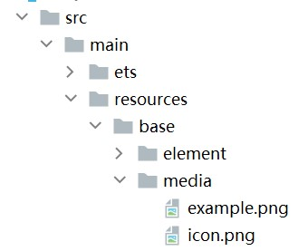
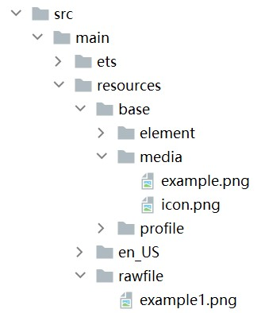

# Image Display (Image)
<!--Kit: ArkUI-->
<!--Subsystem: ArkUI-->
<!--Owner: @liyujie43-->
<!--Designer: @weixin_52725220-->
<!--Tester: @xiong0104-->
<!--Adviser: @Brilliantry_Rui-->

More often than not, you may need to display images in your application, for example, icons in buttons, online images, and local images. In such cases, the **Image** component is used, which supports multiple image formats (including PNG, JPG, and JPEG), excluding APNG and SVGA. For details about the supported formats and usage, see [Image](../reference/apis-arkui/arkui-ts/ts-basic-components-image.md).


To use the **Image** component, call the following API:

```ts
Image(src: PixelMap | ResourceStr | DrawableDescriptor)
```


This API obtains a local or online image from the data source specified by **src**. For details about how to load the data source, see [Loading Image Resources](#loading-image-resources).

For details about how to resolve white block issues during image loading, see [Solution to White Image Blocks](https://developer.huawei.com/consumer/en/doc/best-practices/bpta-image-white-lump-solution). For details about how to address slow image loading, see [Optimizing Preset Image Loading](https://developer.huawei.com/consumer/en/doc/best-practices/bpta-texture-compression-improve-performance).


## Loading Image Resources

Images can be categorized into three types: archived files, pixel maps, and drawable descriptors.


### Archived Data Sources

Archived data sources can be classified into local resources, network resources, **Resource** objects, media library assets, and Base64 resources.

- Local resources

  To load local images, create an **ets** directory and place image files within this directory structure.

  In the **Image** component, set **src** to the local image path, with the **ets** directory as the root directory. Note that images cannot be loaded across bundles or modules.

  > **NOTE**
  > 
  > Starting from DevEco Studio 6.0.0 Beta2, when creating a new project or module, the default module created does not package resources located outside the **resources** directory. To include such resources, you need to set **buildOption** > **resOptions** > **copyCodeResource** > **enable** to **true** in the module's **build-profile.json5** file. For details, refer to the [copyCodeResource](https://developer.huawei.com/consumer/en/doc/harmonyos-guides/ide-hvigor-build-profile#section754823013348) section in **resOptions**.

  <!-- @[local_resource](https://gitcode.com/openharmony/applications_app_samples/blob/master/code/DocsSample/ArkUISample/ImageComponent/entry/src/main/ets/pages/LoadingResources.ets) -->    
  
  ``` TypeScript
  // Replace 'images/view.jpg' with the resource file you use.
  Image('images/view.jpg')
    .width(200)
  ```

  To avoid application instability, do not modify or replace local images while they are being loaded. To update an image file, first delete the existing file before creating a new one with the same name.

- Network resources

  To load network images, first declare the ohos.permission.INTERNET permission. For details, see [Declaring Permissions](../security/AccessToken/declare-permissions.md). Then, in the **Image** component, set **src** to the URL of the network image.

  Currently, the **Image** component supports only simple network images.

  When the **Image** component loads a network image for the first time, it needs to request network resources. If this component is not loaded for the first time, it directly reads the image from the cache by default.
  
  For more image cache settings, see [setImageCacheCount](../reference/apis-arkui/js-apis-system-app.md#setimagecachecount7), [setImageRawDataCacheSize](../reference/apis-arkui/js-apis-system-app.md#setimagerawdatacachesize7), and [setImageFileCacheSize](../reference/apis-arkui/js-apis-system-app.md#setimagefilecachesize7). The three image cache APIs are used to support simple and common scenarios. They will not evolve in the future, and have certain limitations in flexibility and scalability. For example:
  - They cannot obtain the current cache usage. The **Image** component does not support querying the real-time status of the disk cache, including the total file size and file quantity.
  - The cache policy cannot be customized, and the cache status cannot be observed. You cannot obtain runtime metrics such as the cache hit ratio and eviction count through APIs, so it is difficult to implement dynamic optimization based on the actual cache effect.

  For complex scenarios, you are advised to use [ImageKnife](https://gitcode.com/CPF-ApplicationTPC/ImageKnife), which provides more flexible and scalable cache policies and comprehensive lifecycle management capabilities.

  Network images must comply with the RFC 9113 standard. Otherwise, the loading will fail. For images larger than 10 MB or bulk downloads, use the [HTTP](../network/http-request.md) API for pre-downloading to improve loading performance and simplify data management.

  The **Image** component employs a decoupled architecture where download and cache operations are handled by the unified [@ohos.request.cacheDownload (Download and Cache)](../reference/apis-basic-services-kit/js-apis-request-cacheDownload.md). For details, see [Example 3: Downloading and Displaying Online GIF Images](../reference/apis-arkui/arkui-ts/ts-basic-components-image.md#example-3-downloading-and-displaying-online-gif-images).
  
  The download and cache module provides pre-download capabilities, allowing images to be fetched before the **Image** component is created. After the **Image** component is created, it can directly obtain downloaded image data from the cache, accelerating image display, improving the loading experience, and effectively avoiding delays caused by fetching network images repeatedly. All network cache files are stored in the application's **cache** directory.

  <!-- @[net_resource](https://gitcode.com/openharmony/applications_app_samples/blob/master/code/DocsSample/ArkUISample/ImageComponent/entry/src/main/ets/pages/LoadingResources.ets) -->    
  
  ``` TypeScript
  // Replace $r('app.string.LoadingResources') with the resource file you use. Replace the value in the resource file with the actual path.
  Image($r('app.string.LoadingResources'))
  ```

- **Resource** objects

  **Resource** objects can be used to import images across bundles and modules. All images in the **resources** folder can be read and converted to the **Resource** objects through **$r**.

  **Figure 1** resources 

  

  API:

  <!-- @[resource_icon](https://gitcode.com/openharmony/applications_app_samples/blob/master/code/DocsSample/ArkUISample/ImageComponent/entry/src/main/ets/pages/LoadingResources.ets) -->    
  
  ``` TypeScript
  // Replace $r('app.media.icon') with the actual resource file.
  Image($r('app.media.icon'))
  ```

  You can also place the images in the **rawfile** folder.

  **Figure 2** rawfile folder 

  

  API:

  <!-- @[rawfile_resource](https://gitcode.com/openharmony/applications_app_samples/blob/master/code/DocsSample/ArkUISample/ImageComponent/entry/src/main/ets/pages/LoadingResources.ets) -->    
  
  ``` TypeScript
  // Replace $rawfile('example1.png') with the resource file you use.
  Image($rawfile('example1.png'))
  ```

- Media library resource (file://data/storage)
  
  To load images from the [picker](../reference/apis-core-file-kit/js-apis-file-picker.md), use a path string that starts with **file://**.
  1. Call the API to obtain the image URL in the media library.
      <!-- @[media_libraryfile](https://gitcode.com/openharmony/applications_app_samples/blob/master/code/DocsSample/ArkUISample/ImageComponent/entry/src/main/ets/pages/LoadImageResources.ets) -->    
  
      ``` TypeScript
      import { photoAccessHelper } from '@kit.MediaLibraryKit';
      import { BusinessError } from '@kit.BasicServicesKit';
      import { hilog } from '@kit.PerformanceAnalysisKit';
      const DOMAIN = 0x0001;
      const TAG = 'Sample_imagecomponent';
    
      @Entry
      @Component
      struct MediaLibraryFile {
        @State imgDatas: string[] = [];
        // Use PhotoViewPicker to launch the image picker, select an image, and render it on the page.
        // Obtain the image URL set.
        getAllImg() {
          try {
            let photoSelectOptions:photoAccessHelper.PhotoSelectOptions = new photoAccessHelper.PhotoSelectOptions();
            photoSelectOptions.MIMEType = photoAccessHelper.PhotoViewMIMETypes.IMAGE_TYPE;
            photoSelectOptions.maxSelectNumber = 5;
            let photoPicker:photoAccessHelper.PhotoViewPicker = new photoAccessHelper.PhotoViewPicker();
            photoPicker.select(photoSelectOptions).then((photoSelectResult:photoAccessHelper.PhotoSelectResult) => {
              this.imgDatas = photoSelectResult.photoUris;
              hilog.info(DOMAIN, TAG,'PhotoViewPicker.select successfully, photoSelectResult uri: ' + JSON.stringify(photoSelectResult));
            }).catch((err:Error) => {
              let message = (err as BusinessError).message;
              let code = (err as BusinessError).code;
              hilog.info(DOMAIN, TAG,`PhotoViewPicker.select failed with. Code: ${code}, message: ${message}`);
            });
          } catch (err) {
            let message = (err as BusinessError).message;
            let code = (err as BusinessError).code;
            hilog.info(DOMAIN, TAG,`PhotoViewPicker failed with. Code: ${code}, message: ${message}`);
          };
        };
    
        // Call the preceding function in aboutToAppear to obtain the image URL set and store the URLs in imgDatas.
        async aboutToAppear() {
          this.getAllImg();
        };
        // Load images using the URLs from imgDatas.
        build() {
          Column() {
            Grid() {
              ForEach(this.imgDatas, (item:string) => {
                GridItem() {
                  Image(item)
                    .width(200)
                }
              }, (item:string):string => JSON.stringify(item))
            }
          }.width('100%').height('100%')
        }
      }
      ```
    2. Check the format of the URL obtained from the media library:
       <!-- @[fileLibrary_format](https://gitcode.com/openharmony/applications_app_samples/blob/master/code/DocsSample/ArkUISample/ImageComponent/entry/src/main/ets/pages/LoadingResources.ets) -->    
  
       ``` TypeScript
       // Replace 'file://media/Photos/5' with the resource file you need, and replace the value in the resource file with the real file path.
       Image('file://media/Photos/5')
         .width(200)
       ```


- Base64

  As shown above, the URL format is data:image/[png|jpeg|bmp|webp|heif];base64,[base64 data], in which **[base64 data]** indicates Base64 string data.

  Base64 strings are widely used on web pages for storing pixel data of images.


### Pixel Map

PixelMap is a pixel image after image decoding. For details, see [Introduction to Image Kit](../media/image/image-overview.md). In the following example, the data returned by the loaded online image is decoded into a pixel map, which is then displayed on the **Image** component.


<!-- @[multimedia_pixel](https://gitcode.com/openharmony/applications_app_samples/blob/master/code/DocsSample/ArkUISample/ImageComponent/entry/src/main/ets/pages/MultimediaPixelArt.ets) -->

``` TypeScript
import { http } from '@kit.NetworkKit';
import { image } from '@kit.ImageKit';
import { BusinessError } from '@kit.BasicServicesKit';
import { hilog } from '@kit.PerformanceAnalysisKit';
const DOMAIN = 0x0001;
const TAG = 'Sample_imagecomponent';

@Entry
@Component
struct HttpExample {
  outData: http.HttpResponse | undefined = undefined;
  code: http.ResponseCode | number | undefined = undefined;
  @State image: PixelMap | undefined = undefined; // Create a PixelMap state variable.

  // Use createHttp to decode data returned by the loaded online image into a pixel map for display on the Image component.
  aboutToAppear(): void {
    http.createHttp().request('xxx://xxx.xxx.xxx/example.png', // Replace the file with the resource file you use. Replace the value in the resource file with the actual path.
      (error: BusinessError, data: http.HttpResponse) => {
        if (error) {
          hilog.error(DOMAIN, TAG, `hello http request failed. Code: ${error.code}, message: ${error.message}`);
          return;
        };
        this.outData = data;
        // Decode the data successfully retrieved from the network address into PixelMap format.
        if (http.ResponseCode.OK === this.outData.responseCode) {
          let imageData: ArrayBuffer = this.outData.result as ArrayBuffer;
          let imageSource: image.ImageSource = image.createImageSource(imageData);
          let options: image.DecodingOptions = {
            'desiredPixelFormat': image.PixelMapFormat.RGBA_8888,
          };
          imageSource.createPixelMap(options).then((pixelMap: PixelMap) => {
            this.image = pixelMap;
            imageSource.release();
          });
        };
      });
  };

  build() {
    Column() {
      // Display the image.
      Image(this.image)
        .height(100)
        .width(100)
    }
  }
}
```
  

### DrawableDescriptor

DrawableDescriptor is an advanced image abstraction mechanism in ArkUI that encapsulates image resources into programmable objects. It enables dynamic composition and runtime control capabilities beyond traditional Image components, supporting advanced features like layered overlays (such as badge icons), dynamic attribute adjustments (for example, color filters), and complex animation sequences. This mechanism is particularly suitable for scenarios requiring flexible image manipulation or complex visual interactions. For complete API details, see [DrawableDescriptor](../../application-dev/reference/apis-arkui/js-apis-arkui-drawableDescriptor.md).

The following example demonstrates image display and animation implementation using DrawableDescriptor:

  <!-- @[drawable_descriptor](https://gitcode.com/openharmony/applications_app_samples/blob/master/code/DocsSample/ArkUISample/ImageComponent/entry/src/main/ets/pages/DrawableDescriptor.ets) -->    
  
  ``` TypeScript
  import {
    DrawableDescriptor,
    PixelMapDrawableDescriptor,
    LayeredDrawableDescriptor,
    AnimatedDrawableDescriptor,
    AnimationOptions
  } from '@kit.ArkUI';
  import { image } from '@kit.ImageKit';
  
  @Entry
  @Component
  struct DrawableDescriptorType {
    // Declare a DrawableDescriptor object.
    @State pixmapDesc: DrawableDescriptor | null = null;
    @State pixelMapDesc: PixelMapDrawableDescriptor | null = null;
    @State layeredDesc: LayeredDrawableDescriptor | null = null;
    @State animatedDesc: AnimatedDrawableDescriptor | null = null;
    // Configure animation parameters.
    private animationOptions: AnimationOptions = {
      duration: 3000,
      iterations: -1
    };
  
    // Use DrawableDescriptor to implement advanced effects, such as layered image overlays (for example, badge icons), dynamic attribute adjustments (for example, color filters), and complex animation sequences.
    async aboutToAppear() {
      const resManager = this.getUIContext().getHostContext()?.resourceManager;
      if (!resManager) {
        return;
      };
      // Create standard DrawableDescriptor object.
      // Replace $r('app.media.landscape') with the actual resource file.
      let pixmapDescResult = resManager.getDrawableDescriptor($r('app.media.landscape').id);
      if (pixmapDescResult) {
        this.pixmapDesc = pixmapDescResult as DrawableDescriptor;
      };
      // Create a PixelMapDrawableDescriptor object.
      // Replace $r('app.media.landscape') with the actual resource file.
      const pixelMap = await this.getPixmapFromMedia($r('app.media.landscape'));
      this.pixelMapDesc = new PixelMapDrawableDescriptor(pixelMap);
      // Create a layered icon.
      // Replace $r('app.media.foreground') with the actual resource file.
      const foreground = await this.getDrawableDescriptor($r('app.media.foreground'));
      // Replace $r('app.media.landscape') with the actual resource file.
      const background = await this.getDrawableDescriptor($r('app.media.landscape'));
      this.layeredDesc = new LayeredDrawableDescriptor(foreground, background);
      // Create an animated image sequence (requires loading of multiple images).
      // Replace $r('app.media.sky') with the actual resource file.
      const frame1 = await this.getPixmapFromMedia($r('app.media.sky'));
      // Replace $r('app.media.landscape') with the actual resource file.
      const frame2 = await this.getPixmapFromMedia($r('app.media.landscape'));
      // Replace $r('app.media.clouds') with the actual resource file.
      const frame3 = await this.getPixmapFromMedia($r('app.media.clouds'));
      if (frame1 && frame2 && frame3) {
        this.animatedDesc = new AnimatedDrawableDescriptor([frame1, frame2, frame3], this.animationOptions);
      };
    };
  
    // Helper method: Obtain the pixel map from the resource.
    private async getPixmapFromMedia(resource: Resource): Promise<image.PixelMap | undefined> {
      const unit8Array = await this.getUIContext().getHostContext()?.resourceManager.getMediaContent(resource.id);
      if (!unit8Array) {
        return undefined;
      };
      const imageSource = image.createImageSource(unit8Array.buffer.slice(0, unit8Array.buffer.byteLength));
      const pixelMap = await imageSource.createPixelMap({
        desiredPixelFormat: image.PixelMapFormat.RGBA_8888
      });
      await imageSource.release();
      return pixelMap;
    };
  
    // Helper method: Obtain a DrawableDescriptor object.
    private async getDrawableDescriptor(resource: Resource): Promise<DrawableDescriptor | undefined> {
      const resManager = this.getUIContext().getHostContext()?.resourceManager;
      if (!resManager) {
        return undefined;
      };
      return (resManager.getDrawableDescriptor(resource.id)) as DrawableDescriptor;
    };
  
    build() {
      RelativeContainer() {
        Column() {
          // Display a standard image.
          Image(this.pixmapDesc)
            .width(100)
            .height(100)
            .border({ width: 1, color: Color.Black })
          // Display a PixelMap image.
          Image(this.pixelMapDesc)
            .width(100)
            .height(100)
            .border({ width: 1, color: Color.Red })
          // Display a layered icon.
          if (this.layeredDesc) {
            Image(this.layeredDesc)
              .width(100)
              .height(100)
              .border({ width: 1, color: Color.Blue })
          }
          // Display an animated image.
          if (this.animatedDesc) {
            Image(this.animatedDesc)
              .width(200)
              .height(200)
              .margin({ top: 20 })
          }
        }
      }
      .height('100%')
      .width('100%')
      .margin(50)
    }
  }
  ```


## Displaying Vector Images

The Image component supports Scalable Vector Graphics (SVG). For SVG element reference, see [SVG Tags](../../application-dev/reference/apis-arkui/arkui-ts/ts-basic-svg.md).

To display an SVG image without intrinsic dimensions, you must set the width and height for the **Image** component. SVG images cannot reference local SVG or GIF images through `<image>` tags.

You can use the **fillColor** attribute to change the fill color of an SVG image.


  <!-- @[svg_fillColor](https://gitcode.com/openharmony/applications_app_samples/blob/master/code/DocsSample/ArkUISample/ImageComponent/entry/src/main/ets/pages/DisplayVectorDiagram.ets) -->    
  
  ``` TypeScript
  // Replace $r('app.media.cloud') with the actual resource file.
  Image($r('app.media.cloud'))
    .width(50)
    .fillColor(Color.Blue)
  ```

  **Figure 3** Original image 


  **Figure 4** SVG image after the fill color is set 


### Using an SVG File with a Local Bitmap Reference

When using the **Image** component to load an SVG file that references any local bitmap, make sure the SVG file path is a relative path to the **ets** project root directory, and the local bitmap referenced in the SVG file is located at the same level as the SVG file and specified using a relative path.

Example for setting the SVG image path in the **Image** component:

> **NOTE**
> 
> Starting from DevEco Studio 6.0.0 Beta2, when creating a new project or module, the default module created does not package resources located outside the **resources** directory. To include such resources, you need to set **buildOption** > **resOptions** > **copyCodeResource** > **enable** to **true** in the module's **build-profile.json5** file. For details, refer to the [copyCodeResource](https://developer.huawei.com/consumer/en/doc/harmonyos-guides/ide-hvigor-build-profile#section754823013348) section in **resOptions**.

  <!-- @[local_svg](https://gitcode.com/openharmony/applications_app_samples/blob/master/code/DocsSample/ArkUISample/ImageComponent/entry/src/main/ets/pages/DisplayVectorDiagram.ets) -->    
  
  ``` TypeScript
  // Replace 'images/icon.svg' with the resource file you use.
  Image('/images/icon.svg')
    .width(50)
    .height(50)
  ```
In your SVG file, use the **xlink:href** attribute within the **\<image>** tag to reference the local bitmap. Ensure the bitmap path is relative to the SVG file location.

```xml
<svg width="200" height="200">
  <image width="200" height="200" xlink:href="sky.png"></image>
</svg>
```
The following figure shows an example of the project structure.


## Setting Attributes

Setting attributes for the **Image** component can spruce up the image with custom effects. The following are usage examples of common attributes. For details about all attributes, see [Image](../reference/apis-arkui/arkui-ts/ts-basic-components-image.md).

### Setting the Image Scale Mode

You can use the [objectFit](../reference/apis-arkui/arkui-ts/ts-basic-components-image.md#objectfit) attribute to scale an image to fit it into a container whose height and width are determined.


  <!-- @[image_objectfit](https://gitcode.com/openharmony/applications_app_samples/blob/master/code/DocsSample/ArkUISample/ImageComponent/entry/src/main/ets/pages/SetImageZoomType.ets) -->   
  
  ``` TypeScript
  @Entry
  @Component
  struct ImageScalingType {
    scroller: Scroller = new Scroller();
  
    build() {
      Scroll(this.scroller) {
        Row() {
          Column() {
            // Replace $r('app.media.img_2') with the actual resource file.
            Image($r('app.media.img_2'))
              .width(200)
              .height(150)
              .border({ width: 1 })
              // Use the objectFit attribute to scale an image to fit it into a container whose height and width are determined.
              // The image is scaled with its aspect ratio retained for the content to be completely displayed within the display boundaries.
              .objectFit(ImageFit.Contain)
              .margin({bottom:25,left:10})
              // The overlay API does not support the dark mode.
              .overlay('Contain', { align: Alignment.Bottom, offset: { x: 0, y: 20 } })
            // Replace $r('app.media.img_2') with the actual resource file.
            Image($r('app.media.img_2'))
              .width(200)
              .height(150)
              .border({ width: 1 })
              // Use the objectFit attribute to scale an image to fit it into a container whose height and width are determined.
              // The image is scaled with its aspect ratio retained for both sides to be greater than or equal to the display boundaries.
              .objectFit(ImageFit.Cover)
              .margin({bottom:25,left:10})
              // The overlay API does not support the dark mode.
              .overlay('Cover', { align: Alignment.Bottom, offset: { x: 0, y: 20 } })
            // Replace $r('app.media.img_2') with the actual resource file.
            Image($r('app.media.img_2'))
              .width(200)
              .height(150)
              .border({ width: 1 })
              // Use the objectFit attribute to scale an image to fit it into a container whose height and width are determined.
              // The image is scaled automatically to fit the display area.
              .objectFit(ImageFit.Auto)
              .margin({bottom:25,left:10})
              // The overlay API does not support the dark mode.
              .overlay('Auto', { align: Alignment.Bottom, offset: { x: 0, y: 20 } })
          }
  
          Column() {
            // Replace $r('app.media.img_2') with the actual resource file.
            Image($r('app.media.img_2'))
              .width(200)
              .height(150)
              .border({ width: 1 })
              // Use the objectFit attribute to scale an image to fit it into a container whose height and width are determined.
              // The image is scaled to fill the display area, and its aspect ratio is not retained.
              .objectFit(ImageFit.Fill)
              .margin({bottom:25,left:10})
              // The overlay API does not support the dark mode.
              .overlay('Fill', { align: Alignment.Bottom, offset: { x: 0, y: 20 } })
            // Replace $r('app.media.img_2') with the actual resource file.
            Image($r('app.media.img_2'))
              .width(200)
              .height(150)
              .border({ width: 1 })
              // Use the objectFit attribute to scale an image to fit it into a container whose height and width are determined.
              // The image content is displayed with its aspect ratio retained. The size is smaller than or equal to the original size.
              .objectFit(ImageFit.ScaleDown)
              .margin({bottom:25,left:10})
              // The overlay API does not support the dark mode.
              .overlay('ScaleDown', { align: Alignment.Bottom, offset: { x: 0, y: 20 } })
            // Replace $r('app.media.img_2') with the actual resource file.
            Image($r('app.media.img_2'))
              .width(200)
              .height(150)
              .border({ width: 1 })
              // Use the objectFit attribute to scale an image to fit it into a container whose height and width are determined.
              // The original size is retained.
              .objectFit(ImageFit.None)
              .margin({bottom:25,left:10})
              // The overlay API does not support the dark mode.
              .overlay('None', { align: Alignment.Bottom, offset: { x: 0, y: 20 } })
          }
        }
      }
    }
  }
  ```


### Using Image Interpolation

An image of low resolution may suffer quality loss with aliasing when scaled up. If this is the case, you can use the [interpolation](../reference/apis-arkui/arkui-ts/ts-basic-components-image.md#interpolation) attribute to conduct image interpolation and improve image quality.


  <!-- @[image_interpolation](https://gitcode.com/openharmony/applications_app_samples/blob/master/code/DocsSample/ArkUISample/ImageComponent/entry/src/main/ets/pages/ImageInterpolation.ets) -->    
  
  ``` TypeScript
  @Entry
  @Component
  struct ImageInterpolationType {
    build() {
      Column() {
        Row() {
          // Replace $r('app.media.grass') with the actual resource file.
          Image($r('app.media.grass'))
            .width('40%')
            // Use interpolation to conduct image interpolation and improve image quality.
            .interpolation(ImageInterpolation.None)
            .borderWidth(1)
            // The overlay API does not support the dark mode.
            .overlay('Interpolation.None', { align: Alignment.Bottom, offset: { x: 0, y: 20 } })
            .margin(10)
          // Replace $r('app.media.grass') with the actual resource file.
          Image($r('app.media.grass'))
            .width('40%')
            // Use interpolation to conduct image interpolation and improve image quality.
            .interpolation(ImageInterpolation.Low)
            .borderWidth(1)
            // The overlay API does not support the dark mode.
            .overlay('Interpolation.Low', { align: Alignment.Bottom, offset: { x: 0, y: 20 } })
            .margin(10)
        }.width('100%')
        .justifyContent(FlexAlign.Center)
  
        Row() {
          // Replace $r('app.media.grass') with the actual resource file.
          Image($r('app.media.grass'))
            .width('40%')
            // Use interpolation to conduct image interpolation and improve image quality.
            .interpolation(ImageInterpolation.Medium)
            .borderWidth(1)
            // The overlay API does not support the dark mode.
            .overlay('Interpolation.Medium', { align: Alignment.Bottom, offset: { x: 0, y: 20 } })
            .margin(10)
          // Replace $r('app.media.grass') with the actual resource file.
          Image($r('app.media.grass'))
            .width('40%')
            // Use interpolation to conduct image interpolation and improve image quality.
            .interpolation(ImageInterpolation.High)
            .borderWidth(1)
            // The overlay API does not support the dark mode.
            .overlay('Interpolation.High', { align: Alignment.Bottom, offset: { x: 0, y: 20 } })
            .margin(10)
        }.width('100%')
        .justifyContent(FlexAlign.Center)
      }
      .height('100%')
    }
  }
  ```


### Setting Image Repeat Pattern

You can use the **objectRepeat** attribute to set the repeat pattern of an image. For details, see [ImageRepeat](../reference/apis-arkui/arkui-ts/ts-appendix-enums.md#imagerepeat).


  <!-- @[image_repetitionstyle](https://gitcode.com/openharmony/applications_app_samples/blob/master/code/DocsSample/ArkUISample/ImageComponent/entry/src/main/ets/pages/SetImageRepetitionStyle.ets) -->    
  
  ``` TypeScript
  @Entry
  @Component
  struct ImageRepetitionStyle {
    build() {
      Column({ space: 10 }) {
        Column({ space: 25 }) {
          // Replace $r('app.media.ic_public_favor_filled_1') with the actual resource file.
          Image($r('app.media.ic_public_favor_filled_1'))
            .width(160)
            .height(160)
            .border({ width: 1 })
            // Use the objectRepeat attribute to set the image repeat pattern.
            // Repeat the image along both the horizontal and vertical axes.
            .objectRepeat(ImageRepeat.XY)
            .objectFit(ImageFit.ScaleDown)
            // The overlay API does not support the dark mode.
            .overlay('ImageRepeat.XY', { align: Alignment.Bottom, offset: { x: 0, y: 20 } })
          // Replace $r('app.media.ic_public_favor_filled_1') with the actual resource file.
          Image($r('app.media.ic_public_favor_filled_1'))
            .width(160)
            .height(160)
            .border({ width: 1 })
            // Use the objectRepeat attribute to set the image repeat pattern.
            // Repeat the image only along the vertical axis.
            .objectRepeat(ImageRepeat.Y)
            .objectFit(ImageFit.ScaleDown)
            // The overlay API does not support the dark mode.
            .overlay('ImageRepeat.Y', { align: Alignment.Bottom, offset: { x: 0, y: 20 } })
          // Replace $r('app.media.ic_public_favor_filled_1') with the actual resource file.
          Image($r('app.media.ic_public_favor_filled_1'))
            .width(160)
            .height(160)
            .border({ width: 1 })
            // Use the objectRepeat attribute to set the image repeat pattern.
            // Repeat the image only along the horizontal axis.
            .objectRepeat(ImageRepeat.X)
            .objectFit(ImageFit.ScaleDown)
            // The overlay API does not support the dark mode.
            .overlay('ImageRepeat.X', { align: Alignment.Bottom, offset: { x: 0, y: 20 } })
        }
      }.height(150).width('100%').padding(8)
    }
  }
  ```


### Setting Image Rendering Mode

You can use the **renderMode** attribute to set the rendering mode of an image.


  <!-- @[image_renderingmode](https://gitcode.com/openharmony/applications_app_samples/blob/master/code/DocsSample/ArkUISample/ImageComponent/entry/src/main/ets/pages/SetImageRenderingMode.ets) -->    
  
  ``` TypeScript
  @Entry
  @Component
  struct SetImageRenderingMode {
    build() {
      Column({ space: 10 }) {
        Row({ space: 50 }) {
          // Replace $r('app.media.example') with the actual resource file.
          Image($r('app.media.example'))
            // Use the renderMode attribute to set the rendering mode of an image.
            .renderMode(ImageRenderMode.Original)
            .width(100)
            .height(100)
            .border({ width: 1 })
            // The overlay API does not support the dark mode.
            .overlay('Original', { align: Alignment.Bottom, offset: { x: 0, y: 20 } })
          // Replace $r('app.media.example') with the actual resource file.
          Image($r('app.media.example'))
            // Use the renderMode attribute to set the rendering mode of an image.
            .renderMode(ImageRenderMode.Template)
            .width(100)
            .height(100)
            .border({ width: 1 })
            // The overlay API does not support the dark mode.
            .overlay('Template', { align: Alignment.Bottom, offset: { x: 0, y: 20 } })
        }
      }.height(150).width('100%').padding({ top: 20,right: 10 })
    }
  }
  ```


### Setting Image Decoding Size

You can use the **sourceSize** attribute to set the image decoding size. By setting the decoding size to lower than the source size, you can decrease the image resolution.

In this example, the source image size is 1280 x 960, and the decoding sizes are 40 x 40 and 90 x 90.


  <!-- @[image_decodingsize](https://gitcode.com/openharmony/applications_app_samples/blob/master/code/DocsSample/ArkUISample/ImageComponent/entry/src/main/ets/pages/SetImageDecodingSize.ets) -->    
  
  ``` TypeScript
  @Entry
  @Component
  struct SetImageDecodingSize {
    build() {
      Column() {
        Row({ space: 50 }) {
          // Replace $r('app.media.example') with the actual resource file.
          Image($r('app.media.example'))
          // Use the sourceSize attribute to set the image decoding size. By setting the decoding size to lower than the source size, you can decrease the image resolution.
            .sourceSize({
              width: 40,
              height: 40
            })
            .objectFit(ImageFit.ScaleDown)
            .aspectRatio(1)
            .width('25%')
            .border({ width: 1 })
            // The overlay API does not support the dark mode.
            .overlay('width:40 height:40', { align: Alignment.Bottom, offset: { x: 0, y: 40 } })
          // Replace $r('app.media.example') with the actual resource file.
          Image($r('app.media.example'))
          // Use the sourceSize attribute to set the image decoding size. By setting the decoding size to lower than the source size, you can decrease the image resolution.
            .sourceSize({
              width: 90,
              height: 90
            })
            .objectFit(ImageFit.ScaleDown)
            .width(100)
            .height(100)
            .aspectRatio(1)
            .border({ width: 1 })
            // The overlay API does not support the dark mode.
            .overlay('width:90 height:90', { align: Alignment.Bottom, offset: { x: 0, y: 40 } })
        }.height(150).width('100%').padding(20)
      }
    }
  }
  ```


### Adding a Filter to an Image

You can use the **colorFilter** attribute to add a filter to an image.<!--RP1--><!--RP1End-->


  <!-- @[image_filtereffect](https://gitcode.com/openharmony/applications_app_samples/blob/master/code/DocsSample/ArkUISample/ImageComponent/entry/src/main/ets/pages/AddFilterEffectsToImages.ets) -->    
  
  ``` TypeScript
  @Entry
  @Component
  struct AddFilterEffectsToImages {
    build() {
      Column() {
        Row() {
          // Replace $r('app.media.example') with the actual resource file.
          Image($r('app.media.example'))
            .width('40%')
            .margin(10)
          // Replace $r('app.media.example') with the actual resource file.
          Image($r('app.media.example'))
            .width('40%')
            // Use the colorFilter attribute to add a filter to an image.
            .colorFilter(
               [1, 1, 0, 0, 0,
                0, 1, 0, 0, 0,
                0, 0, 1, 0, 0,
                0, 0, 0, 1, 0])
            .margin(10)
        }.width('100%')
        .justifyContent(FlexAlign.Center)
      }
    }
  }
  ```


### Synchronously Loading Images

Generally, the image loading process is performed asynchronously to avoid blocking the main thread and to streamline UI interaction. In certain cases, however, the image may flicker when refreshed. If this occurs, you can use the **syncLoad** attribute to load the image synchronously to avoid flickering. Avoid using this attribute if the image loading may take a long time. Otherwise, the page may fail to respond.


  <!-- @[synchronous_imageloading](https://gitcode.com/openharmony/applications_app_samples/blob/master/code/DocsSample/ArkUISample/ImageComponent/entry/src/main/ets/pages/DisplayVectorDiagram.ets) -->    
  
  ``` TypeScript
  // Replace $r('app.media.icon') with the actual resource file.
  Image($r('app.media.icon'))
    .syncLoad(true)
  ```

<!--RP2--><!--RP2End-->

## Adding Events

By binding the **onComplete** event to the **Image** component, you can obtain necessary information about the image after the image is successfully loaded. You can also bind the **onError** event to obtain error information when the image fails to be loaded.


  <!-- @[event_invocation](https://gitcode.com/openharmony/applications_app_samples/blob/master/code/DocsSample/ArkUISample/ImageComponent/entry/src/main/ets/pages/EventCall.ets) -->    
  
  ``` TypeScript
  import { hilog } from '@kit.PerformanceAnalysisKit';
  const DOMAIN = 0x0001;
  const TAG = 'Sample_imagecomponent';
  
  @Entry
  @Component
  struct EventCall {
    @State widthValue: number = 0;
    @State heightValue: number = 0;
    @State componentWidth: number = 0;
    @State componentHeight: number = 0;
  
    build() {
      Column() {
        Row() {
          // Replace $r('app.media.ic_img_2') with the actual resource file.
          Image($r('app.media.ic_img_2'))
            .width(200)
            .height(150)
            .margin(15)
            // After the image loads successfully, obtain necessary image information via onComplete.
            .onComplete(msg => {
              if(msg){
                this.widthValue = msg.width;
                this.heightValue = msg.height;
                this.componentWidth = msg.componentWidth;
                this.componentHeight = msg.componentHeight;
              };
              hilog.info(DOMAIN, TAG, `${msg}`);
            })
            // If loading fails, use onError to trigger the callback and obtain the result.
            .onError(() => {
              hilog.info(DOMAIN, TAG, 'load image fail');
            })
            // The overlay API does not support the dark mode.
            .overlay('\nwidth: ' + String(this.widthValue) + ', height: ' + String(this.heightValue) + '\ncomponentWidth: ' + String(this.componentWidth) + '\ncomponentHeight: ' + String(this.componentHeight), {
              align: Alignment.Bottom,
              offset: { x: 0, y: 60 }
            })
        }
      }
    }
  }
  ```


<!--Del-->##  

 

-  <!--DelEnd-->
