# Immersive Light Sense

<!--Kit: ArkUI-->
<!--Subsystem: ArkUI-->
<!--Owner: @H-xinwei-->
<!--Designer: @zhanghaibo0-->
<!--Tester: @lxl007-->
<!--Adviser: @Brilliantry_Rui-->
<!-- md-trans-meta sourceCommit=7c02fd7d3bf79d983e83eb56a10b2587305ecd75 translatedAt=2026-08-01T00:32:26.027Z pushedAt=2026-08-01T05:54:54.418Z -->

Starting from API version 26.0.0, immersive light sense is introduced. Immersive light sense is a high-quality visual and animation system provided by ArkUI. By combining immersive system materials ([ImmersiveMaterial](../reference/apis-arkui/arkts-apis-uimaterial.md#immersivematerial)) with spatial animations, it brings a transparent and exquisite visual experience to app components. Immersive light sense includes two capabilities:

- Immersive system materials: By influencing the component's background color [backgroundColor](../reference/apis-arkui/arkui-ts/ts-universal-attributes-background.md#backgroundcolor), border color [borderColor](../reference/apis-arkui/arkui-ts/ts-universal-attributes-border.md#bordercolor), border width [borderWidth](../reference/apis-arkui/arkui-ts/ts-universal-attributes-border.md#borderwidth), shadow [shadow](../reference/apis-arkui/arkui-ts/ts-universal-attributes-image-effect.md#shadow), and material filter [materialFilter](../reference/apis-arkui/arkui-ts/ts-universal-attributes-filter-effect.md#materialfilter23), it gives components a visual appearance with a sense of depth and transparency.

- Spatial effects: Add dynamic expressions such as deformation and flowing light to the pop-up process of certain components ([Dialog](arkts-base-dialog-overview.md) and [menu control](../reference/apis-arkui/arkui-ts/ts-universal-attributes-menu.md)), making animations more fluid and lively.

Immersive light sense can automatically adjust the performance level of immersive system material and animations based on the device's computing power tier and the immersive light sense intensity configured by the user in system settings, ensuring the best possible effect across devices of different performance levels.

For common issues and solutions during immersive light sense development, see [Immersive Light Sense FAQ](arkts-immersive-light-sense-faq.md).

## Immersive System Materials

Immersive system material ([ImmersiveMaterial](../reference/apis-arkui/arkts-apis-uimaterial.md#immersivematerial)) is a new type of material object provided by ArkUI. You can set the system material of a component through the [systemMaterial](../reference/apis-arkui/arkui-ts/ts-universal-attributes-image-effect.md#systemmaterial) API by passing [ImmersiveOptions](../reference/apis-arkui/arkts-apis-uimaterial.md#immersiveoptions) parameters. Once set, it automatically affects the component's background color [backgroundColor](../reference/apis-arkui/arkui-ts/ts-universal-attributes-background.md#backgroundcolor), border color [borderColor](../reference/apis-arkui/arkui-ts/ts-universal-attributes-border.md#bordercolor), border width [borderWidth](../reference/apis-arkui/arkui-ts/ts-universal-attributes-border.md#borderwidth), shadow [shadow](../reference/apis-arkui/arkui-ts/ts-universal-attributes-image-effect.md#shadow), and material filter [materialFilter](../reference/apis-arkui/arkui-ts/ts-universal-attributes-filter-effect.md#materialfilter23) visual effects.

Immersive system material provides five material styles [ImmersiveStyle](../reference/apis-arkui/arkts-apis-uimaterial.md#immersivestyle), ranging from thin to thick:

| Style | Description | Applicable Scenario |
| --- | --- | --- |
| ULTRA_THIN | Ultra-thin style, with high transparency. | Scenarios requiring a highly transparent background, such as floating toolbars. |
| THIN | Thin style, with relatively high transparency. | Scenarios requiring strong transparency, such as search boxes. |
| REGULAR | Regular style, with standard thickness. | General‑purpose scenarios. |
| THICK | Thick style, with a strong blur effect. | Scenarios requiring a strongly blurred background, such as menus. |
| ULTRA_THICK | Ultra-thick style, with a very strong blur effect. | Scenarios requiring a completely blurred background, such as dialogs. |

In addition, the immersive material object also supports configuring the following attributes:

- [materialColor](../reference/apis-arkui/arkts-apis-uimaterial.md#immersiveoptions): Specifies a solid color overlay for the material layer. For high-performance and mid-range computing devices, if this parameter is not set or is **undefined**, no additional solid color blending effect is applied. If this parameter is set to a valid color value, the color is blended as an additional solid layer over the materialFilter effect. If the color is fully opaque, it will obscure the [materialFilter](../reference/apis-arkui/arkui-ts/ts-universal-attributes-filter-effect.md#materialfilter23) effect. For low-performance computing devices, if this parameter is not set or is **undefined**, the background color effect inherent to the material on low-performance devices takes effect; if this parameter is set to a valid color value, it serves as the value for the [backgroundColor](../reference/apis-arkui/arkui-ts/ts-universal-attributes-background.md#backgroundcolor) attribute.

- [colorInvert](../reference/apis-arkui/arkts-apis-uimaterial.md#immersiveoptions): Determines whether the subtree of the node to which the material object is applied automatically adapts the material to the inverted color of the background. Automatic color inversion takes effect only when the material style is sufficiently thin.

- [applyShadow](../reference/apis-arkui/arkts-apis-uimaterial.md#immersiveoptions): Specifies whether to apply the shadow effect of the material. When set to **true**, the material's shadow effect is always applied, taking precedence over the [shadow](../reference/apis-arkui/arkui-ts/ts-universal-attributes-image-effect.md#shadow) universal attribute. When set to **false**, the [shadow](../reference/apis-arkui/arkui-ts/ts-universal-attributes-image-effect.md#shadow) universal attribute takes effect and the material's shadow effect is disabled.

- [interactive](../reference/apis-arkui/arkts-apis-uimaterial.md#immersiveoptions): Specifies whether to enable interactive deformation effects for the component with the material applied. When enabled, the component produces an elastic deformation effect upon press.

- [lightEffect](../reference/apis-arkui/arkts-apis-uimaterial.md#immersiveoptions): Specifies whether to enable the light‑sensitive interactive feedback effect for the component with the material applied.

## Highlights

- **High-end and exquisite visual quality**: Immersive light sense uses multi-layer effects such as material filters [materialFilter](../reference/apis-arkui/arkui-ts/ts-universal-attributes-filter-effect.md#materialfilter23), highlights, and shadows to bring components a high-end visual performance far beyond solid color backgrounds, making the application UI more textured.

- **Adaptive device capability**: Immersive light sense automatically adjusts effect performance based on the device's computing power. High-performance devices present full effects, while mid-range and low-end devices automatically degrade, eliminating the need for manual adaptation and ensuring smooth app operation across various devices.

- **Minimal integration**: Immersive light sense can be enabled with one click through an application-level switch. Components such as [Dialog](arkts-base-dialog-overview.md), [Menu](../reference/apis-arkui/arkui-ts/ts-universal-attributes-menu.md), and [Chip](../reference/apis-arkui/arkui-ts/ohos-arkui-advanced-Chip.md) support it by default, achieving high-quality visual effects without additional code changes. For a complete list of components that support application-level enabling, see [MaterialState](../reference/apis-arkui/arkts-apis-uimaterial.md#materialstate).

- **Adaptive to light and dark modes**: Immersive system materials automatically adapt to the system's light or dark color scheme, requiring no extra handling.

- **Intelligent auto-invert for readability**: With automatic color inversion, when the material is sufficiently transparent, the text color inside the component automatically adapts to the background, ensuring a good reading experience in any scenario.

- **Rich interactive feedback**: Supports interactive deformation ([interactive](../reference/apis-arkui/arkts-apis-uimaterial.md#immersiveoptions)) and light‑sensitive feedback ([lightEffect](../reference/apis-arkui/arkts-apis-uimaterial.md#immersiveoptions)), giving every user interaction a subtle and refined visual response.

## Enabling Immersive Light Sense

There are two approaches to integrating immersive system materials into components: **application-level** and **component-level**. The relationship between them is as follows:

- **Application-level**: Configure a global switch through [module.json5](../quick-start/module-configuration-file.md) to determine which components have materials "enabled by default" and whether to globally disable them. It affects only the scope of components that are "enabled by default" and does not affect materials actively set through systemMaterial (except in DISABLE mode). For details, see [Application-Level Enabling](#application-level-enabling).

- **Component-level**: Set materials for individual components through the [systemMaterial](../reference/apis-arkui/arkui-ts/ts-universal-attributes-image-effect.md#systemmaterial) universal attribute, or through the systemMaterial field in the options parameter of popup-type components. Except in DISABLE mode, it takes effect without any global configuration and is the most direct way to add materials to a specific component. For details, see [Component-Level Enabling](#component-level-enabling).

> **NOTE**
>
> If you only want to add immersive system material to a single component, use the component-level approach directly without configuring [module.json5](../quick-start/module-configuration-file.md). The application-level configuration is primarily used to enable materials by default for a category of components in batch, or to globally disable materials.

### Application-Level Enabling

Application-level enabling refers to uniformly controlling, through module.json5, whether components that support immersive system materials within the app have system materials enabled by default. The components that support application-level immersive system materials and the system material parameters used when enabled by default are as follows:

| Component | Default Material Style (ImmersiveStyle) | Effect Before Switch Is Enabled | Effect After Switch Is Enabled |
| ----- | --- | ----------- | ----------- |
| [Dialog](arkts-base-dialog-overview.md) | ULTRA_THICK |  |  |
| [Toast](arkts-create-toast.md) | THICK |  |  |
| [AlphabetIndexer](../reference/apis-arkui/arkui-ts/ts-container-alphabet-indexer.md) | THICK | 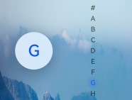 | 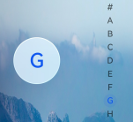 |
| [Chip](../reference/apis-arkui/arkui-ts/ohos-arkui-advanced-Chip.md) | ULTRA_THIN |  |  |
| [ChipGroup](../reference/apis-arkui/arkui-ts/ohos-arkui-advanced-ChipGroup.md) | ULTRA_THIN | 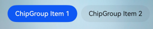 |  |
| [Select](../reference/apis-arkui/arkui-ts/ts-basic-components-select.md) | Parameter used for Select background: ULTRA_THIN<br/>Parameter used for Select dropdown menu: THICK |  | 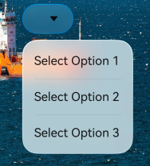 |
| [Menu control](../reference/apis-arkui/arkui-ts/ts-universal-attributes-menu.md) | THICK | 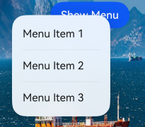 |  |
| [Toggle](../reference/apis-arkui/arkui-ts/ts-basic-components-toggle.md) | Not applicable |  |  |
| [Slider](../reference/apis-arkui/arkui-ts/ts-basic-components-slider.md) | Not applicable |  |  |
| [SegmentButton](../reference/apis-arkui/arkui-ts/ohos-arkui-advanced-SegmentButton.md) | THIN |  | 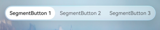 |
| [SegmentButtonV2](../reference/apis-arkui/arkui-ts/ohos-arkui-advanced-SegmentButtonV2.md) | THIN |  | 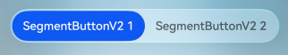 |
| [Text](../reference/apis-arkui/arkui-ts/ts-basic-components-text.md) (text menu triggered by long press or double-tap after setting [copyOption](../reference/apis-arkui/arkui-ts/ts-basic-components-text.md#copyoption9)) | THICK | 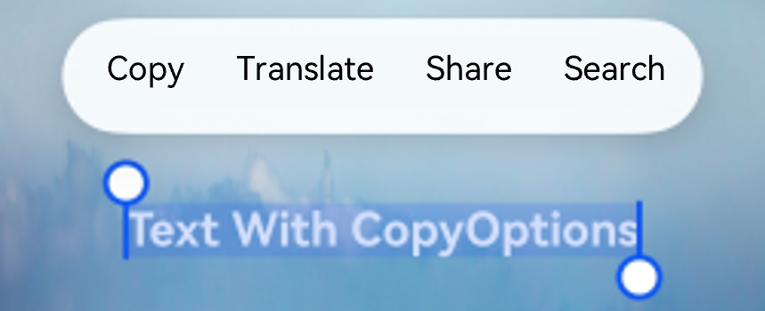 | 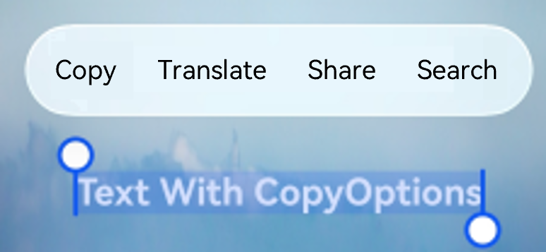 |

For application-level enabling, the name field of the configuration parameter must be "ohos.arkui.UIMaterial.state", and the value field can be default, enable, or disable. Before using this capability, ensure that the app's [targetAPIVersion](../quick-start/app-configuration-file.md) is not lower than 26.0.0. This configuration takes effect only in modules of the entry type.

The following example shows how to configure the enable mode in [module.json5](../quick-start/module-configuration-file.md):

<!-- @[MaterialStateConfig](https://gitcode.com/openharmony/applications_app_samples/blob/master/code/DocsSample/ArkUISample/ImmersiveLightSense/entry/src/main/module.json5) -->

``` JSON5
{
  "module": {
    "name": "entry",
    "type": "entry",
    // ...
    "metadata": [{
      "name": "ohos.arkui.UIMaterial.state",
      "value": "enable"
    }],
    // ...
  }
}
```

[MaterialState](../reference/apis-arkui/arkts-apis-uimaterial.md#materialstate) provides three states for application-level immersive system material configuration: **DEFAULT**, **ENABLE**, and **DISABLE**, which correspond to the three values **default**, **enable**, and **disable** in the json5 configuration. You can use [uiMaterial.getMaterialInfo()](../reference/apis-arkui/arkts-apis-uimaterial.md#uimaterialgetmaterialinfo) to obtain the current material configuration state of the app (that is, **MaterialState**) and determine component behavior based on the configuration state.

The following example demonstrates how to adjust component system material behavior by configuring [MaterialState](../reference/apis-arkui/arkts-apis-uimaterial.md#materialstate): In both **DEFAULT** and **ENABLE** modes, you can actively set immersive system materials for components such as [Button](../reference/apis-arkui/arkui-ts/ts-basic-components-button.md) through the [systemMaterial](../reference/apis-arkui/arkui-ts/ts-universal-attributes-image-effect.md#systemmaterial) universal attribute (active setting does not take effect in **DISABLE** mode). In addition, in **ENABLE** mode, components such as [Select](../reference/apis-arkui/arkui-ts/ts-basic-components-select.md) have immersive system materials enabled by default, and the material style takes priority over the component's own background color, blur, shadow, and border. To individually disable materials for a component that has them enabled by default, set [uiMaterial.Material.empty](../reference/apis-arkui/arkts-apis-uimaterial.md#empty).

<!-- @[MaterialInfo](https://gitcode.com/openharmony/applications_app_samples/blob/master/code/DocsSample/ArkUISample/ImmersiveLightSense/entry/src/main/ets/pages/immersiveLightSense/MaterialInfo.ets) --> 

``` TypeScript
import { uiMaterial } from '@kit.ArkUI';

@Entry
@Component
struct MaterialInfoPage {
  private info: uiMaterial.MaterialInfo = uiMaterial.getMaterialInfo();

  build() {
    Column() {
      Text(`MaterialState: ${this.info.state}`)
        .fontSize(16)
        .margin({ bottom: 10 })
      Text(`MaterialType: ${this.info.type}`)
        .fontSize(16)
        .margin({ bottom: 20 })

      if (this.info.state === uiMaterial.MaterialState.ENABLE) {
        Button('Use immersive system material')
          .backgroundColor(Color.Transparent)
          .systemMaterial(new uiMaterial.ImmersiveMaterial({
            style: uiMaterial.ImmersiveStyle.ULTRA_THIN
          }))
          .fontColor(Color.Blue)
          .margin({ bottom: 10 })

        // The Select component enables immersive system material by default.
        Select([{ value: 'Option 1' }, { value: 'Option 2' }])
          .value('选择')
          .margin({ bottom: 10 })

        // Disable Select and the immersive system material for Select.
        Select([{ value: 'Option 1' }, { value: 'Option 2' }])
          .value('Select (material disabled)')
          .systemMaterial(uiMaterial.Material.empty)
          .menuSystemMaterial(uiMaterial.Material.empty)
      }
    }
    .width('100%')
    .height('100%')
    .justifyContent(FlexAlign.Center)
    // Replace with the actual resource file.
    .backgroundImage($r('app.media.img'))
    .backgroundImageSize(ImageSize.FILL)
  }
}
```

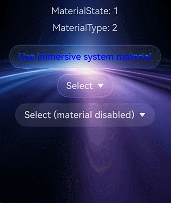

### Component-Level Enabling

In addition to the application‑level switch, you can also finely control the enabling of immersive system materials at the component level. Depending on the component type, there are two approaches: setting via universal attributes and setting via component‑specific APIs.

1. Set through universal attributes.

All components that support universal attributes can enable immersive system materials through the [systemMaterial](../reference/apis-arkui/arkui-ts/ts-universal-attributes-image-effect.md#systemmaterial) universal attribute.

**Column component example**

The following uses the **Column** component as an example to describe how to enable the immersive system materials through a universal attribute.

   <!-- @[ColumnMaterial](https://gitcode.com/openharmony/applications_app_samples/blob/master/code/DocsSample/ArkUISample/ImmersiveLightSense/entry/src/main/ets/pages/immersiveLightSense/ColumnMaterial.ets) -->

   ``` TypeScript
   import { uiMaterial } from '@kit.ArkUI';
   
   @Entry
   @Component
   struct ColumnMaterialPage {
     build() {
       Column() {
         Column() {
           Text('Immersive light sense')
         }
         .width(328)
         .height(56)
         .borderRadius(28)
         .justifyContent(FlexAlign.Center)
         .systemMaterial(new uiMaterial.ImmersiveMaterial({
           style: uiMaterial.ImmersiveStyle.ULTRA_THIN,
         }))
       }
       .width('100%')
       .height('100%')
       .justifyContent(FlexAlign.Center)
       // Replace with the actual resource file.
       .backgroundImage($r('app.media.img'))
       .backgroundImageSize(ImageSize.FILL)
     }
   }
   ```

   

   **Column interactive deformation example**

   The following example sets both the ULTRA_THIN style and the [interactive](../reference/apis-arkui/arkts-apis-uimaterial.md#immersiveoptions) deformation effect for the [Column](../reference/apis-arkui/arkui-ts/ts-container-column.md) component. When the user presses, the component produces an elastic deformation and automatically recovers upon release, enhancing the visual feedback of the interaction.

   <!-- @[ButtonInteractive](https://gitcode.com/openharmony/applications_app_samples/blob/master/code/DocsSample/ArkUISample/ImmersiveLightSense/entry/src/main/ets/pages/immersiveLightSense/ButtonInteractive.ets) -->

   ``` TypeScript
   import { uiMaterial } from '@kit.ArkUI'
   
   @Entry
   @Component
   struct ButtonInteractivePage {
     build() {
       Stack() {
         // Replace with the actual resource file
         Image($r('app.media.img'))
           .width('100%')
           .height('100%')
         Column() {
           Column() {
             Text('Context')
           }
           .margin({ bottom: 100 })
           .width(248)
           .height(56)
           .borderRadius(28)
           .justifyContent(FlexAlign.Center)
           .alignItems(HorizontalAlign.Center)
           .systemMaterial(new uiMaterial.ImmersiveMaterial({
             style: uiMaterial.ImmersiveStyle.ULTRA_THIN,
             interactive: true,
           }))
         }.height('100%').width('100%').justifyContent(FlexAlign.Center)
       }
     }
   }
   ```

   

   **light‑sensitive feedback example**

   The following example enables both [interactive](../reference/apis-arkui/arkts-apis-uimaterial.md#immersiveoptions) interactive deformation and [lightEffect](../reference/apis-arkui/arkts-apis-uimaterial.md#immersiveoptions) light-sense interaction feedback for a group of circular Row components. When the user touches a component, a flowing light following effect is produced; when pressed, an elastic deformation occurs. Specifically, passing a valid object to lightEffect enables light-sense interaction feedback, while passing null or undefined disables it. The color field in the object customizes the flowing light color, with a default value of Color.White. In the example, lightEffect: { color: undefined } means that light-sense interaction feedback is enabled with the default color.

   <!-- @[LightEffect](https://gitcode.com/openharmony/applications_app_samples/blob/master/code/DocsSample/ArkUISample/ImmersiveLightSense/entry/src/main/ets/pages/immersiveLightSense/LightEffect.ets) -->

   ``` TypeScript
   import { uiMaterial } from '@kit.ArkUI';
   
   @Entry
   @Component
   struct LightEffectPage {
     @State itemsKey: number[] = [0, 1, 2];
     @State circleRadius: number = 40;
     @State spaceValue: number = 10;
     @State myMaterial: uiMaterial.Material = new uiMaterial.ImmersiveMaterial({
       style: uiMaterial.ImmersiveStyle.ULTRA_THIN,
       interactive: true,
       lightEffect: { color: undefined },
     });
   
     build() {
       Column() {
         Row() {
           Text('Title')
             .flexGrow(2)
             .fontColor(Color.White)
           Row({ space: this.spaceValue }) {
             ForEach(this.itemsKey, (item: number, index: number) => {
               Row()
                 .width(this.circleRadius * 2)
                 .height(this.circleRadius * 2)
                 .borderRadius(this.circleRadius)
                 .systemMaterial(this.myMaterial)
             })
           }
         }
         .justifyContent(FlexAlign.End)
         .backgroundColor(Color.Black)
         .width('100%')
         .padding(20)
       }
       .height('100%')
       .width('100%')
     }
   }
   ```

   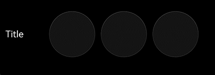

2. Set through component-specific APIs.

   Dialog-type components support enabling immersive system materials by setting their own **systemMaterial** attribute.

   **Toast Example**

   The following example sets an immersive system material with the THIN style through the [ShowToastOptions](../reference/apis-arkui/js-apis-promptAction.md#showtoastoptions) parameter of showToast. When the Toast pops up, it presents a semi-transparent background with a material effect. When systemMaterial is not actively set, the Toast uses a material with the THICK style by default. This example changes it to THIN to demonstrate a more transparent effect.

   <!-- @[ToastMaterial](https://gitcode.com/openharmony/applications_app_samples/blob/master/code/DocsSample/ArkUISample/ImmersiveLightSense/entry/src/main/ets/pages/immersiveLightSense/ToastMaterial.ets) -->

   ``` TypeScript
   import { PromptAction, uiMaterial } from '@kit.ArkUI';
   import { BusinessError } from '@kit.BasicServicesKit';
   
   @Entry
   @Component
   struct ToastMaterialPage {
     promptAction: PromptAction = this.getUIContext().getPromptAction();
   
     build() {
       Column() {
         Button('showToast')
           .position({ x: 125, y: 300 })
           .onClick(() => {
             try {
               this.promptAction.showToast({
                 message: 'Message Info',
                 duration: 2000,
                 // Control whether to set the system material
                 systemMaterial: new uiMaterial.ImmersiveMaterial({
                   style: uiMaterial.ImmersiveStyle.THIN
                 })
               });
             } catch (error) {
               let message = (error as BusinessError).message;
               let code = (error as BusinessError).code;
               console.error(`showToast args error code is ${code}, message is ${message}`);
             };
           })
       }
       .width('100%')
       .height('100%')
       // Please replace with the actual resource file
       .backgroundImage($r('app.media.img'))
       .backgroundImageSize({ width: '100%', height: '100%' })
     }
   }
   ```

   When system material is not set:

   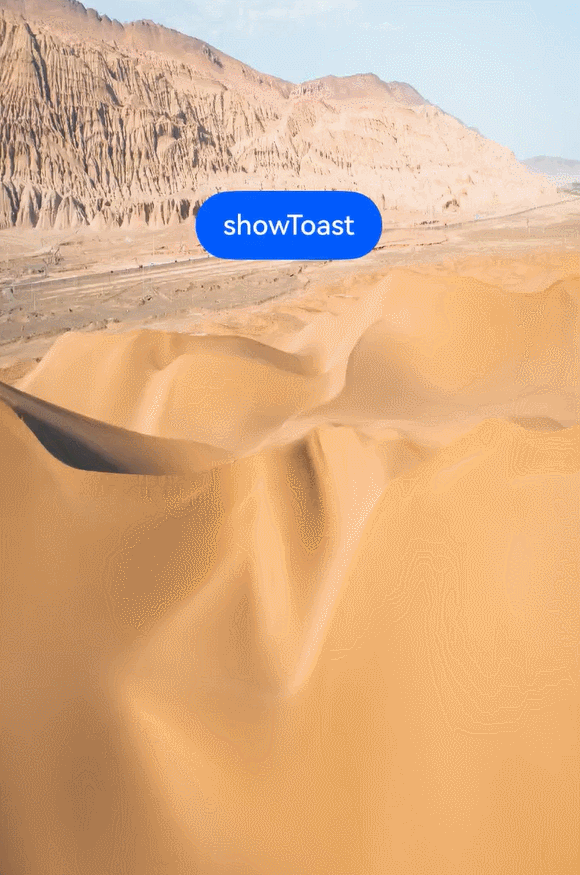

   After system material is set:

   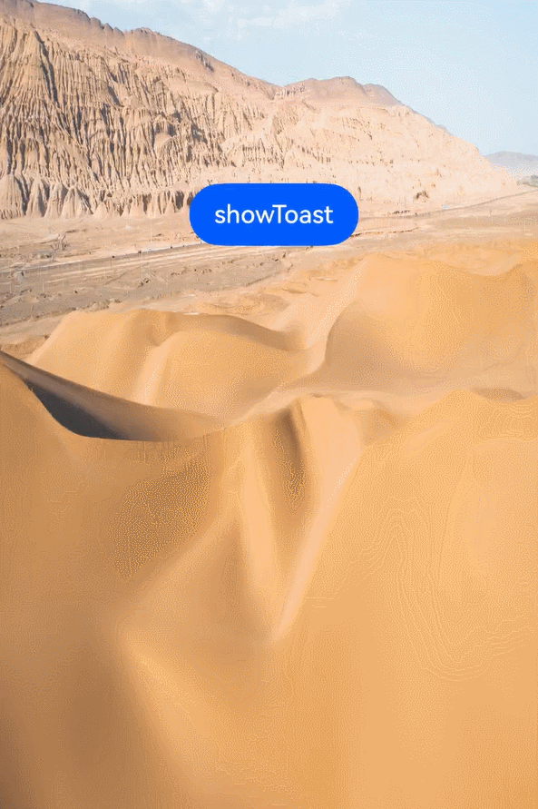

   **Popup Example**

   The following example sets the THIN style immersive system material through the [PopupOptions](../reference/apis-arkui/arkui-ts/ts-universal-attributes-popup.md#popupoptions) parameter of **bindPopup**, and the popup will display a semi-transparent background with a material effect.

   <!-- @[PopupMaterial](https://gitcode.com/openharmony/applications_app_samples/blob/master/code/DocsSample/ArkUISample/ImmersiveLightSense/entry/src/main/ets/pages/immersiveLightSense/PopupMaterial.ets) -->

   ``` TypeScript
   import { uiMaterial } from '@kit.ArkUI';
   
   @Entry
   @Component
   struct PopupMaterialPage {
     @State handlePopup: boolean = false;
   
     build() {
       Flex({ direction: FlexDirection.Column }) {
         Button('PopupOptions')
           .onClick(() => {
             this.handlePopup = !this.handlePopup
           })
           .bindPopup(this.handlePopup!!, {
             message: 'This is a popup with PopupOptions',
             placement: Placement.Top,
             // Controls whether to set the system material
             systemMaterial: new uiMaterial.ImmersiveMaterial({
               style: uiMaterial.ImmersiveStyle.THIN
             })
           })
           .position({ x: 100, y: 300 })
       }.width('100%')
       // Please replace with the actual resource file
       .backgroundImage($r('app.media.img'))
       .backgroundImageSize({ width: '100%', height: '100%' })
     }
   }
   ```

   When the system material is not set:

   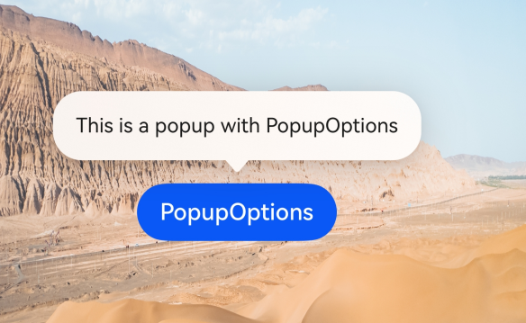

   After setting the system material:

   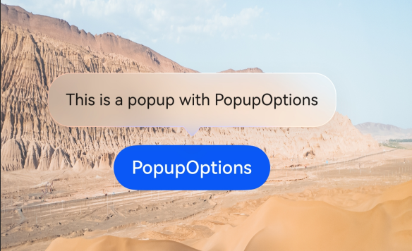

   **Tips Example**

   The following example demonstrates how to set an immersive system material with the THIN style through the [TipsOptions](../reference/apis-arkui/arkui-ts/ts-universal-attributes-tips.md#tipsoptions) parameter of **bindTips**. The **tooltip** will display a translucent background with material effects.

   <!-- @[TipsMaterial](https://gitcode.com/openharmony/applications_app_samples/blob/master/code/DocsSample/ArkUISample/ImmersiveLightSense/entry/src/main/ets/pages/immersiveLightSense/TipsMaterial.ets) -->

   ``` TypeScript
   import { uiMaterial } from '@kit.ArkUI';
   
   @Entry
   @Component
   struct TipsMaterialPage {
     build() {
       Flex({ direction: FlexDirection.Column }) {
         Button('Hover Tips')
           .bindTips('Floating tooltip test', {
             // Controls whether to set the system material
             systemMaterial: new uiMaterial.ImmersiveMaterial({
               style: uiMaterial.ImmersiveStyle.THIN
             })
           })
           .position({ x: 100, y: 300 })
       }.width('100%').padding({ top: 5 })
       // Please replace with the actual resource file
       .backgroundImage($r('app.media.img'))
       .backgroundImageSize({ width: '100%', height: '100%' })
     }
   }
   ```

   When the system material is not set:

   

   After the system material is set:

   

   **bindSheet Example**

   The following example sets an immersive system material with the ULTRA_THICK style through the [SheetOptions](../reference/apis-arkui/arkui-ts/ts-universal-attributes-sheet-transition.md#sheetoptions) parameter of bindSheet. The semi-modal page presents a background with blur and material effects.

   <!-- @[SheetMaterial](https://gitcode.com/openharmony/applications_app_samples/blob/master/code/DocsSample/ArkUISample/ImmersiveLightSense/entry/src/main/ets/pages/immersiveLightSense/SheetMaterial.ets) -->

   ``` TypeScript
   import { uiMaterial } from '@kit.ArkUI';
   
   @Entry
   @Component
   struct SheetMaterialPage {
     @State isShow: boolean = false;
     @State sheetHeight: number = 300;
     @State myMaterial: SystemUiMaterial | undefined = new uiMaterial.ImmersiveMaterial({
       style: uiMaterial.ImmersiveStyle.ULTRA_THICK,
     });
   
     @Builder
     myBuilder() {
       Column({ space: 10 }) {
         Text('Text')
           .fontSize(20)
           .margin(10)
       }
       .width('100%')
       .height('100%')
     }
   
     build() {
       Stack() {
         // Replace with the actual resource file.
         Image($r('app.media.startIcon'))
           .width('100%')
           .height('100%')
         Column() {
           Button('open Sheet')
             .onClick(() => {
               this.isShow = true;
             })
             .fontSize(20)
             .margin(10)
             .bindSheet($$this.isShow, this.myBuilder(), {
               height: this.sheetHeight,
               backgroundColor: Color.Transparent,
               systemMaterial: this.myMaterial // Starting from API version 26.0.0, the systemMaterial attribute is added.
             })
         }
         .justifyContent(FlexAlign.Center)
         .width('100%')
         .height('100%')
       }
     }
   }
   ```

   

   **Menu Example**

   The following example demonstrates how to set an immersive system material with the THICK style through the [MenuOptions](../reference/apis-arkui/arkui-ts/ts-universal-attributes-menu.md#menuoptions10) parameter of **bindMenu**. The popup menu will display a background with material effects along with a pop‑up animation.

   <!-- @[MenuMaterial](https://gitcode.com/openharmony/applications_app_samples/blob/master/code/DocsSample/ArkUISample/ImmersiveLightSense/entry/src/main/ets/pages/immersiveLightSense/MenuMaterial.ets) -->

   ``` TypeScript
   import { uiMaterial } from '@kit.ArkUI';
   
   @Entry
   @Component
   struct MenuMaterialPage {
     @Builder
     MyMenu() {
       Menu() {
         MenuItem({ startIcon: $r('app.media.startIcon'), content: 'Menu option' })
         MenuItem({ startIcon: $r('app.media.startIcon'), content: 'Menu option' })
         MenuItem({ startIcon: $r('app.media.startIcon'), content: 'Menu option' })
       }
     }
   
     build() {
       Stack() {
         Button('bindMenu with THICK material')
           .bindMenu(this.MyMenu, {
             systemMaterial: new uiMaterial.ImmersiveMaterial({
               style: uiMaterial.ImmersiveStyle.THICK
             })
           })
       }
       .height('100%')
       .width('100%')
       // Replace with the actual resource file.
       .backgroundImage($r('app.media.img'))
       .backgroundImageSize(ImageSize.Cover)
     }
   }
   ```

   When system material is not set:

   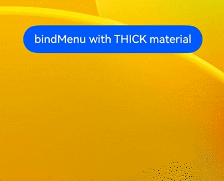

   After setting system material:

   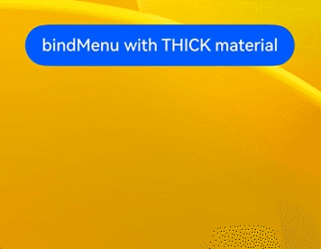

3. Disable the immersive system material for a component.

   In **ENABLE** mode, some components have the immersive system material enabled by default. To individually disable the immersive system material for a specific component, you can set [uiMaterial.Material.empty](../reference/apis-arkui/arkts-apis-uimaterial.md#empty).

   Note that [uiMaterial.Material.empty](../reference/apis-arkui/arkts-apis-uimaterial.md#empty) and setting the systemMaterial attribute to undefined have different meanings: undefined means restoring to the system default state, while uiMaterial.Material.empty explicitly disables the material effect. Therefore, to disable materials for a component that has them enabled by default, use uiMaterial.Material.empty.

   In addition, the materials of some components are controlled by multiple independent APIs. Take [Select](../reference/apis-arkui/arkui-ts/ts-basic-components-select.md) as an example: the material of its dropdown button is set through [systemMaterial](../reference/apis-arkui/arkui-ts/ts-universal-attributes-image-effect.md#systemmaterial), while the material of its dropdown menu is set through the independent [menuSystemMaterial](../reference/apis-arkui/arkui-ts/ts-basic-components-select.md#menusystemmaterial) API. The two are independent of each other and can be enabled or disabled separately.

   <!-- @[CloseMaterial](https://gitcode.com/openharmony/applications_app_samples/blob/master/code/DocsSample/ArkUISample/ImmersiveLightSense/entry/src/main/ets/pages/immersiveLightSense/CloseMaterial.ets) --> 

   ``` TypeScript
   import { uiMaterial } from '@kit.ArkUI';
   
   @Entry
   @Component
   struct CloseMaterialPage {
     build() {
       Column() {
         Text('Disable the immersive system material for a component')
           .fontSize(20)
           .fontWeight(FontWeight.Bold)
           .margin({ bottom: 30 })
   
         Text('Select with immersive system material enabled by default:')
           .fontSize(16)
           .margin({ bottom: 10 })
   
         // The Select component enables immersive system material by default
         Select([{ value: 'Option 1' }, { value: 'Option 2' }])
           .value('Select')
           .margin({ bottom: 30 })
   
         Text('Select with immersive system material disabled individually:')
           .fontSize(16)
           .margin({ bottom: 10 })
   
         // Disable the immersive system material for Select and its dropdown menu.
         Select([{ value: 'Option' }])
           .value('Select')
           .systemMaterial(uiMaterial.Material.empty)
           .menuSystemMaterial(uiMaterial.Material.empty)
       }
       .width('100%')
       .height('100%')
       .padding(20)
       .justifyContent(FlexAlign.Center)
     }
   }
   ```

   If you need to globally disable the immersive system material for all components, you can set the metadata value to "disable" in module.json5.

### Effects After Enabling

The effects of immersive system materials are automatically adapted based on the following two dimensions:

1. **Device computing power tier**: The high, medium, and low tiers of device computing power are determined by the chip. On high-performance and mid-range computing devices, it affects the material filter [materialFilter](../reference/apis-arkui/arkui-ts/ts-universal-attributes-filter-effect.md#materialfilter23) effect and shadow [shadow](../reference/apis-arkui/arkui-ts/ts-universal-attributes-image-effect.md#shadow) effect. On low-end computing devices, it affects the background color [backgroundColor](../reference/apis-arkui/arkui-ts/ts-universal-attributes-background.md#backgroundcolor), border color [borderColor](../reference/apis-arkui/arkui-ts/ts-universal-attributes-border.md#bordercolor), border width [borderWidth](../reference/apis-arkui/arkui-ts/ts-universal-attributes-border.md#borderwidth), and shadow [shadow](../reference/apis-arkui/arkui-ts/ts-universal-attributes-image-effect.md#shadow) effects.

2. **System immersive light sense configuration**: Users can choose the intensity of immersive light sense in the system settings, with three options: strong, balanced, and weak. When set to strong, the material displays the brightest lighting, with the richest blur, highlight, and shadow effects, giving the component the best transparency and texture. When set to weak, the effect is most streamlined, retaining only basic background color and border rendering. When set to balanced, the effect achieves a balance between visual quality and performance.

After immersive system materials are set for components, on high-performance devices, the pop-up process of [Dialog](arkts-base-dialog-overview.md) and [menu control](../reference/apis-arkui/arkui-ts/ts-universal-attributes-menu.md) automatically includes deformation and flowing light spatial effects, making animations more fluid and lively. These effects require no additional configuration — the system automatically determines whether they take effect based on the device's computing power. They take effect automatically on high-performance devices when the immersive light sense intensity is set to strong or balanced, and on mid-range computing devices when the intensity is set to strong. Low-end computing devices do not support spatial effects.

The effects of immersive system materials vary across devices of different computing power tiers. The following examples illustrate the material styles on different devices.

<!-- @[AllStyles](https://gitcode.com/openharmony/applications_app_samples/blob/master/code/DocsSample/ArkUISample/ImmersiveLightSense/entry/src/main/ets/pages/immersiveLightSense/AllStyles.ets) -->

``` TypeScript
import { uiMaterial } from '@kit.ArkUI';

@Entry
@Component
struct AllStylesPage {
  build() {
    Column() {
      Stack() {
        // Replace with the actual resource file
        Image($r('app.media.img'))
          .width('100%')
          .height('100%')

        Column({ space: 30 }) {
          Column() {
            Text('ULTRA_THIN')
          }
          .width(328)
          .height(56)
          .borderRadius(28)
          .justifyContent(FlexAlign.Center)
          .alignItems(HorizontalAlign.Center)
          .systemMaterial(new uiMaterial.ImmersiveMaterial({
            style: uiMaterial.ImmersiveStyle.ULTRA_THIN,
          }))

          Column() {
            Text('THIN')
          }
          .width(328)
          .height(56)
          .borderRadius(28)
          .justifyContent(FlexAlign.Center)
          .alignItems(HorizontalAlign.Center)
          .systemMaterial(new uiMaterial.ImmersiveMaterial({
            style: uiMaterial.ImmersiveStyle.THIN,
          }))

          Column() {
            Text('REGULAR')
          }
          .width(328)
          .height(56)
          .borderRadius(28)
          .justifyContent(FlexAlign.Center)
          .alignItems(HorizontalAlign.Center)
          .systemMaterial(new uiMaterial.ImmersiveMaterial({
            style: uiMaterial.ImmersiveStyle.REGULAR,
          }))

          Column() {
            Text('THICK')
          }
          .width(328)
          .height(56)
          .borderRadius(28)
          .justifyContent(FlexAlign.Center)
          .alignItems(HorizontalAlign.Center)
          .systemMaterial(new uiMaterial.ImmersiveMaterial({
            style: uiMaterial.ImmersiveStyle.THICK,
          }))

          Column() {
            Text('ULTRA_THICK')
          }
          .width(328)
          .height(56)
          .borderRadius(28)
          .justifyContent(FlexAlign.Center)
          .alignItems(HorizontalAlign.Center)
          .systemMaterial(new uiMaterial.ImmersiveMaterial({
            style: uiMaterial.ImmersiveStyle.ULTRA_THICK,
          }))
        }
      }
      .height('90%')
      .width('90%')
    }
    .height('100%')
    .width('100%')
    .alignItems(HorizontalAlign.Center)
    .justifyContent(FlexAlign.Center)
  }
}
```

Performance on low-end computing devices:


Performance on mid-range computing devices:


Performance on high-performance devices:


<!-- @[MenuMaterial](https://gitcode.com/openharmony/applications_app_samples/blob/master/code/DocsSample/ArkUISample/ImmersiveLightSense/entry/src/main/ets/pages/immersiveLightSense/MenuMaterial.ets) -->

``` TypeScript
import { uiMaterial } from '@kit.ArkUI';

@Entry
@Component
struct MenuMaterialPage {
  @Builder
  MyMenu() {
    Menu() {
      MenuItem({ startIcon: $r('app.media.startIcon'), content: 'Menu option' })
      MenuItem({ startIcon: $r('app.media.startIcon'), content: 'Menu option' })
      MenuItem({ startIcon: $r('app.media.startIcon'), content: 'Menu option' })
    }
  }

  build() {
    Stack() {
      Button('bindMenu with THICK material')
        .bindMenu(this.MyMenu, {
          systemMaterial: new uiMaterial.ImmersiveMaterial({
            style: uiMaterial.ImmersiveStyle.THICK
          })
        })
    }
    .height('100%')
    .width('100%')
    // Replace with the actual resource file
    .backgroundImage($r('app.media.img'))
    .backgroundImageSize(ImageSize.Cover)
  }
}
```

Effect when immersive light sense is set to strong:

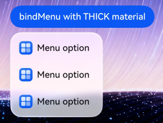

Effect when immersive light sense is set to weak:

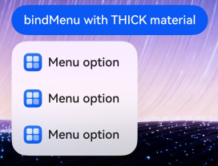

Effect when immersive light sense is set to balanced:

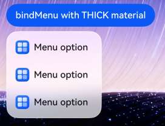

## Constraints

### Performance and Power Consumption

Immersive system materials are composed of multiple layers of effects including material filters, refraction, highlights, and shadows. Improper use can significantly increase GPU load and power consumption. While pursuing visual quality, follow the recommendations below to avoid performance and power consumption issues.

1. Avoid using materials over large areas

   The larger the area affected by the material, the more pixels need to be processed. Avoid using materials on a single oversized area, and avoid repeatedly using materials on a large number of small areas. Prioritize limiting materials to localized areas such as cards and toolbars that need to be highlighted.

   ```ts
   // Correct example: Use material only on local containers that need to be highlighted.
   Column() {
     // ...full page content
     Column() {
       Text('Card')
     }
     .width(328)
     .height(120)
     .borderRadius(24)
     .systemMaterial(new uiMaterial.ImmersiveMaterial({
       style: uiMaterial.ImmersiveStyle.REGULAR,
     }))
   }
   
   // Counterexample: Apply material to the entire page background, which covers an excessively large area.
   Column() {
     // ...full page content
   }
   .width('100%')
   .height('100%')
   .systemMaterial(new uiMaterial.ImmersiveMaterial({
     style: uiMaterial.ImmersiveStyle.REGULAR,
   }))
   ```

2. Avoid nesting or stacking multiple materials

   Stacking materials causes effects to be recalculated and visually interferes with each other. Within the same subtree, set the material only once on the outermost layer; inner nodes should not set materials again.

   ```ts
   // Correct example: Set material only once on the outermost layer.
   Column() {
     Column() {
       Text('Content')
     }
   }
   .systemMaterial(new uiMaterial.ImmersiveMaterial({
     style: uiMaterial.ImmersiveStyle.REGULAR,
   }))
   
   // Counterexample: Material is set on both the outer and inner layers, resulting in nesting.
   Column() {
     Column() {
       Text('Content')
     }
     .systemMaterial(new uiMaterial.ImmersiveMaterial({
       style: uiMaterial.ImmersiveStyle.THIN,
     }))
   }
   .systemMaterial(new uiMaterial.ImmersiveMaterial({
     style: uiMaterial.ImmersiveStyle.REGULAR,
   }))
   ```

3. Avoid using materials together with blur

   The material filter (materialFilter) that comes with immersive system materials already includes a background blur effect. Adding blur attributes such as backgroundBlurStyle or backgroundEffect on top of it is redundant, unnecessary, and adds extra overhead.

   ```ts
   // Correct example: Use only immersive system material, which provides the blur effect.
   Column() {
     Text('Content')
   }
   .systemMaterial(new uiMaterial.ImmersiveMaterial({
     style: uiMaterial.ImmersiveStyle.THICK,
   }))
   
   // Counterexample: Set both material and background blur simultaneously, resulting in redundant processing.
   Column() {
     Text('Content')
   }
   .systemMaterial(new uiMaterial.ImmersiveMaterial({
     style: uiMaterial.ImmersiveStyle.THICK,
   }))
   .backgroundBlurStyle(BlurStyle.COMPONENT_THICK)
   ```

4. Control the size of spatial effects for pop-ups such as Dialog and Menu

   On high-performance devices, when the immersive light sense intensity is set to strong or balanced, Dialog and Menu components include deformation and flowing light spatial effects by default (see the spatial effects description above). The larger the pop-up area, the higher the per-frame rendering cost of the effects. Avoid oversized Dialogs or Menus that are nearly full-screen, and keep pop-up sizes within a reasonable range.

5. Avoid placing materials over videos and animated images

   The refraction and blur effects of materials need to sample the content behind them in real time. When the background consists of continuously changing content such as videos or animated images, the material layer is forced to resample and recalculate frame by frame, significantly increasing overhead. Avoid overlaying materials on top of dynamic content such as videos and animated images.

   ```ts
   // Counterexample: Overlay material on top of a video, which requires per-frame recalculation of the material.
   Stack() {
     Column() {
       // Video
     }
       .width('100%')
       .height('100%')
     Column() {
       Text('Overlay')
     }
     .systemMaterial(new uiMaterial.ImmersiveMaterial({
       style: uiMaterial.ImmersiveStyle.THIN,
     }))
   }
   ```

6. Avoid long-duration animations on materials

   Continuously running property animations (such as repeatedly changing size, position, or opacity) on areas with materials causes the material effect to be recalculated on every frame, consuming GPU resources over long periods. Material areas should remain as stable as possible. If animations are necessary, keep them short and avoid infinite loops.

   ```ts
   // Correct example: Keep the material area stable and avoid applying long-duration animations to it.
   // If animation is necessary, shorten the duration and avoid infinite loops.
   
   // Counterexample: Apply a long-duration, infinite-loop size animation to the material area.
   animateTo({ duration: 3000, iterations: -1 }, () => {
     this.boxWidth = 400
   })
   ```

7. Avoid enabling color inversion for too many components

   Automatic color inversion (colorInvert) calculates the inverted color for each color set through resource APIs in the material subtree. The larger the subtree and the more components participating in inversion, the higher the computation cost. Control the scope of color inversion and avoid enabling it globally over a large area containing numerous texts and icons.

   ```ts
   // Correct example: Narrow the auto-invert scope and enable it only for local areas where readability must be ensured.
   Column() {
     // ...most content does not have auto-invert enabled
     Column() {
       Text('Title').fontColor($r('app.color.text'))
     }
     .systemMaterial(new uiMaterial.ImmersiveMaterial({
       style: uiMaterial.ImmersiveStyle.THIN,
       colorInvert: true,
     }))
   }
   
   // Counterexample: Enable auto-invert on the outer layer of a list with many child items, causing all child item colors to participate in the calculation.
   Column() {
     ForEach(this.largeList, (item: string) => {
       Text(item).fontColor($r('app.color.text'))
     })
   }
   .systemMaterial(new uiMaterial.ImmersiveMaterial({
     style: uiMaterial.ImmersiveStyle.THIN,
     colorInvert: true,
   }))
   ```

8. Use materials with caution in scrolling lists or frequently recycled list items

   During scrolling, the content behind each material item is continuously changing, requiring the material to resample the background frame by frame. The more visible material items there are, the greater the overhead. Avoid setting materials on every list item. If the entire list needs a material texture, set it once on a stable container outside the list, or use it only on a few key items.

   ```ts
   // Correct example: Do not set material on each individual item, avoiding additional material sampling overhead during scrolling.
   List() {
     ForEach(this.largeList, (item: string) => {
       ListItem() {
         Text(item)
       }
     })
   }
   
   // Counterexample: Set material on each ListItem, causing per-frame recalculation during scrolling.
   List() {
     ForEach(this.largeList, (item: string) => {
       ListItem() {
         Text(item)
       }
       .systemMaterial(new uiMaterial.ImmersiveMaterial({
         style: uiMaterial.ImmersiveStyle.THIN,
       }))
     })
   }
   ```

9. Do not frequently change material parameters or the internal structure of material areas at runtime

   Frequently modifying material parameters such as style and materialColor, or frequently adding or removing child nodes within material areas, triggers recalculation of material effects. It is recommended to determine material parameters once and keep them stable. The subtree structure within material areas should also remain as stable as possible.

   ```ts
   // Correct example: Set material parameters once and keep them stable.
   new uiMaterial.ImmersiveMaterial({
     style: uiMaterial.ImmersiveStyle.THIN,
     materialColor: '#80FF0000',
   })
   
   // Counterexample: Frequently modify the material color in a timer, repeatedly triggering material recalculation.
   setInterval(() => {
     this.materialColor = this.nextColor()
   }, 100)
   ```

10. Do not overlay additional shadows on materials

    Immersive system materials provide shadows by default through applyShadow. Adding an extra universal shadow attribute not only conflicts with the material effect but also causes redundant rendering overhead. If you need to customize the shadow, set applyShadow to false before using shadow to avoid both effects taking effect simultaneously.

    ```ts
    // Correct example: If a custom shadow is needed, first disable the material's built-in shadow (applyShadow: false).
    Column() {
      Text('Content')
    }
    .systemMaterial(new uiMaterial.ImmersiveMaterial({
      style: uiMaterial.ImmersiveStyle.REGULAR,
      applyShadow: false,
    }))
    .shadow({ radius: 20, color: Color.Black })
    
    // Counterexample: The material (with applyShadow set to true by default) and the custom shadow coexist, resulting in redundancy and conflict.
    Column() {
      Text('Content')
    }
    .systemMaterial(new uiMaterial.ImmersiveMaterial({
      style: uiMaterial.ImmersiveStyle.REGULAR,
    }))
    .shadow({ radius: 20, color: Color.Black })
    ```

General principle: Treat immersive system materials as a "scarce" visual resource — control the area and number of layers, keep them away from continuously changing content, and keep material areas stable. This way, you can achieve high-quality visual effects while minimizing the impact on performance and power consumption.

### Attribute Conflicts

Setting immersive system materials affects the visual appearance of components. For details, see [Immersive System Materials](#immersive-system-materials). For scenarios where materials are set via the universal attribute [systemMaterial](../reference/apis-arkui/arkui-ts/ts-universal-attributes-image-effect.md#systemmaterial), it is recommended to place the [systemMaterial](../reference/apis-arkui/arkui-ts/ts-universal-attributes-image-effect.md#systemmaterial) attribute after other style attributes to ensure correct priority of material effects. When setting materials via the **options** parameter, the order does not need to be considered.

For all components with immersive system materials applied, it is not recommended to set the background color, background blur, shadow, or border styles simultaneously. In **DEFAULT** mode, components such as **Dialog** and **Toast** enable immersive system materials by default when the background color, blur parameters, or shadow parameters are not set. If you actively set these attributes, immersive system materials will not be enabled by default, and you need to explicitly enable them via the **systemMaterial** attribute.

### Light and Dark Modes

Immersive system materials automatically adapt to the system's light or dark mode, displaying different visual effects. In light mode, the material presents a bright and transparent appearance. In dark mode, it presents a deep and subdued appearance. Developers do not need to configure material parameters separately for different modes.

Material effect in light mode:

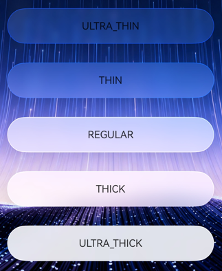

Material effect in dark mode:

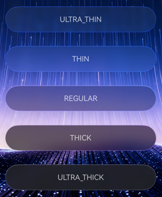

### Automatic Color Inversion

When a component is set to a highly transparent material (such as ULTRA_THIN or THIN), the text inside the component may have insufficient contrast with the background color, resulting in a poor reading experience. In this case, you can enable the colorInvert auto-inversion feature in [ImmersiveOptions](../reference/apis-arkui/arkts-apis-uimaterial.md#immersiveoptions).

After **colorInvert** is enabled, the text color within the component's child nodes will automatically adapt to the inverted color of the material relative to the background, ensuring that the text remains readable at all times.The details are as follows:

- Automatic color inversion takes effect only when the material is sufficiently thin, specifically for material styles THIN or ULTRA_THIN.

- Automatic color inversion is related to the system's immersive lighting intensity configuration. The thinner the material and the stronger the immersive lighting, the more likely it is to meet the requirements for color inversion.

- Automatic color inversion takes effect only on color values set through resource APIs, including the [fontColor](../reference/apis-arkui/arkui-ts/ts-basic-components-text.md#fontcolor) of the Text component, the [fontColor](../reference/apis-arkui/arkui-ts/ts-basic-components-button.md#fontcolor) of the Button component, the [fontColor](../reference/apis-arkui/arkui-ts/ts-basic-components-symbolGlyph.md#fontcolor) of the SymbolGlyph component, the [fillColor](../reference/apis-arkui/arkui-ts/ts-basic-components-image.md#fillcolor) of the Image component, the [placeholderColor](../reference/apis-arkui/arkui-ts/ts-basic-components-search.md#placeholdercolor), [fontColor](../reference/apis-arkui/arkui-ts/ts-basic-components-search.md#fontcolor10), icon color in [searchIcon](../reference/apis-arkui/arkui-ts/ts-basic-components-search.md#searchicon10), icon color in [cancelButton](../reference/apis-arkui/arkui-ts/ts-basic-components-search.md#cancelbutton10), and cursor color in [caretStyle](../reference/apis-arkui/arkui-ts/ts-basic-components-search.md#caretstyle10) of the Search component, the text and icon colors when the [tabBar](../reference/apis-arkui/arkui-ts/ts-container-tabcontent.md#tabbar) attribute of the TabContent component uses the [BottomTabBarStyle](../reference/apis-arkui/arkui-ts/ts-container-tabcontent.md#bottomtabbarstyle9) style, as well as the color attributes of components such as Chip, ChipGroup, TextInput, TextArea, SegmentButton, and Swiper. For the complete list of effective attributes, see the [colorInvert](../reference/apis-arkui/arkts-apis-uimaterial.md#immersiveoptions) parameter description.

<!-- @[ColorInvert](https://gitcode.com/openharmony/applications_app_samples/blob/master/code/DocsSample/ArkUISample/ImmersiveLightSense/entry/src/main/ets/pages/immersiveLightSense/ColorInvert.ets) -->

``` TypeScript
import { uiMaterial } from '@kit.ArkUI';

@Entry
@Component
struct ColorInvertPage {
  build() {
    Column() {
      Stack() {
        // Replace with the actual resource file
        Image($r('app.media.img'))
          .width('100%')
          .height('100%')

        Column({ space: 20 }) {
          // Auto-invert is not enabled, text may be difficult to read
          Column() {
            Text('Auto-invert not enabled')
              .fontColor(Color.White)
          }
          .width(280)
          .height(56)
          .borderRadius(28)
          .justifyContent(FlexAlign.Center)
          .systemMaterial(new uiMaterial.ImmersiveMaterial({
            style: uiMaterial.ImmersiveStyle.ULTRA_THIN,
            colorInvert: false,
          }))

          // Enable auto-invert to automatically adapt text color to the background
          Column() {
            Text('Auto-invert enabled')
              .fontColor(Color.White)
          }
          .width(280)
          .height(56)
          .borderRadius(28)
          .justifyContent(FlexAlign.Center)
          .systemMaterial(new uiMaterial.ImmersiveMaterial({
            style: uiMaterial.ImmersiveStyle.ULTRA_THIN,
            colorInvert: true,
          }))
        }
      }
      .width('100%')
      .height('100%')
    }
    .width('100%')
    .height('100%')
  }
}
```

Comparison before and after enabling color inversion:

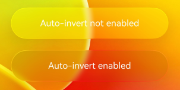

<!--RP1--><!--RP1End-->

<!--no_check-->