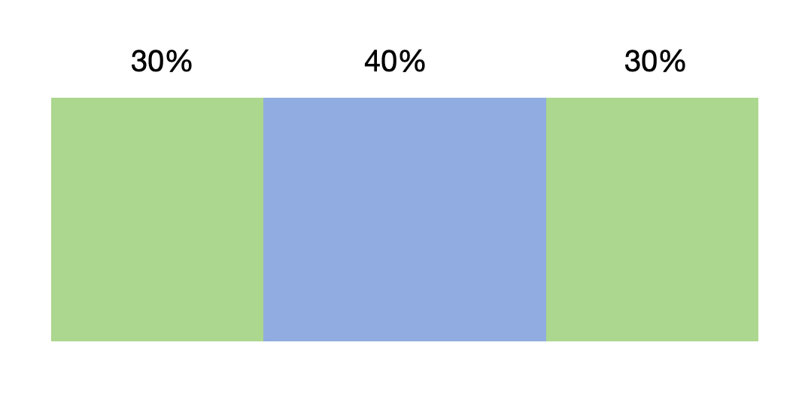

# Interaction Mechanism Overview

The interaction framework processes pointer-based inputs through coordinate-based hit testing to determine event and gesture targets. This mechanism forms a response chain where the system delivers events to corresponding UI components based on the coordinates, types, and other information of the events, combined with the UI layout. Multiple events can combine to trigger gestures or features, for example, long press, click, and drag.

## Event Interaction Pipeline

The event interaction pipeline describes the end-to-end process where ArkUI receives touch-type or mouse-type input events from upstream systems, collects event response chains based on developer-configured parameters, and dispatches them to components to trigger callbacks. This pipeline consists of three key phases:

1. Event Generation

   Hardware input devices report events to target ArkUI instances through drivers and multi-mode modules. The rendering pipeline of ArkUI performs unified event processing.

2. Event Response Chain Formation and Event Dispatch

   The event response chain forms the core of the event interaction pipeline. After receiving an event, the pipeline performs hit testing to construct an event response chain, which drives decision-making for event dispatch and gesture recognition.

   (1) Hit Testing

    After receiving an initial touch event, the pipeline performs spatial hit testing using event coordinates and component boundaries and constructs an event response chain. You can configure attributes to affect the formation of the event response chain.

   (2) Dispatch to the Touch Event Response Chain

    Through the constructed touch response chain, the system delivers the touch event to target components.

   (3) Dispatch to the Gesture Response Chain and Gesture Recognition

    Components with registered gestures form a gesture response chain. The system combines events to detect gestures, resolves gesture conflicts through competition logic, and triggers the callback of the winning gesture.

   (4) Event Interception

    You can intercept events at two levels:

   - Pre-chain: Configure hit test properties to affect the formation of the event response chain.

   - Post-chain:

     During event dispatch to the touch event response chain, you can block touch event propagation using touch interceptors.

     During dispatch to the gesture response chain, you can suppress gesture recognition using gesture interceptors.

3. Callback Execution

   During response chain formation, registered callbacks are collected. Then, after response chain formation and event dispatch, callbacks are executed for qualifying events and gestures.

## Event Response Chain Mechanism

ArkUI constructs event response chains through hit testing using a reverse post-order traversal (right-subtree-first) of the component tree. The pseudocode implementation is as follows:

```
forEach((item, node.rbegin(),node.rend())=> {
    item.TouchTest();
})
node.collectEvent()
```

Consider the following component tree, where all components have **hitTestBehavior** set to **Default**. If the user taps component 5, the final response chain collected will be [5 -> 3 -> 1].

This is because component 3 has **hitTestBehavior** set to **Default**, which blocks the collection from its sibling nodes after receiving the event, thereby excluding the left subtree of component 1 (that is, component 2) from the response chain.

  


## Hit Testing

Touch testing, also known as hit testing, is the process by which the system determines which components' events or gestures can participate in responding to a user interaction before the interaction begins.

### Implementation Principles

For dispatching pointer events, the system does not recursively traverse all component nodes starting from the root node. Instead, during the initial event occurrence, it identifies the range of components capable of responding to the interaction—that is, detecting which component the user has clicked. Components not clicked will not respond to this interaction. This process is called hit testing, or touch testing. The system determines whether a component is clicked by checking whether its response region contains the event coordinates.


The basic process of hit testing is as follows: When the user presses down, the system traverses the component tree from top to bottom and from right to left, collects gestures and events bound to each component, and then bubbles up this information level by level to parent components for consolidation, constructing a complete event response chain.

Assume that the user presses at point T (Touch Down). Components A, B, and D are identified as hit, and the chain formed by these components is called the response chain for this interaction. Base events are propagated along this chain: They are first delivered to the leaf node, and then passed to parent nodes, bubbling upward. This process is known as event bubbling.

Below shows the hit testing process.

  

As shown in the figure, when the initial event is dispatched to a component, the component collects gestures and events bound to it, and then passes the collection result to the parent component until the root node is reached. If a component is transparent, has been removed from the component tree, or the event coordinates are outside the component's response region, the collection process is not triggered, and the parent component receives an empty response. Otherwise, all components will collect gestures and events and send the collection result to the parent component.

### Hit Test Intervention

Applications can intervene in hit test results through the following methods to influence the final response scope, thereby controlling which components are included in the event response chain.

| Intervention Mode      | Description                            | API        | Remarks                                                                                                                                                                                                                                                                                                                                     |
| -------------- | ------------------------------------ | ---------------- | ----------------------------------------------------------------------------------------------------------------------------------------------------------------------------------------------------------------------------------------------------------------------------------------------------------------------------------------- |
| Response region setting  | Sets the region where a component can respond to user interactions.| [responseRegion](../reference/apis-arkui/arkui-ts/ts-universal-attributes-touch-target.md#responseregion)   | 1. The response region is used to determine whether the user's touch falls within its range; only touches within the range will be collected.<br>2. The response region also affects gesture recognition, such as clicks, which are triggered only when the touch is released within the response region range.<br>                                                                                                                                                                    |
| Hit test control  | Intervenes in the collection results of the component itself and other components.        | [hitTestBehavior](../reference/apis-arkui/arkui-ts/ts-universal-attributes-hit-test-behavior.md#hittestbehavior)  | **hitTestBehavior** works similarly to **onTouchIntercept**, but it is statically configured.                                                                                                                                                                                                                                                                              |
| Custom event interception| Intervenes in the collection results of the component itself and other components.        | [onTouchIntercept](../reference/apis-arkui/arkui-ts/ts-universal-attributes-on-touch-intercept.md#ontouchintercept) | This callback is triggered when the user presses down and the system begins collecting all components that need to participate in event processing at the current position. Applications can return a **HitTestMode** value through this callback to influence the system's behavior in collecting child or sibling nodes. This enables dynamic control over interaction responses, such as allowing certain components to participate in interactions only under specific service conditions.<br>**onTouchIntercept** works similarly to **hitTestBehavior**, but it is a dynamic callback.|


1. Response Region Setting

   By default, a component's response region matches its own position and size, ensuring maximum consistency between user actions and visual feedback. In rare cases, applications may need to adjust the response region size to limit or expand the component's response range. This is achieved through the **responseRegion** API.

   The response region affects the dispatch of pointer events and can be specified relative to the component's own area. One or more areas can be defined to partition the component's response region into multiple sections.

   >**NOTE**
   >
   > **x** and **y** can be set to a positive or negative percentage value. Setting **x** to **'100%'** shifts the response region rightward by the component's width, while setting **x** to **'-100%'** shifts the response region leftward by the component's width. Setting **y** to **'100%'** shifts the response region downward by the component's height, while setting **y** to **'-100%'** shifts the response region upward by the component's height.
   >
   > **width** and **height** can only be set to positive percentage values. When **width** is set to **'100%'**, the width of the response region is equal to that of the component. For example, if the width of a component is 100 vp, **'100%'** indicates that the width of the response region is also 100 vp. when **height** is set to **'100%'**, the height of the response region is equal to that of the component.
   >
   > Percentage values are calculated relative to the component's own width and height.

   The following is an example of binding multiple response regions:

   ```ts
   Button("Button")
     .responseRegion([
        { x: 0, y: 0, width: '30%', height: '100%' },      // First response region: left 1/3 of the button
        { x: '70%', y: 0, width: '30%', height: '100%' },  // Second response region: left 1/3 of the button
      ])
   ```

   The above code divides the button into three parts, with the middle 40% area non-responsive to clicks, while the remaining areas on both sides remain responsive.

   

2. Hit Test Control

   When [hit test control](../reference/apis-arkui/arkui-ts/ts-universal-attributes-hit-test-behavior.md) is bound to a component, it may affect the hit testing of sibling nodes and parent and child nodes. The impact of a child component on its parent component's hit testing depends on the status of the last child component that is not blocked in hit testing.

   You can configure hit test control to block the hit test of the component itself or other components.

   - **HitTestMode.Default**: This mode is used by default when the **hitTestBehavior** attribute is not specified. In this mode, if the component itself is hit, it will block the hit testing of sibling components, but will not block the hit testing of child components.

     

   - **HitTestMode.None**: In this mode, the component neither receives events nor interferes with the hit testing of its sibling components or child components.

     

   - **HitTestMode.Block**: This mode blocks the hit testing of child components. If the component itself is hit during a hit test, it will also block the hit testing of sibling and parent components.

     

   - **HitTestMode.Transparent**: This mode allows the component to participate in hit testing itself, without blocking the hit testing of sibling or parent components.

     

3. Custom Event Interception

   When a user performs a press action, the callback for [custom event interception](../reference/apis-arkui/arkui-ts/ts-universal-attributes-on-touch-intercept.md) bound to the component is triggered. You can dynamically adjust the **hitTestBehavior** attribute of the component based on the application status to affect the hit test process.

## Enable/Disable Control

[Disabled](../reference/apis-arkui/arkui-ts/ts-universal-attributes-enable.md) components, including their children, do not initiate the hit test process; instead, they pass the events back to the parent to continue the hit test.

## Security Components

ArkUI provides security components, including [PasteButton](../security/AccessToken/pastebutton.md) and [SaveButton](../security/AccessToken/savebutton.md).

If a component has a higher [z-order](../reference/apis-arkui/arkui-ts/ts-universal-attributes-z-order.md) than a security component and covers it, the security component's touch events are sent directly to the parent node for further hit testing.

## Event Bubbling

Basic events propagate through the response chain following a bubbling mechanism, where the innermost component processes the event first, and then the event propagates up to parent components layer by layer. Any component can terminate the further transmission of the event, that is, stop the bubbling. However, it should be noted that stopping the bubbling does not affect gesture recognition in parent components.

**stopPropagation** can terminate event bubbling. As shown in the figure below, when a touch event reaches component C and **stopPropagation()** is called, components B and root will no longer receive this event. However, gesture objects attached to component B can still process the touch event.


> **NOTE**
>
> When using **stopPropagation** to intervene in event bubbling, maintain consistent handling rules for all event types (including **Down**, **Move**, and **Up**) to avoid situations where upper-level nodes only receive partial types of events, resulting in incomplete event cycles. For example, if node B only receives the **Down** event but not the **Up** event, it will affect the integrity of events on node B. For press-type interactions, always ensure the integrity of events.

## Cancel Event

When processing basic events, you will find that there are various types of cancel events, such as **TouchType.Cancel** and **MouseAction.CANCEL**. These events are system generated in specific scenarios. For example, in a drag operation, when the user drags an object that supports dragging (using **onDragStart**) with a finger or mouse device, the application will normally receive touch or mouse events before **onDragStart** is triggered. Once the drag action starts, the system will send a cancel event to inform the application that the normal basic events have ended.

The meaning of Cancel is the same as that of Up, both indicating the end of event processing. If you are handling scenarios involving **Up** and **Release** events, you should also handle cancel events simultaneously.
