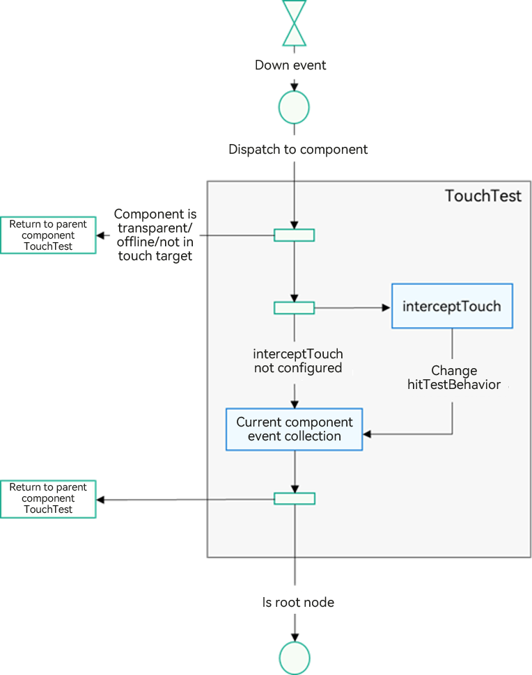
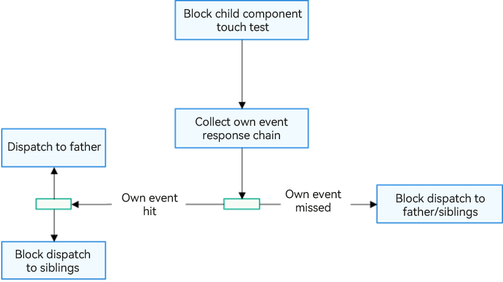
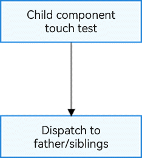
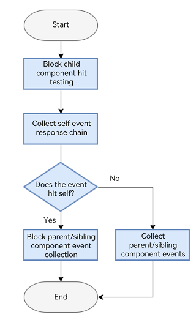
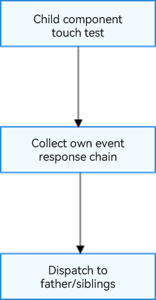
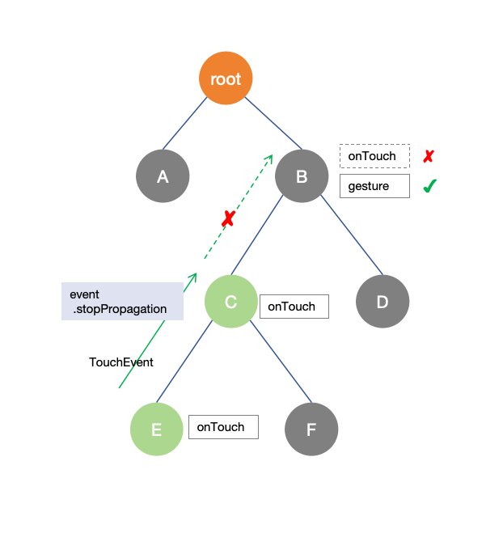

# Interaction Mechanism Overview

<!--Kit: ArkUI-->
<!--Subsystem: ArkUI-->
<!--Owner: @yihao-lin-->
<!--Designer: @piggyguy-->
<!--Tester: @songyanhong-->
<!--Adviser: @Brilliantry_Rui-->
<!-- md-trans-meta sourceCommit=c8954d33bacbdec6df88d8586db7cc9b9d8a799e translatedAt=2026-08-01T00:29:17.838Z pushedAt=2026-08-01T06:13:03.643Z -->

For pointer-based interactions including [touch events](../reference/apis-arkui/arkui-ts/ts-universal-events-touch.md), [mouse events](../reference/apis-arkui/arkui-ts/ts-universal-mouse-key.md), and [axis events](../reference/apis-arkui/arkui-ts/ts-universal-events-axis.md), the interaction framework determines event and gesture targets through coordinate-based hit testing. This process assembles a response chain by identifying components within the interaction area. The system then dispatches events to appropriate UI components by correlating touch coordinates, event types, and layout information. Multiple events can combine to trigger gestures or features, for example, long press, click, and drag.

## Event Interaction Pipeline

The event interaction pipeline describes the end-to-end process where ArkUI receives touch-type or mouse-type input events from upstream systems, collects event response chains based on developer-configured parameters, and dispatches them to components to trigger callbacks. This pipeline consists of three key phases:

1. Event Generation

   Hardware input devices report events to target ArkUI instances through drivers and multi-mode modules. The rendering pipeline of ArkUI performs unified event processing.

2. Event Response Chain Formation and Event Dispatch

   The event response chain forms the core of the event interaction pipeline. After receiving an event, the pipeline performs hit testing to construct an event response chain, which drives decision-making for event dispatch and gesture recognition.

   (1) Hit Testing

    After receiving an initial touch event, the pipeline performs spatial hit testing using event coordinates and component positions and constructs an event response chain. You can configure attributes to affect the formation of the event response chain.

   (2) Dispatch to the Touch Event Response Chain

    Through the constructed touch response chain, the system delivers the touch event to target components.

   (3) Dispatch to the Gesture Response Chain and Gesture Recognition

    Components with registered gestures form a gesture response chain. The system combines events to detect gestures, resolves gesture conflicts through competition logic, and triggers the callback of the winning gesture.

   (4) Event Interception

    Before the event response chain is established, you can configure hit test attributes to influence the formation of the event response chain. Once the event response chain is established, you can use the provided APIs to intercept events, thereby altering the event dispatch flow.

    During event dispatch to the touch event response chain, you can block touch event propagation using touch interceptors.

    During dispatch to the gesture response chain, you can suppress gesture recognition using gesture interceptors.

3. Callback Execution

   During response chain formation, registered callbacks are synchronously collected. Then, after response chain formation and event dispatch, callbacks are executed for qualifying events and gestures.

## Event Response Chain

The event response chain is an ordered chain composed of all components that are collected through hit testing and can respond to the current interaction. When the user touches the screen, the system starts from the touch point position and follows a post-order traversal order prioritizing the right subtree (that is, starting from the innermost component and collecting outward layer by layer, bottom-up and right-to-left) to form the complete response chain.<!--RP1--><!--RP1End-->

The following figure illustrates the hierarchical structure of the component tree and the process of collecting the event response chain. In the figure, the parent and child nodes correspond to the parent and child components, respectively. The left and right subtrees correspond to sibling components. The components corresponding to the right subtree are displayed above those corresponding to the left subtree.


You can use the [hitTestBehavior](../reference/apis-arkui/arkui-ts/ts-universal-attributes-hit-test-behavior.md#hittestbehavior) attribute to set the hit test mode of a component. In this example, the hit test mode of all components is set to [HitTestMode](../reference/apis-arkui/arkui-ts/ts-appendix-enums.md#hittestmode9).Default. If the user taps component 5, the response chain collection process is as follows:

1. The system detects that the hit point falls on component 5, and component 5 is collected.

2. The event bubbles up to parent component 3, and component 3 is collected.

3. Since component 3's hit test mode is **HitTestMode.Default**, the sibling component will be blocked after the event is collected. Therefore, component 2 will not be collected.

4. The event continues to bubble up to root component 1, and component 1 is collected.

Therefore, the final response chain (in order of component hierarchy) is 5, 3, and 1.

## Hit Testing

Touch testing, also known as hit testing, is the process by which the system determines which components' events or gestures can participate in responding to a user interaction before the interaction begins.

### Implementation Principles

For dispatching pointer events, the system does not recursively traverse all component nodes starting from the root node. Instead, during the initial event occurrence, it identifies the range of components capable of responding to the interaction—that is, detecting which component the user has clicked. Components not clicked will not respond to this interaction. This process is called hit testing, or touch testing. The system determines whether a component is clicked by checking whether its response region contains the event coordinates.


The basic process of hit testing is as follows: When the user triggers a press event, the system traverses the component tree from top to bottom and right to left, collects gestures and events bound to each component, and then bubbles up this information level by level to parent components for consolidation, constructing a complete event response chain.

Assume that the user presses at point T (Touch Down). Components A, B, and D are identified as hit, and the chain formed by these components is called the response chain for this interaction. Base events are propagated along this chain: They are first delivered to the leaf node, and then passed to parent nodes, bubbling upward. This process is known as event bubbling.

The following figure shows the hit testing process.



As shown in the figure, when the initial event is dispatched to a component, the component collects gestures and events bound to it, and then passes the collection result to the parent component until the root node is reached. If a component is transparent, has been removed from the component tree, or the event coordinates are outside the component's response region, the collection process is not triggered, and the parent component receives an empty response. Otherwise, all components will collect gestures and events and send the collection result to the parent component.

### Hit Test Intervention

Applications can intervene in hit test results through the following methods to influence the final response scope, thereby controlling which components are included in the event response chain.

| Intervention Mode      | Description                            | API        | Remarks                                                                                                                                                                                                                                                                                                                                     |
| -------------- | ------------------------------------ | ---------------- | ----------------------------------------------------------------------------------------------------------------------------------------------------------------------------------------------------------------------------------------------------------------------------------------------------------------------------------------- |
| Response region setting  | Sets the region where a component can respond to user interactions.| [responseRegion](../reference/apis-arkui/arkui-ts/ts-universal-attributes-touch-target.md#responseregion)   | 1. The response region is used to determine whether the user's touch falls within its range; only touches within the range will be collected.<br>2. The response region also affects gesture recognition, such as clicks, which are triggered only when the touch is released within the response region range.<br>                                                                                                                                                                    |
| Response region setting  | Sets the region where a component can respond to mouse interactions.| [mouseResponseRegion](../reference/apis-arkui/arkui-ts/ts-universal-attributes-touch-target.md#mouseresponseregion10)   | Sets one or more mouse response regions. The function is similar to that of **responseRegion**, but it takes effect only for mouse events.<br>                                                                                                                                                                    |
| Response region setting  | Sets the touch response list for the component.| [responseRegionList](../reference/apis-arkui/arkui-ts/ts-universal-attributes-touch-target.md#responseregionlist22)   | Sets the list of touch response regions for the component. You can specify the input tool type (such as mouse or touch) applicable to each region. When this API is called, the **responseRegion** and **mouseResponseRegion** APIs do not take effect. This function is supported since API version 22.<br>                                                                                                                                                                    |
| Hit test control  | Intervenes in the collection results of the component itself and other components.        | [hitTestBehavior](../reference/apis-arkui/arkui-ts/ts-universal-attributes-hit-test-behavior.md#hittestbehavior)  | **hitTestBehavior** works similarly to **onTouchIntercept**, but it is statically configured.                                                                                                                                                                                                                                                                              |
| Custom event interception| Intervenes in the collection results of the component itself and other components.        | [onTouchIntercept](../reference/apis-arkui/arkui-ts/ts-universal-attributes-on-touch-intercept.md#ontouchintercept) | This callback is triggered when the user triggers a press event and the system begins collecting all components that need to participate in event processing at the current position. Applications can return a **HitTestMode** value through this callback to influence the system's behavior in collecting child or sibling nodes. This enables dynamic control over interaction responses, such as allowing certain components to participate in interactions only under specific service conditions.<br>**onTouchIntercept** works similarly to **hitTestBehavior**, but it is a dynamic callback.|

1. Response Region Setting

   By default, a component's response region matches its own position and size, ensuring maximum consistency between user actions and visual feedback. In rare cases, an application may need to adjust the size of the response region to limit or expand the scope of operations that a component can respond to.

   ArkUI provides the following APIs to set the touch response region of a component:

   - **responseRegion**: sets one or more response regions, applicable to all input device types (such as touch and mouse). This API is supported since API version 8.

   - **mouseResponseRegion**: Sets one or more mouse response regions, which take effect only for mouse events. This API is supported since API version 10.

   - **responseRegionList**: Sets the list of touch response regions for the component. You can specify the input tool type applicable to each region. When this API is called, the **responseRegion** and **mouseResponseRegion** APIs do not take effect. This function is supported since API version 22.

   The response region affects the dispatch of pointer events and can be specified relative to the component's own area. One or more areas can be defined to partition the component's response region into multiple sections.

   >**NOTE**
   >
   > **x** and **y** can be set to a positive or negative percentage value. Setting **x** to **'100%'** shifts the response region rightward by the component's width, while setting **x** to **'-100%'** shifts the response region leftward by the component's width. Setting **y** to **'100%'** shifts the response region downward by the component's height, while setting **y** to **'-100%'** shifts the response region upward by the component's height.
   >
   > **width** and **height** can only be set to positive percentage values. When **width** is set to **'100%'**, the width of the response region is equal to that of the component. For example, if the width of a component is 100 vp, **'100%'** indicates that the width of the response region is also 100 vp. When **height** is set to **'100%'**, the height of the response region is equal to that of the component.
   >
   > Percentage values are calculated relative to the component's own width and height.

   The following is an example of binding multiple response regions:

   <!-- @[focus_onclick](https://gitcode.com/openharmony/applications_app_samples/blob/master/code/DocsSample/ArkUISample/InterAction/entry/src/main/ets/pages/FocusOnclickExample/FocusOnclickExample.ets) -->

   ``` TypeScript
   @Entry
   @Component
   struct FocusOnclickExample {
     @State text: string = '';
     @State number: number = 0;
   
     build() {
       Column() {
         Text(this.text)
           .margin({ bottom: 20 })
         // Replace $r('app.string.button') with the actual resource file. In this example, the value in the resource file is "Button."
         Button($r('app.string.button'))
           .responseRegion([
             {
               x: 0,
               y: 0,
               width: '30%',
               height: '100%'
             }, // First response region: left 1/3 of the button
             {
               x: '70%',
               y: 0,
               width: '30%',
               height: '100%'
             },// Second response region: right 1/3 of the button
           ])
           .onClick(() => {
             this.number++;
             this.text = 'button' + this.number + 'clicked';
           })
           .width(200)
       }.width('100%').justifyContent(FlexAlign.Center)
     }
   }
   ```

   The above code divides the button into three parts, with the middle 40% area non-responsive to clicks, while the remaining areas on both sides remain responsive.

   

2. Hit Test Control

   When [hit test control](../reference/apis-arkui/arkui-ts/ts-universal-attributes-hit-test-behavior.md) is bound to a component, it may affect the hit testing of sibling nodes and parent and child nodes. The impact of a child component on its parent component's hit testing depends on the status of the last child component that is not blocked in hit testing.

   You can configure hit test control to block the hit test of the component itself or other components.

   - **HitTestMode.Default**: When the **hitTestBehavior** attribute is not configured, if the component itself is hit, it blocks sibling components but does not block child components.

     

   - **HitTestMode.None**: In this mode, the component neither receives events nor interferes with the hit testing of its sibling components or child components.

     

   - **HitTestMode.Block**: This mode blocks the hit testing of child components. If the component itself is hit during a hit test, it will also block the hit testing of sibling and parent components.

     

   - **HitTestMode.Transparent**: This mode allows the component to participate in hit testing itself, without blocking the hit testing of sibling or parent components.

     

   - **HitTestMode.BLOCK_HIERARCHY** (available since API version 20): In this mode, the node itself and its child nodes respond to the hit test, while all parent nodes and sibling nodes with lower priority are blocked from participating in the hit test.

     

   - **HitTestMode.BLOCK_DESCENDANTS** (available since API version 20): In this mode, the node itself does not respond to the hit test, and all its descendants (children, grandchildren, and more) also do not respond to the hit test. It does not affect the hit test of ancestor nodes.

     

3. Custom Event Interception

   When a user performs a press action, the callback for [custom event interception](../reference/apis-arkui/arkui-ts/ts-universal-attributes-on-touch-intercept.md) bound to the component is triggered. You can dynamically adjust the **hitTestBehavior** attribute of the component based on the application status to affect the hit test process.

## Enable/Disable Control

[Disabled](../reference/apis-arkui/arkui-ts/ts-universal-attributes-enable.md) components, including their children, do not initiate the hit test process; instead, they pass the events back to the parent to continue the hit test.

## Security Components

ArkUI provides security components, including [PasteButton](../security/AccessToken/pastebutton.md) and [SaveButton](../security/AccessToken/savebutton.md).

If a component has a higher [z-order](../reference/apis-arkui/arkui-ts/ts-universal-attributes-z-order.md) than a security component and covers it, the security component's touch events are sent directly to the parent node for further hit testing.

## Event Bubbling

Basic events propagate through the response chain following a bubbling mechanism, where the innermost component processes the event first, and then the event propagates up to parent components layer by layer. Any component can terminate the further transmission of the event, that is, stop the bubbling. However, it should be noted that stopping the bubbling does not affect gesture recognition in parent components.

**stopPropagation** can terminate event bubbling. As shown in the figure below, when a touch event reaches component C and **stopPropagation()** is called, components B and root will no longer receive this event. However, gesture objects attached to component B can still receive and process the touch event.



> **NOTE**
>
> When using **stopPropagation** to intervene in event bubbling, maintain consistent handling rules for all event types (including **Down**, **Move**, and **Up**) to avoid situations where upper-level nodes only receive partial types of events, resulting in incomplete event cycles. For example, if node B only receives the **Down** event but not the **Up** event, it will affect the integrity of events on node B. For press-type interactions, always ensure the integrity of events.

## Cancel Event

When handling basic events, you will encounter various types of cancel events, such as [TouchType](../reference/apis-arkui/arkui-ts/ts-appendix-enums.md#touchtype)**.Cancel** and [MouseAction](../reference/apis-arkui/arkui-ts/ts-appendix-enums.md#mouseaction8)**.CANCEL**. These cancel events are generated by the system in specific scenarios. For example, during a drag operation, when the user drags a draggable object (configured with **onDragStart**) with a finger or mouse device, the application typically receives touch or mouse events first. Once the displacement threshold is reached, the [onDragStart](../reference/apis-arkui/arkui-ts/ts-universal-events-drag-drop.md#ondragstart) callback is triggered. Once the drag action starts, the system dispatches a cancel event to inform the application that the normal basic events have ended.

The meaning of **Cancel** is the same as that of Up, both indicating the end of event processing. If you are handling scenarios involving **Up** and **Release** events, you should also handle cancel events simultaneously.