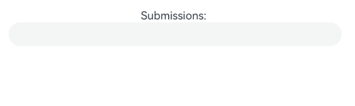
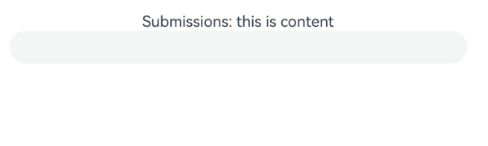

# Keyboard Input Events
<!--Kit: ArkUI-->
<!--Subsystem: ArkUI-->
<!--Owner: @jiangtao92-->
<!--Designer: @piggyguy-->
<!--Tester: @songyanhong-->
<!--Adviser: @HelloCrease-->

Key events generated by physical keys are non-pointer events. Unlike pointer events such as touch events, non-pointer events lack coordinate information and are dispatched to the focused component in a specific order. In text input scenarios, key events are preferentially dispatched to the input method for text association and candidate word processing. Applications can use **onKeyPreIme** to intercept events early in the dispatch process.

> **NOTE**
>
> Certain system key events (for example, the power key) are not delivered to UI components.

## Key Event Data Flow


After being triggered by a device such as a peripheral keyboard, a key event has its data processed and converted by the driver and multimodal input modules, and then is sent to the currently focused window. The window dispatches the received event, following the sequence below. The dispatch stops once the event is consumed.

1. The window first dispatches the event to the ArkUI framework for invoking the **onKeyPreIme** callback bound to the component in focus as well as the page keyboard shortcuts.
2. If the ArkUI framework does not consume the event, the window dispatches the event to the input method for key input.
3. Remaining events are dispatched to **onKeyEventDispatch** events, **onKeyEvent** callbacks on focused components, and focus navigation.

When a text box has focus and the input method is enabled, most key events are consumed by the input method. For example, a letter key is used by the input method to enter a letter in the text box, and an arrow key is used by the input method to switch to the desired candidate word. Yet, if a keyboard shortcut is bound to the text box, the shortcut responds to the event first, and the event will not be consumed by the input method.

Within the ArkUI framework, key events propagate through the focus chain from leaf to root nodes, allowing child components to handle events before parent components.

The key event process for the **Web** component differs from the aforementioned process. When **onKeyPreIme** returns **false**, the **Web** component does not match shortcuts. During phase 3, unconsumed key events are redispatched to ArkUI through **ReDispatch** for shortcut matching.

## onKeyEvent & onKeyPreIme

```ts
onKeyEvent(event: (event: KeyEvent) => void): T
onKeyEvent(event: Callback<KeyEvent, boolean>): T
onKeyPreIme(event: Callback<KeyEvent, boolean>): T
onKeyEventDispatch(event: Callback<KeyEvent, boolean>): T
```

These four methods differ only in their triggering timing (see [Key Event Data Flow](#key-event-data-flow)). The return value of **onKeyPreIme** determines whether events proceed to page shortcuts, input method, **onKeyEventDispatch**, and **onKeyEvent**.


The methods are triggered when the bound component has focus and a key event occurs on the component. The callback parameter [KeyEvent](../reference/apis-arkui/arkui-ts/ts-universal-events-key.md#keyevent) can be used to obtain the information about the key event, including [KeyType](../reference/apis-arkui/arkui-ts/ts-appendix-enums.md#keytype), [keyCode](../reference/apis-input-kit/js-apis-keycode.md#keycode), **keyText**, [KeySource](../reference/apis-arkui/arkui-ts/ts-appendix-enums.md#keysource), **deviceId**, **metaKey**, **timestamp**, and **stopPropagation**.


```ts
// xxx.ets
@Entry
@Component
struct KeyEventExample {
  @State buttonText: string = '';
  @State buttonType: string = '';
  @State columnText: string = '';
  @State columnType: string = '';

  build() {
    Column() {
      Button('onKeyEvent')
        .defaultFocus(true)
        .width(140).height(70)
        .onKeyEvent((event?: KeyEvent) => { // Set the onKeyEvent event for the button.
          if(event){
            if (event.type === KeyType.Down) {
              this.buttonType = 'Down';
            }
            if (event.type === KeyType.Up) {
              this.buttonType = 'Up';
            }
            this.buttonText = 'Button: \n' +
            'KeyType:' + this.buttonType + '\n' +
            'KeyCode:' + event.keyCode + '\n' +
            'KeyText:' + event.keyText;
          }
        })

      Divider()
      Text(this.buttonText).fontColor(Color.Green)

      Divider()
      Text(this.columnText).fontColor(Color.Red)
    }.width('100%').height('100%').justifyContent(FlexAlign.Center)
    .onKeyEvent((event?: KeyEvent) => { // Set the onKeyEvent event for the parent container Column.
      if(event){
        if (event.type === KeyType.Down) {
          this.columnType = 'Down';
        }
        if (event.type === KeyType.Up) {
          this.columnType = 'Up';
        }
        this.columnText = 'Column: \n' +
        'KeyType:' + this.columnType + '\n' +
        'KeyCode:' + event.keyCode + '\n' +
        'KeyText:' + event.keyText;
      }
    })
  }
}
```


In the preceding example, **onKeyEvent** is bound to the **Button** component and its parent container **Column**. After the application opens and loads a page, the first focusable non-container component in the component tree automatically obtains focus. Set the **Button** component as the default focus of the current page. Because the **Button** component is a child node of the **Column** component, the **Column** component also obtains focus. For details about the focus obtaining mechanism, see [Focus Event](arkts-common-events-focus-event.md).


After opening the application, press the following keys on the keyboard in sequence: space, Enter, Ctrl, Shift, A, and Z.


1. The onKeyEvent event bubbles by default. Therefore, the **onKeyEvent** of both **Button** and **Column** can respond.

2. Each key press results in two callbacks, corresponding to **KeyType.Down** and **KeyType.Up**, indicating the key was pressed down and then released.


To prevent the key event of the **Button** component from bubbling up to its parent container **Column**, add the **event.stopPropagation()** API to the **onKeyEvent** callback of **Button**.


```ts
@Entry
@Component
struct KeyEventExample {
  @State buttonText: string = '';
  @State buttonType: string = '';
  @State columnText: string = '';
  @State columnType: string = '';

  build() {
    Column() {
      Button('onKeyEvent')
        .defaultFocus(true)
        .width(140).height(70)
        .onKeyEvent((event?: KeyEvent) => {
          // Use stopPropagation to prevent the key event from bubbling up.
          if(event){
            if(event.stopPropagation){
              event.stopPropagation();
            }
            if (event.type === KeyType.Down) {
              this.buttonType = 'Down';
            }
            if (event.type === KeyType.Up) {
              this.buttonType = 'Up';
            }
            this.buttonText = 'Button: \n' +
              'KeyType:' + this.buttonType + '\n' +
              'KeyCode:' + event.keyCode + '\n' +
              'KeyText:' + event.keyText;
          }
        })

      Divider()
      Text(this.buttonText).fontColor(Color.Green)

      Divider()
      Text(this.columnText).fontColor(Color.Red)
    }.width('100%').height('100%').justifyContent(FlexAlign.Center)
    .onKeyEvent((event?: KeyEvent) => { // Set the onKeyEvent event for the parent container Column.
      if(event){
        if (event.type === KeyType.Down) {
          this.columnType = 'Down';
        }
        if (event.type === KeyType.Up) {
          this.columnType = 'Up';
        }
        this.columnText = 'Column: \n' +
          'KeyType:' + this.columnType + '\n' +
          'KeyCode:' + event.keyCode + '\n' +
          'KeyText:' + event.keyText;
      }
    })
  }
}
```


This example shows how to use **OnKeyPreIme** to block the left arrow key input in the text box.

```ts
import { KeyCode } from '@kit.InputKit';

@Entry
@Component
struct PreImeEventExample {
  @State buttonText: string = '';
  @State buttonType: string = '';
  @State columnText: string = '';
  @State columnType: string = '';

  build() {
    Column() {
      Search({
        placeholder: "Search..."
      })
        .width("80%")
        .height("40vp")
        .border({ radius:"20vp" })
        .onKeyPreIme((event:KeyEvent) => {
          if (event.keyCode == KeyCode.KEYCODE_DPAD_LEFT) {
            return true;
          }
          return false;
        })
    }
  }
}
```

This example demonstrates how to use **onKeyEventDispatch** to distribute key events to child components, which handle the events using **onKeyEvent**.

```ts
@Entry
@Component
struct Index {
  build() {
    Row() {
      Row() {
        Button('button1').id('button1').onKeyEvent((event) => {
          console.info("button1");
          return true
        })
        Button('button2').id('button2').onKeyEvent((event) => {
          console.info("button2");
          return true
        })
      }
      .width('100%')
      .height('100%')
      .id('Row1')
      .onKeyEventDispatch((event) => {
        let context = this.getUIContext();
        context.getFocusController().requestFocus('button1');
        return context.dispatchKeyEvent('button1', event);
      })

    }
    .height('100%')
    .width('100%')
    .onKeyEventDispatch((event) => {
      if (event.type == KeyType.Down) {
        let context = this.getUIContext();
        context.getFocusController().requestFocus('Row1');
        return context.dispatchKeyEvent('Row1', event);
      }
      return true;
    })
  }
}
```

Use **OnKeyPreIme** to implement **Enter** key submission (using a physical keyboard is recommended).

```ts
@Entry
@Component
struct TextAreaDemo {
  @State content: string = '';
  @State text: string = '';
  controller: TextAreaController = new TextAreaController();

  build() {
    Column() {
      Text('Submissions: ' + this.content)
      TextArea({ controller: this.controller, text: this.text })
        .onKeyPreIme((event: KeyEvent) => {
          console.log(`${JSON.stringify(event)}`);
          if (event.keyCode === 2054 && event.type === KeyType.Down) { // Enter key physical code.
            const hasCtrl = event?.getModifierKeyState?.(['Ctrl']);
            if (hasCtrl) {
              console.log('Line break');
            } else {
              onsole.log('Submissions: ' + this.text);
              this.content = this.text;
              this.text = '';
              event.stopPropagation();
            }
            return true;
          }
          return false;
        })
        .onChange((value: string) => {
          this.text = value
        })
    }
  }
}
```



Enter content in the input box and press **Enter**.


