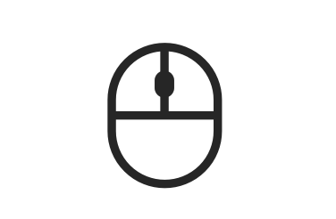
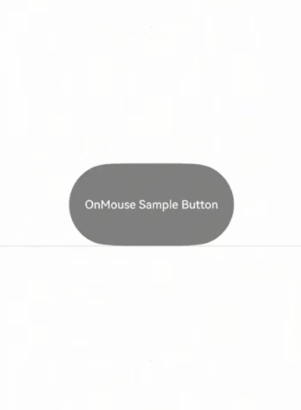
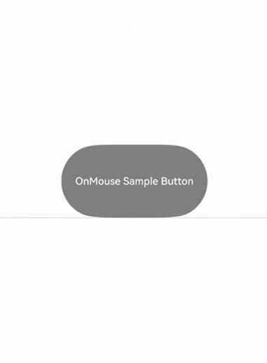
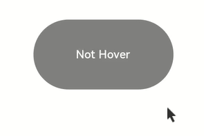
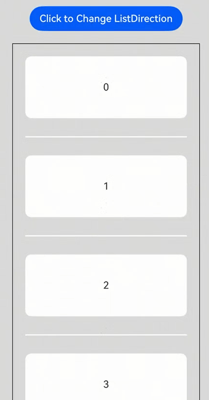
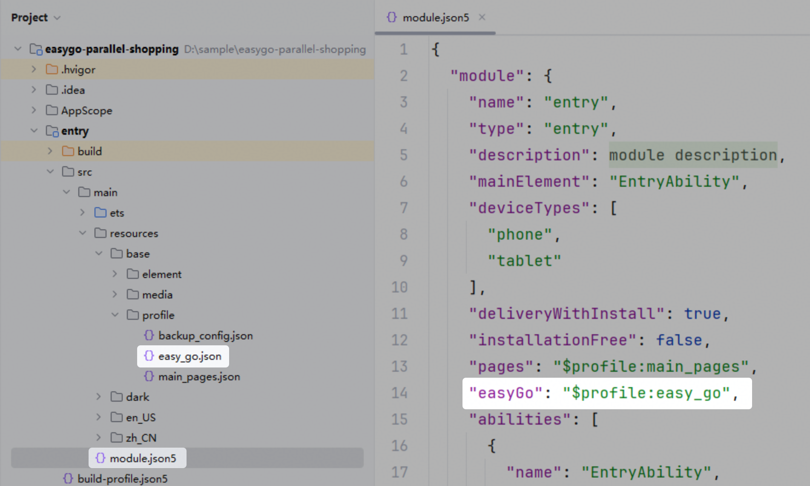

# Handling Mouse Input Events

<!--Kit: ArkUI-->
<!--Subsystem: ArkUI-->
<!--Owner: @yihao-lin-->
<!--Designer: @piggyguy-->
<!--Tester: @songyanhong-->
<!--Adviser: @Brilliantry_Rui-->
<!-- md-trans-meta sourceCommit=c8954d33bacbdec6df88d8586db7cc9b9d8a799e translatedAt=2026-08-01T00:29:46.939Z pushedAt=2026-08-01T07:03:18.680Z -->



A mouse is an essential input device for PC/2in1 and tablet devices. It allows click and swipe operations through buttons, scrolling through the scroll wheel, and also provides additional buttons. These events are reported to the app through [MouseEvent](../reference/apis-arkui/arkui-ts/ts-universal-mouse-key.md#mouseevent) and [AxisEvent](../reference/apis-arkui/arkui-ts/ts-universal-events-axis.md#axisevent), respectively.

>**NOTE**
>
>All single-finger touch events and gesture events can be triggered and responded to using a left mouse click.
> - For example, to implement a feature where clicking a [Button](../reference/apis-arkui/arkui-ts/ts-basic-components-button.md) navigates to another page, supporting both finger tap and left mouse click, you can achieve this by simply binding a single [onClick](../reference/apis-arkui/arkui-ts/ts-universal-events-click.md#onclick) event.
> - If you want to implement different effects for the finger touch and the left mouse click, use the **source** parameter in the **onClick** callback to determine whether the current event is triggered by a finger touch or a mouse device.

In addition, for apps on PC/2in1 and tablet devices that have not been adapted for mouse operations, the system provides a fallback mechanism that converts left mouse button clicks, swipes, and scroll wheel events into touch events. The system also allows you to control whether to convert events through a configuration file.

## Processing Mouse Movement

Mouse events are handled by registering a callback using the [onMouse](../reference/apis-arkui/arkui-ts/ts-universal-mouse-key.md#onmouse) API. When a mouse action occurs, the event is dispatched to the component located beneath the cursor. This dispatch process adheres to the event bubbling mechanism.

### onMouse

```ts
onMouse(event: (event?: MouseEvent) => void)
```

Triggered when a mouse event occurs. If the mouse pointer performs an action (**MouseAction**) on a component bound to this API, the corresponding callback is triggered and receives a [MouseEvent](../reference/apis-arkui/arkui-ts/ts-universal-mouse-key.md#mouseevent) object as its parameter. This event supports custom bubbling settings, with parent-child bubbling enabled by default. This API is typically used to implement custom mouse interaction logic.

The **MouseEvent** object in the callback provides the following information: coordinates (displayX, displayY, windowX, windowY, x, y), button ([MouseButton](../reference/apis-arkui/arkui-ts/ts-appendix-enums.md#mousebutton8)), action ([MouseAction](../reference/apis-arkui/arkui-ts/ts-appendix-enums.md#mouseaction8)), timestamp ([timestamp](../reference/apis-arkui/arkui-ts/ts-gesture-customize-judge.md#properties)), target area ([EventTarget](../reference/apis-arkui/arkui-ts/ts-universal-events-click.md#eventtarget8)), and event source ([SourceType](../reference/apis-arkui/arkui-ts/ts-gesture-settings.md#sourcetype8)). The **stopPropagation** callback of **MouseEvent** can be used to prevent the event from bubbling up.

> **NOTE**
>
> **MouseButton** indicates the physical mouse button (pressed or released) that triggers the mouse event. The values are **Left**, **Right**, **Middle**, **Back**, **Forward**, and **None**. **None** indicates that the event is triggered only when the mouse is moved without any mouse button pressed or released.

<!-- @[mouse_move](https://gitcode.com/openharmony/applications_app_samples/blob/master/code/DocsSample/ArkUISample/InterAction/entry/src/main/ets/pages/mouseMove/MouseMove.ets) --> 

``` TypeScript
@Entry
@Component
struct MouseMove {
  @State buttonText: string = '';
  @State columnText: string = '';
  @State text: string = 'OnMouse Sample Button';
  @State color: Color = Color.Gray;

  build() {
    Column() {
      Button(this.text, { type: ButtonType.Capsule })
        .width(200)
        .height(100)
        .backgroundColor(this.color)
        .onMouse((event?: MouseEvent) => { // Set the onMouse callback for the Button component.
          if (event) {
            this.buttonText = 'Button onMouse:\n' + '' +
              'button = ' + event.button + '\n' +
              'action = ' + event.action + '\n' +
              'x,y = ' + '\n' + '(' + event.x + ',' + event.y + ')' + '\n' +
              'windowXY=' + '\n' + '(' + event.windowX + ',' + event.windowY + ')';
          }
        })
      Column() {
        Divider()
        Text(this.buttonText).fontColor(Color.Green).padding(5)
        Divider()
        Text(this.columnText).fontColor(Color.Red).padding(5)
      }
      .width('100%')
      .alignItems(HorizontalAlign.Start)
    }
    .width('100%')
    .height('100%')
    .justifyContent(FlexAlign.Center)
    .borderWidth(2)
    .borderColor(Color.Red)
    .onMouse((event?: MouseEvent) => { // Set the onMouse callback for Column.
      if (event) {
        this.columnText = 'Column onMouse:\n' + '' +
          'button = ' + event.button + '\n' +
          'action = ' + event.action + '\n' +
          'x,y = ' + '\n' + '(' + event.x + ',' + event.y + ')' + '\n' +
          'windowXY=' + '\n' + '(' + event.windowX + ',' + event.windowY + ')';
      }
    })
  }
}
```

In the preceding example, the **onMouse** API is bound to the **Button** component. The callback displays the values of callback parameters, such as **button** and **action**. Apply the same settings to the outer **Column** container. The entire process can be divided into the following two actions:

1. Moving the mouse pointer: Before the mouse pointer moves from outside the **Button** component to inside, only the **onMouse** callback of the **Column** component is triggered. When the mouse pointer enters the **Button** component, as the **onMouse** event bubbles up by default, both the **onMouse** callbacks of the **Column** and **Button** components are invoked. Because no mouse button is clicked during this process, the displayed information shows **button** as **0** (enumerated value of **MouseButton.None**) and **action** as **3** (enumerated value of **MouseAction.Move**).

2. Clicking the mouse button: After the mouse pointer enters the **Button** component, clicking the component twice (left-click and right-click) produces the following results:

   Left-click: button = 1 (enumerated value of **MouseButton.Left**); action = 1 (enumerated value of **MouseAction.Press**); action = 2 (enumerated value of **MouseAction.Release**).

   Right-click: button = 2 (enumerated value of **MouseButton.Right**); action = 1 (enumerated value of **MouseAction.Press**); action = 2 (enumerated value of **MouseAction.Release**)



To prevent the mouse event from bubbling, call the **stopPropagation** API.

<!-- @[stop_propagation](https://gitcode.com/openharmony/applications_app_samples/blob/master/code/DocsSample/ArkUISample/InterAction/entry/src/main/ets/pages/stopPropagation/StopPropagation.ets) -->

``` TypeScript
@Entry
@Component
struct StopPropagation {
  @State buttonText: string = '';
  @State columnText: string = '';
  @State text: string = 'OnMouse Sample Button';
  @State color: Color = Color.Gray;

  build() {
    Column() {
      Button(this.text, { type: ButtonType.Capsule })
        .width(200)
        .height(100)
        .backgroundColor(this.color)
        .onMouse((event?: MouseEvent) => { // Set the onMouse callback for the Button component.
          if (event) {
            event.stopPropagation(); // Prevent the onMouse event from bubbling.
            this.buttonText = 'Button onMouse:\n' + '' +
              'button = ' + event.button + '\n' +
              'action = ' + event.action + '\n' +
              'x,y = ' + '\n' + '(' + event.x + ',' + event.y + ')' + '\n' +
              'windowXY=' + '\n' + '(' + event.windowX + ',' + event.windowY + ')';
          }
        })
      Column() {
        Divider()
        Text(this.buttonText).fontColor(Color.Green).padding(5)
        Divider()
        Text(this.columnText).fontColor(Color.Red).padding(5)
      }
      .width('100%')
      .alignItems(HorizontalAlign.Start)
    }
    .width('100%')
    .height('100%')
    .justifyContent(FlexAlign.Center)
    .borderWidth(2)
    .borderColor(Color.Red)
    .onMouse((event?: MouseEvent) => { // Set the onMouse callback for the Column component.
      if (event) {
        this.columnText = 'Column onMouse:\n' + '' +
          'button = ' + event.button + '\n' +
          'action = ' + event.action + '\n' +
          'x,y = ' + '\n' + '(' + event.x + ',' + event.y + ')' + '\n' +
          'windowXY=' + '\n' + '(' + event.windowX + ',' + event.windowY + ')';
      }
    })
  }
}
```



To prevent mouse events from bubbling up from a child component (**Button**) to its parent component (**Column**), call the **stopPropagation** API using the **event** parameter in the **onMouse** callback of **Button**, as shown in the example above.

### onHover

To detect when the mouse pointer enters or exits a component's boundary, you are advised to use the advanced [onHover](../reference/apis-arkui/arkui-ts/ts-universal-events-hover.md#onhover) event. This approach simplifies your code and avoids the complexity of manually handling mouse move events.

```ts
onHover(event: (isHover: boolean) => void)
```

It is triggered when the mouse pointer enters or leaves the component. The **isHover** parameter indicates whether the mouse pointer hovers over the component. This event supports custom bubbling settings, with parent-child bubbling enabled by default.

If this API is bound to a component, it is triggered when the mouse pointer enters the component from outside and the value of **isHover** is **true**, or when the mouse pointer leaves the component and the value of **isHover** is **false**.

<!-- @[on_hover](https://gitcode.com/openharmony/applications_app_samples/blob/master/code/DocsSample/ArkUISample/InterAction/entry/src/main/ets/pages/onHover/OnHover.ets) -->

``` TypeScript
@Entry
@Component
struct OnHover {
  @State hoverText: string = 'Not Hover';
  @State color: Color = Color.Gray;

  build() {
    Column() {
      Button(this.hoverText)
        .width(200).height(100)
        .backgroundColor(this.color)
        .onHover((isHover?: boolean) => { // Listen for whether the mouse cursor is hovered over the button.
          if (isHover) {
            this.hoverText = 'Hovered!';
            this.color = Color.Green;
          } else {
            this.hoverText = 'Not Hover';
            this.color = Color.Gray;
          }
        })
    }.width('100%').height('100%').justifyContent(FlexAlign.Center)
  }
}
```

In this example, a **Button** component is created, with an initial gray background color and the content **Not Hover**. The component is bound to the **onHover** callback. In the callback, **this.isHovered** is set to the callback parameter **isHover**.

When the mouse pointer moves from outside the **Button** component to inside, the callback is invoked. The **isHover** value becomes true, and the **isHovered** variable is set to true. As a result, the background color of the component changes to **Color.Green**, and the content is updated to **Hovered!**.

When the mouse pointer moves from inside the **Button** component to outside, the callback is invoked again, setting the value of **isHover** to **false**. The component then reverts to its initial style.



## Processing Mouse Buttons

When a user presses a mouse button, a mouse down event is triggered. You can access key information about the event through [MouseEvent](../reference/apis-arkui/arkui-ts/ts-universal-mouse-key.md#mouseevent), such as the occurrence time and the mouse button (MouseButton: left button, right button, etc.). You can also use the [getModifierKeyState](../reference/apis-arkui/arkui-ts/ts-gesture-customize-judge.md#getmodifierkeystate12) API to obtain the pressed state of the **Ctrl/Alt/Shift** modifier keys on the physical keyboard when the user is using the mouse. By combining and evaluating these states, you can implement convenient operations.

The following example demonstrates multi-selection functionality using mouse button processing:

<!-- @[mouse_button](https://gitcode.com/openharmony/applications_app_samples/blob/master/code/DocsSample/ArkUISample/InterAction/entry/src/main/ets/pages/MouseButton/MouseButton.ets) -->   

``` TypeScript
class ListDataSource implements IDataSource {
  private list: number[] = [];
  private listeners: DataChangeListener[] = [];

  constructor(list: number[]) {
    this.list = list;
  }

  totalCount(): number {
    return this.list.length;
  }

  getData(index: number): number {
    return this.list[index];
  }

  registerDataChangeListener(listener: DataChangeListener): void {
    if (this.listeners.indexOf(listener) < 0) {
      this.listeners.push(listener);
    }
  }

  unregisterDataChangeListener(listener: DataChangeListener): void {
    const pos = this.listeners.indexOf(listener);
    if (pos >= 0) {
      this.listeners.splice(pos, 1);
    }
  }

  // Notify the controller of data deletion.
  notifyDataDelete(index: number): void {
    this.listeners.forEach(listener => {
      listener.onDataDelete(index);
    });
  }

  // Delete an element at the specified index.
  public deleteItem(index: number): void {
    this.list.splice(index, 1);
    this.notifyDataDelete(index);
  }
}

@Entry
@Component
struct ListExample {
  private arr: ListDataSource = new ListDataSource([0, 1, 2, 3, 4, 5, 6, 7, 8, 9]);
  private allSelectedItems: Array<number> = [];
  @State isSelected: boolean[] = [];

  @Styles
  selectedStyle(): void {
    .backgroundColor(Color.Blue);
  }

  isItemSelected(item: number): boolean {
    for (let i = 0; i < this.allSelectedItems.length; i++) {
      if (this.allSelectedItems[i] === item) {
        this.isSelected[item] = true;
        return true;
      }
    }
    this.isSelected[item] = false;
    return false;
  }

  build() {
    Column() {
      List({ space: 10, initialIndex: 0 }) {
        LazyForEach(this.arr, (index: number) => {
          ListItem() {
            Text('' + index)
              .width('100%')
              .height(100)
              .fontSize(16)
              .fontColor(this.isSelected[index] ? Color.White : Color.Black)
              .textAlign(TextAlign.Center)
          }
          .backgroundColor(Color.White)
          .selectable(true)
          .selected(this.isSelected[index])
          .stateStyles({
            selected: this.selectedStyle
          })
          .onMouse((event: MouseEvent) => {
            // Check whether the left mouse button is pressed.
            if (event.button === MouseButton.Left && event.action === MouseAction.Press) {
              // Check the item selected state.
              let isSelected: boolean = this.isItemSelected(index);
              // Check the Ctrl key state.
              let isCtrlPressing: boolean = false;
              if (event.getModifierKeyState) {
                try {
                  isCtrlPressing = event.getModifierKeyState(['Ctrl']);
                } catch (error) {
                  console.error('Get modifier key state failed!')
                }
              }
              // If the mouse is clicked without the Ctrl key held down, forcefully clear other selected items and keep only the current item selected.
              if (!isCtrlPressing) {
                this.allSelectedItems = [];
                for (let i = 0; i < this.isSelected.length; i++) {
                  this.isSelected[i] = false;
                }
              }
              if (isSelected) {
                this.allSelectedItems = this.allSelectedItems.filter(item => item !== index);
                this.isSelected[index] = false;
              } else {
                this.allSelectedItems.push(index);
                this.isSelected[index] = true;
              }
            }
          })
        }, (item: string) => item)
      }
      .listDirection(Axis.Vertical)
      .scrollBar(BarState.Off)
      .friction(0.6)
      .edgeEffect(EdgeEffect.Spring)
      .width('90%')
      .height('100%')
    }
    .width('100%')
    .height('100%')
    .backgroundColor(0xDCDCDC)
    .padding({ top: 5 })
  }
}
```


## Processing Mouse Wheel Input

The mouse wheel is primarily used for vertical scrolling. When a user scrolls the wheel, the system generates a vertical [axis event](../reference/apis-arkui/arkui-ts/ts-universal-events-axis.md) and dispatches it to the application. Components can handle this event using the [onAxisEvent](../reference/apis-arkui/arkui-ts/ts-universal-events-axis.md#onaxisevent) API. The event includes the cursor position and the angle of wheel rotation, accessible using the **axisVertical** property of the [BaseEvent](../reference/apis-arkui/arkui-ts/ts-gesture-customize-judge.md#baseevent8) object.

Mouse wheel axis events follow a structured lifecycle: Each scroll interaction begins with an [AxisAction](../reference/apis-arkui/arkui-ts/ts-appendix-enums.md#axisaction17).BEGIN event. When scrolling ends, an [AxisAction](../reference/apis-arkui/arkui-ts/ts-appendix-enums.md#axisaction17).End event is emitted. For slow or intermittent scrolling, multiple **BEGIN** and **END** events may be reported. The **axisVertical** value represents the angular change during a single scroll tick. Key characteristics include:

- It reflects the delta of one scroll action, not the cumulative scroll distance.

- The value is influenced by system-level wheel sensitivity settings.

- The sensitivity is specified by the [AxisEvent](../reference/apis-arkui/arkui-ts/ts-universal-events-axis.md#axisevent) parameter **scrollStep** in system settings.

- A forward scroll (wheel up) yields a negative value. A backward scroll (wheel down) yields a positive value.

Built-in scrollable components automatically handle wheel input. No additional configuration is required.

When [PanGesture](../reference/apis-arkui/arkui-ts/ts-basic-gestures-pangesture.md) is used, wheel input maps to vertical offset values: For forward scrolling, **offsetY** is positive; for backward scrolling, **offsetY** is negative.

> **NOTE**
>
> 1. Wheel-generated vertical axis values only trigger vertical scrolling gestures.
> 2. If the system detects that only horizontally scrollable components are under the cursor, it may trigger horizontal scrolling.
> 3. When both vertical and horizontal scrollable elements are present, vertical scrolling takes precedence.

This example demonstrates how a **List** component responds to mouse wheel input in both vertical and horizontal orientations.

<!-- @[list_data_source](https://gitcode.com/openharmony/applications_app_samples/blob/master/code/DocsSample/ArkUISample/InterAction/entry/src/main/ets/pages/MouseWheel/ListDataSource.ets) -->

``` TypeScript
export class ListDataSource implements IDataSource {
  private list: number[] = [];
  private listeners: DataChangeListener[] = [];

  constructor(list: number[]) {
    this.list = list;
  }

  totalCount(): number {
    return this.list.length;
  }

  getData(index: number): number {
    return this.list[index];
  }

  registerDataChangeListener(listener: DataChangeListener): void {
    if (this.listeners.indexOf(listener) < 0) {
      this.listeners.push(listener);
    }
  }

  unregisterDataChangeListener(listener: DataChangeListener): void {
    const pos = this.listeners.indexOf(listener);
    if (pos >= 0) {
      this.listeners.splice(pos, 1);
    }
  }

  // Notify the controller of data deletion.
  notifyDataDelete(index: number): void {
    this.listeners.forEach(listener => {
      listener.onDataDelete(index);
    });
  }

  // Notify the controller of data insertion.
  notifyDataAdd(index: number): void {
    this.listeners.forEach(listener => {
      listener.onDataAdd(index);
    });
  }

  // Delete an element at the specified index.
  public deleteItem(index: number): void {
    this.list.splice(index, 1);
    this.notifyDataDelete(index);
  }

  // Insert an element at the specified index.
  public insertItem(index: number, data: number): void {
    this.list.splice(index, 0, data);
    this.notifyDataAdd(index);
  }
}
```

<!-- @[mouse_wheel](https://gitcode.com/openharmony/applications_app_samples/blob/master/code/DocsSample/ArkUISample/InterAction/entry/src/main/ets/pages/MouseWheel/MouseWheel.ets) --> 

``` TypeScript
import { ListDataSource } from './ListDataSource';

@Entry
@Component
struct MouseWheel {
  private arr: ListDataSource = new ListDataSource([0, 1, 2, 3, 4, 5, 6, 7, 8, 9]);
  @State dir1: Axis = Axis.Vertical;

  build() {
    Column() {
      Button('Click to Change ListDirection')
        .margin(20)
        .onClick(() => {
          if (this.dir1 === Axis.Vertical) {
            this.dir1 = Axis.Horizontal;
          } else {
            this.dir1 = Axis.Vertical;
          }
        })
      List({ space: 20, initialIndex: 0 }) {
        LazyForEach(this.arr, (item: number) => {
          ListItem() {
            Text('' + item)
              .width('100%')
              .height(100)
              .fontSize(16)
              .textAlign(TextAlign.Center)
              .borderRadius(10)
              .backgroundColor(0xFFFFFF)
          }
          .margin(20)
          // Bind a pan gesture to the ListItem. When the mouse wheel is scrolled over the ListItem, the ListItem's own pan gesture is triggered first.
          .gesture(PanGesture({ direction: PanDirection.Vertical })
            .onActionStart(() => {
            })
            .onActionUpdate(() => {
            }))
        }, (item: number) => item.toString())
      }
      .borderWidth(1)
      .listDirection(this.dir1) // Arrangement direction
      .scrollBar(BarState.Off)
      .friction(0.6)
      .divider({
        strokeWidth: 2,
        color: 0xFFFFFF,
        startMargin: 20,
        endMargin: 20
      }) // Divider between rows
      .edgeEffect(EdgeEffect.Spring) // Set the edge scrolling effect to Spring.
      .width('90%')
    }
    .width('100%')
    .height('100%')
    .backgroundColor(0xDCDCDC)
    .padding(20)
  }
}
```



## Mouse Event Conversion

If you only implement touch operation scenarios during app development without adapting to mouse operations on PC/2in1 and tablet devices, the app may behave unexpectedly or even become inoperable when a mouse is used. To address this scenario, the system provides a fallback mechanism that converts left mouse button events and axis events into touch events by default before sending them to the app, thereby delivering an operation experience similar to that on a phone.

In addition, if you want to control the conversion behavior described above, the system provides custom configuration capabilities. You can control whether mouse events are converted into touch events by adding a configuration file to the app.

### How to Develop

**1. Add a configuration file**

Create a configuration file named easy_go.json (the file name is an example; you can name it as needed) in the entry/src/main/resources/base/profile directory of the app. Add the easyGo field in the [module.json5](../quick-start/module-configuration-file.md) configuration file and point it to the referenced easy_go.json configuration file.



**2. Add event conversion configuration**

In the easy_go.json configuration file, configure the attributes related to event conversion.

### Configuration Description

easy_go.json is a standard Object-type JSON file with a two-layer structure. The first layer configures device types, and the second layer configures the mouse event conversion mode for the corresponding device type.

**1. Device type**

The first-layer configuration sets the behavior of mouse event conversion on different device types.

``` json
{ 
  "common": {},
  "phone": {},
  "2in1": {},
  "tablet": {}
}
```

| Value | Description | Optional |
| --- | --- | --- |
| common | Common device configuration, providing the basic default configuration for all device types. | No |
| phone | Configuration that takes effect on phone-type devices. After configuration, the common configuration no longer takes effect on phone-type devices. | Yes |
| 2in1 | Configuration that takes effect on PC/2in1-type devices. After configuration, the common configuration no longer takes effect on PC/2in1-type devices. | Yes |
| tablet | Configuration that takes effect on tablet-type devices. After configuration, the common configuration no longer takes effect on tablet-type devices. | Yes |

**2. Multi-modal input options**

The second-layer configuration uses the multiModalInputOptions field to set event input options. The internal fields are described as follows:

| Name | Description | Optional |
| --- | --- | --- |
| mouse2TouchEventMode | Configures the mode for converting mouse events to touch events. | Yes |

Configurable fields of mouse2TouchEventMode:

| Value | Description |
| --- | --- |
| all | All mouse events are converted into touch events. |
| xcomponentAndWebOnly | Mouse events are converted into touch events only within XComponent and Web components. |
| disabled | No mouse events are converted into touch events. |

**3. Configuration example**

The following example shows how to configure a PC/2in1 device so that mouse events are not converted into touch events:

``` json
{
  "common": {},
  "2in1": {
    "multiModalInputOptions": {
      "mouse2TouchEventMode": "disabled"
    }
  }
}
```