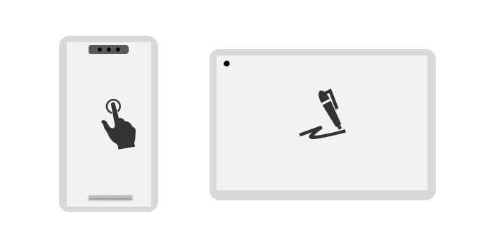
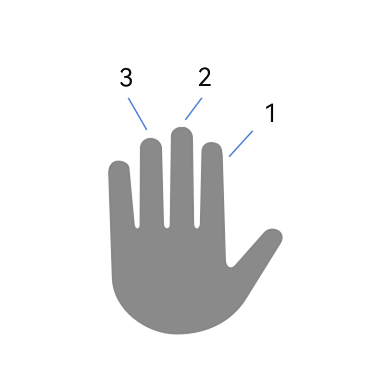

# Handling Touchscreen Input Events



Touchscreen devices are the most common input devices, supported by nearly all handheld terminal devices for user touch operations. Touch events are also one of the most frequently handled event types by application developers.

It should be noted that for touch-like operations from non-touchscreen devices, for example, mouse button clicks and swipes, the system converts them into touch events for consistency. In this case, applications may receive both touch events and mouse events. To distinguish between genuine touchscreen events and converted events, check the [SourceType](../reference/apis-arkui/arkui-ts/ts-gesture-settings.md#sourcetype8) property in the event object.


## Touch Event

Touch events can be captured using the universal attribute **onTouch** on components. The callback response follows hit testing rules.

The reporting frequency of touch events is downsampled by the system to match the screen refresh rate. For details, see [Resampling and Historical Points](#resampling-and-historical-points).

For multi-touch-capable devices, simultaneous finger operations generate multiple touch points. All touch points are accessible through the **touches** member, while **changedTouches** indicates which points triggered the current event.

Additional event information can be obtained from the base class [BaseEvent](../reference/apis-arkui/arkui-ts/ts-gesture-customize-judge.md#baseevent8).


## Preventing Event Bubbling

Refer to [Event Bubbling](./arkts-interaction-basic-principles.md#event-bubbling) to understand the bubbling mechanism. Below is an example where touch events are blocked from reaching the parent component when the child component is clicked.

```typescript
@Entry
@ComponentV2
struct Index {
  
  build() {
    RelativeContainer() {
      Column() { // Parent component
        Text("If you click me, the parent will not receive touch events")
          .fontColor(Color.White)
          .height("40%")
          .width("80%")
          .backgroundColor(Color.Brown)
          .alignSelf(ItemAlign.Center)
          .padding(10)
          .margin(20)
          .onTouch((event:TouchEvent)=>{
            event.stopPropagation() // Prevent the parent component from receiving the event.
          })
      }
      .justifyContent(FlexAlign.End)
      .backgroundColor(Color.Green)
      .height('100%')
      .width('100%')
      .onTouch((event:TouchEvent)=>{
        console.log("touch event received on parent")
      })
    }
    .height('100%')
    .width('100%')
  }
}
```

> **NOTE**
>
> Controlling event bubbling does not affect gesture recognition. Both aspects need to be considered separately.


## Resampling and Historical Points

The reporting frequency of raw input events depends on the device type. For example, touchscreens typically report events every 5–7 ms, while high-precision mouse devices may report events every 1 ms. Since the ultimate purpose of processing these input events is to drive UI updates that respond to user actions, the system optimizes this process by resampling the raw input event stream. Between each display frame, the system collects all received input events and processes them through a resampling algorithm. This resampling occurs independently for each active touch point, ensuring that multi-touch interactions remain accurate.


- Down events are reported immediately.
- Move events within a frame are resampled and merged before the next frame.
- Up events trigger immediate reporting, including any pending move events.

For each touch point within a single frame, multiple move events are merged and processed through an advanced algorithm. This generates optimized coordinates that represent the most accurate position for the current display frame. While these resampled coordinates may show minor deviations from the raw device-reported positions, this intentional processing delivers significant benefits. The resulting points exhibit improved temporal consistency and motion smoothness.

To maintain full data transparency, the system preserves all original touch points prior to resampling. You can access the complete historical dataset when needed through the **getHistoricalPoints(): Array** API.

The following is a simple example.

```typescript
@Entry
@ComponentV2
struct Index {
  build() {
    RelativeContainer() {
      Column()
        .backgroundColor(Color.Green)
        .height('100%')
        .width('100%')
        .onTouch((event: TouchEvent) => {
          // Obtain historical points from the event.
          let allHistoricalPoints = event.getHistoricalPoints();
          if (allHistoricalPoints.length != 0) {
            for (const point of allHistoricalPoints) {
              console.log("historical point: [" + point.touchObject.windowX + ", " + point.touchObject.windowY + "]")
            }
          }
        })
    }
    .height('100%')
    .width('100%')
  }
}
```

## Multi-Touch Information

For multi-touch-capable devices, the reported events contain information about all touch points, which can be obtained through **touches** as follows:

```typescript
@Entry
@ComponentV2
struct Index {
  private currentFingerCount: number = 0
  private allFingerIds: number[] = []

  build() {
    RelativeContainer() {
      Column()
        .backgroundColor(Color.Green)
        .height('100%')
        .width('100%')
        .onTouch((event: TouchEvent) => {
          if (event.source != SourceType.TouchScreen) {
            return;
          }
          // Clear the array.
          this.allFingerIds.splice(0, this.allFingerIds.length)
          // Obtain all touch point information from the event.
          let allFingers = event.touches;
          if (allFingers.length > 0 && this.currentFingerCount == 0) {
            // The first finger is pressed.
            console.log("fingers start to press down")
            this.currentFingerCount = allFingers.length
          }
          if (allFingers.length != 0) {
            for (const finger of allFingers) {
              this.allFingerIds.push(finger.id)
            }
            console.log("current all fingers : " + this.allFingerIds.toString())
          }
          if (event.type == TouchType.Up && event.touches.length == 1) {
            // All fingers are lifted.
            console.log("all fingers already up")
            this.currentFingerCount = 0
          }
        })
    }
    .height('100%')
    .width('100%')
  }
}
```

Different touch points are distinguished by IDs. These IDs are assigned sequentially based on the order of contact with the screen and do not correspond to physical touch sources (fingers). When working with the **touches** array, note that the points are not sorted by their ID values, so do not rely on the array order for access. The ID allocation system maintains an efficient reuse policy: When a touch point is released (finger lifted), its ID becomes available for reassignment to new touch points that may occur before all current contacts are removed from the screen.

Below is the log output of the preceding example during the following operation sequence.



Press finger 1 -> Press finger 2 -> Press finger 3 -> Lift finger 2 -> Lift finger 3 -> Press finger 2 -> Lift finger 1 -> Lift finger 3

```
  fingers start to press down   // Press finger 1.
  current all fingers: 0
  ... ...
  current all fingers: 0,1      // Press finger 2.
  ... ...
  current all fingers: 0,1,2    // Press finger 3.
  ... ...
  current all fingers: 0,2      // Lift finger 2.
  ... ...
  current all fingers: 0        // Lift finger 3.
  ... ...
  current all fingers: 0,1      //  Press finger 3.
  ... ...
  current all fingers: 1        // Lift finger 1.
  ... ...
  all fingers already up        // Lift finger 3.
```


## Stylus Support

Stylus interactions with the touchscreen generate touch events similar to finger touches, but can be identified using the **sourceTool** property. Active capacitive styluses provide additional precision data, including tilt and orientation angles. For details, see [BaseEvent](../reference/apis-arkui/arkui-ts/ts-gesture-customize-judge.md#baseevent8).

- **tiltX**: angle between the projection of the stylus on the device plane and the x-axis.
- **tiltY**: angle between the projection of the stylus on the device plane and the y-axis.
- **rollAngle**: angle between the stylus and the device plane.
