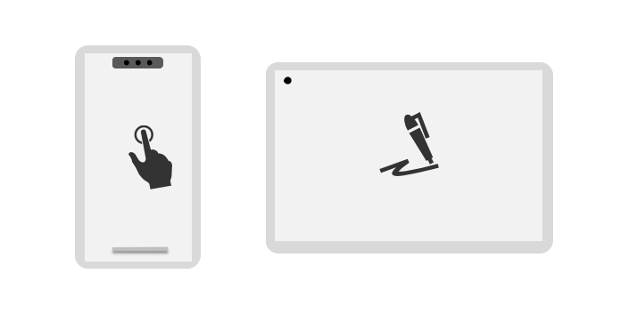
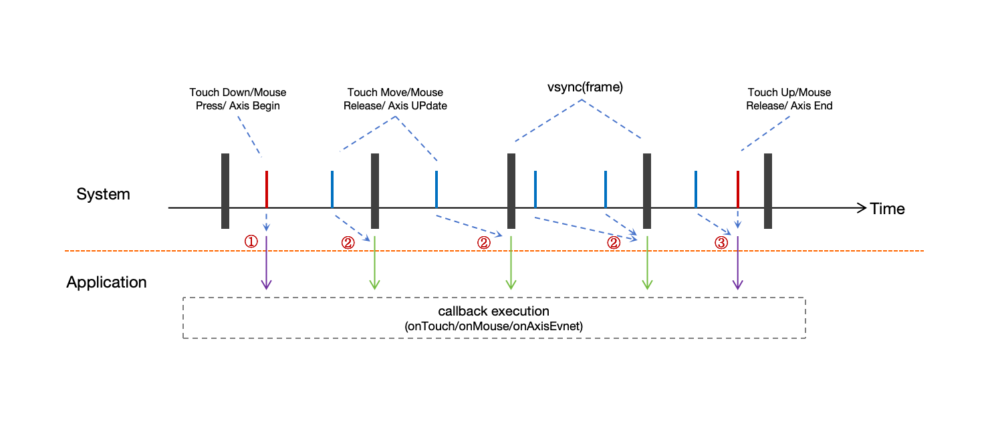
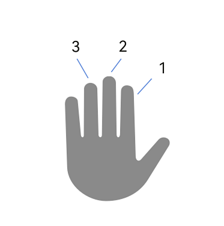

# Handling Touchscreen Input Events

<!--Kit: ArkUI-->
<!--Subsystem: ArkUI-->
<!--Owner: @yihao-lin-->
<!--Designer: @piggyguy-->
<!--Tester: @songyanhong-->
<!--Adviser: @Brilliantry_Rui-->
<!-- md-trans-meta sourceCommit=bc228748751d1941d00f77c40cd3e5a7fed2c8bc translatedAt=2026-08-01T00:29:02.297Z pushedAt=2026-08-03T02:07:32.045Z -->



Touchscreen devices are the most common input devices, supported by nearly all handheld terminal devices for user touch operations. Touch events are also one of the most frequently handled event types by application developers.

It should be noted that for touch-like operations from non-touchscreen devices, for example, mouse button clicks and swipes, the system converts them into touch events for consistency. In this case, applications may receive both touch events and mouse events. To distinguish between genuine touchscreen events and converted events, check the [SourceType](../reference/apis-arkui/arkui-ts/ts-gesture-settings.md#sourcetype8) property in the event object.

## Touch Event

Touch events can be received on a component through the universal event [onTouch](../reference/apis-arkui/arkui-ts/ts-universal-events-touch.md#ontouch), and the callback response follows the hit test rules.

The reporting frequency of touch events is downsampled by the system to match the screen refresh rate. For details, see [Resampling and Historical Points](#resampling-and-historical-points).

On devices that support multi-touch, simultaneous finger operations generate multiple touch points. All touch points are accessible through the **touches** property of the [TouchEvent](../reference/apis-arkui/arkui-ts/ts-universal-events-touch.md#touchevent) object, while **changedTouches** indicates which touch points triggered the current event.

Additional event information can be obtained from the base class [BaseEvent](../reference/apis-arkui/arkui-ts/ts-gesture-customize-judge.md#baseevent8) of the [TouchEvent](../reference/apis-arkui/arkui-ts/ts-universal-events-touch.md#touchevent) object.

## Preventing Event Bubbling

Refer to [Event Bubbling](./arkts-interaction-basic-principles.md#event-bubbling) to understand the bubbling mechanism. Below is an example where touch events are blocked from reaching the parent component when the child component is clicked.

<!-- @[prevent_bubbling](https://gitcode.com/openharmony/applications_app_samples/blob/master/code/DocsSample/ArkUISample/InterAction/entry/src/main/ets/pages/PreventBubbling/PreventBubbling.ets) -->

``` TypeScript
import { hilog } from '@kit.PerformanceAnalysisKit';

const TAG = '[Sample_PreventBubbling]';
const DOMAIN = 0xF811;
const BUNDLE = 'MyApp_PreventBubbling';

@Entry
@ComponentV2
struct PreventBubbling {
  build() {
    RelativeContainer() {
      Column() { // Parent component
        // Replace $r('app.string.preventEvent') with the actual resource file. In this example, the value in the resource file is "If you tap me, the parent will not receive touch events."
        Text($r('app.string.preventEvent'))
          .fontColor(Color.White)
          .height('40%')
          .width('80%')
          .backgroundColor(Color.Brown)
          .alignSelf(ItemAlign.Center)
          .padding(10)
          .margin(20)
          .onTouch((event: TouchEvent) => {
            event.stopPropagation(); // After the child component receives the touch event first, prevent it from bubbling to the parent component.
          })
      }
      .justifyContent(FlexAlign.End)
      .backgroundColor(Color.Green)
      .height('100%')
      .width('100%')
      .onTouch((event: TouchEvent) => {
        hilog.info(DOMAIN, TAG, BUNDLE + 'touch event received on parent');
      })
    }
    .height('100%')
    .width('100%')
  }
}
```

> **NOTE**
>
> Controlling event bubbling does not affect gesture recognition. Both aspects need to be considered separately.

## Resampling and Historical Points

The reporting frequency of basic events depends on the specific input device type, but it is generally very high. For example, a touchscreen typically reports a point every 5 to 7 ms, while some high-precision mice can report at a frequency of up to once every 1 ms. Since the response to input events is intended to produce UI changes in response to user actions, reporting such high-frequency basic events to the app is redundant in most cases. To address this, the system resamples the basic events received between two frames and reports them to the app only once within a frame. Resampling is performed independently for each touch point, and different touch points are resampled separately.



- Down events are reported immediately.

- Move events within a single frame are not dispatched immediately; they are resampled and coalesced, then reported when the display frame is rendered.

- Up events trigger immediate reporting, including any pending move events.

Resampling merges multiple move events reported by the same touch point within a single frame and calculates an appropriate coordinate to report to the app through an algorithm. As a result, the coordinate information after resampling may differ slightly from the actual points reported by the underlying device. These differences are beneficial, as the resampled points generally exhibit better smoothness.

To maintain full data transparency, the system preserves all original touch points prior to resampling. You can access the complete historical dataset when needed through the **getHistoricalPoints(): Array** API.

The following is a simple example.

<!-- @[samp_ling](https://gitcode.com/openharmony/applications_app_samples/blob/master/code/DocsSample/ArkUISample/InterAction/entry/src/main/ets/pages/sampling/Sampling.ets) -->

``` TypeScript
import { hilog } from '@kit.PerformanceAnalysisKit';

const TAG = '[Sample_Sampling]';
const DOMAIN = 0xF811;
const BUNDLE = 'MyApp_Sampling';

@Entry
@ComponentV2
struct Sampling {
  build() {
    RelativeContainer() {
      Column()
        .backgroundColor(Color.Green)
        .height('100%')
        .width('100%')
        .onTouch((event: TouchEvent) => {
          // Obtain historical points from the event.
          let allHistoricalPoints = event.getHistoricalPoints();
          if (allHistoricalPoints.length !== 0) {
            for (const point of allHistoricalPoints) {
              hilog.info(DOMAIN, TAG, BUNDLE + 'historical point: [' + point.touchObject.windowX +
                ', ' + point.touchObject.windowY + ']');
            }
          }
        })
    }
    .height('100%')
    .width('100%')
  }
}
```

## Multi-Touch Information

For multi-touch-capable devices, the reported events contain information about all touch points, which can be obtained through **touches** as follows:

<!-- @[multiple_finger_information](https://gitcode.com/openharmony/applications_app_samples/blob/master/code/DocsSample/ArkUISample/InterAction/entry/src/main/ets/pages/MultipleFingerInformation/MultipleFingerInformation.ets) -->

``` TypeScript
import { hilog } from '@kit.PerformanceAnalysisKit';

const TAG = '[Sample_MultipleFingerInformation]';
const DOMAIN = 0xF811;
const BUNDLE = 'MyApp_MultipleFingerInformation';

@Entry
@ComponentV2
struct MultipleFingerInformation {
  private currentFingerCount: number = 0;
  private allFingerIds: number[] = [];

  build() {
    RelativeContainer() {
      Column()
        .backgroundColor(Color.Green)
        .height('100%')
        .width('100%')
        .onTouch((event: TouchEvent) => {
          if (event.source !== SourceType.TouchScreen) {
            return;
          }
          // Clear the array.
          this.allFingerIds.splice(0, this.allFingerIds.length);
          // Obtain all touch point information from the event.
          let allFingers = event.touches;
          if (allFingers.length > 0 && this.currentFingerCount === 0) {
            // The first finger is pressed.
            hilog.info(DOMAIN, TAG, BUNDLE + 'fingers start to press down');
            this.currentFingerCount = allFingers.length;
          }
          if (allFingers.length !== 0) {
            for (const finger of allFingers) {
              this.allFingerIds.push(finger.id);
            }
            hilog.info(DOMAIN, TAG, BUNDLE + 'current all fingers : ' + this.allFingerIds.toString());
          }
          if (event.type === TouchType.Up && event.touches.length === 1) {
            // All fingers are lifted.
            hilog.info(DOMAIN, TAG, BUNDLE + 'all fingers already up');
            this.currentFingerCount = 0;
          }
        })
    }
    .height('100%')
    .width('100%')
  }
}
```

Different touch points are distinguished by IDs. These IDs are assigned sequentially based on the order of contact with the screen and do not correspond to physical touch sources (fingers). When working with the **touches** array, note that the points are not sorted by their ID values, so do not rely on the array order for access. The ID allocation system maintains an efficient reuse policy: When a touch point is released (finger lifted), its ID becomes available for reassignment to new touch points that may occur before all current contacts are removed from the screen.

Below is the log output of the preceding example during the following operation sequence.



Press finger 1 -> Press finger 2 -> Press finger 3 -> Lift finger 2 -> Lift finger 3 -> Press finger 3 -> Lift finger 1 -> Lift finger 3

```text
  fingers start to press down   // Press finger 1.
  current all fingers: 0
  ... ...
  current all fingers: 0,1      // Press finger 2.
  ... ...
  current all fingers: 0,1,2    // Press finger 3.
  ... ...
  current all fingers: 0,2      // Lift finger 2.
  ... ...
  current all fingers: 0        // Lift finger 3.
  ... ...
  current all fingers: 0,1      //  Press finger 3.
  ... ...
  current all fingers: 1        // Lift finger 1.
  ... ...
  all fingers already up        // Lift finger 3.
```

## Stylus

Stylus interactions with the touchscreen generate touch events similar to finger touches, but can be identified using the **sourceTool** property. Active capacitive styluses provide additional precision data, including tilt and orientation angles. For details, see [BaseEvent](../reference/apis-arkui/arkui-ts/ts-gesture-customize-judge.md#baseevent8).

- **tiltX**: angle between the projection of the stylus on the device plane and the x-axis of the device plane.

- **tiltY**: angle between the projection of the stylus on the device plane and the y-axis of the device plane.

- **rollAngle**: angle between the stylus and the device plane.