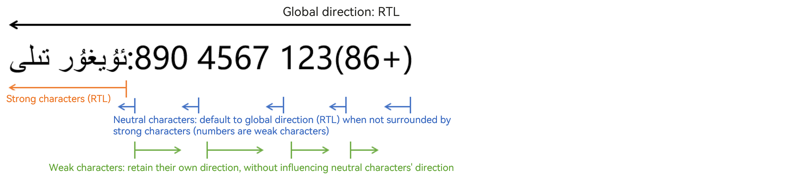

# Implementing UI Internationalization
<!--Kit: ArkUI-->
<!--Subsystem: ArkUI-->
<!--Owner: @camlostshi-->
<!--Designer: @lanshouren-->
<!--Tester: @liuli0427-->
<!--Adviser: @HelloCrease-->

This topic explains how to implement UI internationalization in an application, including resource configuration and layout adaptation. For details about internationalization guidance, see [Localization Kit](../internationalization/i18n-l10n.md).

## Configuring Internationalization Resources with Resource Qualifiers

To support multiple languages and regions, you can configure localized resources using resource qualifiers in DevEco Studio. For details, see [Resource Categories and Access](../quick-start/resource-categories-and-access.md).

## Using the Mirroring Capability

Different text alignment modes and reading sequences may be used for different languages. For example, English is read from left-to-right (LTR), and Arabic and Greek are read from right-to-left (RTL). To accommodate diverse user reading habits, ArkUI provides a mirroring capability that can reverse the display content along the x-axis, switching the layout from left-to-right to right-to-left.

| Before Mirroring         | After Mirroring                                 |
| ----------- | ----------------------------------- |
|||

The mirroring capability is activated on a component under either of these conditions:

1. The component's **direction** attribute is set to **Direction.Rtl**.

2. The component's **direction** attribute is set to **Direction.Auto**, and the system language in use (such as Uyghur) is read from right to left.

### Basic Concepts

- LTR: left-to-right reading direction
- RTL: right-to-left reading direction

### Constraints

ArkUI has default mirroring support for the following capabilities:

| **Category**    | Name                                                        |
| -------- | ------------------------------------------------------------ |
| Basic components| [Swiper](../reference/apis-arkui/arkui-ts/ts-container-swiper.md), [Tabs](../reference/apis-arkui/arkui-ts/ts-container-tabs.md), [TabContent](../reference/apis-arkui/arkui-ts/ts-container-tabcontent.md), [List](../reference/apis-arkui/arkui-ts/ts-container-list.md), [Progress](../reference/apis-arkui/arkui-ts/ts-basic-components-progress.md), [CalendarPicker](../reference/apis-arkui/arkui-ts/ts-basic-components-calendarpicker.md), [CalendarPickerDialog](../reference/apis-arkui/arkui-ts/ts-methods-calendarpicker-dialog.md), [TextPicker](../reference/apis-arkui/arkui-ts/ts-basic-components-textpicker.md), [TextPickerDialog](../reference/apis-arkui/arkui-ts/ts-methods-textpicker-dialog.md), [DatePicker](../reference/apis-arkui/arkui-ts/ts-basic-components-datepicker.md), [DatePickerDialog](../reference/apis-arkui/arkui-ts/ts-methods-datepicker-dialog.md), [Grid](../reference/apis-arkui/arkui-ts/ts-container-grid.md), [WaterFlow](../reference/apis-arkui/arkui-ts/ts-container-waterflow.md), [Scroll](../reference/apis-arkui/arkui-ts/ts-container-scroll.md), [ScrollBar](../reference/apis-arkui/arkui-ts/ts-basic-components-scrollbar.md), [AlphabetIndexer](../reference/apis-arkui/arkui-ts/ts-container-alphabet-indexer.md), [Stepper](../reference/apis-arkui/arkui-ts/ts-basic-components-stepper.md), [SideBarContainer](../reference/apis-arkui/arkui-ts/ts-container-sidebarcontainer.md), [Navigation](../reference/apis-arkui/arkui-ts/ts-basic-components-navigation.md), [NavDestination](../reference/apis-arkui/arkui-ts/ts-basic-components-navdestination.md), [Rating](../reference/apis-arkui/arkui-ts/ts-basic-components-rating.md), [Slider](../reference/apis-arkui/arkui-ts/ts-basic-components-slider.md), [Toggle](../reference/apis-arkui/arkui-ts/ts-basic-components-toggle.md), [Badge](../reference/apis-arkui/arkui-ts/ts-container-badge.md), [Counter](../reference/apis-arkui/arkui-ts/ts-container-counter.md), [Chip](../reference/apis-arkui/arkui-ts/ohos-arkui-advanced-Chip.md), [SegmentButton](../reference/apis-arkui/arkui-ts/ohos-arkui-advanced-SegmentButton.md), [bindMenu](../reference/apis-arkui/arkui-ts/ts-universal-attributes-menu.md#bindmenu), [bindContextMenu](../reference/apis-arkui/arkui-ts/ts-universal-attributes-menu.md#bindcontextmenu8), [TextInput](../reference/apis-arkui/arkui-ts/ts-basic-components-textinput.md), [TextArea](../reference/apis-arkui/arkui-ts/ts-basic-components-textarea.md), [Search](../reference/apis-arkui/arkui-ts/ts-basic-components-search.md), [Stack](../reference/apis-arkui/arkui-ts/ts-container-stack.md), [GridRow](../reference/apis-arkui/arkui-ts/ts-container-gridrow.md), [Text](../reference/apis-arkui/arkui-ts/ts-basic-components-text.md), [Select](../reference/apis-arkui/arkui-ts/ts-basic-components-select.md), [Marquee](../reference/apis-arkui/arkui-ts/ts-basic-components-marquee.md), [Row](../reference/apis-arkui/arkui-ts/ts-container-row.md), [Column](../reference/apis-arkui/arkui-ts/ts-container-column.md), [Flex](../reference/apis-arkui/arkui-ts/ts-container-flex.md), [RelativeContainer](../reference/apis-arkui/arkui-ts/ts-container-relativecontainer.md), [ListItemGroup](../reference/apis-arkui/arkui-ts/ts-container-listitemgroup.md)|
| Advanced components| [SelectionMenu](../reference/apis-arkui/arkui-ts/ohos-arkui-advanced-SelectionMenu.md) , [TreeView](../reference/apis-arkui/arkui-ts/ohos-arkui-advanced-TreeView.md) , [Filter](../reference/apis-arkui/arkui-ts/ohos-arkui-advanced-Filter.md), [SplitLayout](../reference/apis-arkui/arkui-ts/ohos-arkui-advanced-SplitLayout.md), [ToolBar](../reference/apis-arkui/arkui-ts/ohos-arkui-advanced-ToolBar.md), [ComposeListItem](../reference/apis-arkui/arkui-ts/ohos-arkui-advanced-ComposeListItem.md), [EditableTitleBar](../reference/apis-arkui/arkui-ts/ohos-arkui-advanced-EditableTitleBar.md), [ProgressButton](../reference/apis-arkui/arkui-ts/ohos-arkui-advanced-ProgressButton.md), [SubHeader](../reference/apis-arkui/arkui-ts/ohos-arkui-advanced-SubHeader.md) , [Popup](../reference/apis-arkui/arkui-ts/ohos-arkui-advanced-Popup.md), [Dialog](../reference/apis-arkui/arkui-ts/ohos-arkui-advanced-Dialog.md), [SwipeRefresher](../reference/apis-arkui/arkui-ts/ohos-arkui-advanced-SwipeRefresher.md)|
| Universal Attribute| [position](../reference/apis-arkui/arkui-ts/ts-universal-attributes-location.md#position), [markAnchor](../reference/apis-arkui/arkui-ts/ts-universal-attributes-location.md#markanchor), [offset](../reference/apis-arkui/arkui-ts/ts-universal-attributes-location.md#offset), [alignRules](../reference/apis-arkui/arkui-ts/ts-universal-attributes-location.md#alignrules12), [borderWidth](../reference/apis-arkui/arkui-ts/ts-universal-attributes-border.md#borderwidth), [borderColor](../reference/apis-arkui/arkui-ts/ts-universal-attributes-border.md#bordercolor), [borderRadius](../reference/apis-arkui/arkui-ts/ts-universal-attributes-border.md#borderradius), [padding](../reference/apis-arkui/arkui-ts/ts-universal-attributes-size.md#padding), [margin](../reference/apis-arkui/arkui-ts/ts-universal-attributes-size.md#margin)|
| API    | [AlertDialog](../reference/apis-arkui/arkui-ts/ts-methods-alert-dialog-box.md), [ActionSheet](../reference/apis-arkui/arkui-ts/ts-methods-action-sheet.md), [promptAction.showDialog](../reference/apis-arkui/js-apis-promptAction.md#promptactionshowdialogdeprecated), [promptAction.showToast](../reference/apis-arkui/js-apis-promptAction.md#promptactionshowtoastdeprecated)|

However, adaptation is still required in the following three scenarios:

1. For layout and border settings, use the generalized direction terms **start** and **end** as parameter types instead of absolute terms such as **left**, **right**, **x**, and **y**, to accommodate mirroring.

2. The **Canvas** component offers limited support for mirroring in text drawing only.

3. The **XComponent** component does not support mirroring capabilities.

### Layout and Border Settings

To adapt to mirroring capabilities, update the following universal attributes with new parameter types:

Position settings: [position](../reference/apis-arkui/arkui-ts/ts-universal-attributes-location.md#position), [markAnchor](../reference/apis-arkui/arkui-ts/ts-universal-attributes-location.md#markanchor), [offset](../reference/apis-arkui/arkui-ts/ts-universal-attributes-location.md#offset), [alignRules](../reference/apis-arkui/arkui-ts/ts-universal-attributes-location.md#alignrules12)

Border settings: [borderWidth](../reference/apis-arkui/arkui-ts/ts-universal-attributes-border.md#borderwidth), [borderColor](../reference/apis-arkui/arkui-ts/ts-universal-attributes-border.md#bordercolor), [borderRadius](../reference/apis-arkui/arkui-ts/ts-universal-attributes-border.md#borderradius)

Size settings: [padding](../reference/apis-arkui/arkui-ts/ts-universal-attributes-size.md#padding), [margin](../reference/apis-arkui/arkui-ts/ts-universal-attributes-size.md#margin)

For example, with **position**, change the absolute directional descriptions of **x** and **y** to the new parameter types of **start** and **end**.

```typeScript
import { LengthMetrics } from '@kit.ArkUI';

@Entry
@Component
struct Index1 {
  build() {
    Stack({ alignContent: Alignment.TopStart }) {
      Stack({ alignContent: Alignment.TopStart }) {
        Column()
          .width(100)
          .height(100)
          .backgroundColor(Color.Red)
          .position({ start: LengthMetrics.px(200), top: LengthMetrics.px(200) })  // Use the new LocalizedEdges parameter type added since API version 12 for supporting both LTR and RTL.
                                                                                   // It is equivalent to .position({ x: '200px', y: '200px' }) when only LTR is supported.

      }.backgroundColor(Color.Blue)
    }.width("100%").height("100%").border({ color: '#880606' })
  }
}
```

### Custom Drawing with the Canvas Component

The drawings and coordinates of the **Canvas** component do not support mirroring. Content drawn on it does not automatically mirror when the system language changes.

[CanvasRenderingContext2D](../reference/apis-arkui/arkui-ts/ts-canvasrenderingcontext2d.md) supports mirroring for text rendering, which should be used with the **Canvas** component's **direction** attribute and the **direction** attribute of **CanvasRenderingContext2D**. The following table lists the specifications.

1. Priority: The **direction** attribute of **CanvasRenderingContext2D** takes precedence over the **Canvas** component's **direction** attribute, which in turn follows the system language's horizontal display direction.
2. The **Canvas** component does not automatically mirror with system language changes; applications must listen for system language changes and redraw the content on their own.
3. Only symbols follow the direction setting during text drawing with **CanvasRenderingContext2D**; Latin characters and numbers do not.

```typeScript
import { BusinessError, commonEventManager } from '@kit.BasicServicesKit';

@Entry
@Component
struct Index {
  @State message: string = 'Hello world';
  private settings: RenderingContextSettings = new RenderingContextSettings(true)
  private context: CanvasRenderingContext2D = new CanvasRenderingContext2D(this.settings)

  aboutToAppear(): void {
    // Listen for the system language changes.
    let subscriber: commonEventManager.CommonEventSubscriber | null = null;
    let subscribeInfo2: commonEventManager.CommonEventSubscribeInfo = {
      events: ["usual.event.LOCALE_CHANGED"],
    }
    commonEventManager.createSubscriber(subscribeInfo2, (err: BusinessError, data: commonEventManager.CommonEventSubscriber) => {
      if (err) {
        console.error(`Failed to create subscriber. Code is ${err.code}, message is ${err.message}`);
        return;
      }

      subscriber = data;
      if (subscriber !== null) {
        commonEventManager.subscribe(subscriber, (err: BusinessError, data: commonEventManager.CommonEventData) => {
          if (err) {
            console.error(`Failed to subscribe to the language and region status change event. Code: ${err.code}; message: ${err.message}`);
            return;
          }
          console.info('Successfully subscribed to the language and region status change event: data: ' + JSON.stringify(data))
          // After detecting the language switch, redraw the content on the Canvas component.
          this.drawText();
        })
      } else {
        console.error(`MayTest Need create subscriber`);
      }
    })
  }

  drawText(): void {
    console.error("MayTest drawText")
    this.context.reset()
    this.context.direction = "inherit"
    this.context.font = '30px sans-serif'
    this.context.fillText("ab%123&*@", 50, 50)
  }

  build() {
    Row() {
      Canvas(this.context)
        .direction(Direction.Auto)
        .width("100%")
        .height("100%")
        .onReady(() =>{
          this.drawText()
        })
        .backgroundColor(Color.Pink)
    }
    .height('100%')
  }

}
```

| Before Mirroring         | After Mirroring                                 |
| ----------- | ----------------------------------- |
|||

### Bidirectional Text Layout and Alignment
Text direction ([Direction](../reference/apis-arkui/arkui-ts/ts-appendix-enums.md#direction)) defines the order of characters when text is presented on the screen. In left-to-right (LTR) scripts, the display order is from left to right; in right-to-left (RTL) scripts, the display order is from right to left.

Text alignment ([TextAlign](../reference/apis-arkui/arkui-ts/ts-appendix-enums.md#textalign)) affects the layout of text as a whole, with specific positioning influenced by **Direction**. For example, when **TextAlign** is set to **start**, the text is left-aligned if **Direction** is **LTR**, and is right-aligned if **Direction** is **RTL**.

When LTR and RTL scripts are mixed (for example, an English sentence containing Arabic words or phrases), the display order can become complex. The following figure shows the logical order of characters when numbers and Uyghur are mixed.


In this case, the text rendering engine uses a method called the Unicode Bidirectional Algorithm to determine the character display order. The following figure illustrates the character display order for mixed LTR and RTL scripts. The basic principles for determining character direction are as follows:
1. Strong characters: Strong characters have a definite directionality. For example, Chinese characters are LTR, and Arabic characters are RTL. These characters influence the directionality of surrounding neutral characters.

2. Weak characters: Weak characters do not have a definite directionality. These characters do not affect the directionality of surrounding neutral characters.

3. Neutral characters: Neutral characters do not have a fixed directionality. They inherit the directionality of the nearest strong character. If there are no strong characters nearby, they adopt the global direction.


