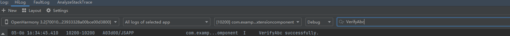

# Cross-Thread Embedded Component (IsolatedComponent, for System Applications Only)

<!--Kit: ArkUI-->
<!--Subsystem: ArkUI-->
<!--Owner: @dutie123-->
<!--Designer: @dutie123-->
<!--Tester: @fredyuan0912-->
<!--Adviser: @Brilliantry_Rui-->
<!-- md-trans-meta sourceCommit=5ed0cc4164abf79790ec16923fb6361d2a756da9 translatedAt=2026-08-01T00:30:04.199Z pushedAt=2026-08-03T02:38:57.516Z -->

**IsolatedComponent** is a cross-thread embedded component that can embed and display isolated UI content provided by an independent .abc file within the current page. This content runs independently in a restricted worker thread without conflicting with other components.

Each **IsolatedComponent** exists independently with its own scope and lifecycle, not sharing state or data with other components. This facilitates reuse across applications, reducing repetitive development efforts.

## Basic Concepts

[IsolatedComponent](../reference/apis-arkui/arkui-ts/ts-container-isolated-component-sys.md) is designed to embed and display a UI provided by an independent .abc file within the current page, with its content executed in a restricted [worker](../reference/apis-arkts/js-apis-worker.md) thread.

This component is typically used in modular development scenarios that require hot updates for .abc files (where the .abc file loaded by **IsolatedComponent** can be dynamically replaced, enabling content updates without reinstalling the app).

## Constraints

1. The .abc file must pass [VerifyAbc](../reference/apis-ability-kit/js-apis-bundleManager-sys.md#bundlemanagerverifyabc11) verification before use.

2. Constructor parameter updates are not supported; only the initial input is effective.

3. Nesting of **IsolatedComponent** components is not supported.

4. The main thread and the restricted Worker thread handle layout rendering asynchronously, which can lead to desynchronization in page changes caused by layout alterations or rotations.

5. Event passing between the main thread and the restricted Worker thread is managed asynchronously, and there is no support for event bubbling between threads. As a result, UI interactions between threads may encounter event conflicts.

6. When an independent .abc file is embedded into the host process using the **IsolatedComponent**, its content is fully open to the host, which can operate on the content. Therefore, this feature should be disabled in security-sensitive scenarios.

7. The independent .abc file runs in a restricted worker thread, which ensures relative security and prevents main thread crashes or direct impact on the data integrity of the main thread.

## Scenario Example

This example demonstrates the basic usage of the **IsolatedComponent** component. The sample application's **bundleName** is **"com.example.isolateddemo"**, and the component uses the .abc file and an extension page from the same application as the embedded content.

**Importing the Core Module**

When using the **IsolatedComponent**, first import the **@kit.AbilityKit** module, which provides the necessary functionality for building isolated components, including key APIs like **bundleManager**.

**bundleManager** is a module in **@kit.AbilityKit** that provides app package management capabilities. Its **verifyAbc** API can be used to verify .abc files, which is a necessary step before using the **IsolatedComponent**. By importing this module, you can use the APIs it provides to create and manage isolated components, ensuring data and resource isolation between different components and thereby improving app security.

```ts
import { bundleManager } from '@kit.AbilityKit';
```

**Managing Permissions**

When using the **IsolatedComponent**, properly configure the [requestPermissions](../security/AccessToken/declare-permissions.md) tag, which is crucial for ensuring the secure operation of components in restricted environments. This configuration allows you to specify the permissions required by the component, enabling fine-grained permission management.

In restricted mode, the **IsolatedComponent** does not have the ability to execute dynamic code by default. By adding the **requestPermissions** tag in the **module.json5** configuration file to declare the required permissions, the component can gain the ability to execute dynamically delivered ArkCompiler bytecode under specific conditions.

```json
"requestPermissions": [
  {
    "name": "ohos.permission.RUN_DYN_CODE",
    "usedScene": {
      "abilities": [
        "EntryAbility"
      ],
      "when": "inuse"
    }
  }
]
```

**Restricted Worker**

A restricted [Worker](../reference/apis-arkts/js-apis-worker.md) thread runs in an isolated environment. This isolation ensures memory isolation between the restricted Worker thread and other threads or components, preventing mutual interference or security issues.

In the **IsolatedComponent** scenario, the component often needs to dynamically load external HAP resources. The restricted worker ensures security through the following mechanisms:

- [Sandbox path](../file-management/app-sandbox-directory.md) validation

  **abcPath** points to an .abc file in a system-verified secure directory, preventing malicious code injection.

- Communication control

  Only standardized message events are allowed for communication between the main thread and the Worker thread, with direct data sharing prohibited.

- Exception isolation

  Errors within the worker do not cause the main app to crash and can be handled in a controlled manner through the [onerror](../reference/apis-arkts/js-apis-worker.md#properties) event.

```ts
// OhCardWorker.ets
import { worker, ThreadWorkerGlobalScope, MessageEvents, ErrorEvent } from '@kit.ArkTS';

const workerPort: ThreadWorkerGlobalScope = worker.workerPort;

workerPort.onmessage = (e: MessageEvents) => {}
workerPort.onmessageerror = (e: MessageEvents) => {}
workerPort.onerror = (e: ErrorEvent) => {}
```

<!--deprecated_code_no_check-->

```ts
IsolatedComponent({
  want: {
    "parameters": {
      // Resource path
      "resourcePath": `${this.getUIContext().getHostContext()?.filesDir}/${this.fileName}.hap`,
      // Verified sandbox path for the .abc file
      "abcPath": `/abcs${this.getUIContext().getHostContext()?.filesDir}/${this.fileName}`,
      // Entry path for the page to be displayed
      "entryPoint": `${this.bundleName}/entry/ets/pages/extension`,
    }
  },
  // Restricted Worker thread
  worker: new worker.RestrictedWorker("entry/ets/workers/OhCardWorker.ets")
})
```

The **IsolatedComponent** achieves dynamic component loading and isolated execution through the **want** and **worker** properties, which together form the security boundary. Properly setting these properties is key to ensuring the secure operation of the component.

The entry page file **ets/pages/extension.ets** running in the restricted Worker thread contains the following reference content:

```ts
@Entry
@Component
struct Extension {
  @State message: string = 'Hello World';

  build() {
    RelativeContainer() {
      Text(this.message)
        .id('HelloWorld')
        .fontSize(50)
        .fontWeight(FontWeight.Bold)
        .alignRules({
          center: { anchor: '__container__', align: VerticalAlign.Center },
          middle: { anchor: '__container__', align: HorizontalAlign.Center }
        })
    }
    .height('100%')
    .width('100%')
  }
}
```

**Sample Application Code**

The following example shows the content of the home page file **ets/pages/Index.ets** loaded by EntryAbility (UIAbility) in the application.

```ts
import { worker } from '@kit.ArkTS';
import { bundleManager, common } from '@kit.AbilityKit';
import { BusinessError } from '@kit.BasicServicesKit';

// Verify the .abc file and copy it to the specified sandbox path.
function VerifyAbc(abcPaths: Array<string>, deleteOriginalFiles: boolean) {
  try {
    bundleManager.verifyAbc(abcPaths, deleteOriginalFiles, (err) => {
      if (err) {
        console.error("VerifyAbc failed, error message: " + err.message);
      } else {
        console.info("VerifyAbc successfully.");
      }
    });
  } catch (err) {
    let message = (err as BusinessError).message;
    console.error("VerifyAbc failed, error message: " + message);
  }
}

@Entry
@Component
struct Index {
  @State isShow: boolean = false;
  @State resourcePath: string = "";
  @State abcPath: string = "";
  @State entryPoint: string = "";
  @State context: Context = this.getUIContext().getHostContext() as common.UIAbilityContext;
  // .abc file name
  private fileName: string = "modules";
  // Bundle name of the application to which the .abc file belongs
  private bundleName: string = "com.example.isolateddemo";
  // Restricted Worker thread
  private worker ?: worker.RestrictedWorker = new worker.RestrictedWorker("entry/ets/workers/OhCardWorker.ets");

  build() {
    Row() {
      Column({ space: 20 }) {
        // 1. Verify the .abc file.
        Button("verifyAbc").onClick(() => {
          let abcFilePath = `${this.context.filesDir}/${this.fileName}.abc`;
          console.info("abcFilePath: " + abcFilePath);
          VerifyAbc([abcFilePath], false);
        }).height(100).width(200)

        // 2. Display the IsolatedComponent.
        Button("showIsolatedComponent").onClick(() => {
          if (!this.isShow) {
            // Resource path
            this.resourcePath = `${this.context.filesDir}/${this.fileName}.hap`;
            // Verified sandbox path for the .abc file
            this.abcPath = `/abcs${this.context.filesDir}/${this.fileName}`;
            // Entry path for the page to be displayed
            this.entryPoint = `${this.bundleName}/entry/ets/pages/extension`;
            this.isShow = true;
          }
        }).height(100).width(200)

        if (this.isShow) {
          IsolatedComponent({
            want: {
              "parameters": {
                "resourcePath": this.resourcePath,
                "abcPath": this.abcPath,
                "entryPoint": this.entryPoint
              }
            },
            worker: this.worker
          })
            .width(300)
            .height(300)
            .onError((err) => {
              console.info("onError : " + JSON.stringify(err));
            })
        }
      }
      .width('100%')
    }
    .height('100%')
  }
}
```

**Expected Results**

1. Compile and build the HAP package in DevEco Studio, and install it on the device.

2. Upload the **modules.abc** file generated by the application to the application sandbox path **/data/app/el2/100/base/com.example.isolateddemo/haps/entry/files** using DevEco Studio or the hdc tool. The reference command for the hdc tool is as follows:

   ```bash
   hdc file send modules.abc /data/app/el2/100/base/com.example.isolateddemo/haps/entry/files/
   ```

3. Open the application page and click the **verifyAbc** button to verify the .abc file. The log "VerifyAbc successfully" should be output.

   

   

4. Click the **showIsolatedComponent** button to display the **IsolatedComponent** with the content "Hello World."