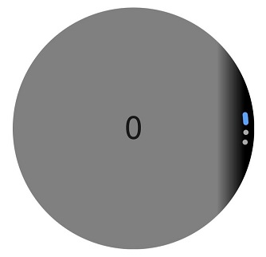
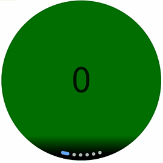

# Creating an Arc Carousel Component (ArcSwiper) (Recommended for Circular Screens)


**ArcSwiper** is an arc carousel component designed specifically for circular screens, allowing you to display content in an arc layout. For details, see [ArcSwiper](../reference/apis-arkui/arkui-ts/ts-container-arcswiper.md).

Before using the **ArcSwiper** component, you need to import the **ArcSwiper** module in your code:

```ts
import {
  ArcSwiper,
  ArcSwiperAttribute,
  ArcDotIndicator,
  ArcDirection,
  ArcSwiperController
} from '@kit.ArkUI'
```

## Setting the Navigation Point Indicator Style

**ArcSwiper** provides a default arc-shaped navigation point style, with the navigation points displayed centered below the **ArcSwiper**. You can customize the style of the arc-shaped navigation points using the [indicator](../reference/apis-arkui/arkui-ts/ts-container-arcswiper.md#indicator) attribute.

Using the **indicator** attribute, you can set the direction of the arc-shaped navigation points and customize the colors of the points and the selected point.

- Example of using the navigation point indicator in its default style:

  ```ts
  ArcSwiper() {
    Text('0')
      .width(233)
      .height(233)
      .backgroundColor(Color.Gray)
      .textAlign(TextAlign.Center)
      .fontSize(30)

    Text('1')
      .width(233)
      .height(233)
      .backgroundColor(Color.Green)
      .textAlign(TextAlign.Center)
      .fontSize(30)

    Text('2')
      .width(233)
      .height(233)
      .backgroundColor(Color.Pink)
      .textAlign(TextAlign.Center)
      .fontSize(30)
  }
  ```
  

- Example of customizing the style of the navigation point indicator:

  In this example, the navigation dots are positioned at the 6 o'clock direction of the **ArcSwiper** component, with the dot color set to red and the selected point color set to blue.

  ```ts
  ArcSwiper() {
    // ...
  }
  .indicator(
    new ArcDotIndicator()
      .arcDirection(ArcDirection.SIX_CLOCK_DIRECTION) // Set the dots at the 6 o'clock direction.
      .itemColor (Color.Red) // Set the dot color to red.
      .selectedItemColor (Color.Blue) // Set the selected dot color to blue.
  )
  ```
  

## Controlling Page Switching Modes

The **ArcSwiper** component supports four page switching modes: swiping with fingers, touching navigation points, rotating the digital crown, and using a controller. The following examples demonstrate how to use a controller and the digital crown to switch between pages.

- Using a controller to switch between pages

  ```ts
  // Import the ArcButton and ArcSwiper modules.
  import {
    ArcButton,
    ArcButtonOptions,
    ArcButtonStatus,
    ArcButtonStyleMode,
    ArcButtonPosition,
    ArcSwiper,
    ArcSwiperAttribute,
    ArcDotIndicator,
    ArcDirection,
    ArcSwiperController
  } from '@kit.ArkUI';

  @Entry
  @Component
  struct SwiperCustomAnimationExample {
    private wearableSwiperController: ArcSwiperController = new ArcSwiperController()

    build() {
      Column() {
        Stack() {
          ArcSwiper(this.wearableSwiperController) {
            // ...
          }
          .vertical(true)
          .indicator(false)

          Column() {
            ArcButton({
              options: new ArcButtonOptions({
                label: 'previous',
                position: ArcButtonPosition.TOP_EDGE,
                styleMode: ArcButtonStyleMode.EMPHASIZED_LIGHT,
                onClick: () => {
                  this.wearableSwiperController.showPrevious(); // Switch to the previous page using the controller.
                }
              })
            })

            Blank()

            ArcButton({
              options: new ArcButtonOptions({
                label: 'next',
                position: ArcButtonPosition.BOTTOM_EDGE,
                styleMode: ArcButtonStyleMode.EMPHASIZED_LIGHT,
                onClick: () => {
                  this.wearableSwiperController.showNext(); // Switch to the next page using the controller.
                }
              })
            })
          }.width('100%').height('100%')
        }
      }
    }
  }
  ```

  

- Using the digital crown to switch between pages

  When the **ArcSwiper** component is focused, it can respond to digital crown rotations. Users can scroll through the **ArcSwiper** component by rotating the crown to browse content.

  ```ts
  ArcSwiper() {
    // ...
  }
  .focusable(true)
  .focusOnTouch(true)
  .defaultFocus(true)
  ```

  You can also adjust the sensitivity of the digital crown to events using the [digitalCrownSensitivity](../reference/apis-arkui/arkui-ts/ts-container-arcswiper.md#digitalcrownsensitivity) attribute to adapt to different scales of data. For large datasets, you can increase the sensitivity; for smaller datasets, you can decrease it.

  ```ts
  ArcSwiper() {
    // ...
  }
  .digitalCrownSensitivity(CrownSensitivity.MEDIUM)
  ```

## Setting the Swiping Direction

The **ArcSwiper** component supports both horizontal and vertical swiping, controlled primarily by the [vertical](../reference/apis-arkui/arkui-ts/ts-container-arcswiper.md#vertical) attribute.

When **vertical** is set to **true**, swiping occurs in the vertical direction. When **vertical** is set to **false**, swiping occurs in the horizontal direction. The default value is **false**.

- Example of using horizontal swiping:

  ```ts
  ArcSwiper() {
    // ...
  }
  .indicator(true)
  .vertical(false)
  ```
  


- Example of using vertical swiping with dots at the 3 o'clock direction:

  ```ts
  ArcSwiper() {
    // ...
  }
  .indicator(new ArcDotIndicator()
      .arcDirection(ArcDirection.THREE_CLOCK_DIRECTION))
  .vertical(true)
  ```
  

## Customizing the Transition Animation

Use the [customContentTransition](../reference/apis-arkui/arkui-ts/ts-container-arcswiper.md#customcontenttransition) attribute to set a custom transition animation for **ArcSwiper**. Define the animation by adjusting opacity, scale, translation, and rendering layer for all pages within the viewport frame by frame in the callback.

```ts
import { Decimal } from '@kit.ArkTS'

@Entry
@Component
struct SwiperCustomAnimationExample {
  private MIN_SCALE: number = 0.1
  @State backgroundColors: Color[] = [Color.Green, Color.Blue, Color.Yellow, Color.Pink, Color.Gray, Color.Orange]
  @State opacityList: number[] = []
  @State scaleList: number[] = []

  aboutToAppear(): void {
    for (let i = 0; i < this.backgroundColors.length; i++) {
      this.opacityList.push(1.0)
      this.scaleList.push(1.0)
    }
  }

  build() {
    Column() {
      ArcSwiper() {
        ForEach(this.backgroundColors, (backgroundColor: Color, index: number) => {
          Text(index.toString())
            .width(233)
            .height(233)
            .fontSize(50)
            .textAlign(TextAlign.Center)
            .backgroundColor(backgroundColor)
            .opacity(this.opacityList[index])
            .scale({ x: this.scaleList[index], y: this.scaleList[index] })
        })
      }
      .customContentTransition({
        timeout: 1000,
        transition: (proxy: SwiperContentTransitionProxy) => {
          if (proxy.position <= -1 || proxy.position >= 1) {
            // When a group of pages is completely scrolled out of the viewport, reset the attribute values.
            this.opacityList[proxy.index] = 1.0
            this.scaleList[proxy.index] = 1.0
          } else {
            let position: number = Decimal.abs(proxy.position).toNumber()
            this.opacityList[proxy.index] = 1 - position
            this.scaleList[proxy.index] =
              this.MIN_SCALE + (1 - this.MIN_SCALE) * (1 - position)
          }
        }
      })
    }.width('100%')
  }
}
```



## Implementing Swipe-to-Return

The swipe gesture of the **ArcSwiper** component may conflict with the swipe-to-return functionality. To resolve this, you can use [gesture judgment](../reference/apis-arkui/arkui-ts/ts-gesture-blocking-enhancement.md#ongesturerecognizerjudgebegin) to determine whether **ArcSwiper** has scrolled to the beginning. This allows you to intercept the swipe gesture and enable the swipe-to-return functionality.

```ts
@Entry
@Component
struct SwiperCustomAnimationExample {
  @State backgroundColors: Color[] = [Color.Green, Color.Blue, Color.Yellow, Color.Pink, Color.Gray, Color.Orange]
  innerSelectedIndex: number = 0

  build() {
    Column() {
      ArcSwiper() {
        ForEach(this.backgroundColors, (backgroundColor: Color, index: number) => {
          Text(index.toString())
            .width(233)
            .height(233)
            .fontSize(50)
            .textAlign(TextAlign.Center)
            .backgroundColor(backgroundColor)
        })
      }
      .onAnimationStart((index: number, targetIndex: number) => {
        this.innerSelectedIndex = targetIndex
      })
      .onGestureRecognizerJudgeBegin((event: BaseGestureEvent, current: GestureRecognizer,
        others: Array<GestureRecognizer>): GestureJudgeResult => { // When the implementation is about to succeed, set the recognizer enabling state based on the current component state.
        if (current) {
          let target = current.getEventTargetInfo();
          if (target && current.isBuiltIn() && current.getType() == GestureControl.GestureType.PAN_GESTURE) {
            let swiperTaget = target as ScrollableTargetInfo
            if (swiperTaget instanceof ScrollableTargetInfo &&
              (swiperTaget.isBegin() || this.innerSelectedIndex === 0)) { // This condition checks whether ArcSwiper has scrolled to the beginning.
              let panEvent = event as PanGestureEvent;
              if (panEvent && panEvent.offsetX > 0 && (swiperTaget.isBegin() || this.innerSelectedIndex === 0)) {
                return GestureJudgeResult.REJECT;
              }
            }
          }
        }
        return GestureJudgeResult.CONTINUE;
      })
    }.width('100%')
  }
}
```
