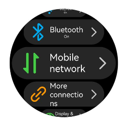
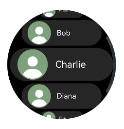
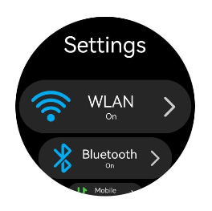
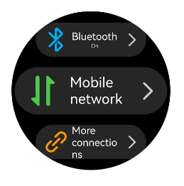
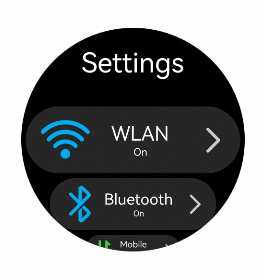
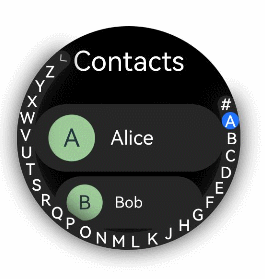
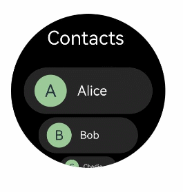

# Creating an Arc List (ArcList) (Recommended for Circular Screens)

The **ArcList** component is a specialized list designed for devices with circular screens, capable of efficiently displaying information in a structured, scrollable format. For details, see [ArcList](../reference/apis-arkui/arkui-ts/ts-container-arclist.md).

You can linearly arrange child components, [ArcListItem](../reference/apis-arkui/arkui-ts/ts-container-arclistitem.md), vertically within the [ArcList](../reference/apis-arkui/arkui-ts/ts-container-arclist.md) component. This allows each item in the **ArcList** to have its own view. To build a complex **ArcList**, you can use [ForEach](../ui/state-management/arkts-rendering-control-foreach.md) to iterate over a set of list items or combine any number of individual views with the **ForEach** structure. The [ArcList](../reference/apis-arkui/arkui-ts/ts-container-arclist.md) component supports various [rendering control](../ui/state-management/arkts-rendering-control-overview.md) methods, including conditional rendering, loop rendering, and lazy loading, to generate child components.

## Creating an ArcList Component

To create an [ArcList](../reference/apis-arkui/arkui-ts/ts-container-arclist.md) component, use the following:

```ts
ArcList() {
  ArcListItem() {
    // ...
  }
  ArcListItem() {
    // ...
  }
  // ...
}
```

>**NOTE**
>
>The child components of the **ArcList** must be **ArcListItem**. **ArcListItem** must be used in conjunction with **ArcList**.

## Displaying Data in the ArcList Component

The **ArcList** component displays a collection of items vertically and provides scrolling functionality when items exceed the screen boundaries. This makes it ideal for displaying large datasets. In the simplest form of an **ArcList**, the list items, **ArcListItem**, are statically created within the **ArcList**.

```ts
// xxx.ets
import { ArcList, ArcListItem, ArcListAttribute, ArcListItemAttribute, LengthMetrics } from "@kit.ArkUI";

@Entry
@Component
struct ArcListExample {
  build() {
    ArcList({ initialIndex: 2 }) {
      ArcListItem() {
        Row() {
          Image($r("app.media.wlan")).width("99px").height("99px")
            .borderRadius("50px").margin({ left: 7 })
          Column() {
            Text("WLAN").fontSize("38px").fontColor("#FFFFFFFF")
            Text("On").fontSize("20px").fontColor("#FFFFFFFF")
          }.width("190px")

          Image($r("app.media.ic_settings_arrow")).width("92px").height("92px")
            .borderRadius("50px")
        }
      }
      .borderRadius("65px")
      .width("414px")
      .height("129px")
      .backgroundColor("#26FFFFFF")

      ArcListItem() {
        Row() {
          Image($r("app.media.blueTooth")).width("99px").height("99px")
            .borderRadius("50px").margin({ left: 7 })
          Column() {
            Text("Bluetooth").fontSize("38px").fontColor("#FFFFFFFF")
            Text("On").fontSize("20px").fontColor("#FFFFFFFF")
          }.width("190px")
          
          Image($r("app.media.ic_settings_arrow")).width("92px").height("92px")
            .borderRadius("50px")
        }
      }
      .borderRadius("65px")
      .width("414px")
      .height("129px")
      .backgroundColor("#26FFFFFF")

      ArcListItem() {
        Row() {
          Image($r("app.media.mobileData")).width("99px").height("99px")
            .borderRadius("50px").margin({ left: 7 })
          Column() {
            Text("Mobile network").fontSize("38px").fontColor("#FFFFFFFF")
          }.width("190px")

          Image($r("app.media.ic_settings_arrow")).width("92px").height("92px")
            .borderRadius("50px")
        }
      }
      .borderRadius("65px")
      .width("414px")
      .height("129px")
      .backgroundColor("#26FFFFFF")

      ArcListItem() {
        Row() {
          Image($r("app.media.ic_settings_more_connections")).width("99px").height("99px")
            .borderRadius("50px").margin({ left: 7 })
          Column() {
            Text("More connections").fontSize("38px").fontColor("#FFFFFFFF")
          }.width("190px")

          Image($r("app.media.ic_settings_arrow")).width("92px").height("92px")
            .borderRadius("50px")
        }
      }
      .borderRadius("65px")
      .width("414px")
      .height("129px")
      .backgroundColor("#26FFFFFF")

      ArcListItem() {
        Row() {
          Image($r("app.media.displayAndBrightness")).width("99px").height("99px")
            .borderRadius("50px").margin({ left: 7 })
          Column() {
            Text("Display & brightness").fontSize("38px").fontColor("#FFFFFFFF")
          }.width("190px")

          Image($r("app.media.ic_settings_arrow")).width("92px").height("92px")
            .borderRadius("50px")
        }
      }
      .borderRadius("65px")
      .width("414px")
      .height("129px")
      .backgroundColor("#26FFFFFF")
    }
    .width("466px")
    .height("466px")
    .space(LengthMetrics.px(10))
    .borderRadius("233px")
    .backgroundColor(Color.Black)
  }
}
```

  **Figure 1** Displaying data in the ArcList component



## Iterating ArcList Content

Typically, applications dynamically create lists from data collections. Using [loop rendering](../ui/state-management/arkts-rendering-control-foreach.md), you can iterate over the data source to create corresponding components during each iteration, thereby reducing code complexity.

ArkTS provides loop rendering capabilities through [ForEach](../ui/state-management/arkts-rendering-control-foreach.md). For example, in a simple contacts list, contact names and profile picture data are stored in a **contacts** array using a **Contact** class structure. By using [ForEach](../ui/state-management/arkts-rendering-control-foreach.md) with nested [ArcListItem](../reference/apis-arkui/arkui-ts/ts-container-arclistitem.md), you can replace multiple similar, flat-laid-out **ArcListItem** components, reducing redundant code and making your code more concise and efficient.

```ts
// xxx.ets
import { ArcList, ArcListAttribute, ArcListItemAttribute, ArcListItem, LengthMetrics } from '@kit.ArkUI';
import { util } from '@kit.ArkTS';

class Contact {
  key: string = util.generateRandomUUID(true);
  name: string;
  icon: Resource;

  constructor(name: string, icon: Resource) {
    this.name = name;
    this.icon = icon;
  }
}

@Entry
@Component
struct SimpleContacts {
  private contacts: Array<object> = [
    new Contact('Alice', $r("app.media.ic_contact")),
    new Contact('Bob', $r("app.media.ic_contact")),
    new Contact('Charlie', $r("app.media.ic_contact")),
    new Contact('Diana', $r("app.media.ic_contact")),
    new Contact('Eve', $r("app.media.ic_contact"))
  ]

  build() {
    ArcList({ initialIndex: 2 }) {
      ForEach(this.contacts, (item: Contact) => {
        ArcListItem() {
          Row() {
            Image(item.icon)
              .width(40)
              .height(40)
              .margin(10)
              .backgroundColor("#FF9CC998")
              .borderRadius(20)
            Text(item.name).fontSize("38px").fontColor("#FFFFFFFF")
          }
          .width('100%')
          .justifyContent(FlexAlign.Start)
        }
        .borderRadius("65px")
        .width("410px")
        .height('130px')
        .backgroundColor("#26FFFFFF")
      }, (item: Contact) => JSON.stringify(item))
    }
    .space(LengthMetrics.px(10))
    .width('466px')
    .height('466px')
    .borderRadius('233px')
    .backgroundColor(Color.Black)
  }
}
```

  **Figure 2** Iterating ArcList content



## Customizing the ArcList Style

### Setting a Custom Header

You can add a custom header to an ArcList using the [header](../reference/apis-arkui/arkui-ts/ts-container-arclist.md#arklistoptions) parameter.

1. Construct the custom header component, **customHeader**.

   ```ts
   @Builder
   function customHeader() {
     Column() {
       Text("Settings")
         .fontColor("#FFFFFFFF")
         .fontSize('19fp')
     }
   }
   ```

2. Wrap the custom header component. This step is required because the [header](../reference/apis-arkui/arkui-ts/ts-container-arclist.md#arklistoptions) parameter expects a [ComponentContent](../reference/apis-arkui/js-apis-arkui-ComponentContent.md) type.

   ```ts
   context: UIContext = this.getUIContext();
   arcListHeader: ComponentContent<Object> = new ComponentContent(this.context, wrapBuilder(customHeader));
   ```

3. Set the **arcListHeader **to the **ArcList** component using the **header** parameter.

   ```ts
   ArcList({header: this.arcListHeader}) {
     ArcListItem() {
       // ...
     }
     ArcListItem() {
       // ...
     }
     // ...
   }
   ```

  **Figure 3** Setting a custom header



### Setting the List Item Spacing

When initializing the **ArcList** component, you can use the [space](../reference/apis-arkui/arkui-ts/ts-container-arclist.md#space) attribute to add spacing between list items. For example, to add a vertical spacing of 30 px between list items:

```ts
ArcList() {
  // ...
}
.space(LengthMetrics.px(30))
```

  **Figure 4** Setting the list item spacing



### Disabling Auto-Scaling for List Items

By default, items in an **ArcList** component automatically scale when they are near the top or bottom edges. However, in some cases, you might not want this scaling effect. To disable it, set the [autoScale](../reference/apis-arkui/arkui-ts/ts-container-arclistitem.md#autoscale) attribute of [ArcListItem](../reference/apis-arkui/arkui-ts/ts-container-arclistitem.md) to **false**. For example, as shown in Figure 5, the **Network** and **Display** list items do not scale regardless of their position after thire **autoScale** attribute is disabled.

```ts
ArcListItem() {
  // ...
}
.autoScale(false)
```

  **Figure 5** Disabling auto-scaling for list items


### Adding a Built-in Scrollbar

When the height of the list items exceeds the screen height, the **ArcList** component can scroll vertically. To help users quickly navigate, a scrollbar can be provided to allow rapid scrolling through the list, as shown in Figure 6.

When using the [ArcList](../reference/apis-arkui/arkui-ts/ts-container-arclist.md) component, you can control the display of the scrollbar using the [scrollBar](../reference/apis-arkui/arkui-ts/ts-container-arclist.md#scrollbar) attribute. The value of **scrollBar** is of type [BarState](../reference/apis-arkui/arkui-ts/ts-appendix-enums.md#barstate). When set to **BarState.Auto**, the scrollbar is displayed as needed. In this mode, the scrollbar appears when the user touches the scrollbar area, allowing for up and down dragging to quickly scroll through the content. The scrollbar also thickens during dragging for better visibility. If the user takes no action, the scrollbar automatically disappears after 2 seconds. You can customize the scrollbar style, using the [scrollBarWidth](../reference/apis-arkui/arkui-ts/ts-container-arclist.md#scrollbarwidth) attribute to set its width in the pressed state and the [scrollBarColor](../reference/apis-arkui/arkui-ts/ts-container-arclist.md#scrollbarcolor) attribute to set its color.

```ts
ArcList() {
  // ...
}
.scrollBar(BarState.Auto)
.scrollBarWidth(LengthMetrics.px(10))
.scrollBarColor(ColorMetrics.resourceColor(Color.White))
```

  **Figure 6** Built-in scrollbar of the ArcList component



### Adding an External Scrollbar: ArcScrollBar

To add an external scrollbar to an [ArcList](../reference/apis-arkui/arkui-ts/ts-container-arclist.md), you can use the [ArcScrollBar](../reference/apis-arkui/arkui-ts/ts-basic-components-arcscrollbar.md) component. By binding both the **ArcList** and **ArcScrollBar** components to the same [Scroller](../reference/apis-arkui/arkui-ts/ts-container-scroll.md#scroller) object, you can ensure they stay synchronized.

1. Create a **Scroller** object named **arcListScroller**.

   ```ts
   private arcListScroller: Scroller = new Scroller();
   ```

2. Bind the **arcListScroller** object to the **ArcList** component using the [scroller](../reference/apis-arkui/arkui-ts/ts-container-arclist.md#arklistoptions) parameter.

   ```ts
   // Use arcListScroller to initialize the scroller parameter to bind it with the ArcList component.
   ArcList({ scroller: this.arcListScroller }) {
   // ...
   }
   ```

3. Bind the **arcListScroller** object to the **ArcScrollBar** component using the [scroller](../reference/apis-arkui/arkui-ts/ts-basic-components-arcscrollbar.md#arcscrollbaroptions) parameter.

   ```ts
   // Use arcListScroller to initialize the scroller parameter to bind it with the ArcScrollBar component.
   ArcScrollBar({ scroller: this.arcListScroller })
   ```

  **Figure 7** External scrollbar of the ArcList component


>**NOTE**
>
>The [ArcScrollBar](../reference/apis-arkui/arkui-ts/ts-basic-components-arcscrollbar.md) component can also be used with other scrollable components such as [List](../reference/apis-arkui/arkui-ts/ts-container-list.md), [Grid](../reference/apis-arkui/arkui-ts/ts-container-grid.md), and [Scroll](../reference/apis-arkui/arkui-ts/ts-container-scroll.md).

## Interacting with ArcAlphabetIndexer

Applications often need to monitor changes in the scroll position of a list and respond accordingly, or quickly navigate to specific sections by adjusting the scroll position. For example, in a contacts list, as the list scrolls through different sections (for example, from "A" to "B"), the external index bar should update to reflect the current letter. When a user selects an index item (for example, "C"), the list should jump to the corresponding section. To achieve this functionality, you can use the [ArcAlphabetIndexer](../reference/apis-arkui/arkui-ts/ts-container-arc-alphabet-indexer.md) component.

As shown in Figure 8, when the list scrolls from contacts starting with "A" to those starting with "B," the external index bar should also update from the selected "A" state to the selected "B" state. This can be achieved by listening for the [onScrollIndex](../reference/apis-arkui/arkui-ts/ts-container-arclist.md#onscrollindex) event of the **ArcList** component. When an index item "C" is clicked, the list should jump to the contacts starting with "C." This can be achieved by listening for the [onSelect](../reference/apis-arkui/arkui-ts/ts-container-arc-alphabet-indexer.md#onselect) event of the [ArcAlphabetIndexer](../reference/apis-arkui/arkui-ts/ts-container-arc-alphabet-indexer.md) component.

When the list scrolls, the **selectedIndex** value of the letter to highlight in the alphabet index bar is recalculated based on the **firstIndex** value of the item to which the list has scrolled. Since the **ArcAlphabetIndexer** component uses the [selected](../reference/apis-arkui/arkui-ts/ts-container-arc-alphabet-indexer.md#selected) attribute to set the selected item index, changes to **selectedIndex** will trigger the **ArcAlphabetIndexer** component to re-render and display the selected letter state.

When an index item is selected, the selected item index (**index**) is used to recalculate the corresponding position in the list. The list is then scrolled to that position using the [scrollToIndex](../reference/apis-arkui/arkui-ts/ts-container-scroll.md#scrolltoindex) API of the bound scroll controller (**arcListScroller**). The **ArcList** component can be bound to a [Scroller](../reference/apis-arkui/arkui-ts/ts-container-scroll.md#scroller) (scroll controller) object using the [scroller](../reference/apis-arkui/arkui-ts/ts-container-arclist.md#arklistoptions) parameter.

```ts
const alphabets = ['#', 'A', 'B', 'C', 'D', 'E', 'F', 'G', 'H', 'I', 'J', 'K',
  'L', 'M', 'N', 'O', 'P', 'Q', 'R', 'S', 'T', 'U', 'V', 'W', 'X', 'Y', 'Z'];
@Entry
@Component
struct ContactsArcList {
  // Index of the selected item in the index bar
  @State selectedIndex: number = 0;
  // Scroll controller bound to the list
  private arcListScroller: Scroller = new Scroller();

  build() {
    Stack({ alignContent: Alignment.End }) {
      ArcList({ scroller: this.arcListScroller }) {
        // ...
      }
      .onScrollIndex((firstIndex: number) => {
        // Recalculate the corresponding index bar position based on the index of the item to which the list has scrolled.
        this.selectedIndex = firstIndex + 1;
      })

      // ArcAlphabetIndexer component
      ArcAlphabetIndexer({ arrayValue: alphabets })
        .selected(this.selectedIndex)
        .onSelect((index: number) => {
          // Scroll the list to the corresponding position when an index item is selected.
          this.selectedIndex = index
          this.scrollerForList.scrollToIndex(this.selectedIndex - 1)
        })
    }
  }
}
```

  **Figure 8** Interaction between the ArcList and ArcAlphabetIndexer



## Responding to Swipe on List Items

To enable swipe gestures on list items in the **ArcList** component, you can use the [swipeAction](../reference/apis-arkui/arkui-ts/ts-container-arclistitem.md#swipeaction) attribute of **ArcListItem**. This attribute requires a [SwipeActionOptions](../reference/apis-arkui/arkui-ts/ts-container-listitem.md#swipeactionoptions9) object with **start** and **end** parameters. Here, **start** defines the swipe action item displayed on the start edge of the list item when the item is swiped right, while **end** defines the swipe action item displayed on the end edge of the list item when the item is swiped left.

For example, in a contacts list, you can use the **end** parameter to show a delete button when an item is swiped left. When the delete button is clicked, you can remove the corresponding item from the data source.

1. Build the component that appears from the end edge when the list item is swiped left.
   ```ts
   @Builder 
   itemEnd(item: Contact) {
     // Build the component that appears from the end edge when the list item is swiped left.
     Button({ type: ButtonType.Circle }) {
       Image($r('app.media.ic_public_delete_filled'))
         .width(20)
         .height(20)
     }
     .backgroundColor(Color.Black)
     .onClick(() => {
       animateTo({
         duration: 1000,
         curve: Curve.Smooth,
         iterations: 1,
         playMode: PlayMode.Normal,
       }, () => {
         // this.contacts is the data source. The indexOf API obtains the index of the item to be deleted.
         let index = this.contacts.indexOf(item)
         // Remove the specified data item from the data source.
         this.contacts.splice(index, 1)
       })
     })
   }
   ```

2. Bind the [swipeAction](../reference/apis-arkui/arkui-ts/ts-container-arclistitem.md#swipeaction) attribute to the **ArcListItem** that can be swiped left.

   ```ts
   // When constructing an ArcList component, use ForEach to render list items based on the data source this.contacts.
   ArcListItem() {
     // ...
   }
   .swipeAction({
     end: {
       // item is the data corresponding to this list item in the data source this.contacts.
       builder: () => { this.itemEnd(item) }
     }
   }) // Set the swipe action.
   ```

  **Figure 9** Swipe-to-delete feature



## Handling Long Lists

While [ForEach](../ui/state-management/arkts-rendering-control-foreach.md) is suitable for short lists, using it for long lists with a large number of items can significantly slow down page loading, as it loads all items at once. Therefore, for better list performance, use [LazyForEach](../ui/state-management/arkts-rendering-control-lazyforeach.md) instead to implement on-demand iterative data loading. For details about the implementation, see the example in [LazyForEach: Lazy Data Loading](../ui/state-management/arkts-rendering-control-lazyforeach.md).

When the list is rendered in lazy loading mode, to improve the list scrolling experience and minimize white blocks during list scrolling, you can use the [cachedCount](../reference/apis-arkui/arkui-ts/ts-container-arclist.md#cachedcount) attribute of the [ArcList](../reference/apis-arkui/arkui-ts/ts-container-arclist.md) component. This attribute sets the number of list items preloaded outside of the screen and is valid only in [LazyForEach](../ui/state-management/arkts-rendering-control-lazyforeach.md).

```ts
ArcList() {
  // ...
}.cachedCount(3)
```

>**NOTE**
>
>- A greater **cachedCount** value may result in higher CPU and memory overhead of the UI. Adjust the value by taking into account both the comprehensive performance and user experience.
>
>- When a list uses data lazy loading, all list items except the list items in the display area and the cached list items are destroyed.

## Responding to Digital Crown Rotations

On wearable devices, the **ArcList** component can respond to digital crown rotations when it is in focus. Users can scroll through the list items by rotating the crown. To make the **ArcList** the default focus on the page and enable it to respond to crown rotations, you can use the following [focus control](../reference/apis-arkui/arkui-ts/ts-universal-attributes-focus.md) attributes:

```ts
ArcList() {
  // ...
}
// Enable focus for the ArcList component.
.focusable(true)
// Allow the ArcList component to gain focus on touch.
.focusOnTouch(true)
// Set the ArcList component as the default focus on the page.
.defaultFocus(true)
```

You can also adjust the sensitivity of the digital crown response using the [digitalCrownSensitivity](../reference/apis-arkui/arkui-ts/ts-container-arclist.md#digitalcrownsensitivity) attribute. This allows you to fine-tune the responsiveness based on the amount of data in the list. For lists with more items, you might want to increase the sensitivity, while for lists with fewer items, you can decrease it.

```ts
ArcList() {
  // ...
}
.digitalCrownSensitivity(CrownSensitivity.MEDIUM)
```
