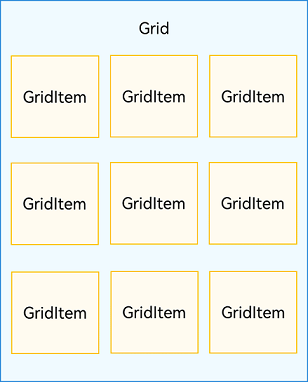
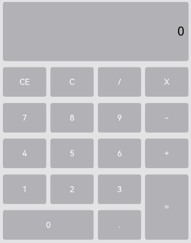
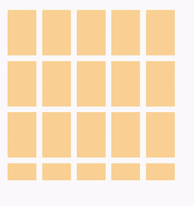

# Creating a Grid (Grid/GridItem)

<!--Kit: ArkUI-->
<!--Subsystem: ArkUI-->
<!--Owner: @rongShao-Z; @guozejun-->
<!--Designer: @guozejun-->
<!--Tester: @leiyuqian-->
<!--Adviser: @Brilliantry_Rui-->

## Overview

The grid layout consists of cells formed by rows and columns. You can specify the cells where items are located to create various layouts. The grid layout excels at dividing a page into regions and defining the proportion of child components. It is a key adaptive layout and applies to scenarios such as photo gallery, calendar, and calculator.

ArkUI provides the [Grid](../reference/apis-arkui/arkui-ts/ts-container-grid.md) and [GridItem](../reference/apis-arkui/arkui-ts/ts-container-griditem.md) components for building grid layouts. **Grid** is a container for defining the grid layout, while **GridItem** is a child component in the container. The **Grid** component allows creation of child components using methods such as [if/else](../ui/rendering-control/arkts-rendering-control-ifelse.md), [ForEach](../ui/rendering-control/arkts-rendering-control-foreach.md), and [LazyForEach](../ui/rendering-control/arkts-rendering-control-lazyforeach.md).

> **NOTE**
>
> This topic presents key code excerpts. For complete executable code, see <!--RP2-->[the code for creating a grid](https://gitcode.com/openharmony/applications_app_samples/tree/master/code/DocsSample/ArkUISample/ScrollableComponent)<!--RP2End-->.

## Layout and Constraints

Each item in the **Grid** container corresponds to a **GridItem** component, as shown below.

  **Figure 1** Relationship between Grid and GridItem components 


>**NOTE**
>
>The **Grid** component accepts only **GridItem** as its child.

The grid layout is a two-dimensional layout. The **Grid** component allows you to define the number of rows and columns, proportion of each row and column, number of rows or columns that child components span, and the horizontal and vertical alignment. When it has its size changed, its child components and spacing are adjusted proportionally. By leveraging these layout capabilities, you can build grid layouts of different styles, as shown below.

  **Figure 2** Grid layout 


The size of the **Grid** component follows its width and height settings (if configured) or adapts to the size of its parent component.

Depending on the settings of the quantity and proportion of rows and columns, the **Grid** component behaves as follows:

- If both the quantity and proportion are set for rows or columns, the **Grid** component displays elements only in the set number of rows or columns, and it cannot be scrolled. (This layout mode is recommended.)

- If only the quantity or proportion is set for rows or columns, the **Grid** component lays out elements in the specified direction, and it can be scrolled to display excess elements.

- If neither the quantity nor the proportion is set for rows or columns, the **Grid** component lays out elements in the layout direction. The number of rows and columns is determined by the layout direction and the width and height of the grid. Elements that exceed the range of rows and columns are not displayed, and the **Grid** component cannot be scrolled.


## Setting the Arrangement Mode


### Setting the Number and Proportion of Rows and Columns

You can set the number and proportion of rows and columns to determine the overall arrangement mode of the grid layout. To do so, use the [rowsTemplate](../reference/apis-arkui/arkui-ts/ts-container-grid.md#rowstemplate) and [columnsTemplate](../reference/apis-arkui/arkui-ts/ts-container-grid.md#columnstemplate) attributes of the **Grid** component.

The values of **rowsTemplate** and **columnsTemplate** are a string consisting of 'number+fr' segments, separated by spaces. Wherein **fr** indicates the number of rows or columns in the grid layout, and the number in front of **fr** is used to calculate the proportion of the row or column in the grid width, thereby determining the width of the row or column.

  **Figure 3** Example of the proportion of rows and columns 


The preceding figure shows a grid layout with three rows and three columns. The grid layout is divided into three parts in the vertical direction with each row taking up 1/3, and four parts in the horizontal direction with the first column taking up 1/4, the second column 2/4, and the third column 1/4.

This layout can be implemented by setting **rowsTemplate** to **'1fr 1fr 1fr'** and **columnsTemplate** to **'1fr 2fr 1fr'**.

<!-- @[build_a_grid](https://gitcode.com/openharmony/applications_app_samples/blob/master/code/DocsSample/ArkUISample/ScrollableComponent/entry/src/main/ets/pages/grid/GridLayout.ets) -->

``` TypeScript
Grid() {
  // ···
}
.rowsTemplate('1fr 1fr 1fr')
.columnsTemplate('1fr 2fr 1fr')
```

>**NOTE**
>
>When **rowsTemplate** or **columnsTemplate** is set for the **Grid** component, its **layoutDirection**, **maxCount**, **minCount**, and **cellLength** attributes do not take effect. For details about the attributes, see [Grid Attributes](../reference/apis-arkui/arkui-ts/ts-container-grid.md#attributes).


### Setting the Number of Rows and Columns Occupied by a Child Component

In real-world applications, an uneven grid layout, where grid cells span a varying number of cells and rows, is as common as its even counterpart. To allow a single grid cell in a grid to span multiple rows or columns, passing appropriate [GridLayoutOptions](../reference/apis-arkui/arkui-ts/ts-container-grid.md#gridlayoutoptions10) when creating the grid. Use **irregularIndexes** and **onGetIrregularSizeByIndex** for grids with only **rowsTemplate** or **columnsTemplate**, and **onGetRectByIndex** for grids with both.

  **Figure 4** Uneven grid layout


A common application with an uneven grid layout is the calculator. As shown in the following figure, the **0** key spans the first and second columns, and the **=** key spans the fifth and sixth rows. For a grid layout created using the **Grid** component, the row and column numbers start from 0 and increase incrementally.

  **Figure 5** Calculator 



In the grid, use the **onGetRectByIndex** callback to return the array [rowStart, columnStart, rowSpan, columnSpan] to achieve a layout that spans rows and columns, wherein **rowStart** and **columnStart** indicate the start row and column numbers of the current element, and **rowSpan** and **columnSpan** indicate how many rows and columns the current element spans.

To make the **0** key span across the first and second columns, and the **=** key span across the fifth and sixth rows, set **onGetRectByIndex** for **0** and **=** as follows: for **0**, set **rowStart** and **columnStart** at **6** and **0**, and **rowSpan** and **columnSpan** at **1** and **2**; for **=**, set **rowStart** and **columnStart** at **5** and **3**, and **rowSpan** and **columnSpan** at **2** and **1**.

<!-- @[Set_numberrows_columns](https://gitcode.com/openharmony/applications_app_samples/blob/master/code/DocsSample/ArkUISample/ScrollableComponent/entry/src/main/ets/pages/grid/GridCalculator.ets) -->

``` TypeScript
layoutOptions: GridLayoutOptions = {
  regularSize: [1, 1],
  onGetRectByIndex: (index: number) => {
  // ···
    if (index = = key1) { // key1 is the index of the 0 key.
      return [6, 0, 1, 2];
    } else if (index == key2) { // key2 is the index of the = key.
      return [5, 3, 2, 1];
    }
    // ···
    // Here, you need to return the positions of other items based on the specific layout.
  }
}
// ···
Grid(undefined, this.layoutOptions) {
  // ···
}
.columnsTemplate('1fr 1fr 1fr 1fr')
.rowsTemplate('1fr 1fr 1fr 1fr 1fr 1fr 1fr')
```

### Setting the Main Axis Direction

When neither the number nor proportion is set for rows and columns in a grid layout, you can use the [layoutDirection](../reference/apis-arkui/arkui-ts/ts-container-grid.md#layoutdirection8) attribute to set the main axis direction and thereby specify the arrangement mode of child components. In addition, you can use the [minCount](../reference/apis-arkui/arkui-ts/ts-container-grid.md#mincount8) and [maxCount](../reference/apis-arkui/arkui-ts/ts-container-grid.md#maxcount8) attributes to restrict the number of grid cells along the main axis.

  **Figure 6** Main axis direction 


When **layoutDirection** is set to **Row**, child components are arranged from left to right. When a row is full, a new row is added. When **layoutDirection** is set to **Column**, child components are arranged from top to bottom. When a column is full, a new column is added. In this example, the **maxCount** attribute is set to **3**, indicating that the maximum number of grid cells displayed along the main axis is 3.

<!-- @[Set_the_direction_of_the_main_axis_of_the_grid](https://gitcode.com/openharmony/applications_app_samples/blob/master/code/DocsSample/ArkUISample/ScrollableComponent/entry/src/main/ets/pages/grid/GridLayout.ets) -->

``` TypeScript
Grid() {
  // ···
}
.maxCount(3)
.layoutDirection(GridDirection.Row)
```

>**NOTE**
>
>- The **layoutDirection** attribute takes effect only when **rowsTemplate** and **columnsTemplate** are not set. In this case, child components are arranged in the direction set by **layoutDirection**.
>- When only **rowsTemplate** is set, the main axis of the grid runs in the horizontal direction, and the cross axis runs in the vertical direction.
>- When only **columnsTemplate** is set, the main axis of the grid runs in the vertical direction, and the cross axis runs in the horizontal direction.


## Displaying Data in a Grid Layout

The grid layout organizes its internal elements in two-dimensional layout mode, as shown in the following figure.

**Figure 7** General office services 


The **Grid** component can display a group of **GridItem** child components in two-dimensional layout mode.

<!-- @[build_a_office_services_meeting](https://gitcode.com/openharmony/applications_app_samples/blob/master/code/DocsSample/ArkUISample/ScrollableComponent/entry/src/main/ets/pages/grid/DataInGrid.ets) -->

``` TypeScript
Grid() {
  GridItem() {
    // The value in the app.string.Meeting resource file is 'Conference'.
    Text($r('app.string.Meeting'))
    // ...
  }

  GridItem() {
    // The value in the app.string.Check_in resource file is 'Sign-in'.
    Text($r('app.string.Check_in'))
    // ...
  }

  GridItem() {
    // The value in the app.string.Voting resource file is 'Vote'.
    Text($r('app.string.Voting'))
    // ...
  }

  GridItem() {
    // The value in the app.string.Printing resource file is 'Print'.
    Text($r('app.string.Printing'))
    // ...
  }
}
// ...
.rowsTemplate('1fr 1fr')
.columnsTemplate('1fr 1fr')
```


For multiple **GridItem** components with similar content structures, you are advised to nest them in **ForEach** statements to reduce repeated code.

<!-- @[build_a_office_services_grid_of_foreach](https://gitcode.com/openharmony/applications_app_samples/blob/master/code/DocsSample/ArkUISample/ScrollableComponent/entry/src/main/ets/pages/grid/DataInGrid.ets) -->

``` TypeScript
@Entry
@Component
export struct DataInGrid {
  // ...

  @State services: Array<string> = [
    // The value in the app.string.Meeting resource file is 'Conference'.
    this.context!.resourceManager.getStringSync($r('app.string.Meeting').id),
    // The value in the app.string.Check_in resource file is 'Sign-in'.
    this.context!.resourceManager.getStringSync($r('app.string.Check_in').id),
    // The value in the app.string.Voting resource file is 'Vote'.
    this.context!.resourceManager.getStringSync($r('app.string.Voting').id),
    // The value in the app.string.Printing resource file is 'Print'.
    this.context!.resourceManager.getStringSync($r('app.string.Printing').id)
  ];
  // ...

  build() {
    // ...
      Column() {
        // ...
          Grid() {
            ForEach(this.services, (service: string) => {
              GridItem() {
                Text(service)
              }
              // ...
            }, (service: string): string => service)
          }
          .rowsTemplate(('1fr 1fr') as string)
          .columnsTemplate(('1fr 1fr') as string)
          // ...
      }
      // ...
  }
}
```


## Setting the Gap Between Rows and Columns

The horizontal spacing between two grid cells is called row spacing, and the vertical spacing is called column spacing, as shown in the following figure.

**Figure 8** Row spacing and column spacing 


To configure the row and column spacing of a grid layout, use the [rowsGap](../reference/apis-arkui/arkui-ts/ts-container-grid.md#rowsgap) and [columnsGap](../reference/apis-arkui/arkui-ts/ts-container-grid.md#columnsgap) attributes of the **Grid** component. In the calculator shown in Figure 5, the row spacing is 15 vp, and the column spacing is 10vp.

<!-- @[set_rows_and_columns_occupied](https://gitcode.com/openharmony/applications_app_samples/blob/master/code/DocsSample/ArkUISample/ScrollableComponent/entry/src/main/ets/pages/grid/GridColumnsGap.ets) -->

``` TypeScript
Grid() {
  // ···
}
.columnsGap(10)
.rowsGap(15)
```

## Building a Scrollable Grid Layout

The scrollable grid layout is often used on the file list, product list, video list, and similar pages, as shown in the following figure. When only the number or proportion is set for rows and columns, that is, only the **rowsTemplate** or **columnsTemplate** attribute is set, the elements in the grid are arranged in the configured direction. When the content goes beyond the display area, the grid can be scrolled.

<!--Del-->**Figure 9** Horizontal scrollable grid layout<!--DelEnd-->

<!--Del-->![en-us_image_0000001511740512] (figures/en-us_image_0000001511740512.gif)<!--DelEnd-->

If **columnsTemplate** is set, the grid scrolls vertically. If **rowsTemplate** is set, the grid scrolls horizontally.

In the horizontal scrollable grid layout shown in the preceding figure, **rowsTemplate** is set but **columnsTemplate** is not. When the content exceeds the width of the grid, the grid can scroll horizontally to display the content outside of the display area.

<!-- @[build_scrollable_horizontally_grid_layouts](https://gitcode.com/openharmony/applications_app_samples/blob/master/code/DocsSample/ArkUISample/ScrollableComponent/entry/src/main/ets/pages/grid/ScrollableGrid.ets) -->

``` TypeScript
@Entry
@Component
export struct ScrollableGrid {
  // ...
  @State services: Array<string> = [
    // Replace $r('app.string.Live_Streaming') with the actual resource file. In this example, the value of the resource file is "Live streaming."
    this.context!.resourceManager.getStringSync($r('app.string.Live_Streaming').id),
    // Replace $r('app.string.Imported') with the actual resource file. In this example, the value of the resource file is "Import."
    this.context!.resourceManager.getStringSync($r('app.string.Imported').id)
    ];
  // ...
  build() {
    // ...

      Column({ space: 5 }) {
        // ...

          Grid() {
            ForEach(this.services, (service: string, index: number) => {
              GridItem() {
                // ...
              }
              .width('25%')
              // ...
            }, (service: string): string => service)
          }
          .rowsTemplate('1fr 1fr') // Set only the rowsTemplate attribute. When the content exceeds the display area of the grid, the grid can be scrolled horizontally.
          .rowsGap(15)

          // ...
        }
      }
      // ...
}
```


## Controlling the Scrolling Position

Similar to the Back to top button in a list layout, the feature of controlling the scrolling position is commonly used in the grid layout, for example, page turning in the calendar application, as shown below.

  **Figure 10** Page turning in the calendar application 


When the **Grid** component is initialized, it can be bound to a [Scroller](../reference/apis-arkui/arkui-ts/ts-container-scroll.md#scroller) object for scrolling control. In this example, the [scrollPage](../reference/apis-arkui/arkui-ts/ts-container-scroll.md#scrollpage9) API of the **Scroller** object is used to turn pages.

<!-- @[build_a_private_scrolling_object](https://gitcode.com/openharmony/applications_app_samples/blob/master/code/DocsSample/ArkUISample/ScrollableComponent/entry/src/main/ets/pages/grid/ScrollPositionGrid.ets) -->

``` TypeScript
private scroller: Scroller = new Scroller();
```

On the calendar page, when a user clicks the **Next** button, the application responds to the click event by setting the **next** parameter in the **scrollPage** API to **true** to scroll to the next page.

 <!-- @[Control_scrolling_position](https://gitcode.com/openharmony/applications_app_samples/blob/master/code/DocsSample/ArkUISample/ScrollableComponent/entry/src/main/ets/pages/grid/GridSideToSide.ets) -->
 
 ``` TypeScript
 Column({ space: 5 }){
   Grid(this.scroller) {
     // ...
   }
   .columnsTemplate('1fr 1fr 1fr 1fr 1fr 1fr 1fr')
   // ...
   Row({ space: 20 }) {
     // Replace $r('app.string.Previous_Page') with the actual resource file. In this example, the value in the resource file is "Previous."
     Button($r('app.string.Previous_Page'))
       .onClick(() => {
         this.scroller.scrollPage({
           next: false
         });
       })
     // Replace $r('app.string.Next_page') with the actual resource file. In this example, the value in the resource file is "Next."
     Button($r('app.string.Next_page'))
       .onClick(() => {
         this.scroller.scrollPage({
           next: true
         });
       })
   }
 }
 ```

## Adding an External Scrollbar

To add an external scrollbar to a [Grid](../reference/apis-arkui/arkui-ts/ts-container-grid.md) component, you can use the [ScrollBar](../reference/apis-arkui/arkui-ts/ts-basic-components-scrollbar.md) component. By binding both the **Grid** and **ScrollBar** components to the same [Scroller](../reference/apis-arkui/arkui-ts/ts-container-scroll.md#scroller) object, you can ensure they stay synchronized.

1. Create a [Scroller](../reference/apis-arkui/arkui-ts/ts-container-scroll.md#scroller) object named **gridScroller**.
   <!-- @[Add_external_scrollbar_gridScroller](https://gitcode.com/openharmony/applications_app_samples/blob/master/code/DocsSample/ArkUISample/ScrollableComponent/entry/src/main/ets/pages/grid/GridScrollbar.ets) -->
   
   ``` TypeScript
   private gridScroller: Scroller = new Scroller();
   ```

2. Bind the **gridScroller** object to the **Grid** component using the [scroller](../reference/apis-arkui/arkui-ts/ts-container-grid.md#apis) parameter.
   
   <!-- @[Add_external_scrollbar1](https://gitcode.com/openharmony/applications_app_samples/blob/master/code/DocsSample/ArkUISample/ScrollableComponent/entry/src/main/ets/pages/grid/GridScrollbar.ets) -->
   
   ``` TypeScript
   // Use gridScroller to initialize the scroller parameter to bind it with the Grid component.
   Grid( this.gridScroller) {
   // ···
   }
   ```


3. Bind the **gridScroller** object to the **ScrollBar** component using the [scroller](../reference/apis-arkui/arkui-ts/ts-basic-components-scrollbar.md#scrollbaroptions) parameter.
      

   <!-- @[Add_external_scrollbar2](https://gitcode.com/openharmony/applications_app_samples/blob/master/code/DocsSample/ArkUISample/ScrollableComponent/entry/src/main/ets/pages/grid/GridScrollbar.ets) -->
   
   ``` TypeScript
   // Use gridScroller to initialize the scroller parameter to bind it with the ScrollBar component.
   ScrollBar({ scroller: this.gridScroller })
   ```

  **Figure 11** External scrollbar of the Grid component



>**NOTE**
>- The [ScrollBar](../reference/apis-arkui/arkui-ts/ts-basic-components-scrollbar.md) component can also be used with other scrollable components such as [ArcList](../reference/apis-arkui/arkui-ts/ts-container-arclist.md), [List](../reference/apis-arkui/arkui-ts/ts-container-list.md), [Scroll](../reference/apis-arkui/arkui-ts/ts-container-scroll.md), and [WaterFlow](../reference/apis-arkui/arkui-ts/ts-container-waterflow.md).
>- On devices with circular screens, you can use the [Grid](../reference/apis-arkui/arkui-ts/ts-container-grid.md) component with the [ArcScrollBar](../reference/apis-arkui/arkui-ts/ts-basic-components-arcscrollbar.md) component to add an arc scrollbar to your grid layout. For details, see [Adding an External Scrollbar: ArcScrollBar](./arkts-layout-development-create-arclist.md#adding-an-external-scrollbar-arcscrollbar).

## Multi‑Selection by Swiping

Starting from API version 26.0.0, the [Grid](../reference/apis-arkui/arkui-ts/ts-container-grid.md) component supports finger‑swipe multi‑select in edit mode. After entering edit mode, users can swipe a single finger across multiple [GridItem](../reference/apis-arkui/arkui-ts/ts-container-griditem.md) components to batch select or deselect grid items. The application can set whether each **GridItem** is selectable and record the selected items via callbacks. This capability is suitable for scenarios such as photo albums, file managers, video lists, and other use cases that require consecutive batch selection of grid items.

**Effect of selecting multiple grid items by swiping**


### Setting the Edit Mode

Call [enableEditMode](../reference/apis-arkui/arkui-ts/ts-container-grid.md#enableeditmode) to set whether to enter the edit mode. When set to **true**, the Grid enters edit mode, allowing users to swipe a single finger over multiple **GridItem** components to batch select or deselect them; when set to **false**, the Grid exits edit mode. Use [onEditModeChange](../reference/apis-arkui/arkui-ts/ts-container-grid.md#oneditmodechange) to listen for edit‑mode changes and synchronise changes triggered by system back, swipe‑back, or two‑finger swipe gestures with your application state.

Configure multi‑select behaviour in edit mode via [editModeOptions](../reference/apis-arkui/arkui-ts/ts-container-grid.md#editmodeoptions23). The **editModeOptions** object provides two swipe‑related parameters: **useDefaultMultiSelectStyle** and **enableTwoFingerMultiSelect**, both defaulting to **true**. The former controls whether the system check box is displayed at the bottom‑right corner of each **GridItem**; the latter controls whether users can automatically enter edit mode and perform multi‑selection by swiping with two fingers. If you need a custom style, set **useDefaultMultiSelectStyle** to **false**. If you want to disable the two‑finger swipe‑to‑enter‑edit‑mode behaviour, set **enableTwoFingerMultiSelect** to **false**.
<!-- @[Add_grid_select](https://gitcode.com/openharmony/applications_app_samples/blob/master/code/DocsSample/ArkUISample/ScrollableComponent/entry/src/main/ets/pages/grid/GridSwipeSelect.ets) -->

``` TypeScript
Grid() {
  // ...
}
.enableEditMode(this.enableEditMode)
.onEditModeChange((enabled: boolean) => {
  this.setEditMode(enabled);
})
.editModeOptions({ useDefaultMultiSelectStyle: true, enableTwoFingerMultiSelect: true })
```

### Recording Grid Item Selection Results

Configure [selectable](../reference/apis-arkui/arkui-ts/ts-container-griditem.md#selectable8), [selected](../reference/apis-arkui/arkui-ts/ts-container-griditem.md#selected10), and [onSelect](../reference/apis-arkui/arkui-ts/ts-container-griditem.md#onselect8) on **GridItem**. The **selectable** attribute is used to set whether a grid item is selectable, and the **selected** attribute is used to set whether a grid item is currently selected. During swipe multi‑selection, the component triggers the **onSelect** callback. Your application can record the latest selection state for each grid item inside this callback.
<!-- @[Add_grid_item_select](https://gitcode.com/openharmony/applications_app_samples/blob/master/code/DocsSample/ArkUISample/ScrollableComponent/entry/src/main/ets/pages/grid/GridSwipeSelect.ets) -->

``` TypeScript
GridItem() {
  this.GridCard(item, index)
}
.selectable(true)
.selected(this.isSelected(item.id))
.onSelect((selected: boolean) => {
  this.updateSelected(item.id, selected);
})
```

>**NOTE**
>
>- It is recommended to use a unique identifier that does not change with the item's position (e.g., a file ID) to record selection results. Avoid relying solely on the current index, as this may cause selected items to become misaligned after dynamic insertion or deletion of data.
>- If your service logic requires preserving selection results after exiting edit mode, you can save them in the [onEditModeChange](../reference/apis-arkui/arkui-ts/ts-container-grid.md#oneditmodechange) callback.
>- When using [LazyForEach](../ui/rendering-control/arkts-rendering-control-lazyforeach.md), after the data source changes, you must notify the component to refresh via [DataChangeListener](../reference/apis-arkui/arkui-ts/ts-rendering-control-lazyforeach.md#datachangelistener) to ensure that grid‑item states remain consistent with the data source during swipe multi‑selection.

## Performance Optimization

Just as [LazyForEach](../ui/rendering-control/arkts-rendering-control-foreach.md) is recommended for [handling a long list](arkts-layout-development-create-list.md#handling-a-long-list), [LazyForEach](../ui/rendering-control/arkts-rendering-control-lazyforeach.md) is recommended for a scrolling grid layout when a large number of grid items are involved.

For details about the implementation of on-demand loading optimization, see the example in [LazyForEach](../ui/rendering-control/arkts-rendering-control-lazyforeach.md).

When the grid is rendered in lazy loading mode, to improve the grid scrolling experience and minimize white blocks during grid scrolling, you can use the [cachedCount](../reference/apis-arkui/arkui-ts/ts-container-grid.md#cachedcount) attribute of the **Grid** component. This attribute sets the number of grid items preloaded outside of the screen and is valid only in [LazyForEach](../ui/rendering-control/arkts-rendering-control-lazyforeach.md).

  Specifically, the number of the grid items to cache before and after the currently displayed one equals the value of **cachedCount** multiplied by the number of columns. Grid items that exceed the display and cache range are released.

<!-- @[long_list](https://gitcode.com/openharmony/applications_app_samples/blob/master/code/DocsSample/ArkUISample/ScrollableComponent/entry/src/main/ets/pages/grid/LongGrid.ets) -->

``` TypeScript
Grid() {
  LazyForEach(this.dataSource, () => {
    GridItem() {
    }
  })
}
.cachedCount(3)
```

>**NOTE**
>
>A greater **cachedCount** value may result in higher CPU and memory overhead of the UI. Adjust the value by taking into account both the comprehensive performance and user experience.

<!--RP1-->
<!--Del-->##  

 

-  

-  
<!--RP1End--><!--DelEnd-->

<!--no_check-->
