# Creating a List (List)


## Overview

A list is a container that displays a collection of items. If the list items go beyond the screen, the list can scroll to reveal the content off the screen. The list is applicable for presenting similar data types or data type sets, such as images and text. Some common lists seen in applications are the contacts list, playlist, and shopping list.

You can use lists to easily and efficiently display structured, scrollable information. Specifically, you can provide a single view of rows or columns by arranging the [ListItemGroup](../reference/apis-arkui/arkui-ts/ts-container-listitemgroup.md) or [ListItem](../reference/apis-arkui/arkui-ts/ts-container-listitem.md) child components linearly in a vertical or horizontal direction in the [List](../reference/apis-arkui/arkui-ts/ts-container-list.md) component, or use [ForEach](../ui/state-management/arkts-rendering-control-foreach.md) to iterate over a group of rows or columns, or mix any number of single views and **ForEach** structures to build a list. The **List** component supports the generation of child components in various [rendering](../ui/state-management/arkts-rendering-control-overview.md) modes, including conditional rendering, iterative rendering, and lazy data loading.

On devices with circular screens, the [ArcList](../reference/apis-arkui/arkui-ts/ts-container-arclist.md) component is recommended. For details, see [Creating an Arc List (ArcList)](./arkts-layout-development-create-arclist.md).

## Layout and Constraints

A list automatically arranges child components in the direction it scrolls. Adding or removing child components from the list will trigger re-arrangement of the child components.

As shown in the following figure, in a vertical list, **ListItemGroup** or **ListItem** components are automatically arranged vertically.

**ListItemGroup** is used to display list data by group. Its child component is also **ListItem**. **ListItem** represents a list item, which can contain a single child component.

  **Figure 1** Relationships between List, ListItemGroup, and ListItem 

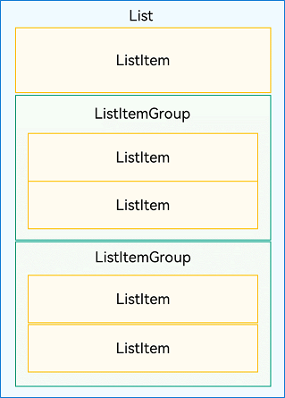

>**NOTE**
>
>A **List** component can contain only **ListItemGroup** or **ListItem** as its child components. **ListItemGroup** and **ListItem** must be used together with **List**.


### Layout

In addition to providing vertical and horizontal layout support with adaptive scrolling for off-screen content, the **List** component also offers the capability of adapting to the number of rows in the cross axis direction.

When used in vertical layout, the list can contain one or more scrollable columns, as shown below.

  **Figure 2** Vertical scrolling list (left: one column; right: multiple columns) 


When used in horizontal layout, the list can contain one or more scrollable rows, as shown below.

  **Figure 3** Horizontal scrolling list (left: one column; right: multiple columns) 

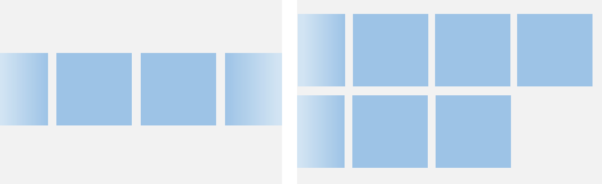


While **Grid** and **WaterFlow** can also create single-column and multi-column layouts, there are scenarios where the **List** is the more suitable choice. Specifically, if your layout design requires columns of equal width and items do not need to span rows or columns, opt for the **List**.

### Constraints

The main axis direction of a list refers to the direction in which the child component columns are laid out and in which the list scrolls. An axis perpendicular to the main axis is referred to as a cross axis, and the direction of the cross axis is perpendicular to a direction of the main axis.

As shown below, the main axis of a vertical list is in the vertical direction, and the cross axis is in the horizontal direction. The main axis of a horizontal list is in the horizontal direction, and the cross axis is in the vertical direction.

  **Figure 4** Main axis and cross axis of the list 

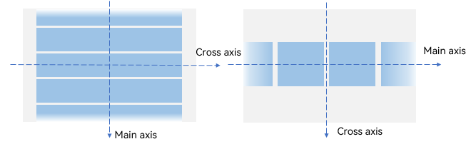

If a size is set for the main axis or cross axis of the **List** component, it is used as the size of the component in the corresponding direction.

If no size is set for the main axis of the **List** component, the size of the **List** component in the main axis direction automatically adapts to the total size of its child components, as long as the total size of the child components in the main axis direction does not exceed the size of the parent component of **List**.

In the example shown below, no height is set for vertical list B, and the height of its parent component A is 200 vp. If the total height of all child components C is 150 vp, the height of list B is 150 vp.

  **Figure 5** Main axis height constraint example 1 (A: parent component of List; B: List component; C: all child components of List) 

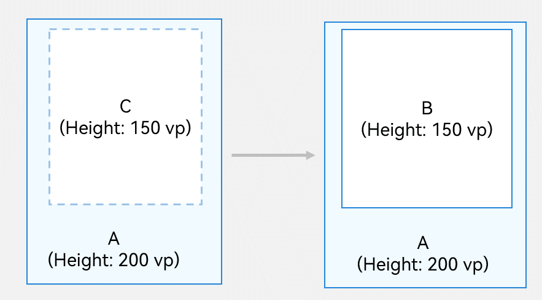

If the total size of the child components in the main axis direction is greater than the size of the parent component of **List**, the size of the **List** component in the main axis direction automatically adapts to the size of its parent component.

In the example shown below, still no height is set for vertical list B, and the height of its parent component A is 200 vp. If the total height of all child components C is 300 vp, the height of list B is 200 vp.

  **Figure 6** Main axis height constraint example 2 (A: parent component of List; B: List component; C: all child components of List) 

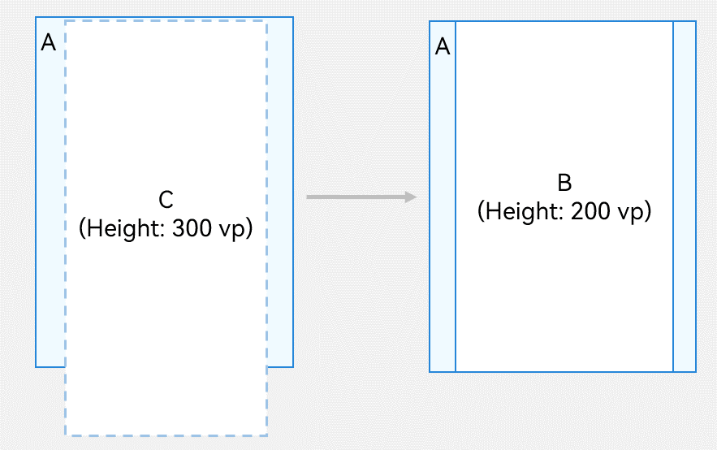

If no size is set for the cross axis of the **List** component, the size of the **List** component in the cross axis direction automatically adapts to the size of its parent component.


## Developing the Layout


### Setting the Main Axis Direction

By default, the main axis of the **List** component runs in the vertical direction. This means that you can create a vertical scrolling list without the need to manually set the list direction.

To create a horizontal scrolling list, set the **listDirection** attribute to **Axis.Horizontal**. The default value of **listDirection** is **Axis.Vertical**.


```ts
List() {
  // ...
}
.listDirection(Axis.Horizontal)
```


### Setting the Cross Axis Layout

The cross axis layout of the **List** component can be set using the **lanes** and **alignListItem** attributes. The **lanes** attribute controls the number of list items along the cross axis, and the **alignListItem** attribute controls the alignment mode of child components along the cross axis.

The **lanes** attribute of the **List** component is usually used to adaptively construct lists with different numbers of rows or columns for devices of different sizes, enabling one-time development for multi-device deployment. Its value type is number or [LengthConstrain](../reference/apis-arkui/arkui-ts/ts-types.md#lengthconstrain). If you are building a two-column vertical list shown on the right in Figure 2, set the **lanes** attribute to **2**. The default value of **lanes** is **1**.


```ts
List() {
  // ...
}
.lanes(2)
```

If set to a value of the LengthConstrain type, the **lanes** attribute determines the number of rows or columns based on the LengthConstrain settings and the size of the **List** component.


```ts
@Entry
@Component
struct EgLanes {
  @State egLanes: LengthConstrain = { minLength: 200, maxLength: 300 };
  build() {
    List() {
      // ...
    }
    .lanes(this.egLanes)
  }
}
```

For example, if the **lanes** attribute is set to **{ minLength: 200, maxLength: 300 }** for a vertical list, then:

- When the list width is 300 vp, the list contains one column, because **minLength** is 200 vp.

- When the list width changes to 400 vp, which is twice that of the **minLength** value, the list is automatically adapted to two-column.

With regard to a vertical list, when the **alignListItem** attribute is set to **ListItemAlign.Center**, list items are center-aligned horizontally; when the **alignListItem** attribute is at its default value **ListItemAlign.Start**, list items are aligned toward the start edge of the cross axis in the list.


```ts
List() {
  // ...
}
.alignListItem(ListItemAlign.Center)
```

## ListItem Lifecycle Management
### Creating ListItem Components with ForEach
When a **List** component is created, all **ListItem** components are created immediately, but their behavior varies by area:

- Visible area: **ListItem** components are laid out during the first frame.
- Preload area: **ListItem** components are laid out during idle time.
- Outside the preload area: Only the **ListItem** container is created; its child components are not created.

During scrolling, the **ListItem** components entering the preload and visible areas create their child components and complete layout, and the **ListItem** components leaving these areas are not destroyed.

**Figure 7** Lifecycle of ListItem components created using ForEach
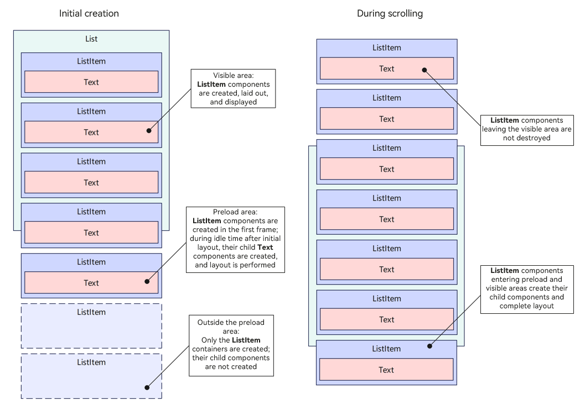

### Creating ListItem Components with LazyForEach
When a **List** component is created:

- Visible area: **ListItem** components are created and laid out immediately.
- Preload area: **ListItem** components are created and laid out during idle time but not mounted to the component tree.
- Outside the preload area: No **ListItem** components are created.

During scrolling, the **ListItem** components entering the preload and visible areas are created and laid out. If they contain @Reusable decorated custom components, these components are reused from the cache pool when possible. **ListItem** components leaving the preload and visible areas are destroyed. If they contain @Reusable decorated custom components, these components are recycled into the cache pool.

**Figure 8** Lifecycle of ListItem components created using LazyForEach
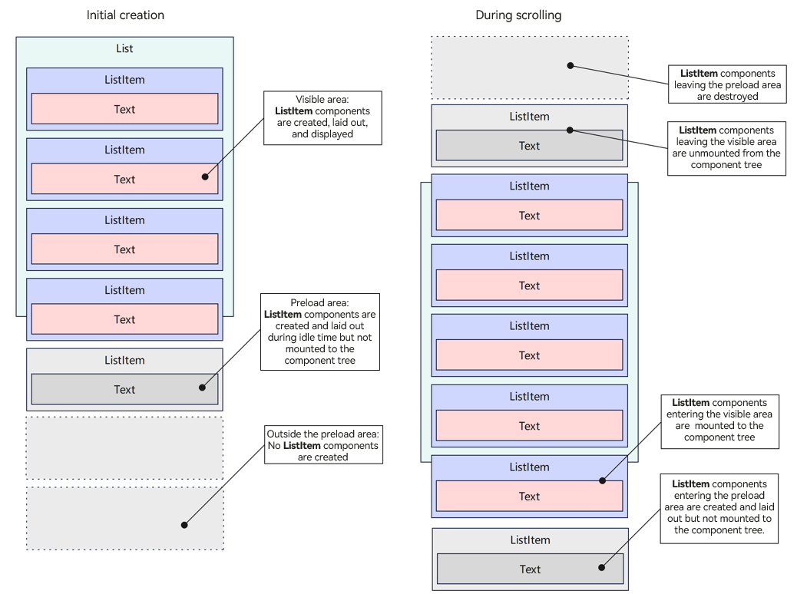

### Creating ListItem Components with Repeat
**With virtualScroll Enabled**

When a **List** component is created:

- Visible area: **ListItem** components are created and laid out immediately.
- Preload area: **ListItem** components are created and laid out during idle time, and then mounted to the component tree.
- Outside the preload area: No **ListItem** components are created.

During scrolling, for **ListItem** components entering the preload and visible areas, the system first attempts to reuse components from cache pool. If no components are unavailable in the cache pool, the system creates **ListItem** components and lays them out. **ListItem** components leaving the preload and visible areas are recycled into the cache pool.

**Figure 9** Lifecycle of ListItem components created using Repeat with virtualScroll enabled
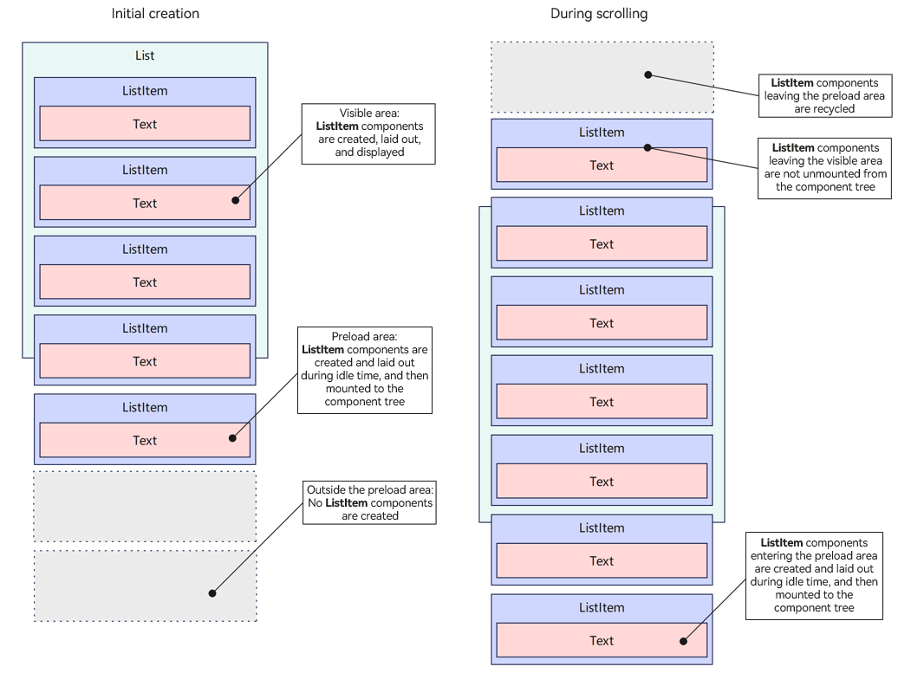

**With virtualScroll Disabled**

When a **List** component is created, all **ListItem** components are created immediately, but their behavior varies by area:

- Visible area: **ListItem** components are laid out during the first frame.
- Preload area: **ListItem** components are laid out during idle time.
- Outside the preload area: No layout is performed.

During scrolling, the **ListItem** components in the preload and visible areas are laid out; the **ListItem** components leaving these areas are not destroyed.

**Figure 10** Lifecycle of ListItem components created using Repeat with virtualScroll disabled
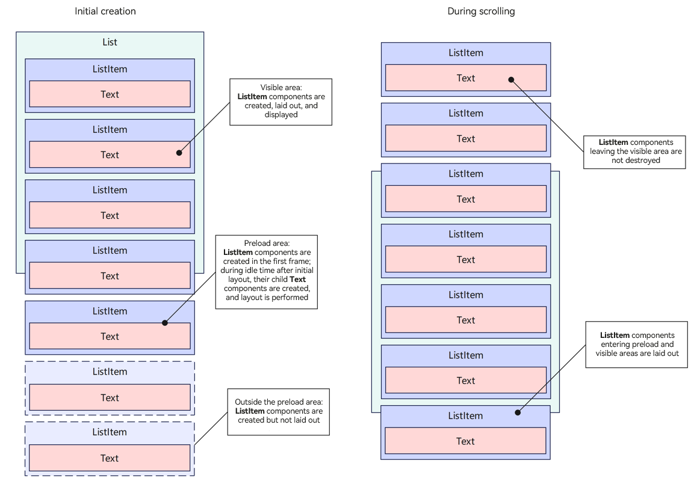


## Displaying Data in the List

The list displays a collection of items horizontally or vertically and can scroll to reveal content off the screen. In the simplest case, a **List** component is statically made up of **ListItem** components.

  **Figure 11** Example of a city list 

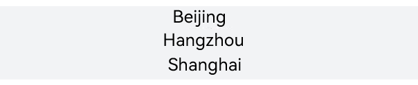

```ts
@Entry
@Component
struct CityList {
  build() {
    List() {
      ListItem() {
        Text('Beijing').fontSize(24)
      }

      ListItem() {
        Text('Hangzhou').fontSize(24)
      }

      ListItem() {
        Text('Shanghai').fontSize(24)
      }
    }
    .backgroundColor('#FFF1F3F5')
    .alignListItem(ListItemAlign.Center)
  }
}
```

Each **ListItem** component can contain only one root child component. Therefore, it does not allow for child components in tile mode. If tile mode is required, encapsulate the child components into a container or create a custom component.

  **Figure 12** Example of a contacts list 


As shown above, as a list item, each contact has a profile picture and a name. To present it, you can encapsulate **Image** and **Text** components into a **Row** container.


```ts
List() {
  ListItem() {
    Row() {
      // app.media.iconE is a custom resource.
      Image($r('app.media.iconE'))
        .width(40)
        .height(40)
        .margin(10)

      Text('Tom')
        .fontSize(20)
    }
  }

  ListItem() {
    Row() {
      // app.media.iconF is a custom resource.
      Image($r('app.media.iconF'))
        .width(40)
        .height(40)
        .margin(10)

      Text('Tracy')
        .fontSize(20)
    }
  }
}
```


## Iterating List Content

Compared with a static list, a dynamic list is more common in applications. For dynamic lists, you can use [ForEach](../ui/state-management/arkts-rendering-control-foreach.md) to obtain data from the data source and create components for each data item, thereby reducing code complexity.

For example, when creating a contacts list, you can store the contact name and profile picture data in a **Contact** class structure to the **contacts** array, and nest **ListItem** components in **ForEach**, thereby reducing repeated code needed for tiling similar **ListItem** components.


```ts
import { util } from '@kit.ArkTS';

class Contact {
  key: string = util.generateRandomUUID(true);
  name: string;
  icon: Resource;

  constructor(name: string, icon: Resource) {
    this.name = name;
    this.icon = icon;
  }
}

@Entry
@Component
struct SimpleContacts {
  private contacts: Array<object> = [
    new Contact('Tom', $r("app.media.iconA")),
    new Contact('Tracy', $r("app.media.iconB")),
  ];

  build() {
    List() {
      ForEach(this.contacts, (item: Contact) => {
        ListItem() {
          Row() {
            Image(item.icon)
              .width(40)
              .height(40)
              .margin(10)
            Text(item.name).fontSize(20)
          }
          .width('100%')
          .justifyContent(FlexAlign.Start)
        }
      }, (item: Contact) => JSON.stringify(item))
    }
    .width('100%')
  }
}
```

In the **List** component, **ForEach** can be used to render **ListItemGroup** items as well as **ListItem** items. For details, see [Adding Grouping Support](#adding-grouping-support).


## Customizing the List Style


### Setting the Spacing

When initializing a list, you can use the **space** parameter to add spacing between list items. In the following example, a 10 vp spacing is added between list items along the main axis:


```ts
List({ space: 10 }) {
  // ...
}
```


### Adding Dividers

A divider separates UI items to make them easier to identify. In the following figure that shows the settings screen, a divider is added between the setting items, appearing below the text.

  **Figure 13** Using dividers between the setting items 

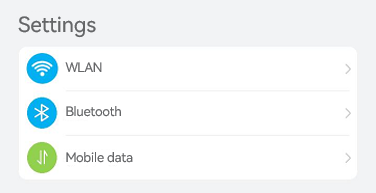

To add dividers between list items, you can use the **divider** attribute together with the following style attributes:

- **strokeWidth** and **color**: stroke width and color of the diver, respectively.

- **startMargin** and **endMargin**: distance between the divider and the start edge and end edge of the list, respectively.


```ts
class DividerTmp {
  strokeWidth: Length = 1;
  startMargin: Length = 60;
  endMargin: Length = 10;
  color: ResourceColor = '#ffe9f0f0';

  constructor(strokeWidth: Length, startMargin: Length, endMargin: Length, color: ResourceColor) {
    this.strokeWidth = strokeWidth;
    this.startMargin = startMargin;
    this.endMargin = endMargin;
    this.color = color;
  }
}
@Entry
@Component
struct EgDivider {
  @State egDivider: DividerTmp = new DividerTmp(1, 60, 10, '#ffe9f0f0');
  build() {
    List() {
      // ...
    }
    .divider(this.egDivider)
  }
}
```

This example draws a divider with a stroke thickness of 1 vp from a position 60 vp away from the start edge of the list to a position 10 vp away from the end edge of the list. The effect is shown in Figure 9.

>**NOTE**
>
>1. The stroke width of the divider causes some space between list items. If the content spacing set for the list is smaller than the stroke width of the divider, the latter is used instead.
>
>2. When a list contains multiple columns, the **startMargin** and **endMargin** attributes of the divider apply to each column.
>
>3. The divider is drawn between list items. No divider is drawn above the first list item and below the last list item.


### Adding a Scrollbar

When the total height (width) of list items exceeds the screen height (width), the list can scroll vertically (horizontally). The scrollbar of a list enables users to quickly navigate the list content, as shown below.

  **Figure 14** Scrollbar of a list


When using the **List** component, you can use the **scrollBar** attribute to control the display of the list scrollbar. The value type of **scrollBar** is [BarState](../reference/apis-arkui/arkui-ts/ts-appendix-enums.md#barstate). When the value is **BarState.Auto**, the scrollbar is displayed as required: It is displayed when the scrollbar area is touched and becomes thicker when being dragged; it automatically disappears after 2 seconds of inactivity.

The default value of the **scrollBar attribute** is **BarState.Off** in API version 9 and earlier versions and **BarState.Auto** since API version 10.
```ts
List() {
  // ...
}
.scrollBar(BarState.Auto)
```

## Adding an External Scrollbar

To add an external scrollbar to a [List](../reference/apis-arkui/arkui-ts/ts-container-list.md) component, you can use the [ScrollBar](../reference/apis-arkui/arkui-ts/ts-basic-components-scrollbar.md) component. By binding both the **List** and **ScrollBar** components to the same [Scroller](../reference/apis-arkui/arkui-ts/ts-container-scroll.md#scroller) object, you can ensure they stay synchronized.

1. Create a [Scroller](../reference/apis-arkui/arkui-ts/ts-container-scroll.md#scroller) object named **listScroller**.

   ```ts
   private listScroller: Scroller = new Scroller();
   ```

2. Bind the **listScroller** object to the **List** component using the [scroller](../reference/apis-arkui/arkui-ts/ts-container-list.md#listoptions18) parameter.

   ```ts
   // Use listScroller to initialize the scroller parameter to bind it with the List component.
   List({ scroller: this.listScroller }) {
   // ...
   }
   ```

3. Bind the **listScroller** object to the **ScrollBar** component using the [scroller](../reference/apis-arkui/arkui-ts/ts-basic-components-scrollbar.md#scrollbaroptions) parameter.

   ```ts
   // Use listScroller to initialize the scroller parameter to bind it with the ScrollBar component.
   ScrollBar({ scroller: this.listScroller })
   ```

  **Figure 15** External scrollbar of the List component


>**NOTE**
>- The [ScrollBar](../reference/apis-arkui/arkui-ts/ts-basic-components-scrollbar.md) component can also be used with other scrollable components such as [ArcList](../reference/apis-arkui/arkui-ts/ts-container-arclist.md), [Grid](../reference/apis-arkui/arkui-ts/ts-container-grid.md), [Scroll](../reference/apis-arkui/arkui-ts/ts-container-scroll.md), and [WaterFlow](../reference/apis-arkui/arkui-ts/ts-container-waterflow.md).
>- On devices with circular screens, you can use the [List](../reference/apis-arkui/arkui-ts/ts-container-list.md) component with the [ArcScrollBar](../reference/apis-arkui/arkui-ts/ts-basic-components-arcscrollbar.md) component to add an arc scrollbar to your list layout. For details, see [Adding an External Scrollbar: ArcScrollBar](./arkts-layout-development-create-arclist.md#adding-an-external-scrollbar-arcscrollbar).

## Adding Grouping Support

By allowing data to be displayed in groups in the list, you make the list easier to scan and navigate. Grouping is common in real-world applications. For example, the contacts list below use grouping.

  **Figure 16** Contacts list with grouping

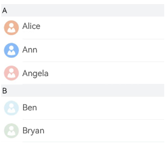

You can use **ListItemGroup** to group items in the **List** component to build a two-dimensional list.

A **List** component allows one or more **ListItemGroup** child components. By default, the width of **ListItemGroup** is equal to that of **List**. When initializing **ListItemGroup**, you can use the **header** parameter to set its header.


```ts
@Entry
@Component
struct ContactsList {
  
  @Builder itemHead(text: string) {
    // Header of the list group, corresponding to the group A and B locations.
    Text(text)
      .fontSize(20)
      .backgroundColor('#fff1f3f5')
      .width('100%')
      .padding(5)
  }

  build() {
    List() {
      ListItemGroup({ header: this.itemHead('A') }) {
        // Render the repeated list items of group A.
      }

      ListItemGroup({ header: this.itemHead('B') }) {
        // Render the repeated list items of group B.
      }
    }
  }
}
```

If the structures of multiple **ListItemGroup** components are similar, you can combine the data of these components into an array and use **ForEach** to render them cyclically. For example, in the contacts list, the **contacts** data of each group (for details, see [Iterating List Content](#iterating-list-content)) and the **title** data of the corresponding group are combined and defined as the **contactsGroups** array. Then, with rendering of **contactsGroups** in **ForEach**, a contact list with multiple groups is implemented. For details, see the example in [Adding a Sticky Header](#adding-a sticky-header).

## Adding a Sticky Header

The sticky header is a common pattern for keeping the header in the same place on the screen while the user scrolls down the list. As shown in the following figure, when you scroll through group A in the contacts list, the header of group B is always below group A. When you start scrolling through group B, the header of group B is fixed at the top of the screen. After group B has been scrolled to the bottom, the header of group B is replaced by the header of next group.

Sticky headers not only signify the representation and usage of data in the respective groups, but also help users navigate through a large amount of information, thereby avoiding unnecessary scrolling between the top of the area where the header is located and the area of interest.

  **Figure 17** Sticky header 

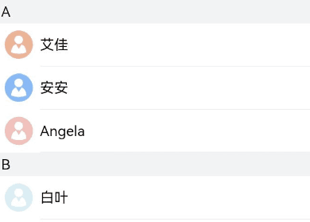

You can set a sticky header or footer for a **ListItemGroup** component by setting the **sticky** attribute of its parent **List** component.

Setting the **sticky** attribute to **StickyStyle.Header** implements a sticky header. To implement a sticky footer, use the **footer** parameter to initialize the footer of **ListItemGroup** and set the **sticky** attribute to **StickyStyle.Footer**.


```ts
import { util } from '@kit.ArkTS';
class Contact {
  key: string = util.generateRandomUUID(true);
  name: string;
  icon: Resource;

  constructor(name: string, icon: Resource) {
    this.name = name;
    this.icon = icon;
  }
}
export class ContactsGroup {
  title: string = '';
  contacts: Array<object> | null = null;
  key: string = "";
}

export class ContactsGroupDataSource implements IDataSource {
  private list: object[] = [];

  constructor(list: object[]) {
    this.list = list;
  }

  totalCount(): number {
    return this.list.length;
  }

  getData(index: number): object {
    return this.list[index];
  }

  registerDataChangeListener(listener: DataChangeListener): void {
  }

  unregisterDataChangeListener(listener: DataChangeListener): void {
  }
}

export let contactsGroups: object[] = [
  {
    title: 'A',
    contacts: [
      new Contact('Alice', $r('app.media.iconA')),
      new Contact('Ann', $r('app.media.iconB')),
      new Contact('Angela', $r('app.media.iconC')),
    ],
    key: util.generateRandomUUID(true)
  } as ContactsGroup,
  {
    title: 'B',
    contacts: [
      new Contact('Ben', $r('app.media.iconD')),
      new Contact('Bryan', $r('app.media.iconE')),
    ],
    key: util.generateRandomUUID(true)
  } as ContactsGroup,
  // ...
]
export let contactsGroupsDataSource: ContactsGroupDataSource = new ContactsGroupDataSource(contactsGroups);

@Entry
@Component
struct ContactsList {
  // Define the contactsGroups array.
  @Builder itemHead(text: string) {
    // Header of the list group, corresponding to the group A and B locations.
    Text(text)
      .fontSize(20)
      .backgroundColor('#fff1f3f5')
      .width('100%')
      .padding(5)
  }
  build() {
    List() {
      // Lazy-load the ListItemGroup components. contactsGroups is the data set of contacts and titles of multiple groups.
      LazyForEach(contactsGroupsDataSource, (itemGroup: ContactsGroup) => {
        ListItemGroup({ header: this.itemHead(itemGroup.title) }) {
          // Lazy-load ListItem components.
          if (itemGroup.contacts) {
            LazyForEach(new ContactsGroupDataSource(itemGroup.contacts), (item: Contact) => {
              ListItem() {
                // ...
              }
            }, (item: Contact) => JSON.stringify(item))
          }
        }
      }, (itemGroup: ContactsGroup) => JSON.stringify(itemGroup))
    }.sticky(StickyStyle.Header)  // Set a sticky header.
  }
}
```


## Controlling the Scroll Position

In some cases you may want to control the scroll position of a list. For example, when there are a huge number of items in the news page list, you may want to allow users to quickly jump to the top or bottom of the list after they have scrolled to a certain point. Below is an example.

  **Figure 18** Returning to the top of the list 

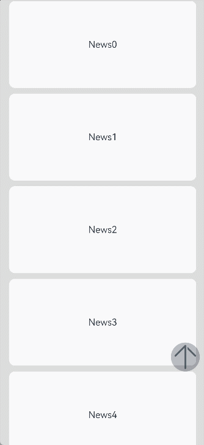

When the **List** component is initialized, you can use the **scroller** parameter to bind a [Scroller](../reference/apis-arkui/arkui-ts/ts-container-scroll.md#scroller) object to control the scrolling of the list. In this example of a news page list, the **scrollToIndex** API of the **Scroller** object is used to scroll the list to the list item with the specified index. This allows the user to return to the top of the list by clicking a specific button.

To start with, create a **Scroller** object **listScroller**.


```ts
private listScroller: Scroller = new Scroller();
```

Then, use **listScroller** to initialize the **scroller** parameter to bind it with the **List** component. Set **scrollToIndex** to **0**, meaning to return to the top of the list.


```ts
Stack({ alignContent: Alignment.Bottom }) {
  // Use listScroller to initialize the scroller parameter to bind it with the List component.
  List({ space: 20, scroller: this.listScroller }) {
    // ...
  }

  Button() {
    // ...
  }
  .onClick(() => {
    // Specify where e to jump when the specific button is clicked, which is the top of the list in this example.
    this.listScroller.scrollToIndex(0);
  })
}
```


## Handling Scroll Position Changes

Many applications need to listen for and respond to changes in list scroll positions. For example, with regard to a contacts list, if scrolling spans more than one group, the alphabetical index bar at one side of the list also needs to be updated to highlight the letter corresponding to the current group.

Another common example is a scrolling list working with a multi-level index bar, as in the case of a product category page in a shopping application.

**Figure 19** Alphabetical index bar's response to contacts list scrolling 


As shown above, when the contacts list scrolls from group A to B, the alphabetical index bar on the right also changes from A to B. This scenario can be implemented by listening for the **onScrollIndex** event of the **List** component. The alphabet index bar is implemented using the [AlphabetIndexer](../reference/apis-arkui/arkui-ts/ts-container-alphabet-indexer.md) component.

When the list scrolls, the **selectedIndex** value of the letter to highlight in the alphabet index bar is recalculated based on the **firstIndex** value of the item to which the list has scrolled. In the **AlphabetIndexer** component, the index of the highlighted item is set through the **selected** attribute. When the value of **selectedIndex** changes, the **AlphabetIndexer** component is re-rendered to highlight the corresponding letter.


```ts
const alphabets = ['#', 'A', 'B', 'C', 'D', 'E', 'F', 'G', 'H', 'I', 'J', 'K',
  'L', 'M', 'N', 'O', 'P', 'Q', 'R', 'S', 'T', 'U', 'V', 'W', 'X', 'Y', 'Z'];
@Entry
@Component
struct ContactsList {
  @State selectedIndex: number = 0;
  private listScroller: Scroller = new Scroller();

  build() {
    Stack({ alignContent: Alignment.End }) {
      List({ scroller: this.listScroller }) {}
      .onScrollIndex((firstIndex: number) => {
        // Recalculate the value of this.selectedIndex in the alphabetical index bar based on the index of the item to which the list has scrolled.
      })

      // AlphabetIndexer component
      AlphabetIndexer({ arrayValue: alphabets, selected: 0 })
        .selected(this.selectedIndex)
        .onSelect((index: number) => {
          this.listScroller.scrollToIndex(index);
        })
    }
  }
}
```

>**NOTE**
>
>During index calculation, each **ListItemGroup** component is taken as a whole and assigned an index, and the indexes of the list items within are not included in the calculation.


## Responding to Swipe on List Items

Swipe menus are common in many applications. For example, a messaging application generally provides a swipe-to-delete feature for its message list. This feature allows users to delete a message by swiping left on it and touching the delete button, as shown in the following figure. For details about how to add a badge to the profile picture of a list item, see [Adding a Badge to a List Item](#adding-a-badge-to-a-list-item).

**Figure 20** Swipe-to-delete feature 

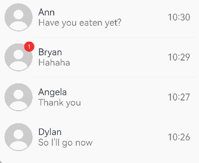

Swiping left or right on a list item can be implemented through the [swipeAction](../reference/apis-arkui/arkui-ts/ts-container-listitem.md#swipeaction9) attribute. In initialization of the **swipeAction** attribute, the **SwipeActionOptions** parameter is mandatory, wherein the **start** parameter indicates the component that appears from the start edge when the list item is swiped right, and the **end** parameter indicates the component that appears from the end edge when the list item is swiped left.

In the example of the message list, the **end** parameter is set to a custom delete button. In initialization of the **end** attribute, the index of the sliding list item is passed to the delete button. When the user touches the delete button, the data corresponding to the list item is deleted based on the index.

1. Build the component that appears from the end edge when the list item is swiped left.

    ```ts
    @Builder itemEnd(index: number) {
      // Build the component that appears from the end edge when the list item is swiped left.
      Button({ type: ButtonType.Circle }) {
        Image($r('app.media.ic_public_delete_filled'))
          .width(20)
          .height(20)
      }
      .onClick(() => {
        // this.messages is the list data source, which can be constructed as required. A specified data item can be deleted from the data source upon click.
        this.messages.splice(index, 1);
      })
    }
    ```

2. Binds the **swipeAction** attribute to a list item that can be swiped left.

    ```ts
    // When constructing a list, use ForEach to render list items based on the data source this.messages.
    ListItem() {
      // ...
    }
    .swipeAction({
      end: {
        // index is the index of the list item.
        builder: () => { this.itemEnd(index) },
      }
    }) // Set the swipe action.
    ```

## Adding a Badge to a List Item

A badge is an intuitive, unobtrusive visual indicator to draw attention and convey a specific message. For example, a badge can be displayed in the upper right corner of the contact's profile picture to indicate that there is a new message from that contact, as shown in the following figure.

  **Figure 21** Adding a badge to a list item 

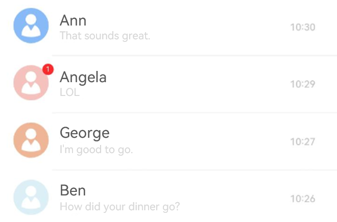

To add a badge, use the [Badge](../reference/apis-arkui/arkui-ts/ts-container-badge.md) component in **ListItem**. The **Badge** component is a container that can be attached to another component for tagging.

In this example, when implementing the **Image** component for presenting the profile picture of a list item, add it to **Badge** as a child component.

In the **Badge** component, the **count** and **position** parameters are used to set the number of notifications and the position to display the badge, respectively. You can also use the **style** parameter to spruce up the badge.


```ts
ListItem() {
  Badge({
    count: 1,
    position: BadgePosition.RightTop,
    style: { badgeSize: 16, badgeColor: '#FA2A2D' }
  }) {
    // The Image component implements the contact profile picture.
    // ...
  }
}
```


## Implementing Pull-Down-to-Refresh and Pull-Up-to-Load

The pull-down-to-refresh and pull-up-to-load features are widely used in mobile applications, such as news applications. In effect, the implementation of these two features follows the same process: (1) As response to a [touch event](../reference/apis-arkui/arkui-ts/ts-universal-events-touch.md), a refresh or load view is displayed at the top or bottom of the page; (2) when the refresh or load is complete, the refresh or load view is hidden.

The following describes the implementation of the pull-and-refresh feature:

1. Listen for the finger press event and record the value of the initial position.

2. Listen for the finger movement event, and record and calculate the difference between the value of the current position and the initial value. If the difference is greater than 0, the finger moves downward. Set the maximum value for the movement.

3. Listen for the finger lift event. If the movement reaches the maximum value, trigger data loading and display the refresh view. After the loading is complete, hide the view.

> **NOTE**
>
> To implement the pull-down-to-refresh feature, you are advised to use the [Refresh](../reference/apis-arkui/arkui-ts/ts-container-refresh.md) component.

<!--RP1--><!--RP1End-->

<!--Del-->
  <!--DelEnd-->


## Editing a List

The list editing mode is frequently used in various scenarios, such as to-do list management, file management, and note management. In editing mode, adding and deleting list items are the most basic functions. The core is to add and delete data in the data set corresponding to the list items.

The following uses to-do list management as an example to describe how to quickly add and delete list items.


### Adding a List Item

As shown below, when a user touches **Add**, a page is displayed for the user to set options for the new list item. After the user touches **OK**, the corresponding item is added to the list.

  **Figure 22** Adding a to-do task 

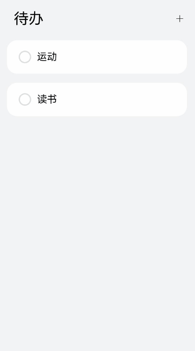

The process of implementing the addition feature is as follows:

1. Define the list item data structure. In this example, a to-do data structure is defined.

   ```ts
   //ToDo.ets
   import { util } from '@kit.ArkTS';

   export class ToDo {
     key: string = util.generateRandomUUID(true);
     name: string;

     constructor(name: string) {
       this.name = name;
     }
   }
   ```

2. Build the overall list layout and list items.

   ```ts
   //ToDoListItem.ets
   import { ToDo } from './ToDo';
   @Component
   export struct ToDoListItem {
     @Link isEditMode: boolean;
     @Link selectedItems: ToDo[];
     private toDoItem: ToDo = new ToDo("");

     build() {
      Flex({ justifyContent: FlexAlign.SpaceBetween, alignItems: ItemAlign.Center }) {
        // ...
      }
      .width('100%')
      .height(80)
      // .padding(): Set this parameter based on the use case.
      .borderRadius(24)
      // .linearGradient(): Set this parameter based on the use case.
      .gesture(
        GestureGroup(GestureMode.Exclusive,
        LongPressGesture()
          .onAction(() => {
            // ...
          })
        )
      )
     }
   }
   ```

3. Initialize the to-do list data and available items, and build the list layout and list items.

   ```ts
   //ToDoList.ets
   import { ToDo } from './ToDo';
   import { ToDoListItem } from './ToDoListItem';
   
   @Entry
   @Component
   struct ToDoList {
     @State toDoData: ToDo[] = [];
     @Watch('onEditModeChange') @State isEditMode: boolean = false;
     @State selectedItems: ToDo[] = [];
    private availableThings: string[] = ['Reading', 'Fitness', 'Travel', 'Music', 'Movie', 'Singing'];
   
     onEditModeChange() {
       if (!this.isEditMode) {
         this.selectedItems = [];
       }
    }
   
     build() {
       Column() {
         Row() {
           if (this.isEditMode) {
             Text('X')
               .fontSize(20)
               .onClick(() => {
                 this.isEditMode = false;
               })
               .margin({ left: 20, right: 20 })
           } else {
             Text('To-Do')
               .fontSize(36)
               .margin({ left: 40 })
             Blank()
             Text('+') // Provide an entry for adding a list item, that is, add a click event for the add button.
               .onClick(() => {
                 this.getUIContext().showTextPickerDialog({
                   range: this.availableThings,
                   onAccept: (value: TextPickerResult) => {
                     let arr = Array.isArray(value.index) ? value.index : [value.index];
                     for (let i = 0; i < arr.length; i++) {
                       this.toDoData.push(new ToDo(this.availableThings[arr[i]])); // Add to-do list items (available items).
                     }
                   },
                 })
               })
           }
           List({ space: 10 }) {
             ForEach(this.toDoData, (toDoItem: ToDo) => {
               ListItem() {
                 // Place each item of toDoData into the list item in the form of model.
                 ToDoListItem({
                   isEditMode: this.isEditMode,
                   toDoItem: toDoItem,
                   selectedItems: this.selectedItems })
               }
             }, (toDoItem: ToDo) => toDoItem.key.toString())
           }
         }
       }
     }
   }
   ```


### Deleting a List Item

As shown below, when the user long presses a list item to enter the deletion mode, a page is displayed for the user to delete the list item. After the user selects the list item and touches the delete button, the list item is deleted.

  **Figure 23** Deleting a to-do task 

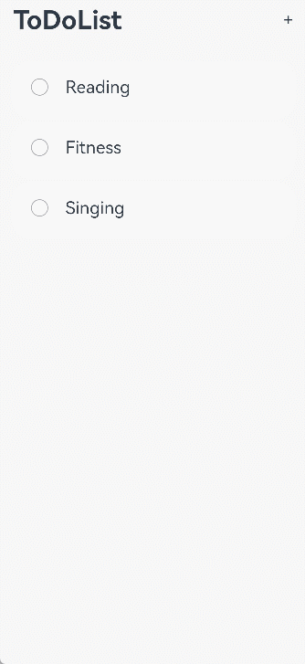

The process of implementing the deletion feature is as follows:

1. Generally, the deletion feature is available only after the list enters the editing mode. Therefore, the entry to the editing mode needs to be provided.
   In this example, by listening for the long press event of a list item, the list enters the editing mode when the user long presses a list item.

    ```ts
    // Structure reference
    export class ToDo {
      key: string = util.generateRandomUUID(true);
      name: string;
      toDoData: ToDo[] = [];

      constructor(name: string) {
        this.name = name;
      }
    }
    ```
    ```ts
    // Implementation reference
    Flex({ justifyContent: FlexAlign.SpaceBetween, alignItems: ItemAlign.Center }) {
      // ...
    }
    .gesture(
    GestureGroup(GestureMode.Exclusive,
      LongPressGesture()
        .onAction(() => {
          if (!this.isEditMode) {
            this.isEditMode = true; // Enter the editing mode.
          }
        })
      )
    )
    ```
   
2. Respond to the user's selection and record the list items to be deleted.
   In this to-do list example, the list items are selected or unselected according to the user's selection.

    ```ts
   // Structure reference
   import { util } from '@kit.ArkTS';
   export class ToDo {
     key: string = util.generateRandomUUID(true);
     name: string;
     toDoData: ToDo[] = [];

     constructor(name: string) {
       this.name = name;
     }
   }
    ```
    ```ts
    // Implementation reference
    if (this.isEditMode) {
      Checkbox()
        .onChange((isSelected) => {
          if (isSelected) {
            this.selectedItems.push(toDoList.toDoItem); // When an item is selected, it is added to the selectedItems array. Make adjustment based on actual scenarios.
          } else {
            let index = this.selectedItems.indexOf(toDoList.toDoItem);
            if (index !== -1) {
              this.selectedItems.splice(index, 1); // When an item is deselected, it is deleted from the selectedItems array.
            }
          }
        })
    }
    ```
   
3. Respond to the user's clicking the delete button and delete the corresponding items from the list.

    ```ts
    // Structure reference
    import { util } from '@kit.ArkTS';
    export class ToDo {
      key: string = util.generateRandomUUID(true);
      name: string;
      toDoData: ToDo[] = [];

      constructor(name: string) {
        this.name = name;
      }
    }
    ```
    ```ts
    // Implementation reference
    Button('Delete')
      .onClick(() => {
        // this.toDoData is the to-do list item, which can be constructed based on service requirements. After an item is clicked, the corresponding data is removed.
        let leftData = this.toDoData.filter((item) => {
          return !this.selectedItems.find((selectedItem) => selectedItem == item);
        })
        this.toDoData = leftData;
        this.isEditMode = false;
      })
    ```


## Handling a Long List

While [ForEach](../ui/state-management/arkts-rendering-control-foreach.md) is suitable for short lists, using it for long lists with a large number of items can significantly slow down page loading, as it loads all items at once. Therefore, for better list performance, use [LazyForEach](../ui/state-management/arkts-rendering-control-lazyforeach.md) instead to implement on-demand iterative data loading.

For details about the implementation, see the example in [LazyForEach: Lazy Data Loading](../ui/state-management/arkts-rendering-control-lazyforeach.md).

When the list is rendered in lazy loading mode, to improve the list scrolling experience and minimize white blocks during list scrolling, you can use the **cachedCount** parameter of the **List** component to set the number of cached list items. With lazy loading, only content outside the visible area up to the **cachedCount** limit will be preloaded, whereas non-lazy loading will load all content. For both lazy and non-lazy loading, only the items within the visible area plus the **cachedCount**-specified number of items outside the visible area are laid out.


```ts
List() {
  // ...
}.cachedCount(3)
```

The following uses a vertical list as an example:

- When **cachedCount** is set for the list, the system preloads and lays out the **cachedCount**-specified number of rows of list items both above and below the currently visible area of the list. When calculating the number of rows for list items, the system takes into account the number of rows from the list items within a list item group. If a list item group does not contain any list items, then the entire list item group is counted as one row.

- When a list is nested with **LazyForEach**, and within **LazyForEach** there is a list item group, **LazyForEach** will create **cachedCount**-specified number of list item groups both above and below the currently visible area of the list.

>**NOTE**
>
>1. A greater **cachedCount** value may result in higher CPU and memory overhead of the UI. Adjust the value by taking into account both the comprehensive performance and user experience.
>
>2. When a list uses data lazy loading, all list items except the list items in the display area and the cached list items are destroyed.


## Collapsing and Expanding

The collapsing and expanding of list items are widely used, often applied in scenarios such as displaying information lists and filling out forms.

  **Figure 24** Collapsing and expanding of list items


The process of implementing the collapsing and expanding effect of list items is as follows:

1. Define the list item data structure.

    ```ts
    import { curves } from '@kit.ArkUI';
    interface ItemInfo {
      index: number,
      name: string,
      label: ResourceStr,
      type?: string,
    }

    interface ItemGroupInfo extends ItemInfo {
      children: ItemInfo[]
    }
    ```

2. Construct a list structure.

    ```ts
    @State routes: ItemGroupInfo[] = [
      {
        index: 0,
        name: 'basicInfo',
        label: 'Basic personal information',
        children: [
          {
            index: 0,
            name: 'Nickname',
            label: 'xxxx',
            type: 'Text'
          },
          {
            index: 1,
            name: 'Profile picture',
            label: $r('sys.media.ohos_user_auth_icon_face'),
            type: 'Image'
          },
          {
            index: 2,
            name: 'Age',
            label: 'xxxx',
            type: 'Text'
          },
          {
            index: 3,
            name: 'Birthday',
            label: 'xxxxxxxxx',
            type: 'Text'
          },
          {
            index: 4,
            name: 'Gender',
            label: 'xxxxxxxx',
            type: 'Text'
          },
        ]
      },
      {
        index: 1,
        name: 'equipInfo',
        label: 'Device information',
        children: []
      },
      {
        index: 2,
        name: 'appInfo',
        label: 'App usage',
        children: []
      },
      {
        index: 3,
        name: 'uploadInfo',
        label: 'Data you actively upload',
        children: []
      },
      {
        index: 4,
        name: 'tradeInfo',
        label: 'Transactions & assets',
        children: []
      },
      {
        index: 5,
        name: 'otherInfo',
        label: 'Other materials',
        children: []
      },
    ];
    @State expandedItems: boolean[] = Array(this.routes.length).fill(false);
    @State selection: string | null = null;
    build() {
      Column() {
        // ...

        List({ space: 10 }) {
          ForEach(this.routes, (itemGroup: ItemGroupInfo) => {
            ListItemGroup({
              header: this.ListItemGroupHeader(itemGroup),
              style: ListItemGroupStyle.CARD,
            }) {
              if (this.expandedItems[itemGroup.index] && itemGroup.children) {
                ForEach(itemGroup.children, (item: ItemInfo) => {
                  ListItem({ style: ListItemStyle.CARD }) {
                    Row() {
                      Text(item.name)
                      Blank()
                      if (item.type === 'Image') {
                        Image(item.label)
                          .height(20)
                          .width(20)
                      } else {
                        Text(item.label)
                      }
                      Image($r('sys.media.ohos_ic_public_arrow_right'))
                        .fillColor($r('sys.color.ohos_id_color_fourth'))
                        .height(30)
                        .width(30)
                    }
                    .width("100%")
                  }
                  .width("100%")
                  .animation({ curve: curves.interpolatingSpring(0, 1, 528, 39) })
                })
              }
            }.clip(true)
          })
        }
        .width("100%")
      }
      .width('100%')
      .height('100%')
      .justifyContent(FlexAlign.Start)
      .backgroundColor($r('sys.color.ohos_id_color_sub_background'))
    }
    ```

3. Control whether each list item is expanded by changing the state of **ListItem**, and achieve the animation effects during the expanding and collapsing process through **animation** and **animateTo**.

    ```ts
    @Builder
    ListItemGroupHeader(itemGroup: ItemGroupInfo) {
      Row() {
        Text(itemGroup.label)
        Blank()
        Image($r('sys.media.ohos_ic_public_arrow_down'))
          .fillColor($r('sys.color.ohos_id_color_fourth'))
          .height(30)
          .width(30)
          .rotate({ angle: !!itemGroup.children.length ? (this.expandedItems[itemGroup.index] ? 180 : 0) : 180 })
          .animation({ curve: curves.interpolatingSpring(0, 1, 228, 22) })
      }
      .width("100%")
      .padding(10)
      .animation({ curve: curves.interpolatingSpring(0, 1, 528, 39) })
      .onClick(() => {
        if (itemGroup.children.length) {
          this.getUIContext()?.animateTo({ curve: curves.interpolatingSpring(0, 1, 528, 39) }, () => {
            this.expandedItems[itemGroup.index] = !this.expandedItems[itemGroup.index];
          })
        }
      })
    }
    ```

## Switching the Layout Direction

In certain scenarios, you may want a list to automatically scroll upward when new data is inserted at the bottom of the list to reveal the newly added items. Typical use cases include live-stream comments and instant messaging applications. By default, when the **List** component is using its normal layout, appending items to the bottom maintains the current content position without automatic scrolling. This behavior can be modified by switching the layout direction to achieve the desired effect.

  **Figure 25** Real-time message scrolling

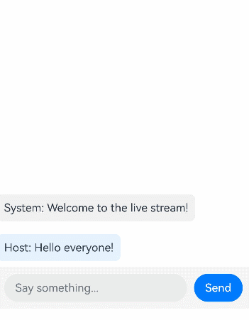

1. Define the list item data structure.

    ```ts
    interface Message {
      id: number
      content: string
      sender: string
    }
    ```

2. Construct a list structure and set **stackFromEnd** to **true**. In this way, the list content automatically scrolls upward to reveal newly inserted data items.

    ```ts
    @State messages: Message[] = [
        { id: 1, content: 'Welcome to the live stream!', sender: 'System' },
        { id: 2, content: 'Hello everyone!', sender: 'Host' }
    ];
    build() {
      Column() {
        List({ space: 10 }) {
          ForEach(this.messages, (item: Message) => {
            ListItem() {
              this.MessageItem(item)
            }
          }, (item: Message) => item.id.toString())
        }
        .stackFromEnd(true)
        .layoutWeight(1)
        .alignListItem(ListItemAlign.Center)
        // ...
      }
      .width('100%')
      .height('100%')
    }
    ```

## Handling Swipe Release Events

Since API version 20, scrollable components ([Grid](../reference/apis-arkui/arkui-ts/ts-container-grid.md), [List](../reference/apis-arkui/arkui-ts/ts-container-list.md), [Scroll](../reference/apis-arkui/arkui-ts/ts-container-scroll.md), and [WaterFlow](../reference/apis-arkui/arkui-ts/ts-container-waterflow.md)) support swipe release event callbacks. These callbacks are triggered when the user lifts their finger from the screen, reporting the instantaneous swipe velocity. You can use the callbacks to implement custom scroll positioning effects, such as snap scrolling for short news items and free scrolling for long articles.


1. Define the news item data structure.

    ```ts
    // Structure reference
    class news {
      public id: string;
      public title: string;
      public content: string;
      public type: string;

      constructor(id: string, title: string, content: string, type: string) {
        this.id = id;
        this.title = title;
        this.content = content;
        this.type = type;
      }
    }
    ```

2. Construct news data, using **type** to distinguish between news item types.

    ```ts
    // Implementation reference
    @State newsData: Array<news> = [
      new news('1', 'Headline 1', 'Short news content for quick browsing', 'short'),
      new news('2', 'Headline 2', 'Another brief news item', 'short'),
      new news('3', 'Headline 3', 'Long-form article with detailed content. '.repeat(20), 'long'),
      new news('4', 'Headline 4', 'Quick news update', 'short'),
      new news('5', 'Headline 5', 'In-depth analysis piece. '.repeat(15), 'long')
    ];
    ```

3. Implement the swipe release event handling (**onWillStopDragging**) and news processing logic:
   - The **onWillStopDragging** callback reports the instantaneous swipe velocity when the user lifts their finger, with direction detection (positive value for upward swipes, negative for downward swipes).

     ```ts
     // Implementation reference
     onWillStopDragging((velocity: number) => {
       if (velocity < 0) {
         // Handle downward swipes.
       } else {
         // Handle upward swipes.
       }
     })
     ```

   - The current item's position information is obtained through the **getItemRect** API.

     ```ts
     // Implementation reference
     let rect = this.scrollerForList.getItemRect(this.currentIndex);
     ```
     
   - For short news items, the list directly snaps to adjacent items.
     
     ```ts
     // Implementation reference
     if (velocity > 10) {
       this.scrollerForList.scrollToIndex(this.currentIndex, true, ScrollAlign.START);
     } else if (velocity < -10) {
       this.scrollerForList.scrollToIndex(this.currentIndex + 1, true, ScrollAlign.START);
     }
     ```

   - For long news articles, the system calculates the remaining visible area to determine the optimal scroll end point.
   
     ```ts
     let rect = this.scrollerForList.getItemRect(this.currentIndex);
     if (velocity < -30) {
       if (rect) {
         // Calculate the remaining visible portion of the current item.
         let leftRect = rect.y + rect.height;
         // Determine the scroll end point.
         let mainPosition = -velocity * DEFAULT_FRICTION / FRICTION_SCALE;
         if (leftRect + mainPosition > 0.75 * this.listHeight) {
           this.scrollerForList.scrollToIndex(this.currentIndex + 1, true, ScrollAlign.START);
           return;
         } else if (leftRect + mainPosition < 0.25 * this.listHeight) {
           this.scrollerForList.scrollToIndex(this.currentIndex, true, ScrollAlign.END,
             { extraOffset: LengthMetrics.vp(this.listHeight * 0.3) })
           return;
         }
       }
     } else if (velocity > 30) {
       let leftRect = rect?.y + rect?.height;
       let mainPosition = velocity * DEFAULT_FRICTION / FRICTION_SCALE;
       if (leftRect + mainPosition > 0.75 * this.listHeight) {
         this.scrollerForList.scrollToIndex(this.currentIndex, true, ScrollAlign.START);
         return;
       }
     }
     ```

<!--RP2--><!--RP2End-->
