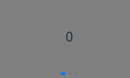
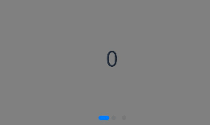
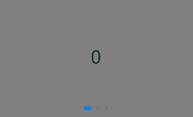
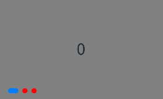
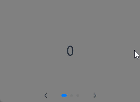
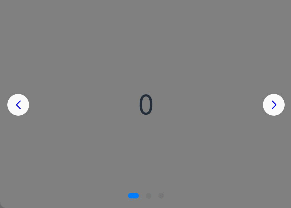
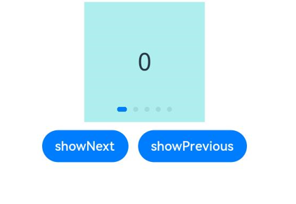
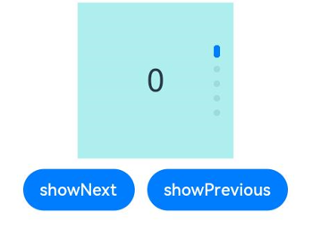
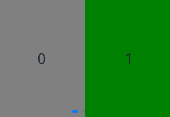
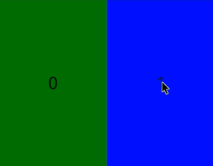

# Creating a Swiper (Swiper)
<!--Kit: ArkUI-->
<!--Subsystem: ArkUI-->
<!--Owner: @Hu_ZeQi-->
<!--Designer: @Hu_ZeQi-->
<!--Tester: @gouyuanyuan-->
<!--Adviser: @Brilliantry_Rui-->


The [Swiper](../reference/apis-arkui/arkui-ts/ts-container-swiper.md) component is a container that is able to display child components in looping mode. It is typically used in scenarios such as display of recommended content on the home page.

The **Swiper** component provides a preloading mechanism, which you can use to improve the swipe experience in complex scenarios. This mechanism allows for prebuilding and prerendering components when the main thread is idle. <!--Del-->For details, see [High-Performance Swiper Development](../performance/swiper_optimization.md).<!--DelEnd-->


## Layout and Constraints

The **Swiper** component follows its own size settings if they are configured. If the component does not have its own size settings configured, it follows the size of its parent component when the [prevMargin](../reference/apis-arkui/arkui-ts/ts-container-swiper.md#prevmargin10) or [nextMargin](../reference/apis-arkui/arkui-ts/ts-container-swiper.md#nextmargin10) attribute is set, or adapts its size to its child components otherwise.


## Loop Playback

The [loop](../reference/apis-arkui/arkui-ts/ts-container-swiper.md#loop) attribute sets whether to enable loop playback. The default value is **true**.

When **loop** is set to **true**, the user can switch to the previous or next page when they are on the first or last page. When **loop** is set to **false**, this behavior is disabled.

- Example of setting **loop** to **true**:

<!-- @[loop_with_true](https://gitcode.com/openharmony/applications_app_samples/blob/master/code/DocsSample/ArkUISample/ScrollableComponent/entry/src/main/ets/pages/swiper/SwiperLoop.ets) -->   

``` TypeScript
Swiper() {
  Text('0')
    .width('90%')
    .height('100%')
    .backgroundColor(Color.Gray)
    .textAlign(TextAlign.Center)
    .fontSize(30)

  Text('1')
    .width('90%')
    .height('100%')
    .backgroundColor(Color.Green)
    .textAlign(TextAlign.Center)
    .fontSize(30)

  Text('2')
    .width('90%')
    .height('100%')
    .backgroundColor(Color.Pink)
    .textAlign(TextAlign.Center)
    .fontSize(30)
}
// ...
.loop(true)
```



- Example of setting **loop** to **false**:

<!-- @[loop_with_false](https://gitcode.com/openharmony/applications_app_samples/blob/master/code/DocsSample/ArkUISample/ScrollableComponent/entry/src/main/ets/pages/swiper/SwiperLoop.ets) -->

``` TypeScript
  Swiper() {
    // ···
  }
// ···
  .loop(false)
```




## Automatic Playback

The [autoPlay](../reference/apis-arkui/arkui-ts/ts-container-swiper.md#autoplay) attribute sets whether to enable automatic playback for child component switching. Its default value is **false**.

When **autoPlay** is set to **true**, automatic playback is enabled for child component switching. The playback interval is specified by the **interval** attribute, which is **3000** by default, in milliseconds.

<!-- @[autoplay_loop_true](https://gitcode.com/openharmony/applications_app_samples/blob/master/code/DocsSample/ArkUISample/ScrollableComponent/entry/src/main/ets/pages/swiper/SwiperAutoPlay.ets) -->

``` TypeScript
  Swiper() {
    // ···
  }
// ···
  .loop(true)
  .autoPlay(true)
  .interval(1000)
```


## Navigation Indicator

The **Swiper** component comes with default indicator and arrow styles, with the indicators centered at the bottom and arrows hidden by default. You can customize the position and style of the indicator using the [indicator](../reference/apis-arkui/arkui-ts/ts-container-swiper.md#indicator) attribute.

With the **indicator** attribute, you can set the position of the indicator relative to the edges of the **Swiper** component, in addition to the size, color, and mask of each indicator as well as the color of the selected indicator.

- Example of using the navigation indicator in its default style:

<!-- @[default_navigation_point_style](https://gitcode.com/openharmony/applications_app_samples/blob/master/code/DocsSample/ArkUISample/ScrollableComponent/entry/src/main/ets/pages/swiper/SwiperIndicatorStyle.ets) -->

``` TypeScript
Swiper() {
  Text('0')
    .width('90%')
    .height('100%')
    .backgroundColor(Color.Gray)
    .textAlign(TextAlign.Center)
    .fontSize(30)

  Text('1')
    .width('90%')
    .height('100%')
    .backgroundColor(Color.Green)
    .textAlign(TextAlign.Center)
    .fontSize(30)

  Text('2')
    .width('90%')
    .height('100%')
    .backgroundColor(Color.Pink)
    .textAlign(TextAlign.Center)
    .fontSize(30)
}
```



- Example of customizing the style of the navigation indicator

The selected navigation indicator has a width of 30 vp and a height of 15 vp with blue color, while unselected indicators have a diameter of 15 vp with red color.

<!-- @[customize_navigation_point_styles](https://gitcode.com/openharmony/applications_app_samples/blob/master/code/DocsSample/ArkUISample/ScrollableComponent/entry/src/main/ets/pages/swiper/SwiperIndicatorStyle.ets) -->

``` TypeScript
  Swiper() {
    // ···
  }
// ···
  .indicator(
    Indicator.dot()
      .left(0)
      .itemWidth(15)
      .itemHeight(15)
      .selectedItemWidth(30)
      .selectedItemHeight(15)
      .color(Color.Red)
      .selectedColor(Color.Blue)
  )
```



You can set the [displayArrow](../reference/apis-arkui/arkui-ts/ts-container-swiper.md#displayarrow10) attribute of **Swiper** to control the size, position, color, and background of navigation point arrows, and whether to display arrows on mouse hover.

- Example of using the navigation point arrows in the default style:

<!-- @[default_arrow_style](https://gitcode.com/openharmony/applications_app_samples/blob/master/code/DocsSample/ArkUISample/ScrollableComponent/entry/src/main/ets/pages/swiper/SwiperIndicatorStyle.ets) -->

``` TypeScript
  Swiper() {
    // ···
  }
// ···
  .displayArrow(true, false)
```



- Example of customizing the style of navigation point arrows:

In this example, the arrows are displayed on both sides of the component, with a size of 18 vp and a color of blue.

<!-- @[customize_the_arrow_style](https://gitcode.com/openharmony/applications_app_samples/blob/master/code/DocsSample/ArkUISample/ScrollableComponent/entry/src/main/ets/pages/swiper/SwiperIndicatorStyle.ets) -->

``` TypeScript
  Swiper() {
    // ···
  }
// ···
  .displayArrow({
    showBackground: true,
    isSidebarMiddle: true,
    backgroundSize: 24,
    backgroundColor: Color.White,
    arrowSize: 18,
    arrowColor: Color.Blue
  }, false)
```



## Page Switching Mode

The **Swiper** component supports three page switching modes: swiping with fingers, touching navigation points, and using a controller. The following example shows how to switch between pages using a controller.

<!-- @[switch_pages](https://gitcode.com/openharmony/applications_app_samples/blob/master/code/DocsSample/ArkUISample/ScrollableComponent/entry/src/main/ets/pages/swiper/SwiperPageSwitchMethod.ets) -->

``` TypeScript

// To use it as the entry of a page, uncomment @Entry and delete the export keyword.
// @Entry
@Component
export struct SwiperPageSwitchMethod {
  private swiperBackgroundColors: Color[] = [Color.Blue, Color.Gray, Color.Green, Color.Orange, Color.Brown,
    Color.Pink, Color.Red, Color.Yellow];
  private swiperAnimationMode: (SwiperAnimationMode | boolean | undefined)[] = [undefined, true, false,
    SwiperAnimationMode.NO_ANIMATION, SwiperAnimationMode.DEFAULT_ANIMATION, SwiperAnimationMode.FAST_ANIMATION];
  private swiperController: SwiperController = new SwiperController();
  private animationModeIndex: number = 0;
  private animationMode: (SwiperAnimationMode | boolean | undefined) = undefined;
  @State animationModeStr: string = 'undefined';
  @State targetIndex: number = 0;

  aboutToAppear(): void {
    this.toSwiperAnimationModeStr();
  }

  build() {
    // ...
          Column({ space: 5 }) {
            Swiper(this.swiperController) {
              ForEach(this.swiperBackgroundColors, (backgroundColor: Color, index: number) => {
                Text(index.toString())
                  .width(250)
                  .height(250)
                  .backgroundColor(backgroundColor)
                  .textAlign(TextAlign.Center)
                  .fontSize(30)
              })
            }
            // ...
            .indicator(true)

            Row({ space: 12 }) {
              Button('showNext')
                .onClick(() => {
                  this.swiperController.showNext(); // Switch to the next page using the controller.
                })
              Button('showPrevious')
                .onClick(() => {
                  this.swiperController.showPrevious(); // Switch to the previous page using the controller.
                })
            }.margin(5)

            Row({ space: 12 }) {
              Text('Index:')
              Button(this.targetIndex.toString())
                .onClick(() => {
                  this.targetIndex = (this.targetIndex + 1) % this.swiperBackgroundColors.length;
                })
            }.margin(5)
            Row({ space: 12 }) {
              Text('AnimationMode:')
              Button(this.animationModeStr)
                .onClick(() => {
                  this.animationModeIndex = (this.animationModeIndex + 1) % this.swiperAnimationMode.length;
                  this.toSwiperAnimationModeStr();
                })
            }.margin(5)

            Row({ space: 12 }) {
              Button('changeIndex(' + this.targetIndex + ', ' + this.animationModeStr + ')')
                .onClick(() => {
                  this.swiperController.changeIndex(this.targetIndex, this.animationMode); // Switch to the specified page using the controller.
                })
            }.margin(5)
          }
          // ...
  }

  private toSwiperAnimationModeStr() {
    this.animationMode = this.swiperAnimationMode[this.animationModeIndex];
    if ((this.animationMode === true) || (this.animationMode === false)) {
      this.animationModeStr = '' + this.animationMode;
    } else if ((this.animationMode === SwiperAnimationMode.NO_ANIMATION) ||
      (this.animationMode === SwiperAnimationMode.DEFAULT_ANIMATION) ||
      (this.animationMode === SwiperAnimationMode.FAST_ANIMATION)) {
      this.animationModeStr = SwiperAnimationMode[this.animationMode];
    } else {
      this.animationModeStr = 'undefined';
    }
  }
}
```


## Playback Direction

The **Swiper** component supports both horizontal and vertical swiping, controlled primarily by the [vertical](../reference/apis-arkui/arkui-ts/ts-container-swiper.md#vertical) attribute.

When **vertical** is set to **true**, vertical swiping is used. When **vertical** is set to **false**, horizontal swiping is used. The default value of **vertical** is **false**.


- Example of using horizontal swiping:

<!-- @[rotate_horizontally](https://gitcode.com/openharmony/applications_app_samples/blob/master/code/DocsSample/ArkUISample/ScrollableComponent/entry/src/main/ets/pages/swiper/SwiperDirection.ets) -->

``` TypeScript
Swiper(
// ···
) {
// ···
}
// ···
.indicator(true)
.vertical(false)
```





- Example of using vertical swiping:

<!-- @[rotate_vertically](https://gitcode.com/openharmony/applications_app_samples/blob/master/code/DocsSample/ArkUISample/ScrollableComponent/entry/src/main/ets/pages/swiper/SwiperDirection.ets) -->

``` TypeScript
Swiper(
// ···
) {
// ···
}
// ···
.indicator(true)
.vertical(true)
```





## Child Components Per Page

You can set the number of child components per page for the **Swiper** component through its [displayCount](../reference/apis-arkui/arkui-ts/ts-container-swiper.md#displaycount8) attribute.

<!-- @[each_page_displays_multiple_subpages](https://gitcode.com/openharmony/applications_app_samples/blob/master/code/DocsSample/ArkUISample/ScrollableComponent/entry/src/main/ets/pages/swiper/SwiperMultiPage.ets) -->  

``` TypeScript
Swiper() {
  Text('0')
    .width(250)
    .height(250)
    .backgroundColor(Color.Gray)
    .textAlign(TextAlign.Center)
    .fontSize(30)
  Text('1')
    .width(250)
    .height(250)
    .backgroundColor(Color.Green)
    .textAlign(TextAlign.Center)
    .fontSize(30)
  Text('2')
    .width(250)
    .height(250)
    .backgroundColor(Color.Pink)
    .textAlign(TextAlign.Center)
    .fontSize(30)
  Text('3')
    .width(250)
    .height(250)
    .backgroundColor(Color.Yellow)
    .textAlign(TextAlign.Center)
    .fontSize(30)
}
// ...
.indicator(true)
.displayCount(2)
```



## Customizing Transition Animation

Use the [customContentTransition](../reference/apis-arkui/arkui-ts/ts-container-swiper.md#customcontenttransition12) attribute to set a custom transition animation for **Swiper**. Define the animation by adjusting opacity, scale, translation, and rendering layer for all pages within the viewport frame by frame in the callback.

<!-- @[customize_transition_animations](https://gitcode.com/openharmony/applications_app_samples/blob/master/code/DocsSample/ArkUISample/ScrollableComponent/entry/src/main/ets/pages/swiper/SwiperCustomAnimation.ets) -->

``` TypeScript

// To use it as the entry of a page, uncomment @Entry and delete the export keyword.
// @Entry
@Component
export struct SwiperCustomAnimation {
  private DISPLAY_COUNT: number = 2;
  private MIN_SCALE: number = 0.75;
  @State backgroundColors: Color[] = [Color.Green, Color.Blue, Color.Yellow, Color.Pink, Color.Gray, Color.Orange];
  @State opacityList: number[] = [];
  @State scaleList: number[] = [];
  @State translateList: number[] = [];
  @State zIndexList: number[] = [];

  aboutToAppear(): void {
    for (let i = 0; i < this.backgroundColors.length; i++) {
      this.opacityList.push(1.0);
      this.scaleList.push(1.0);
      this.translateList.push(0.0);
      this.zIndexList.push(0);
    }
  }

  build() {
    // ...
      Column({ space: 12 }) {
        // ...
          Swiper() {
            ForEach(this.backgroundColors, (backgroundColor: Color, index: number) => {
              Text(index.toString())
                .width('100%')
                .height('100%')
                .fontSize(50)
                .textAlign(TextAlign.Center)
                .backgroundColor(backgroundColor)
                .opacity(this.opacityList[index])
                .scale({ x: this.scaleList[index], y: this.scaleList[index] })
                .translate({ x: this.translateList[index] })
                .zIndex(this.zIndexList[index])
            })
          }
          .height(300)
          .indicator(false)
          .displayCount(this.DISPLAY_COUNT, true)
          .customContentTransition({
            timeout: 1000,
            transition: (proxy: SwiperContentTransitionProxy) => {
              if (proxy.position <= proxy.index % this.DISPLAY_COUNT ||
                proxy.position >= this.DISPLAY_COUNT + proxy.index % this.DISPLAY_COUNT) {
                // When a group of pages is completely scrolled out of the viewport, reset the attribute values.
                this.opacityList[proxy.index] = 1.0;
                this.scaleList[proxy.index] = 1.0;
                this.translateList[proxy.index] = 0.0;
                this.zIndexList[proxy.index] = 0;
              } else {
                // When a group of pages is not scrolled out of the viewport, adjust the attribute values frame by frame for the left and right pages in the group based on the position.
                if (proxy.index % this.DISPLAY_COUNT === 0) {
                  this.opacityList[proxy.index] = 1 - proxy.position / this.DISPLAY_COUNT;
                  this.scaleList[proxy.index] =
                    this.MIN_SCALE + (1 - this.MIN_SCALE) * (1 - proxy.position / this.DISPLAY_COUNT);
                  this.translateList[proxy.index] = -proxy.position * proxy.mainAxisLength +
                    (1 - this.scaleList[proxy.index]) * proxy.mainAxisLength / 2.0;
                } else {
                  this.opacityList[proxy.index] = 1 - (proxy.position - 1) / this.DISPLAY_COUNT;
                  this.scaleList[proxy.index] =
                    this.MIN_SCALE + (1 - this.MIN_SCALE) * (1 - (proxy.position - 1) / this.DISPLAY_COUNT);
                  this.translateList[proxy.index] = -(proxy.position - 1) * proxy.mainAxisLength -
                    (1 - this.scaleList[proxy.index]) * proxy.mainAxisLength / 2.0;
                }
                this.zIndexList[proxy.index] = -1;
              }
            }
          })
          // ...
      }
      .width('100%')
      // ...
  }
}
```



## Synchronizing the Swiper with the Tabs

Since API version 18, when the selected item in the **Swiper** changes, the new index is passed to the [onSelected](../reference/apis-arkui/arkui-ts/ts-container-swiper.md#onselected18) callback. You can then call [tabsController.changeIndex(index)](../reference/apis-arkui/arkui-ts/ts-container-tabs.md#changeindex) to synchronize the **Tabs** component.

<!-- @[swiper_tabs_linkage](https://gitcode.com/openharmony/applications_app_samples/blob/master/code/DocsSample/ArkUISample/ScrollableComponent/entry/src/main/ets/pages/swiper/SwiperAndTabsLinkage.ets) -->

``` TypeScript
// xxx.ets
class MyDataSource implements IDataSource {
  private list: number[] = [];

  constructor(list: number[]) {
    this.list = list;
  }

  totalCount(): number {
    return this.list.length;
  }

  getData(index: number): number {
    return this.list[index];
  }

  registerDataChangeListener(listener: DataChangeListener): void {
  }

  unregisterDataChangeListener() {
  }
}

// To use it as the entry of a page, uncomment @Entry and delete the export keyword.
// @Entry
@Component
export struct SwiperAndTabsLinkage {
  @State fontColor: string = '#182431';
  @State selectedFontColor: string = '#007DFF';
  @State currentIndex: number = 0;
  private list: number[] = [];
  private tabsController: TabsController = new TabsController();
  private swiperController: SwiperController = new SwiperController();
  private swiperData: MyDataSource = new MyDataSource([]);
  private context = this.getUIContext().getHostContext() as common.UIAbilityContext;

  aboutToAppear(): void {
    for (let i = 0; i <= 9; i++) {
      this.list.push(i);
    }
    this.swiperData = new MyDataSource(this.list);
  }

  @Builder tabBuilder(index: number, name: string) {
    Column() {
      Text(name)
        .fontColor(this.currentIndex === index ? this.selectedFontColor : this.fontColor)
        .fontSize(16)
        .fontWeight(this.currentIndex === index ? 500 : 400)
        .lineHeight(22)
        .margin({ top: 17, bottom: 7 })
      Divider()
        .strokeWidth(2)
        .color('#007DFF')
        .opacity(this.currentIndex === index ? 1 : 0)
    }.width('20%')
  }

  build() {
    // ...
          Column() {
            Tabs({ barPosition: BarPosition.Start, controller: this.tabsController }) {
              ForEach(this.list, (index: number) =>{
                // Configure a resource whose name is 'swiper_text1' and value is a non-empty string in the resources\base\element\string.json file.
                TabContent().tabBar(this.tabBuilder(index,
                  this.context.resourceManager.getStringByNameSync('swiper_text1') + this.list[index]))
              })
            }
            .onTabBarClick((index: number) => {
              this.currentIndex = index;
              this.swiperController.changeIndex(index, true);
            })
            .barMode(BarMode.Scrollable)
            .backgroundColor('#F1F3F5')
            .height(56)
            .width('100%')

            Swiper(this.swiperController) {
              LazyForEach(this.swiperData, (item: number) => {
                Text(item.toString())
                  .onAppear(()=>{
                    console.info('onAppear ' + item.toString());
                  })
                  .onDisAppear(()=>{
                    console.info('onDisAppear ' + item.toString());
                  })
                  .width('100%')
                  .height('40%')
                  .backgroundColor(0xAFEEEE)
                  .textAlign(TextAlign.Center)
                  .fontSize(30)
              }, (item: number) => item.toString())
            }
            .loop(false)
            .onSelected((index: number) => {
              console.info('onSelected:' + index);
              this.currentIndex = index;
              this.tabsController.changeIndex(index);
            })
          }
          // ...
  }
}
```


## Setting the Spacing Between Dots

Since API version 19, use the [space](../reference/apis-arkui/arkui-ts/ts-container-swiper.md#space19) attribute of **DotIndicator** to set the spacing between dots.

<!-- @[dot_indicator_space](https://gitcode.com/openharmony/applications_app_samples/blob/master/code/DocsSample/ArkUISample/ScrollableComponent/entry/src/main/ets/pages/swiper/SwiperIgnoreComponentSize.ets) -->

``` TypeScript
Swiper(
  // ···
) {
  // ···
}
.indicator(new DotIndicator()
  .space(this.space)
  // ···
)
```

## Ignoring the Navigation Indicator Component Size

After the [bottom](../reference/apis-arkui/arkui-ts/ts-container-swiper.md#bottom) of the navigation point is set to **0**, there is still a certain spacing between the bottom of the navigation point and the bottom of the **Swiper**. To eliminate this spacing, you can call the [bottom](../reference/apis-arkui/arkui-ts/ts-container-swiper.md#bottom19)(bottom, ignoreSize) attribute from API version 19. Set **ignoreSize** to **true** to ignore the navigation indicator component size.

- Ignoring the dot navigation indicator component size:

<!-- @[dot_indicator_bottom](https://gitcode.com/openharmony/applications_app_samples/blob/master/code/DocsSample/ArkUISample/ScrollableComponent/entry/src/main/ets/pages/swiper/SwiperIgnoreComponentSize.ets) -->

``` TypeScript
Swiper(
  // ···
) {
  // ···
}
.indicator(new DotIndicator()
  // ···
  .bottom(LengthMetrics.vp(0), this.ignoreSize) // true
  // ···
)
```

- Ignoring the digit navigation indicator component size:

<!-- @[digit_indicator](https://gitcode.com/openharmony/applications_app_samples/blob/master/code/DocsSample/ArkUISample/ScrollableComponent/entry/src/main/ets/pages/swiper/SwiperDigitIndicatorIgnoreComponentSize.ets) -->

``` TypeScript
Swiper(
  // ···
) {
  // ···
}
.indicator(new DigitIndicator()
  .bottom(LengthMetrics.vp(0), true)
)
```

Complete sample code for setting the dot spacing and ignoring the component size for a dot navigation indicator:

<!-- @[dot_indicator](https://gitcode.com/openharmony/applications_app_samples/blob/master/code/DocsSample/ArkUISample/ScrollableComponent/entry/src/main/ets/pages/swiper/SwiperIgnoreComponentSize.ets) -->

``` TypeScript
import { LengthMetrics } from '@kit.ArkUI';
// ...


class MyDataSource implements IDataSource {
  private list: number[] = [];

  constructor(list: number[]) {
    this.list = list;
  }

  totalCount(): number {
    return this.list.length;
  }

  getData(index: number): number {
    return this.list[index];
  }

  registerDataChangeListener(listener: DataChangeListener): void {
  }

  unregisterDataChangeListener() {
  }
}

// To use it as the entry of a page, uncomment @Entry and delete the export keyword.
// @Entry
@Component
export struct SwiperIgnoreComponentSize {

  @State space: LengthMetrics = LengthMetrics.vp(0);
  @State spacePool: LengthMetrics[] = [LengthMetrics.vp(0), LengthMetrics.px(3), LengthMetrics.vp(10)];
  @State spaceIndex: number = 0;

  @State ignoreSize: boolean = false;
  @State ignoreSizePool: boolean[] = [false, true];
  @State ignoreSizeIndex: number = 0;

  private swiperController1: SwiperController = new SwiperController();
  private data1: MyDataSource = new MyDataSource([]);

  aboutToAppear(): void {
    let list1: number[] = [];
    for (let i = 1; i <= 10; i++) {
      list1.push(i);
    }
    this.data1 = new MyDataSource(list1);
  }

  build() {
    // ...
          Scroll() {
            Column({ space: 20 }) {
              Swiper(
                this.swiperController1
              ) {
                LazyForEach(this.data1, (item: number) => {
                  Text(item.toString())
                    .width('90%')
                    .height(120)
                    .backgroundColor(0xAFEEEE)
                    .textAlign(TextAlign.Center)
                    .fontSize(30)
                }, (item: number) => item.toString())
              }
              .indicator(new DotIndicator()
                .space(this.space)
                .bottom(LengthMetrics.vp(0), this.ignoreSize) // true
                .itemWidth(15)
                .itemHeight(15)
                .selectedItemWidth(15)
                .selectedItemHeight(15)
                .color(Color.Gray)
                .selectedColor(Color.Blue)
              )
              .displayArrow({
                showBackground: true,
                isSidebarMiddle: true,
                backgroundSize: 24,
                backgroundColor: Color.White,
                arrowSize: 18,
                arrowColor: Color.Blue
              }, false)

              Column({ space: 4 }) {
                Button('spaceIndex:' + this.spaceIndex).onClick(() => {
                  this.spaceIndex = (this.spaceIndex + 1) % this.spacePool.length;
                  this.space = this.spacePool[this.spaceIndex];
                }).margin(10)

                Button('ignoreSizeIndex:' + this.ignoreSizeIndex).onClick(() => {
                  this.ignoreSizeIndex = (this.ignoreSizeIndex + 1) % this.ignoreSizePool.length;
                  this.ignoreSize = this.ignoreSizePool[this.ignoreSizeIndex];
                }).margin(10)
              }.margin(2)
            }.width('100%')
          }
          // ...
  }
}
```


## Maintaining the Visible Content Position

Since API version 20, when using **LazyForEach** to load data (for example, adding data through **onDataAdd**), set the [maintainVisibleContentPosition](../reference/apis-arkui/arkui-ts/ts-container-swiper.md#maintainvisiblecontentposition20) attribute to keep the visible content position stable, preventing view jumps caused by data addition or deletion. The default value is **false**.

When **maintainVisibleContentPosition** is set to **true**, the visible content position remains unchanged when data is inserted or deleted above or before the display area.

For details about how to use **LazyForEach**, see the example in [LazyForEach: Lazy Data Loading](../ui/rendering-control/arkts-rendering-control-lazyforeach.md).

<!-- @[visible_content_position](https://gitcode.com/openharmony/applications_app_samples/blob/master/code/DocsSample/ArkUISample/ScrollableComponent/entry/src/main/ets/pages/swiper/SwiperVisibleContentPosition.ets) -->

``` TypeScript
// xxx.ets
class MyDataSource implements IDataSource {
  private listeners: DataChangeListener[] = [];
  private dataArray: string[] = ['0', '1', '2', '3', '4', '5', '6'];

  public totalCount(): number {
    return this.dataArray.length;
  }

  public getData(index: number): string | undefined {
    return this.dataArray[index];
  }

  public addData(index: number, data: string): void {
    this.dataArray.splice(index, 0, data);
    this.listeners.forEach(listener => {
      listener.onDataAdd(index);
    })
  }

  public deleteData(index: number): void {
    this.dataArray.splice(index, 1);
    this.listeners.forEach(listener => {
      listener.onDataDelete(index);
    })
  }

  registerDataChangeListener(listener: DataChangeListener): void {
    if (this.listeners.indexOf(listener) < 0) {
      hilog.info(DOMAIN, 'testTag', 'add listener');
      this.listeners.push(listener);
    }
  }

  unregisterDataChangeListener(listener: DataChangeListener): void {
    const pos = this.listeners.indexOf(listener);
    if (pos >= 0) {
      hilog.info(DOMAIN, 'testTag', 'remove listener');
      this.listeners.splice(pos, 1);
    }
  }
}

// To use it as the entry of a page, uncomment @Entry and delete the export keyword.
// @Entry
@Component
export struct SwiperVisibleContentPosition {
  private data: MyDataSource = new MyDataSource();
  @State index: number = 3;

  build() {
    // ...
      Column({ space: 12 }) {
        // ...
            Swiper() {
              LazyForEach(this.data, (item: string) => {
                Text(item.toString())
                  .width('90%')
                  .height(160)
                  .backgroundColor(0xAFEEEE)
                  .textAlign(TextAlign.Center)
                  .fontSize(30)
              })
            }
            .onChange((index) => {
              this.index = index;
            })
            .index(3)
            .maintainVisibleContentPosition(true)
            // ...

            Column({ space: 12 }) {
              Text('index:' + this.index).fontSize(20)
              Row() {
                // Insert data at index 0 of the LazyForEach data source.
                Button('header data add').height(30).onClick(() => {
                  this.data.addData(0, 'header Data');
                })
                // Delete data at index 0 of the LazyForEach data source.
                Button('header data delete').height(30).onClick(() => {
                  this.data.deleteData(0);
                })
              }
            }.margin(5)
            // ...
      }.width('100%')
      .margin({ top: 5 })
      // ...
  }
}
```


<!--Del-->## Samples

The following samples are provided to help you better understand how to develop **Swiper**:

- [Electronic Album (ArkTS) (API9)](https://gitcode.com/openharmony/codelabs/tree/master/ETSUI/ElectronicAlbum)

- [Using Swiper (ArkTS) (API9)](https://gitcode.com/openharmony/codelabs/tree/master/ETSUI/SwiperArkTS)<!--DelEnd-->
<!--RP1--><!--RP1End-->
