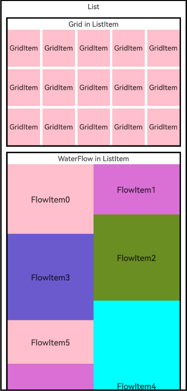

# Creating a Waterfall Flow (WaterFlow)

You can use the [WaterFlow](../reference/apis-arkui/arkui-ts/ts-container-waterflow.md) component in ArkUI to create a waterfall flow layout, which is commonly used to display image collections, especially in e-commerce and news applications.
The WaterFlow component supports conditional rendering, loop rendering (rendering of repeated content), and lazy loading to generate child components.

## Layout and Constraints

The waterfall flow supports both horizontal and vertical layouts. In a vertical layout, you can set the number of columns using [columnsTemplate](../reference/apis-arkui/arkui-ts/ts-container-waterflow.md#columnstemplate). In a horizontal layout, you can set the number of rows using [rowsTemplate](../reference/apis-arkui/arkui-ts/ts-container-waterflow.md#rowstemplate).

In the vertical layout, child nodes in the first row are arranged from left to right. From the second row onward, each child node is placed in the column with the smallest total height. If multiple columns have the same total height, they are filled in order from left to right. The following figure shows this arrangement logic.


In the horizontal layout, each child node is placed in the row with the smallest total width. If multiple rows have the same width, they are filled in order from left to right.


## Infinite Scrolling

### Adding Data When Reaching the End

The waterfall flow layout is often used for infinite scrolling feeds. You can add new data to [LazyForEach](../reference/apis-arkui/arkui-ts/ts-rendering-control-lazyforeach.md) in the [onReachEnd](../reference/apis-arkui/arkui-ts/ts-container-waterflow.md#onreachend) event callback when the **WaterFlow** component reaches the end position, and create a footer that indicates loading new data (using the [LoadingProgress](../reference/apis-arkui/arkui-ts/ts-basic-components-loadingprogress.md) component).

```ts
  @Builder
  itemFoot() {
    Row() {
      LoadingProgress()
        .color(Color.Blue).height(50).aspectRatio(1).width('20%')
      Text(`Loading`)
        .fontSize(20)
        .width('30%')
        .height(50)
        .align(Alignment.Center)
        .margin({ top: 2 })
    }.width('100%').justifyContent(FlexAlign.Center)
  }

  build() {
    Column({ space: 2 }) {
      WaterFlow({ footer: this.itemFoot(), layoutMode: WaterFlowLayoutMode.SLIDING_WINDOW }) {
        LazyForEach(this.dataSource, (item: number) => {
          FlowItem() {
            ReusableFlowItem({ item: item })
          }
          .width('100%')
          .aspectRatio(this.itemHeightArray[item % 100] / this.itemWidthArray[item%100])
          .backgroundColor(this.colors[item % 5])
        }, (item: string) => item)
      }
      .columnsTemplate('1fr '.repeat(this.columns))
      .backgroundColor(0xFAEEE0)
      .width('100%')
      .height('100%')
      .layoutWeight(1)
      // Load data once the component reaches the bottom.
      .onReachEnd(() => {
        setTimeout(() => {
          this.dataSource.addNewItems();
        }, 1000);
      })
    }
  }

  // Method in WaterFlowDataSource to append count-specified elements to the data
  public addNewItems(count: number): void {
    let len = this.dataArray.length;
    for (let i = 0; i < count; i++) {
      this.dataArray.push(this.dataArray.length);
    }
    this.listeners.forEach(listener => {
      listener.onDatasetChange([{ type: DataOperationType.ADD, index: len, count: count }]);
    })
  }

```

Always add data to the end of the data array (**dataArray**) instead of modifying the array directly using the **onDataReloaded()** API of **LazyForEach**.

Since the heights of the child nodes in the **WaterFlow** component are inconsistent, the position of the lower nodes depends on the upper nodes. Therefore, reloading all data triggers full layout recalculation, potentially causing lag. After adding data to the end of the data array, you must use **onDatasetChange([{ type: DataOperationType.ADD, index: len, count: count }])** to notify the **WaterFlow** component of new data without reprocessing existing items.


### Pre-loading Data

Triggering data loading at **onReachEnd()** can cause noticeable pause when the component scrolls to the bottom.

To enable smooth infinite scrolling, you need to adjust the timing of adding new data. For example, you can preload new data when there are still several items left to be traversed in **LazyForEach**. The following code monitors the scroll position (distance of the last displayed child node from the end of the dataset) in the [onScrollIndex](../reference/apis-arkui/arkui-ts/ts-container-waterflow.md#onscrollindex11) API of **WaterFlow** and pre-loads new data at the right time to achieve smooth infinite scrolling.

```ts
  build() {
    Column({ space: 2 }) {
      WaterFlow({ layoutMode: WaterFlowLayoutMode.SLIDING_WINDOW }) {
        LazyForEach(this.dataSource, (item: number) => {
          FlowItem() {
            ReusableFlowItem({ item: item })
          }
          .width('100%')
          .aspectRatio(this.itemHeightArray[item % 100] / this.itemWidthArray[item%100])
          .backgroundColor(this.colors[item % 5])
        }, (item: string) => item)
      }
      .columnsTemplate('1fr '.repeat(this.columns))
      .backgroundColor(0xFAEEE0)
      .width('100%')
      .height('100%')
      .layoutWeight(1)
      // Pre-load data when approaching the bottom.
      .onScrollIndex((first: number, last: number) => {
        if (last + 20 >= this.dataSource.totalCount()) {
          setTimeout(() => {
            this.dataSource.addNewItems(100);
          }, 1000);
        }
      })
    }
  }
```


## Dynamically Adjusting the Column Count

Dynamically adjusting the column count allows applications to switch between list and waterfall flow modes or adapt to screen width changes. For faster transitions, use the sliding window layout mode.

```ts
// Use a state variable to manage the column count and trigger layout updates.
@State columns: number = 2;

@Reusable
@Component
struct ReusableListItem {
  @State item: number = 0;

  aboutToReuse(params: Record<string, number>) {
    this.item = params.item;
  }

  build() {
    Row() {
      Image('res/waterFlow(' + this.item % 5 + ').JPG')
        .objectFit(ImageFit.Fill)
        .height(100)
        .aspectRatio(1)
      Text("N" + this.item).fontSize(12).height('16').layoutWeight(1).textAlign(TextAlign.Center)
    }
  }
}

  build() {
    Column({ space: 2 }) {
      Button('Switch Columns').fontSize(20).onClick(() => {
        if (this.columns === 2) {
          this.columns = 1;
        } else {
          this.columns = 2;
        }
      })
      WaterFlow({ layoutMode: WaterFlowLayoutMode.SLIDING_WINDOW }) {
        LazyForEach(this.dataSource, (item: number) => {
          FlowItem() {
            if (this.columns === 1) {
              ReusableListItem({ item: item })
            } else {
              ReusableFlowItem({ item: item })
            }
          }
          .width('100%')
          .aspectRatio(this.columns === 2 ? this.itemHeightArray[item % 100] / this.itemWidthArray[item % 100] : 0)
          .backgroundColor(this.colors[item % 5])
        }, (item: string) => item)
      }
      .columnsTemplate('1fr '.repeat(this.columns))
      .backgroundColor(0xFAEEE0)
      .width('100%')
      .height('100%')
      .layoutWeight(1)
      // Pre-load data when approaching the bottom.
      .onScrollIndex((first: number, last: number) => {
        if (last + 20 >= this.dataSource.totalCount()) {
          setTimeout(() => {
            this.dataSource.addNewItems(100);
          }, 1000);
        }
      })
    }
  }
```


## Mixed Section Layout

Many application UIs feature supplementary content above the **WaterFlow** component. This scenario can be implemented by nesting a **WaterFlow** within a **Scroll** or **List** container, as illustrated in the following figure:



When child nodes from different sections can be integrated into a single data source, using **WaterFlowSections** enables mixed layouts within a single **WaterFlow** container. This approach simplifies scroll event handling logic compared to nested scrolling implementations.

Each **WaterFlow** section can individually set its own number of columns, row spacing, column spacing, margin, and total number of child nodes. The following code can achieve the above effect:

```ts
@Entry
@Component
struct WaterFlowDemo {
  minSize: number = 80;
  maxSize: number = 180;
  colors: number[] = [0xFFC0CB, 0xDA70D6, 0x6B8E23, 0x6A5ACD, 0x00FFFF, 0x00FF7F];
  dataSource: WaterFlowDataSource = new WaterFlowDataSource(100);
  private itemWidthArray: number[] = [];
  private itemHeightArray: number[] = [];
  private gridItems: number[] = [];
  @State sections: WaterFlowSections = new WaterFlowSections();
  sectionMargin: Margin = {
    top: 10,
    left: 5,
    bottom: 10,
    right: 5
  };
  oneColumnSection: SectionOptions = {
    itemsCount: 1,
    crossCount: 1,
    columnsGap: 5,
    rowsGap: 10,
    margin: this.sectionMargin,
  };
  twoColumnSection: SectionOptions = {
    itemsCount: 98,
    crossCount: 2,
  };
  // Use the last section as a footer, since footers are not supported with sections.
  lastSection: SectionOptions = {
    itemsCount: 1,
    crossCount: 1,
  };

  // Calculate the FlowItem width and height.
  getSize() {
    let ret = Math.floor(Math.random() * this.maxSize);
    return (ret > this.minSize ? ret : this.minSize);
  }

  // Set the FlowItem size array.
  setItemSizeArray() {
    for (let i = 0; i < 100; i++) {
      this.itemWidthArray.push(this.getSize());
      this.itemHeightArray.push(this.getSize());
    }
  }

  aboutToAppear() {
    this.setItemSizeArray();
    for (let i = 0; i < 15; ++i) {
      this.gridItems.push(i);
    }
    // The total number of itemCount values across sections must match the data source item count of the WaterFlow.
    let sectionOptions: SectionOptions[] = [this.oneColumnSection, this.twoColumnSection, this.lastSection];
    this.sections.splice(0, 0, sectionOptions);
  }

  build() {
    WaterFlow({ layoutMode: WaterFlowLayoutMode.SLIDING_WINDOW, sections: this.sections }) {
      LazyForEach(this.dataSource, (item: number) => {
        FlowItem() {
          if (item === 0) {
            Grid() {
              ForEach(this.gridItems, (day: number) => {
                GridItem() {
                  Text('GridItem').fontSize(14).height(16)
                }.backgroundColor(0xFFC0CB)
              }, (day: number) => day.toString())
            }
            .height('30%')
            .rowsGap(5)
            .columnsGap(5)
            .columnsTemplate('1fr '.repeat(5))
            .rowsTemplate('1fr '.repeat(3))
          } else {
            ReusableFlowItem({ item: item })
          }
        }
        .width('100%')
        .aspectRatio(item != 0 ? this.itemHeightArray[item % 100] / this.itemWidthArray[item % 100] : 0)
        .backgroundColor(item != 0 ? this.colors[item % 5] : Color.White)
      }, (item: string) => item)
    }
    .backgroundColor(0xFAEEE0)
    .height('100%')
    // Pre-load data when approaching the bottom.
    .onScrollIndex((first: number, last: number) => {
      if (last + 20 >= this.dataSource.totalCount()) {
        setTimeout(() => {
          this.dataSource.addNewItems(100);
          // Update the itemCount values for sections after adding data.
          this.twoColumnSection.itemsCount += 100;
          this.sections.update(1, this.twoColumnSection);
        }, 1000);
      }
    })
    .margin(10)
  }
}
```

>**NOTE**
>
>Footers are not supported with **WaterFlowSections**; use the last section as a footer instead.
>
>Always update the corresponding **itemsCount** when adding or removing data to maintain layout consistency.
