# Flex Layout (Flex)


## Overview

The flex layout, implemented using the [\<Flex>](../reference/arkui-ts/ts-container-flex.md) container component, provides simple and powerful tools for flexibly distributing space and aligning items. By default, the flex container has a main axis and a cross axis. Child elements are arranged along the main axis by default. The size of a child element along the main axis is referred to as its main axis size. Similarly, the size of a child element along the cross axis is referred to as its cross axis size. The flex layout is widely used in scenarios such as the navigation bar distribution on the page header, page framework setup, and arrangement of multiple lines of data.


  **Figure 1** Flex container whose main axis runs in the horizontal direction 

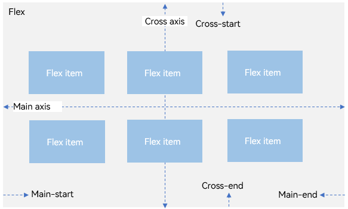


## Basic Concepts

- Main axis: axis along which child elements are placed in the **\<Flex>** component. Child elements are laid out along the main axis by default. The start point of the main axis is referred to as main-start, and the end point is referred to as main-end.

- Cross axis: axis that runs perpendicular to the main axis. The start point of the cross axis is referred to as cross-start, and the end point is referred to as cross-end.


## Layout Direction

In the flex layout, the child elements can be arranged in any direction. You can set the **direction** parameter to define the direction of the main axis and thereby control the arrangement of child elements.

  **Figure 2** Flex layout direction 

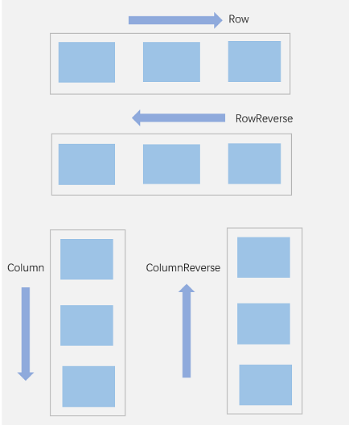

- **FlexDirection.Row** (default value): The main axis runs along the row horizontally, and the child components are laid out from the start edge of the main axis.


  ```ts
  Flex({ direction: FlexDirection.Row }) {
    Text('1').width('33%').height(50).backgroundColor(0xF5DEB3)
    Text('2').width('33%').height(50).backgroundColor(0xD2B48C)
    Text('3').width('33%').height(50).backgroundColor(0xF5DEB3)
  }
  .height(70)
  .width('90%')
  .padding(10)
  .backgroundColor(0xAFEEEE)
  ```

  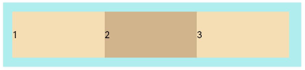

- **FlexDirection.RowReverse**: The main axis runs along the row horizontally, and the child components are laid out from the end edge of the main axis, in a direction opposite to **FlexDirection.Row**.


  ```ts
  Flex({ direction: FlexDirection.RowReverse }) {
    Text('1').width('33%').height(50).backgroundColor(0xF5DEB3)
    Text('2').width('33%').height(50).backgroundColor(0xD2B48C)
    Text('3').width('33%').height(50).backgroundColor(0xF5DEB3)
  }
  .height(70)
  .width('90%')
  .padding(10)
  .backgroundColor(0xAFEEEE)
  ```

  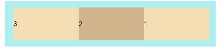

- **FlexDirection.Column**: The main axis runs along the column vertically, and the child components are laid out from the start edge of the main axis.


  ```ts
  Flex({ direction: FlexDirection.Column }) {
    Text('1').width('100%').height(50).backgroundColor(0xF5DEB3)
    Text('2').width('100%').height(50).backgroundColor(0xD2B48C)
    Text('3').width('100%').height(50).backgroundColor(0xF5DEB3)
  }
  .height(70)
  .width('90%')
  .padding(10)
  .backgroundColor(0xAFEEEE)
  ```

  

- **FlexDirection.ColumnReverse**: The main axis runs along the column vertically, and the child components are laid out from the end edge of the main axis, in a direction opposite to **FlexDirection.Column**.


  ```ts
  Flex({ direction: FlexDirection.ColumnReverse }) {
    Text('1').width('100%').height(50).backgroundColor(0xF5DEB3)
    Text('2').width('100%').height(50).backgroundColor(0xD2B48C)
    Text('3').width('100%').height(50).backgroundColor(0xF5DEB3)
  }
  .height(70)
  .width('90%')
  .padding(10)
  .backgroundColor(0xAFEEEE)
  ```

  


## Wrapping in the Flex Layout

In the flex layout, child elements can be laid on a single line (also called an axis) or on multiple lines. By default, child elements are laid out on a single line in the flex container. You can use the **wrap** attribute to set whether child elements can wrap onto multiple lines when the total main axis size of the child elements is greater than the main axis size of the container. When wrapped onto multiple lines, the child elements on the new line are stacked in the direction based on the cross axis direction.

- **FlexWrap.NoWrap** (default value): Child components are laid out on a single line. This may cause the child components to shrink to fit the container when the total width of the child components is greater than the width of the container.


  ```ts
  Flex({ wrap: FlexWrap.NoWrap }) {
    Text('1').width('50%').height(50).backgroundColor(0xF5DEB3)
    Text('2').width('50%').height(50).backgroundColor(0xD2B48C)
    Text('3').width('50%').height(50).backgroundColor(0xF5DEB3)
  } 
  .width('90%')
  .padding(10)
  .backgroundColor(0xAFEEEE)
  ```

  

- **FlexWrap.Wrap**: Child components can break into multiple lines along the main axis.


  ```ts
  Flex({ wrap: FlexWrap.Wrap }) {
    Text('1').width('50%').height(50).backgroundColor(0xF5DEB3)
    Text('2').width('50%').height(50).backgroundColor(0xD2B48C)
    Text('3').width('50%').height(50).backgroundColor(0xD2B48C)
  } 
  .width('90%')
  .padding(10)
  .backgroundColor(0xAFEEEE)
  ```

  

- **FlexWrap.WrapReverse**: Child components can break into multiple lines in the reverse direction to the main axis.


  ```ts
  Flex({ wrap: FlexWrap.WrapReverse}) {
    Text('1').width('50%').height(50).backgroundColor(0xF5DEB3)
    Text('2').width('50%').height(50).backgroundColor(0xD2B48C)
    Text('3').width('50%').height(50).backgroundColor(0xF5DEB3)
  }
  .width('90%')
  .padding(10)
  .backgroundColor(0xAFEEEE)
  ```

  


## Alignment on the Main Axis

Use the **justifyContent** parameter to set alignment of child components on the main axis.

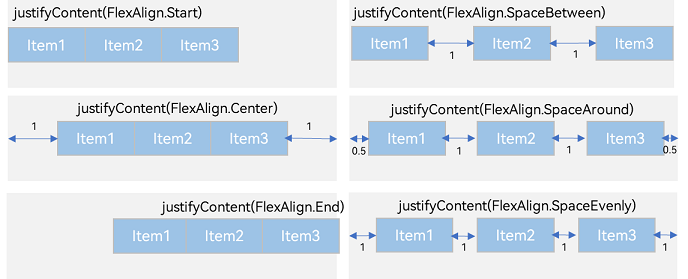


- **FlexAlign.Start** (default value): The child components are aligned with each other toward the start edge of the container along the main axis.


  ```ts
  Flex({ justifyContent: FlexAlign.Start }) {  
    Text('1').width('20%').height(50).backgroundColor(0xF5DEB3)
    Text('2').width('20%').height(50).backgroundColor(0xD2B48C)    
    Text('3').width('20%').height(50).backgroundColor(0xF5DEB3)
  }
  .width('90%')
  .padding({ top: 10, bottom: 10 })
  .backgroundColor(0xAFEEEE)
  ```

  

- **FlexAlign.Center**: The child components are aligned with each other toward the center of the container along the main axis.


  ```ts
  Flex({ justifyContent: FlexAlign.Center }) {  
    Text('1').width('20%').height(50).backgroundColor(0xF5DEB3)  
    Text('2').width('20%').height(50).backgroundColor(0xD2B48C)   
    Text('3').width('20%').height(50).backgroundColor(0xF5DEB3)
  }
  .width('90%')
  .padding({ top: 10, bottom: 10 })
  .backgroundColor(0xAFEEEE)
  ```

  

- **FlexAlign.End**: The child components are aligned with each other toward the end edge of the container along the main axis.


  ```ts
  Flex({ justifyContent: FlexAlign.End }) {  
    Text('1').width('20%').height(50).backgroundColor(0xF5DEB3)  
    Text('2').width('20%').height(50).backgroundColor(0xD2B48C)   
    Text('3').width('20%').height(50).backgroundColor(0xF5DEB3)
  }
  .width('90%')
  .padding({ top: 10, bottom: 10 })
  .backgroundColor(0xAFEEEE)
  ```

  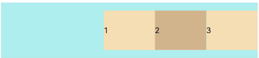

- **FlexAlign.SpaceBetween**: The child components are evenly distributed within the container along the main axis. The first and last child components are aligned with the edges of the container.


  ```ts
  Flex({ justifyContent: FlexAlign.SpaceBetween }) {  
    Text('1').width('20%').height(50).backgroundColor(0xF5DEB3)  
    Text('2').width('20%').height(50).backgroundColor(0xD2B48C)   
    Text('3').width('20%').height(50).backgroundColor(0xF5DEB3)
  }
  .width('90%')
  .padding({ top: 10, bottom: 10 })
  .backgroundColor(0xAFEEEE)
  ```

  

- **FlexAlign.SpaceAround**: The child components are evenly distributed in the container along the main axis. The space between the first child component and main-start, and that between the last child component and main-end are both half of the space between two adjacent child components.


  ```ts
  Flex({ justifyContent: FlexAlign.SpaceAround }) {  
    Text('1').width('20%').height(50).backgroundColor(0xF5DEB3)  
    Text('2').width('20%').height(50).backgroundColor(0xD2B48C)   
    Text('3').width('20%').height(50).backgroundColor(0xF5DEB3)
  }
  .width('90%')
  .padding({ top: 10, bottom: 10 })
  .backgroundColor(0xAFEEEE)
  ```

  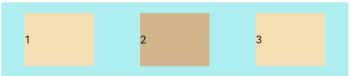

- **FlexAlign.SpaceEvenly**: The child components are equally distributed along the main axis. The space between the first child component and main-start, the space between the last child component and main-end, and the space between two adjacent child components are the same.


  ```ts
  Flex({ justifyContent: FlexAlign.SpaceEvenly }) {  
    Text('1').width('20%').height(50).backgroundColor(0xF5DEB3)  
    Text('2').width('20%').height(50).backgroundColor(0xD2B48C)   
    Text('3').width('20%').height(50).backgroundColor(0xF5DEB3)
  }
  .width('90%')
  .padding({ top: 10, bottom: 10 })
  .backgroundColor(0xAFEEEE)
  ```

  


## Alignment on the Cross Axis

Alignment on the cross axis can be set for both the container and child elements, with that set for child elements having a higher priority.


### Setting Alignment on the Cross Axis for the Container

Use the **alignItems** parameter of the **\<Flex>** component to set alignment of child elements on the cross axis.


- **ItemAlign.Auto**: The child elements are automatically aligned in the flex container.


  ```ts
  Flex({ alignItems: ItemAlign.Auto }) {  
    Text('1').width('33%').height(30).backgroundColor(0xF5DEB3)  
    Text('2').width('33%').height(40).backgroundColor(0xD2B48C)  
    Text('3').width('33%').height(50).backgroundColor(0xF5DEB3)
  }
  .size({ width: '90%', height: 80 })
  .padding(10)
  .backgroundColor(0xAFEEEE)
  ```

  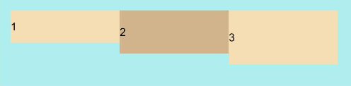

- **ItemAlign.Start**: The child elements are aligned with the start edge of the container along the cross axis.


  ```ts
  Flex({ alignItems: ItemAlign.Start }) {  
    Text('1').width('33%').height(30).backgroundColor(0xF5DEB3)  
    Text('2').width('33%').height(40).backgroundColor(0xD2B48C)  
    Text('3').width('33%').height(50).backgroundColor(0xF5DEB3)
  }
  .size({ width: '90%', height: 80 })
  .padding(10)
  .backgroundColor(0xAFEEEE)
  ```

  

- **ItemAlign.Start**: The child elements are aligned with the center of the container along the cross axis.


  ```ts
  Flex({ alignItems: ItemAlign.Center }) {  
    Text('1').width('33%').height(30).backgroundColor(0xF5DEB3)  
    Text('2').width('33%').height(40).backgroundColor(0xD2B48C)  
    Text('3').width('33%').height(50).backgroundColor(0xF5DEB3)
  }
  .size({ width: '90%', height: 80 })
  .padding(10)
  .backgroundColor(0xAFEEEE)
  ```

  

- **ItemAlign.End**: The child elements are aligned with the end edge of the container along the cross axis.


  ```ts
  Flex({ alignItems: ItemAlign.End }) {  
    Text('1').width('33%').height(30).backgroundColor(0xF5DEB3)  
    Text('2').width('33%').height(40).backgroundColor(0xD2B48C)  
    Text('3').width('33%').height(50).backgroundColor(0xF5DEB3)
  }
  .size({ width: '90%', height: 80 })
  .padding(10)
  .backgroundColor(0xAFEEEE)
  ```

  

- **ItemAlign.Stretch**: The child elements are stretched along the cross axis. If no constraints are set, the child elements are stretched to fill the size of the container on the cross axis.


  ```ts
  Flex({ alignItems: ItemAlign.Stretch }) {  
    Text('1').width('33%').height(30).backgroundColor(0xF5DEB3)  
    Text('2').width('33%').height(40).backgroundColor(0xD2B48C)  
    Text('3').width('33%').height(50).backgroundColor(0xF5DEB3)
  }
  .size({ width: '90%', height: 80 })
  .padding(10)
  .backgroundColor(0xAFEEEE)
  ```

  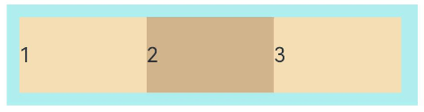

- **ItemAlign.Baseline**: The child elements are aligned at the baseline of the cross axis.


  ```ts
  Flex({ alignItems: ItemAlign.Baseline }) {  
    Text('1').width('33%').height(30).backgroundColor(0xF5DEB3)  
    Text('2').width('33%').height(40).backgroundColor(0xD2B48C)  
    Text('3').width('33%').height(50).backgroundColor(0xF5DEB3)
  }
  .size({ width: '90%', height: 80 })
  .padding(10)
  .backgroundColor(0xAFEEEE)
  ```

  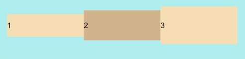


### Setting Alignment on the Cross Axis for Child Components

Use the [alignSelf](../reference/arkui-ts/ts-universal-attributes-flex-layout.md) attribute of child components to set their alignment in the container on the cross axis. The settings overwrite the default **alignItems** settings in the flex container. The sample code is as follows:


```ts
Flex({ direction: FlexDirection.Row, alignItems: ItemAlign.Center }) { // The child components are aligned with the center of the container.
  Text('alignSelf Start').width('25%').height(80)
    .alignSelf(ItemAlign.Start)
    .backgroundColor(0xF5DEB3)
  Text('alignSelf Baseline')
    .alignSelf(ItemAlign.Baseline)
    .width('25%')
    .height(80)
    .backgroundColor(0xD2B48C)
  Text('alignSelf Baseline').width('25%').height(100)
    .backgroundColor(0xF5DEB3)
    .alignSelf(ItemAlign.Baseline)
  Text('no alignSelf').width('25%').height(100)
    .backgroundColor(0xD2B48C)
  Text('no alignSelf').width('25%').height(100)
    .backgroundColor(0xF5DEB3)

}.width('90%').height(220).backgroundColor(0xAFEEEE)
```


In the preceding example, both **alignItems** of the **\<Flex>** component and the **alignSelf** attribute of the child component are both set. In this case, the **alignSelf** settings take effect.


### Content Alignment

Use the [alignContent](../reference/arkui-ts/ts-container-flex.md) parameter to set how space is distributed between and around child components along the cross axis. This parameter is valid only for a flex layout that contains multiple lines. The available options are as follows:

- **FlexAlign.Start**: The child components are aligned toward the start edge of the cross axis in the container.


  ```ts
  Flex({ justifyContent: FlexAlign.SpaceBetween, wrap: FlexWrap.Wrap, alignContent: FlexAlign.Start }) {
    Text('1').width('30%').height(20).backgroundColor(0xF5DEB3)
    Text('2').width('60%').height(20).backgroundColor(0xD2B48C)
    Text('3').width('40%').height(20).backgroundColor(0xD2B48C)
    Text('4').width('30%').height(20).backgroundColor(0xF5DEB3)
    Text('5').width('20%').height(20).backgroundColor(0xD2B48C)
  }
  .width('90%')
  .height(100)
  .backgroundColor(0xAFEEEE)          
  ```

  

- **FlexAlign.Center**: The child components are aligned toward the center of the cross axis in the container.


  ```ts
  Flex({ justifyContent: FlexAlign.SpaceBetween, wrap: FlexWrap.Wrap, alignContent: FlexAlign.Center }) {
    Text('1').width('30%').height(20).backgroundColor(0xF5DEB3)
    Text('2').width('60%').height(20).backgroundColor(0xD2B48C)
    Text('3').width('40%').height(20).backgroundColor(0xD2B48C)
    Text('4').width('30%').height(20).backgroundColor(0xF5DEB3)
    Text('5').width('20%').height(20).backgroundColor(0xD2B48C)
  }
  .width('90%')
  .height(100)
  .backgroundColor(0xAFEEEE)          
  ```

  

- **FlexAlign.End**: The child components are aligned toward the end edge of the cross axis in the container.


  ```ts
  Flex({ justifyContent: FlexAlign.SpaceBetween, wrap: FlexWrap.Wrap, alignContent: FlexAlign.End }) {
    Text('1').width('30%').height(20).backgroundColor(0xF5DEB3)
    Text('2').width('60%').height(20).backgroundColor(0xD2B48C)
    Text('3').width('40%').height(20).backgroundColor(0xD2B48C)
    Text('4').width('30%').height(20).backgroundColor(0xF5DEB3)
    Text('5').width('20%').height(20).backgroundColor(0xD2B48C)
  }
  .width('90%')
  .height(100)
  .backgroundColor(0xAFEEEE)          
  ```

  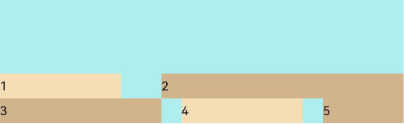

- **FlexAlign.SpaceBetween**: The child components are evenly distributed in the container along the cross axis, with the first and last child components aligned with the edges of the cross axis.


  ```ts
  Flex({ justifyContent: FlexAlign.SpaceBetween, wrap: FlexWrap.Wrap, alignContent: FlexAlign.SpaceBetween }) {
    Text('1').width('30%').height(20).backgroundColor(0xF5DEB3)
    Text('2').width('60%').height(20).backgroundColor(0xD2B48C)
    Text('3').width('40%').height(20).backgroundColor(0xD2B48C)
    Text('4').width('30%').height(20).backgroundColor(0xF5DEB3)
    Text('5').width('20%').height(20).backgroundColor(0xD2B48C)
  }
  .width('90%')
  .height(100)
  .backgroundColor(0xAFEEEE)          
  ```

  

- **FlexAlign.SpaceAround**: The child components are evenly distributed in the container along the cross axis. The spacing before the first child component and after the last child component is half of the spacing between two adjacent child components.


  ```ts
  Flex({ justifyContent: FlexAlign.SpaceBetween, wrap: FlexWrap.Wrap, alignContent: FlexAlign.SpaceAround }) {
    Text('1').width('30%').height(20).backgroundColor(0xF5DEB3)
    Text('2').width('60%').height(20).backgroundColor(0xD2B48C)
    Text('3').width('40%').height(20).backgroundColor(0xD2B48C)
    Text('4').width('30%').height(20).backgroundColor(0xF5DEB3)
    Text('5').width('20%').height(20).backgroundColor(0xD2B48C)
  }
  .width('90%')
  .height(100)
  .backgroundColor(0xAFEEEE)          
  ```

  

- **FlexAlign.SpaceEvenly**: The child components are evenly distributed in the container along the cross axis. The spacing between each two adjacent child components, the spacing between the start edge and the first child component, and the spacing between the end edge and the last child component, are the same.


  ```ts
  Flex({ justifyContent: FlexAlign.SpaceBetween, wrap: FlexWrap.Wrap, alignContent: FlexAlign.SpaceEvenly }) {
    Text('1').width('30%').height(20).backgroundColor(0xF5DEB3)
    Text('2').width('60%').height(20).backgroundColor(0xD2B48C)
    Text('3').width('40%').height(20).backgroundColor(0xD2B48C)
    Text('4').width('30%').height(20).backgroundColor(0xF5DEB3)
    Text('5').width('20%').height(20).backgroundColor(0xD2B48C)
  }
  .width('90%')
  .height(100)
  .backgroundColor(0xAFEEEE)          
  ```

  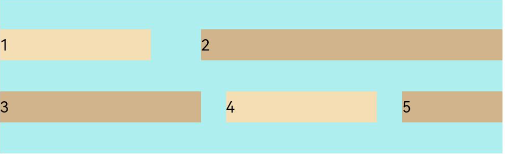


## Adaptive Stretching

When the size of the container in the flex layout is not large enough, the following attributes of the child component can be used to achieve adaptive layout.

- **flexBasis**: base size of the child component in the container along the main axis. It sets the space occupied by the child component. If this attribute is not set, the space occupied by the child component is the value of width/height.


  ```ts
  Flex() {
    Text('flexBasis("auto")')
      .flexBasis('auto') // When width is not set and flexBasis is set to auto, the content is loose.
      .height(100)
      .backgroundColor(0xF5DEB3)
    Text('flexBasis("auto")'+' width("40%")')
      .width('40%')
      .flexBasis('auto') // When width is set and flexBasis is set to auto, the value of width is used.
      .height(100)
      .backgroundColor(0xD2B48C)

    Text('flexBasis(100)') // When width is not set and flexBasis is set to 100, the width is 100 vp.
      .flexBasis(100)  
      .height(100)
      .backgroundColor(0xF5DEB3)

    Text('flexBasis(100)')
      .flexBasis(100)
      .width(200) // When width is set to 200 and flexBasis 100, the width is 100 vp, which means that the settings of flexBasis take precedence.
      .height(100)
      .backgroundColor(0xD2B48C)
  }.width('90%').height(120).padding(10).backgroundColor(0xAFEEEE)
  ```

  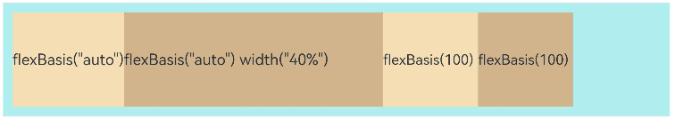

- **flexGrow**: percentage of the flex layout's remaining space that is allocated to the child component. In other words, it is the grow factor of the child component.


  ```ts
  Flex() {
    Text('flexGrow(1)')
      .flexGrow(2) 
      .width(100)
      .height(100)
      .backgroundColor(0xF5DEB3)
    
    Text('flexGrow(2)')
      .flexGrow(2)
      .width(100)
      .height(100)
      .backgroundColor(0xD2B48C)

    Text('no flexGrow')
      .width(100) 
      .height(100)
      .backgroundColor(0xF5DEB3)
  }.width(400).height(120).padding(10).backgroundColor(0xAFEEEE)
  ```

  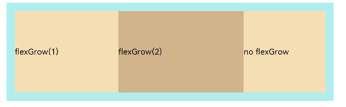

  In the preceding figure, the width of the parent container is 400 vp, the original width of the three child components is 100 vp each, which adds up to the total width of 300 vp. The remaining space 100 vp is allocated to the child components based on their **flexGrow** settings. Child components that do not have **flexGrow** set are not involved in the allocation of remaining space.

  The first child component and the second child component receive their share of remaining space at the 2:3 ratio. The width of the first child component is 100 vp + 100 vp x 2/5 = 140 vp, and the width of the second child component is 100 vp + 100 vp x 3/5 = 160 vp.

- **flexShrink**: shrink factor of the child component when the size of all child components is larger than the flex container.


  ```ts
  Flex({ direction: FlexDirection.Row }) {
    Text('flexShrink(3)')
      .flexShrink(3)
      .width(200)
      .height(100)
      .backgroundColor(0xF5DEB3)
    
    Text('no flexShrink')
      .width(200)
      .height(100)
      .backgroundColor(0xD2B48C)

    Text('flexShrink(2)')
      .flexShrink(2)
      .width(200)
      .height(100)
      .backgroundColor(0xF5DEB3)  
  }.width(400).height(120).padding(10).backgroundColor(0xAFEEEE) 
  ```

  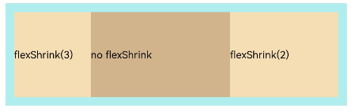


## Example

In this example, child components can be arranged horizontally in the flex layout, aligned at both edges, evenly spaced, and centered in the vertical direction.


```ts
@Entry  
@Component
struct FlexExample {
  build() {
    Column() {
      Column({ space: 5 }) {
        Flex({ direction: FlexDirection.Row, wrap: FlexWrap.NoWrap, justifyContent: FlexAlign.SpaceBetween, alignItems: ItemAlign.Center }) {
          Text('1').width('30%').height(50).backgroundColor(0xF5DEB3)
          Text('2').width('30%').height(50).backgroundColor(0xD2B48C)
          Text('3').width('30%').height(50).backgroundColor(0xF5DEB3)
        }
        .height(70)
        .width('90%')
        .backgroundColor(0xAFEEEE)
      }.width('100%').margin({ top: 5 })
    }.width('100%') 
 }
}
```


