# Responsive Grid Layout (GridRow/GridCol)


## Overview

As an auxiliary positioning tool, the responsive grid layout is handy in UI design on mobile devices. It exhibits the following advantages:

1. Provides rules for layout design and resolves issues of dynamic layout across devices with different sizes. By dividing a page into equal-width columns and rows, you can easily locate and typeset page elements.

2. Provides a unified positioning method for the system to ensure layout consistency across layouts on different devices. This can reduce the complexity of design and development and improve work efficiency.

3. Provides a flexible spacing adjustment method for applications to accommodate special layout requirements. You can adjust the spacing between columns and between rows to control the typesetting of the entire page.

4. Completes the wrapping and adaptation automatically when overflow occurs. When the number of page elements exceeds the capacity of a row or column, they automatically wrap to a new row or column and adapt the typesetting to different devices.

The [GridRow](../reference/apis-arkui/arkui-ts/ts-container-gridrow.md) component is a responsive grid container and must have [GridCol](../reference/apis-arkui/arkui-ts/ts-container-gridcol.md) as its child component.


## GridRow


### Grid Breakpoints

The grid system defines breakpoints, which are screen width types in effect, based on the horizontal width ([screen density pixels](../reference/apis-arkui/arkui-ts/ts-pixel-units.md), in vp) of the screens. You can use the breakpoints to meet specific layout requirements. You can use the breakpoints to meet specific layout requirements.

By default, the grid system provides four breakpoints: xs, sm, md, and lg.

| Breakpoint| Value Range (vp)       | Device Description     |
| ---- | --------------- | --------- |
| xs   | [0, 320)  | Minimum-width device.|
| sm   | [320, 520) | Small-width device. |
| md   | [520, 840) | Medium-width device.|
| lg   | [840, +∞)  | Large-width device. |

In the **GridRow** component, you can use **breakpoints** to customize the value range of breakpoints. A maximum of six breakpoints are supported. In addition to the four default breakpoints, you can also enable the xl and xxl breakpoints for your application window layout.

| Breakpoint| Device Description     |
| ---- | --------- |
| xs   | Minimum-width device.|
| sm   | Small-width device. |
| md   | Medium-width device.|
| lg   | Large-width device. |
| xl   | Extra-large-width device.|
| xxl  | Extra-extra-large-width device.|

- Set **breakpoints** with a monotonically increasing array based on the use case. As **breakpoints** supports a maximum of six breakpoints, the maximum length of the monotonically increasing array is 5.


    ```ts
    breakpoints: {value: ['100vp', '200vp']}
    ```

   Enables three breakpoints: xs, sm, and md. If the value is less than 100 vp, the breakpoint is xs. If the value is 100–200 vp, the breakpoint is sm. If the value is greater than 200 vp, the breakpoint is md.


    ```ts
    breakpoints: {value: ['320vp', '520vp', '840vp', '1080vp']}
    ```

  Enables five breakpoints: xs, sm, md, lg, and xl. If the value is less than 320 vp, the breakpoint is xs. If the value is 320–520 vp, the breakpoint is sm. If the value is 520–840 vp, the breakpoint is md. If the value is 840–1080 vp, the breakpoint is lg. If the value is greater than 1080 vp, the breakpoint is xl.

- The grid system implements breakpoints by listening for the changes in the window or container size, and sets the breakpoint references through **reference**. Since the application may be displayed in non-full-screen mode, it is better to design the breakpoints with the application window width as the reference.

In the following example, the default number of grid columns is 12. Breakpoints are used to divide the application window width into six ranges. In different ranges, the **GridCol** child component occupies a different number of columns.


```ts
@State bgColors: ResourceColor[] =
    ['rgb(213,213,213)', 'rgb(150,150,150)', 'rgb(0,74,175)', 'rgb(39,135,217)', 'rgb(61,157,180)', 'rgb(23,169,141)',
      'rgb(255,192,0)', 'rgb(170,10,33)'];
// ...
GridRow({
  breakpoints: {
    value: ['200vp', '300vp', '400vp', '500vp', '600vp'],
    reference: BreakpointsReference.WindowSize
  }
}) {
   ForEach(this.bgColors, (color:ResourceColor, index?:number|undefined) => {
     GridCol({
       span: {
         xs: 2, // The GridCol component occupies two grid columns on the minimum-width device.
         sm: 3, // The GridCol component occupies three grid columns on the small-width device.
         md: 4, // The GridCol component occupies four grid columns on the medium-width device.
         lg: 6, // The GridCol component occupies six grid columns on the large-width device.
         xl: 8, // The GridCol component occupies eight grid columns on the extra-large-width device.
         xxl: 12 // The GridCol component occupies 12 grid columns on the extra-extra-large-width device.
       }
     }) {
       Row() {
         Text(`${index}`)
       }.width("100%").height('50vp')
     }.backgroundColor(color)
   })
}                                                                    
```

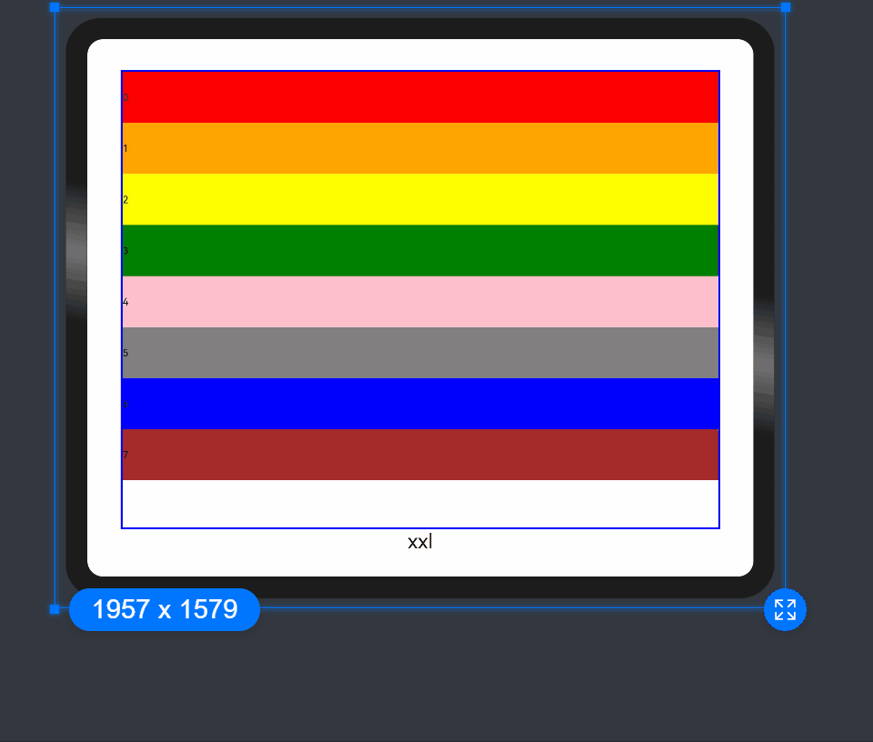


### Columns

In the **GridRow**, **columns** is used to set the total number of columns in the responsive grid layout.

- The default value of **columns** is 12. If **columns** is not set, the responsive grid layout is divided into 12 columns at any breakpoint.


    ```ts
  @State bgColors: ResourceColor[] =
      ['rgb(213,213,213)', 'rgb(150,150,150)', 'rgb(0,74,175)', 'rgb(39,135,217)', 'rgb(61,157,180)', 'rgb(23,169,141)',
        'rgb(255,192,0)', 'rgb(170,10,33)', 'rgb(213,213,213)', 'rgb(150,150,150)', 'rgb(0,74,175)', 'rgb(39,135,217)'];
     // ...
    GridRow() {
      ForEach(this.bgColors, (item:ResourceColor, index?:number|undefined) => {
        GridCol() {
          Row() {
              Text(`${index}`)
          }.width('100%').height('50')
        }.backgroundColor(item)
      })
    }           
    ```

    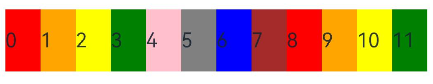

- When **columns** is set to a number, the responsive grid layout is divided into the specified number of columns regardless of the screen size. The following example sets the number of grid layout columns to 4 and 8 in sequence, where a child component occupies one column by default.

  ```ts
  class CurrTmp{
    currentBp: string = 'unknown';
    set(val:string){
      this.currentBp = val
    }
  }
  let BorderWH:Record<string,Color|number> = { 'color': Color.Blue, 'width': 2 }
  @State bgColors: ResourceColor[] =
      ['rgb(213,213,213)', 'rgb(150,150,150)', 'rgb(0,74,175)', 'rgb(39,135,217)', 'rgb(61,157,180)', 'rgb(23,169,141)',
        'rgb(255,192,0)', 'rgb(170,10,33)'];
  @State currentBp: string = 'unknown';
  // ...
  Row() {
    GridRow({ columns: 4 }) {
      ForEach(this.bgColors, (item: ResourceColor, index?:number|undefined) => {
        GridCol() {
          Row() {
            Text(`${index}`)
          }.width('100%').height('50')
        }.backgroundColor(item)
      })
    }
    .width('100%').height('100%')
    .onBreakpointChange((breakpoint:string) => {
      let CurrSet:CurrTmp = new CurrTmp()
      CurrSet.set(breakpoint)
    })
  }
  .height(160)
  .border(BorderWH)
  .width('90%')
  
  Row() {
    GridRow({ columns: 8 }) {
      ForEach(this.bgColors, (item: ResourceColor, index?:number|undefined) => {
          GridCol() {
            Row() {
              Text(`${index}`)
            }.width('100%').height('50')
          }.backgroundColor(item)
      })
    }
    .width('100%').height('100%')
    .onBreakpointChange((breakpoint:string) => {
      let CurrSet:CurrTmp = new CurrTmp()
      CurrSet.set(breakpoint)
    })
  }
  .height(160)
  .border(BorderWH)
  .width('90%')
  ```

    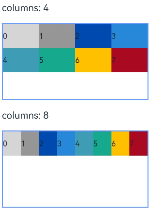

- When **columns** is set to a value of the **GridRowColumnOption** type, you can assign values specific to the screen size (xs, sm, md, lg, xl, xxl).

  ```ts
  @State bgColors: ResourceColor[] =
      ['rgb(213,213,213)', 'rgb(150,150,150)', 'rgb(0,74,175)', 'rgb(39,135,217)', 'rgb(61,157,180)', 'rgb(23,169,141)',
        'rgb(255,192,0)', 'rgb(170,10,33)'];
  GridRow({ columns: { sm: 4, md: 8 }, breakpoints: { value: ['200vp', '300vp', '400vp', '500vp', '600vp'] } }) {
    ForEach(this.bgColors, (item: ResourceColor, index?:number|undefined) => {
      GridCol() {
        Row() {
          Text(`${index}`)
        }.width('100%').height('50')
      }.backgroundColor(item)
    })
  }
  ```

    

If **columns** is only set for the sm and md screen size types, screen sizes smaller than sm use the default value **12**, and screen sizes larger than md (lg, xl, and xxl) use the value of **columns** of the md type.


### Alignment

In the responsive grid layout, you can set the **direction** attribute of **GridRow** to define the direction in which child components are arranged. The options are **GridRowDirection.Row** (from left to right) or **GridRowDirection.RowReverse** (from right to left). An appropriate **direction** value can make the page layout more flexible and meet the design requirements.

- When child components are arranged from left to right (default):


    ```ts
    GridRow({ direction: GridRowDirection.Row }){}
    ```

    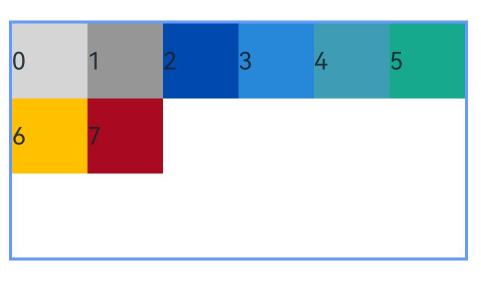

- When child components are arranged from right to left (default):


    ```ts
    GridRow({ direction: GridRowDirection.RowReverse }){}
    ```

    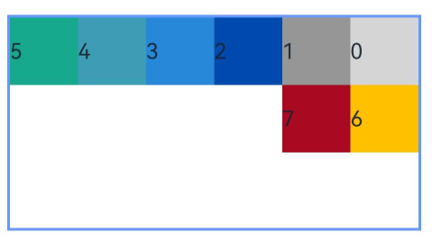


### Gutters

In the **GridRow** component, **gutter** is used to set the spacing between adjacent child components in the horizontal and vertical directions.

- When **gutter** is set to a number, the number applies to both the horizontal and vertical directions. In the following example, the horizontal and vertical spacing between adjacent child components is set to **10**.


    ```ts
    GridRow({ gutter: 10 }){}
    ```

    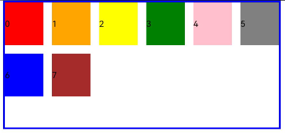

- When **gutter** is set to a value of the **GutterOption** type, the **x** attribute of the value indicates the horizontal gutter, and the **y** attribute indicates the vertical gutter.


    ```ts
    GridRow({ gutter: { x: 20, y: 50 } }){}
    ```

    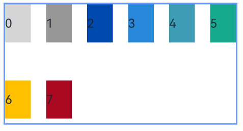


## GridCol

The **\GridCol** component is a child component of the **GridRow** component. You can set the **span**, **offset**, and **order** attributes of this component by passing parameters or using setters.

- Setting **span**


    ```ts
  let Gspan:Record<string,number> = { 'xs': 1, 'sm': 2, 'md': 3, 'lg': 4 }
  GridCol({ span: 2 }){}
  GridCol({ span: { xs: 1, sm: 2, md: 3, lg: 4 } }){}
  GridCol(){}.span(2)
  GridCol(){}.span(Gspan)
    ```

- Setting **offset**


    ```ts
  let Goffset:Record<string,number> = { 'xs': 1, 'sm': 2, 'md': 3, 'lg': 4 }
  GridCol({ offset: 2 }){}
  GridCol({ offset: { xs: 2, sm: 2, md: 2, lg: 2 } }){}
  GridCol(){}.offset(Goffset) 
    ```

- Setting **order**


    ```ts
  let Gorder:Record<string,number> = { 'xs': 1, 'sm': 2, 'md': 3, 'lg': 4 }
  GridCol({ order: 2 }){}
  GridCol({ order: { xs: 1, sm: 2, md: 3, lg: 4 } }){}
  GridCol(){}.order(2)
  GridCol(){}.order(Gorder)
    ```


### span

Sets the number of columns occupied by a child component in the grid layout, which determines the child component width. The default value is **1**.

- When the value type is number, the number of columns occupied by the child component is the same across screen sizes.


    ```ts
  @State bgColors: ResourceColor[] =
      ['rgb(213,213,213)', 'rgb(150,150,150)', 'rgb(0,74,175)', 'rgb(39,135,217)', 'rgb(61,157,180)', 'rgb(23,169,141)',
        'rgb(255,192,0)', 'rgb(170,10,33)'];
    // ...
    GridRow({ columns: 8 }) {
      ForEach(this.bgColors, (color:ResourceColor, index?:number|undefined) => {
        GridCol({ span: 2 }) {      
          Row() {
            Text(`${index}`)
          }.width('100%').height('50vp')          
        }
        .backgroundColor(color)
      })
    }                
    ```

    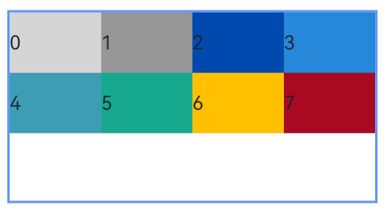

- When the value type is **GridColColumnOption**, you can assign values specific to the screen size (xs, sm, md, lg, xl, xxl).


    ```ts
  @State bgColors: ResourceColor[] =
      ['rgb(213,213,213)', 'rgb(150,150,150)', 'rgb(0,74,175)', 'rgb(39,135,217)', 'rgb(61,157,180)', 'rgb(23,169,141)',
        'rgb(255,192,0)', 'rgb(170,10,33)'];
    // ...
    GridRow({ columns: 8 }) {
      ForEach(this.bgColors, (color:ResourceColor, index?:number|undefined) => {
        GridCol({ span: { xs: 1, sm: 2, md: 3, lg: 4 } }) {      
          Row() {
            Text(`${index}`)
          }.width('100%').height('50vp')          
        }
        .backgroundColor(color)
      })
    }                
    ```

    


### offset

Sets the column offset of a child component relative to the previous child component. The default value is **0**.

- When the value type is number, the column offset of the child component is the same across screen sizes.


    ```ts
  @State bgColors: ResourceColor[] =
      ['rgb(213,213,213)', 'rgb(150,150,150)', 'rgb(0,74,175)', 'rgb(39,135,217)', 'rgb(61,157,180)', 'rgb(23,169,141)',
        'rgb(255,192,0)', 'rgb(170,10,33)'];
    // ...
    GridRow() {
      ForEach(this.bgColors, (color:ResourceColor, index?:number|undefined) => {
        GridCol({ offset: 2 }) {      
          Row() {
            Text('' + index)
          }.width('100%').height('50vp')          
        }
        .backgroundColor(color)
      })
    }                
    ```

    

  By default, a grid is divided into 12 columns and each child component occupies one column with an offset of two columns. Each row holds four child components, with three columns per child component plus the gutter.

- When the value type is **GridColColumnOption**, you can assign values specific to the screen size (xs, sm, md, lg, xl, xxl).


    ```ts
  @State bgColors: ResourceColor[] =
      ['rgb(213,213,213)', 'rgb(150,150,150)', 'rgb(0,74,175)', 'rgb(39,135,217)', 'rgb(61,157,180)', 'rgb(23,169,141)',
        'rgb(255,192,0)', 'rgb(170,10,33)'];
    // ...
  
    GridRow() {
      ForEach(this.bgColors, (color:ResourceColor, index?:number|undefined) => {
        GridCol({ offset: { xs: 1, sm: 2, md: 3, lg: 4 } }) {      
          Row() {
            Text('' + index)
          }.width('100%').height('50vp')          
        }
        .backgroundColor(color)
      })
    }                 
    ```

    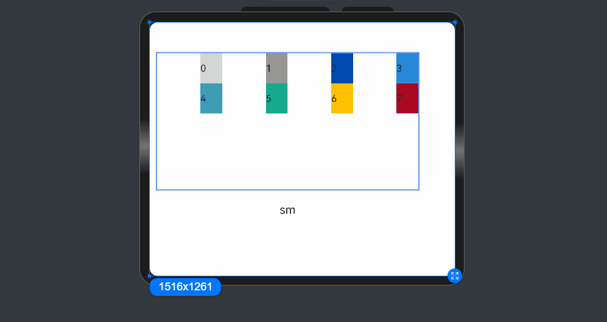


### order

Sets the sequence number of a child component in the grid layout. If a child component shares an **order** value with another child component or does not have **order** set, it is displayed based on its code sequence number. A child component with a smaller **order** value is placed before the one with a larger **order** value.

If **order** is not set for all child components, those that have **order** set are displayed after those that do not have **order** set and are sorted in ascending order based on the value.

- When the value type is number, child components are sorted in the same order across screen sizes.


    ```ts
  GridRow() {
    GridCol({ order: 4 }) {
      Row() {
        Text('1')
      }.width('100%').height('50vp')
    }.backgroundColor('rgb(213,213,213)')
    GridCol({ order: 3 }) {
      Row() {
        Text('2')
      }.width('100%').height('50vp')
    }.backgroundColor('rgb(150,150,150)')
    GridCol({ order: 2 }) {
      Row() {
        Text('3')
      }.width('100%').height('50vp')
    }.backgroundColor('rgb(0,74,175)')
    GridCol({ order: 1 }) {
      Row() {
        Text('4')
      }.width('100%').height('50vp')
    }.backgroundColor('rgb(39,135,217)')
  }
    ```

    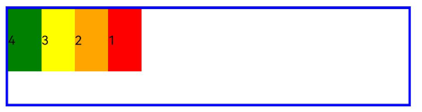

- When the value type is **GridColColumnOption**, you can assign values specific to the screen size (xs, sm, md, lg, xl, xxl). You can set 1234 for xs, 2341 for sm, 3412 for md, and 2431 for lg.


    ```ts
    GridRow() {
      GridCol({ order: { xs:1, sm:5, md:3, lg:7}}) {
        Row() {
          Text('1')
        }.width('100%').height('50vp')
      }.backgroundColor(Color.Red)
      GridCol({ order: { xs:2, sm:2, md:6, lg:1} }) {
        Row() {
          Text('2')
        }.width('100%').height('50vp')
      }.backgroundColor(Color.Orange)
      GridCol({ order: { xs:3, sm:3, md:1, lg:6} }) {
        Row() {
          Text('3')
        }.width('100%').height('50vp')
      }.backgroundColor(Color.Yellow)
      GridCol({ order: { xs:4, sm:4, md:2, lg:5} }) {
        Row() {
          Text('4')
        }.width('100%').height('50vp')
      }.backgroundColor(Color.Green)
    } 
    ```

    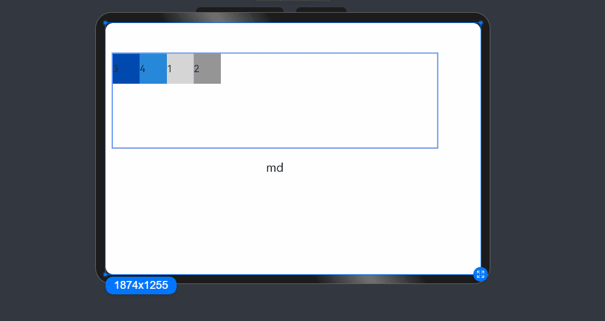


## Nesting of Responsive Grid Components

Responsive grid components can be contained in other responsive grid components.

In the following example, the responsive grid divides the entire space into 12 parts. At the first layer, **\GridCol** is nested in **GridRow**, and the space is divided into the large area in the center and the footer area. At the second layer, **\GridCol** is nested in **GridRow**, and the space is divided into the left and right areas. The child components take up the space allocated by the parent component at the upper layer. In this example, the pink area is made up of 12 columns of the screen space, and the green and blue areas take up the 12 columns of the parent component proportionally.

```ts
@Entry
@Component
struct GridRowExample {
  build() {
    GridRow() {
      GridCol({ span: { sm: 12 } }) {
        GridRow() {
          GridCol({ span: { sm: 2 } }) {
            Row() {
              Text('left').fontSize(24)
            }
            .justifyContent(FlexAlign.Center)
            .height('90%')
          }.backgroundColor('#ff41dbaa')

          GridCol({ span: { sm: 10 } }) {
            Row() {
              Text('right').fontSize(24)
            }
            .justifyContent(FlexAlign.Center)
            .height('90%')
          }.backgroundColor('#ff4168db')
        }
        .backgroundColor('#19000000')
      }

      GridCol({ span: { sm: 12 } }) {
        Row() {
          Text('footer').width('100%').textAlign(TextAlign.Center)
        }.width('100%').height('10%').backgroundColor(Color.Pink)
      }
    }.width('100%').height(300)
  }
}
```


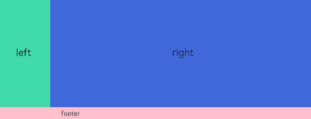


To sum up, the responsive grid components are powerful tools with a wide range of customization capabilities. With the required attributes set at different breakpoints, such as **Columns**, **Margin**, **Gutter**, and **span**, the layout is created automatically. You do not need to pay attention to the specific device type and device state (such as landscape and portrait).
