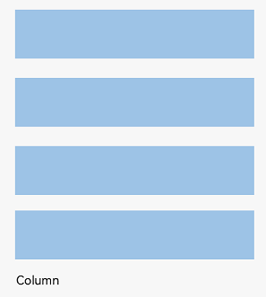
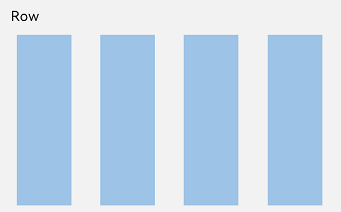
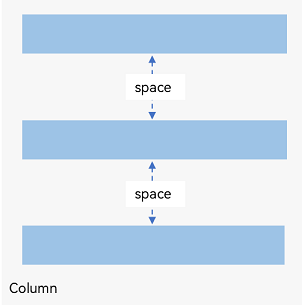
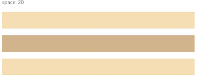
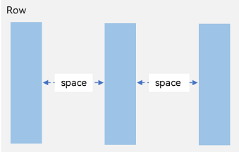
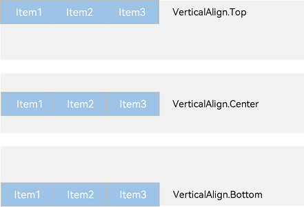
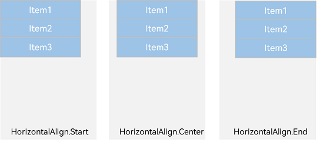

# Linear Layout (Row/Column)

<!--Kit: ArkUI-->
<!--Subsystem: ArkUI-->
<!--Owner: @camlostshi-->
<!--Designer: @lanshouren-->
<!--Tester: @liuli0427-->
<!--Adviser: @Brilliantry_Rui-->
<!-- md-trans-meta sourceCommit=871010847291a8d5221a0bd1c554d4d2cba1ab41 translatedAt=2026-08-01T00:32:39.117Z pushedAt=2026-08-03T08:28:21.087Z -->

## Overview

Linear layout is the most frequently used layout in development, implemented using the [Row](../reference/apis-arkui/arkui-ts/ts-container-row.md) or [Column](../reference/apis-arkui/arkui-ts/ts-container-column.md) linear containers. As the foundation for other layouts, linear layout arranges child elements sequentially along either the horizontal axis (in a **Row** container) or vertical axis (in a **Column** container). You can choose between **Row** and **Column** containers based on your desired arrangement direction.

> **NOTE**
>
> When nesting multiple components in a complex UI, excessive nesting depth or too many nested components in layout containers will incur additional overhead. It is recommended to optimize performance by removing redundant nodes, using layout boundaries to reduce layout calculations, and properly applying rendering control syntax and layout component methods.

  **Figure 1** Child element arrangement in a Column container



  **Figure 2** Child element arrangement in a Row container



## Basic Concepts

- Layout container: container component that is able to lay out other elements as its child elements. The layout container calculates the size of its child elements and arranges the layout.

- Layout child element: element inside the layout container.

- Main axis: axis along which child elements are laid out by default in the linear layout container. The **Row** container's main axis is horizontal, while the **Column** container's main axis is vertical. (For details, see [Basic Concepts](./arkts-layout-development-flex-layout.md#basic-concepts).)

- Cross axis: axis that runs perpendicular to the main axis. The **Row** container's cross axis is vertical, while the **Column** container's cross axis is horizontal. (For details, see [Basic Concepts](./arkts-layout-development-flex-layout.md#basic-concepts).)

- Spacing: distance between child elements.

## Spacing Child Elements Along the Arrangement Direction

Inside a layout container, you can use the [space](../reference/apis-arkui/arkui-ts/ts-container-row.md#rowoptions18) attribute of the [Row](../reference/apis-arkui/arkui-ts/ts-container-row.md) component or the [space](../reference/apis-arkui/arkui-ts/ts-container-column.md#columnoptions18) attribute of the [Column](../reference/apis-arkui/arkui-ts/ts-container-column.md) component to set the spacing between child elements along the main axis, creating an evenly spaced effect.

### In the Column Container

  **Figure 3** Layout child element spacing in the arrangement direction in the Column container



<!-- @[ColumnLayoutExample_start](https://gitcode.com/openharmony/applications_app_samples/blob/master/code/DocsSample/ArkUISample/MultipleLayoutProject/entry/src/main/ets/pages/linearlayout/ColumnLayoutExample.ets) -->

``` TypeScript
Column({ space: 20 }) {
  Text('space: 20').fontSize(15).fontColor(Color.Gray).width('90%')
  Row().width('90%').height(50).backgroundColor(0xF5DEB3)
  Row().width('90%').height(50).backgroundColor(0xD2B48C)
  Row().width('90%').height(50).backgroundColor(0xF5DEB3)
}.width('100%')
```



### In the Row Container

  **Figure 4** Layout child element spacing in the arrangement direction in the Row container



<!-- @[RowLayoutExample_start](https://gitcode.com/openharmony/applications_app_samples/blob/master/code/DocsSample/ArkUISample/MultipleLayoutProject/entry/src/main/ets/pages/linearlayout/RowLayoutExample.ets) -->

``` TypeScript
Row({ space: 35 }) {
  Text('space: 35').fontSize(15).fontColor(Color.Gray)
  Row().width('10%').height(150).backgroundColor(0xF5DEB3)
  Row().width('10%').height(150).backgroundColor(0xD2B48C)
  Row().width('10%').height(150).backgroundColor(0xF5DEB3)
}.width('90%')
```


## Arranging Child Elements Along the Main Axis

In the layout container, you can use the [justifyContent](../reference/apis-arkui/arkui-ts/ts-container-column.md#justifycontent8) attribute to set the arrangement mode of child elements along the main axis. The arrangement may begin from the start point or end point of the main axis, or the space of the main axis can be evenly divided.

### Vertical Alignment of Child Elements in the Column Container

  **Figure 5** Vertical alignment of child elements in the Column container


- **justifyContent(FlexAlign.Start)** (default value): The elements are vertically aligned with each other toward the start edge of the container.

  <!-- @[ColumnLayoutJustifyContentStart_start](https://gitcode.com/openharmony/applications_app_samples/blob/master/code/DocsSample/ArkUISample/MultipleLayoutProject/entry/src/main/ets/pages/linearlayout/ColumnLayoutJustifyContentStart.ets) -->

  ``` TypeScript
  Column({}) {
    Column() {
    }.width('80%').height(50).backgroundColor(0xF5DEB3)
  
    Column() {
    }.width('80%').height(50).backgroundColor(0xD2B48C)
  
    Column() {
    }.width('80%').height(50).backgroundColor(0xF5DEB3)
  }.width('100%').height(300).backgroundColor('rgb(242,242,242)').justifyContent(FlexAlign.Start)
  ```

  

- **justifyContent(FlexAlign.Center)**: The elements are vertically aligned with each other toward the center of the container. The space between the first component and the start edge is the same as that between the last component and the end edge.

  <!-- @[ColumnLayoutJustifyContentCenter_start](https://gitcode.com/openharmony/applications_app_samples/blob/master/code/DocsSample/ArkUISample/MultipleLayoutProject/entry/src/main/ets/pages/linearlayout/ColumnLayoutJustifyContentCenter.ets) -->

  ``` TypeScript
  Column({}) {
    Column() {
    }.width('80%').height(50).backgroundColor(0xF5DEB3)
  
    Column() {
    }.width('80%').height(50).backgroundColor(0xD2B48C)
  
    Column() {
    }.width('80%').height(50).backgroundColor(0xF5DEB3)
  }.width('100%').height(300).backgroundColor('rgb(242,242,242)').justifyContent(FlexAlign.Center)
  ```

  

- **justifyContent(FlexAlign.End)**: Aligns elements to the end in the vertical direction. The last element is aligned with the end of the line, and the other elements are aligned with the one after them.

  <!-- @[ColumnLayoutJustifyContentEnd_start](https://gitcode.com/openharmony/applications_app_samples/blob/master/code/DocsSample/ArkUISample/MultipleLayoutProject/entry/src/main/ets/pages/linearlayout/ColumnLayoutJustifyContentEnd.ets) -->

  ``` TypeScript
  Column({}) {
    Column() {
    }.width('80%').height(50).backgroundColor(0xF5DEB3)
  
    Column() {
    }.width('80%').height(50).backgroundColor(0xD2B48C)
  
    Column() {
    }.width('80%').height(50).backgroundColor(0xF5DEB3)
  }.width('100%').height(300).backgroundColor('rgb(242,242,242)').justifyContent(FlexAlign.End)
  ```

  

- **justifyContent(FlexAlign.SpaceBetween)**: The elements are evenly distributed vertically. The space between any two adjacent elements is the same. The first element is aligned with the start edge, the last element is aligned with the end edge, and the remaining elements are distributed so that the space between any two adjacent elements is the same.

  <!-- @[ColumnLayoutJustifyContentSpaceBetween_start](https://gitcode.com/openharmony/applications_app_samples/blob/master/code/DocsSample/ArkUISample/MultipleLayoutProject/entry/src/main/ets/pages/linearlayout/ColumnLayoutJustifyContentSpaceBetween.ets) -->

  ``` TypeScript
  Column({}) {
    Column() {
    }.width('80%').height(50).backgroundColor(0xF5DEB3)
  
    Column() {
    }.width('80%').height(50).backgroundColor(0xD2B48C)
  
    Column() {
    }.width('80%').height(50).backgroundColor(0xF5DEB3)
  }.width('100%').height(300).backgroundColor('rgb(242,242,242)').justifyContent(FlexAlign.SpaceBetween)
  ```

  

- **justifyContent(FlexAlign.SpaceAround)**: The elements are evenly distributed vertically. The space between any two adjacent elements is the same. The space between the first element and start edge, and that between the last element and end edge are both half the size of the space between two adjacent elements.

  <!-- @[ColumnLayoutJustifyContentSpaceAround_start](https://gitcode.com/openharmony/applications_app_samples/blob/master/code/DocsSample/ArkUISample/MultipleLayoutProject/entry/src/main/ets/pages/linearlayout/ColumnLayoutJustifyContentSpaceAround.ets) -->

  ``` TypeScript
  Column({}) {
    Column() {
    }.width('80%').height(50).backgroundColor(0xF5DEB3)
  
    Column() {
    }.width('80%').height(50).backgroundColor(0xD2B48C)
  
    Column() {
    }.width('80%').height(50).backgroundColor(0xF5DEB3)
  }.width('100%').height(300).backgroundColor('rgb(242,242,242)').justifyContent(FlexAlign.SpaceAround)
  ```

  

- **justifyContent(FlexAlign.SpaceEvenly)**: The elements are evenly distributed vertically. The space between the first element and start edge, the space between the last element and end edge, and the space between any two adjacent elements are the same.

  <!-- @[ColumnLayoutJustifyContentSpaceEvenly_start](https://gitcode.com/openharmony/applications_app_samples/blob/master/code/DocsSample/ArkUISample/MultipleLayoutProject/entry/src/main/ets/pages/linearlayout/ColumnLayoutJustifyContentSpaceEvenly.ets) -->

  ``` TypeScript
  Column({}) {
    Column() {
    }.width('80%').height(50).backgroundColor(0xF5DEB3)
  
    Column() {
    }.width('80%').height(50).backgroundColor(0xD2B48C)
  
    Column() {
    }.width('80%').height(50).backgroundColor(0xF5DEB3)
  }.width('100%').height(300).backgroundColor('rgb(242,242,242)').justifyContent(FlexAlign.SpaceEvenly)
  ```

  

### Horizontal Alignment of Child Elements in the Row Container

  **Figure 6** Horizontal alignment of child elements in the Row container 



- **justifyContent(FlexAlign.Start)** (default value): Aligns elements to the start in the horizontal direction. The first element is aligned with the beginning of the line, and the subsequent elements are aligned with the one before them.

  <!-- @[RowLayoutJustifyContentStart_start](https://gitcode.com/openharmony/applications_app_samples/blob/master/code/DocsSample/ArkUISample/MultipleLayoutProject/entry/src/main/ets/pages/linearlayout/RowLayoutJustifyContentStart.ets) -->

  ``` TypeScript
  Row({}) {
    Column() {
    }.width('20%').height(30).backgroundColor(0xF5DEB3)
  
    Column() {
    }.width('20%').height(30).backgroundColor(0xD2B48C)
  
    Column() {
    }.width('20%').height(30).backgroundColor(0xF5DEB3)
  }.width('100%').height(200).backgroundColor('rgb(242,242,242)').justifyContent(FlexAlign.Start)
  ```

  

- **justifyContent(FlexAlign.Center)**: The elements are horizontally aligned with each other toward the center of the container. The space between the first component and the start edge is the same as that between the last component and the end edge.

  <!-- @[RowLayoutJustifyContentCenter_start](https://gitcode.com/openharmony/applications_app_samples/blob/master/code/DocsSample/ArkUISample/MultipleLayoutProject/entry/src/main/ets/pages/linearlayout/RowLayoutJustifyContentCenter.ets) -->

  ``` TypeScript
  Row({}) {
    Column() {
    }.width('20%').height(30).backgroundColor(0xF5DEB3)
  
    Column() {
    }.width('20%').height(30).backgroundColor(0xD2B48C)
  
    Column() {
    }.width('20%').height(30).backgroundColor(0xF5DEB3)
  }.width('100%').height(200).backgroundColor('rgb(242,242,242)').justifyContent(FlexAlign.Center)
  ```

  

- **justifyContent(FlexAlign.End)**: The elements are horizontally aligned with each other toward the end edge of the container.

  <!-- @[RowLayoutJustifyContentEnd_start](https://gitcode.com/openharmony/applications_app_samples/blob/master/code/DocsSample/ArkUISample/MultipleLayoutProject/entry/src/main/ets/pages/linearlayout/RowLayoutJustifyContentEnd.ets) -->

  ``` TypeScript
  Row({}) {
    Column() {
    }.width('20%').height(30).backgroundColor(0xF5DEB3)
  
    Column() {
    }.width('20%').height(30).backgroundColor(0xD2B48C)
  
    Column() {
    }.width('20%').height(30).backgroundColor(0xF5DEB3)
  }.width('100%').height(200).backgroundColor('rgb(242,242,242)').justifyContent(FlexAlign.End)
  ```

  

- **justifyContent(FlexAlign.SpaceBetween)**: The elements are evenly distributed horizontally. The space between any two adjacent elements is the same. The first element is aligned with the start edge, the last element is aligned with the end edge, and the remaining elements are distributed so that the space between any two adjacent elements is the same.

  <!-- @[RowLayoutJustifyContentSpaceBetween_start](https://gitcode.com/openharmony/applications_app_samples/blob/master/code/DocsSample/ArkUISample/MultipleLayoutProject/entry/src/main/ets/pages/linearlayout/RowLayoutJustifyContentSpaceBetween.ets) -->

  ``` TypeScript
  Row({}) {
    Column() {
    }.width('20%').height(30).backgroundColor(0xF5DEB3)
  
    Column() {
    }.width('20%').height(30).backgroundColor(0xD2B48C)
  
    Column() {
    }.width('20%').height(30).backgroundColor(0xF5DEB3)
  }.width('100%').height(200).backgroundColor('rgb(242,242,242)').justifyContent(FlexAlign.SpaceBetween)
  ```

  

- **justifyContent(FlexAlign.SpaceAround)**: The elements are evenly distributed horizontally. The space between any two adjacent elements is the same. The space between the first element and start edge, and that between the last element and end edge are both half the size of the space between two adjacent elements.

  <!-- @[RowLayoutJustifyContentSpaceAround_start](https://gitcode.com/openharmony/applications_app_samples/blob/master/code/DocsSample/ArkUISample/MultipleLayoutProject/entry/src/main/ets/pages/linearlayout/RowLayoutJustifyContentSpaceAround.ets) -->

  ``` TypeScript
  Row({}) {
    Column() {
    }.width('20%').height(30).backgroundColor(0xF5DEB3)
  
    Column() {
    }.width('20%').height(30).backgroundColor(0xD2B48C)
  
    Column() {
    }.width('20%').height(30).backgroundColor(0xF5DEB3)
  }.width('100%').height(200).backgroundColor('rgb(242,242,242)').justifyContent(FlexAlign.SpaceAround)
  ```

  

- **justifyContent(FlexAlign.SpaceEvenly)**: The elements are evenly distributed horizontally. The space between the first element and start edge, the space between the last element and end edge, and the space between any two adjacent elements are the same.

  <!-- @[RowLayoutJustifyContentSpaceEvenly_start](https://gitcode.com/openharmony/applications_app_samples/blob/master/code/DocsSample/ArkUISample/MultipleLayoutProject/entry/src/main/ets/pages/linearlayout/RowLayoutJustifyContentSpaceEvenly.ets) -->

  ``` TypeScript
  Row({}) {
    Column() {
    }.width('20%').height(30).backgroundColor(0xF5DEB3)
  
    Column() {
    }.width('20%').height(30).backgroundColor(0xD2B48C)
  
    Column() {
    }.width('20%').height(30).backgroundColor(0xF5DEB3)
  }.width('100%').height(200).backgroundColor('rgb(242,242,242)').justifyContent(FlexAlign.SpaceEvenly)
  ```

  

## Aligning Child Elements Along the Cross Axis

You can use the [alignItems](../reference/apis-arkui/arkui-ts/ts-container-column.md#alignitems) attribute to configure the alignment of child elements along the cross axis (perpendicular to the arrangement direction) within the layout container. This alignment remains consistent across screens of different sizes. The value is of the [VerticalAlign Type](../reference/apis-arkui/arkui-ts/ts-appendix-enums.md#verticalalign) type when the cross axis is in the vertical direction and the [HorizontalAlign](../reference/apis-arkui/arkui-ts/ts-appendix-enums.md#horizontalalign) type when the cross axis is in the horizontal direction.

The layout container also provides the [alignSelf](../reference/apis-arkui/arkui-ts/ts-universal-attributes-flex-layout.md#alignself) attribute to control the alignment mode of a single child element along the cross axis. This attribute has a higher priority than the **alignItems** attribute. This means that, if **alignSelf** is set, it will overwrite the **alignItems** setting on the corresponding child element.

### Horizontal Alignment of Child Elements in the Column Container

  **Figure 7** Horizontal alignment of child elements in the Column container 



- **HorizontalAlign.Start**: Child elements are left aligned horizontally.

  <!-- @[RowLayoutHorizontalAlignStart_start](https://gitcode.com/openharmony/applications_app_samples/blob/master/code/DocsSample/ArkUISample/MultipleLayoutProject/entry/src/main/ets/pages/linearlayout/RowLayoutHorizontalAlignStart.ets) -->

  ``` TypeScript
  Column({}) {
    Column() {
    }.width('80%').height(50).backgroundColor(0xF5DEB3)
  
    Column() {
    }.width('80%').height(50).backgroundColor(0xD2B48C)
  
    Column() {
    }.width('80%').height(50).backgroundColor(0xF5DEB3)
  }.width('100%').alignItems(HorizontalAlign.Start).backgroundColor('rgb(242,242,242)')
  ```

  

- **HorizontalAlign.Center** (default value): Child elements are center-aligned horizontally.

  <!-- @[RowLayoutHorizontalAlignCenter_start](https://gitcode.com/openharmony/applications_app_samples/blob/master/code/DocsSample/ArkUISample/MultipleLayoutProject/entry/src/main/ets/pages/linearlayout/RowLayoutHorizontalAlignCenter.ets) -->

  ``` TypeScript
  Column({}) {
    Column() {
    }.width('80%').height(50).backgroundColor(0xF5DEB3)
  
    Column() {
    }.width('80%').height(50).backgroundColor(0xD2B48C)
  
    Column() {
    }.width('80%').height(50).backgroundColor(0xF5DEB3)
  }.width('100%').alignItems(HorizontalAlign.Center).backgroundColor('rgb(242,242,242)')
  ```

  

- **HorizontalAlign.End**: Child elements are right-aligned horizontally.

  <!-- @[RowLayoutHorizontalAlignEnd_start](https://gitcode.com/openharmony/applications_app_samples/blob/master/code/DocsSample/ArkUISample/MultipleLayoutProject/entry/src/main/ets/pages/linearlayout/RowLayoutHorizontalAlignEnd.ets) -->

  ``` TypeScript
  Column({}) {
    Column() {
    }.width('80%').height(50).backgroundColor(0xF5DEB3)
  
    Column() {
    }.width('80%').height(50).backgroundColor(0xD2B48C)
  
    Column() {
    }.width('80%').height(50).backgroundColor(0xF5DEB3)
  }.width('100%').alignItems(HorizontalAlign.End).backgroundColor('rgb(242,242,242)')
  ```

  

### Vertical Alignment of Child Elements in the Row Container

  **Figure 8** Vertical alignment of child elements in Row container 


- **VerticalAlign.Top**: Child elements are top-aligned vertically.

  <!-- @[RowLayoutVerticalAlignTop_start](https://gitcode.com/openharmony/applications_app_samples/blob/master/code/DocsSample/ArkUISample/MultipleLayoutProject/entry/src/main/ets/pages/linearlayout/RowLayoutVerticalAlignTop.ets) -->

  ``` TypeScript
  Row({}) {
    Column() {
    }.width('20%').height(30).backgroundColor(0xF5DEB3)
  
    Column() {
    }.width('20%').height(30).backgroundColor(0xD2B48C)
  
    Column() {
    }.width('20%').height(30).backgroundColor(0xF5DEB3)
  }.width('100%').height(200).alignItems(VerticalAlign.Top).backgroundColor('rgb(242,242,242)')
  ```

  

- **VerticalAlign.Center** (default value): Child elements are center-aligned vertically.

  <!-- @[RowLayoutVerticalAlignCenter_start](https://gitcode.com/openharmony/applications_app_samples/blob/master/code/DocsSample/ArkUISample/MultipleLayoutProject/entry/src/main/ets/pages/linearlayout/RowLayoutVerticalAlignCenter.ets) -->

  ``` TypeScript
  Row({}) {
    Column() {
    }.width('20%').height(30).backgroundColor(0xF5DEB3)
  
    Column() {
    }.width('20%').height(30).backgroundColor(0xD2B48C)
  
    Column() {
    }.width('20%').height(30).backgroundColor(0xF5DEB3)
  }.width('100%').height(200).alignItems(VerticalAlign.Center).backgroundColor('rgb(242,242,242)')
  ```

  

- **VerticalAlign.Bottom**: Child elements are bottom-aligned vertically.

  <!-- @[RowLayoutVerticalAlignBottom_start](https://gitcode.com/openharmony/applications_app_samples/blob/master/code/DocsSample/ArkUISample/MultipleLayoutProject/entry/src/main/ets/pages/linearlayout/RowLayoutVerticalAlignBottom.ets) -->

  ``` TypeScript
  Row({}) {
    Column() {
    }.width('20%').height(30).backgroundColor(0xF5DEB3)
  
    Column() {
    }.width('20%').height(30).backgroundColor(0xD2B48C)
  
    Column() {
    }.width('20%').height(30).backgroundColor(0xF5DEB3)
  }.width('100%').height(200).alignItems(VerticalAlign.Bottom).backgroundColor('rgb(242,242,242)')
  ```

  

## Implementing Adaptive Stretching

In linear layout, adaptive stretching is achieved by using the [Blank](../reference/apis-arkui/arkui-ts/ts-basic-components-blank.md) component, which automatically fills the empty spaces in the container – **Row** or **Column** – along the main axis. Just add the width and height as a percentage, and then adaptive scaling will take effect once the screen width and height change.

<!-- @[BlankExample_start](https://gitcode.com/openharmony/applications_app_samples/blob/master/code/DocsSample/ArkUISample/MultipleLayoutProject/entry/src/main/ets/pages/linearlayout/BlankExample.ets) -->

``` TypeScript
@Entry
@Component
struct BlankExample {
  build() {
    Column() {
      Row() {
        Text('Bluetooth').fontSize(18)
        Blank()
        Toggle({ type: ToggleType.Switch, isOn: true })
      }.backgroundColor(0xFFFFFF).borderRadius(15).padding({ left: 12 }).width('100%')
    }.backgroundColor(0xEFEFEF).padding(20).width('100%')
  }
}
```

  **Figure 9** Portrait mode (adapts to the screen's narrow edge)


  **Figure 10** Landscape mode (adapts to the screen's wide edge)


## Implementing Adaptive Scaling

Adaptive scaling means that the size of a child element is automatically adjusted according to a preset ratio to fit into the container across devices of various screen sizes. In linear layout, adaptive scaling can be achieved using either of the following methods:

- When the container size is determined, use [layoutWeight](../reference/apis-arkui/arkui-ts/ts-universal-attributes-size.md#layoutweight) to set the weight of a child element during layout. The container space is then allocated along the main axis among the element and sibling elements based on the set layout weight, ignoring the size settings of the elements themselves.

  <!-- @[LayoutWeightExample_start](https://gitcode.com/openharmony/applications_app_samples/blob/master/code/DocsSample/ArkUISample/MultipleLayoutProject/entry/src/main/ets/pages/linearlayout/LayoutWeightExample.ets) -->

  ``` TypeScript
  @Entry
  @Component
  struct LayoutWeightExample {
    build() {
      Column() {
        Text('1:2:3').width('100%')
        Row() {
          Column() {
            Text('layoutWeight(1)')
              .textAlign(TextAlign.Center)
          }.layoutWeight(1).backgroundColor(0xF5DEB3).height('100%')
  
          Column() {
            Text('layoutWeight(2)')
              .textAlign(TextAlign.Center)
          }.layoutWeight(2).backgroundColor(0xD2B48C).height('100%')
  
          Column() {
            Text('layoutWeight(3)')
              .textAlign(TextAlign.Center)
          }.layoutWeight(3).backgroundColor(0xF5DEB3).height('100%')
  
        }.backgroundColor(0xffd306).height('30%')
  
        Text('2:5:3').width('100%')
        Row() {
          Column() {
            Text('layoutWeight(2)')
              .textAlign(TextAlign.Center)
          }.layoutWeight(2).backgroundColor(0xF5DEB3).height('100%')
  
          Column() {
            Text('layoutWeight(5)')
              .textAlign(TextAlign.Center)
          }.layoutWeight(5).backgroundColor(0xD2B48C).height('100%')
  
          Column() {
            Text('layoutWeight(3)')
              .textAlign(TextAlign.Center)
          }.layoutWeight(3).backgroundColor(0xF5DEB3).height('100%')
        }.backgroundColor(0xffd306).height('30%')
      }
    }
  }
  ```

    **Figure 11** Landscape mode 

  

    **Figure 12** Portrait mode 

  

- When the parent container size is fixed, use percentages to set the widths of child elements and sibling elements, so that they maintain a fixed adaptive ratio on devices of any size.

  <!-- @[WidthExample_start](https://gitcode.com/openharmony/applications_app_samples/blob/master/code/DocsSample/ArkUISample/MultipleLayoutProject/entry/src/main/ets/pages/linearlayout/WidthExample.ets) -->

  ``` TypeScript
  @Entry
  @Component
  struct WidthExample {
    build() {
      Column() {
        Row() {
          Column() {
            Text('left width 20%')
              .textAlign(TextAlign.Center)
          }.width('20%').backgroundColor(0xF5DEB3).height('100%')
  
          Column() {
            Text('center width 50%')
              .textAlign(TextAlign.Center)
          }.width('50%').backgroundColor(0xD2B48C).height('100%')
  
          Column() {
            Text('right width 30%')
              .textAlign(TextAlign.Center)
          }.width('30%').backgroundColor(0xF5DEB3).height('100%')
        }.backgroundColor(0xffd306).height('30%')
      }
    }
  }
  ```

    **Figure 13** Landscape mode 

  

    **Figure 14** Portrait mode 

  

## Implementing Adaptive Extension

Adaptive extension allows users to drag the scrollbar to access content beyond the visible screen area. This feature is particularly useful when container content exceeds the available screen space. Below are the methods to implement adaptive extension in linear layout:

- [Add a scrollbar to a List component](arkts-layout-development-create-list.md#adding-a-scrollbar): If the list items cannot be fully displayed on one screen, you can place the child elements in different components and employ a scrollbar to display them. Use the [scrollBar](../reference/apis-arkui/arkui-ts/ts-container-scroll.md#scrollbar) attribute to set the scrollbar status and the [edgeEffect](../reference/apis-arkui/arkui-ts/ts-container-scroll.md#edgeeffect) attribute to set the rebound effect when the scrollbar has reached the edge.

- Use a [Scroll](../reference/apis-arkui/arkui-ts/ts-container-scroll.md) component: When one screen is not able to accommodate the full content, you can wrap a **Scroll** component at the outer layer of the **Column** or **Row** component to implement a scrollable linear layout.

  Example of using a **Scroll** component in the vertical layout:

  <!-- @[ScrollVerticalExample_start](https://gitcode.com/openharmony/applications_app_samples/blob/master/code/DocsSample/ArkUISample/MultipleLayoutProject/entry/src/main/ets/pages/linearlayout/ScrollVerticalExample.ets) -->

  ``` TypeScript
  @Entry
  @Component
  struct ScrollVerticalExample {
    scroller: Scroller = new Scroller();
    private arr: number[] = [0, 1, 2, 3, 4, 5, 6, 7, 8, 9];
  
    build() {
      Scroll(this.scroller) {
        Column() {
          ForEach(this.arr, (item?:number|undefined) => {
            if(item != undefined){
              Text(item.toString())
                .width('90%')
                .height(150)
                .backgroundColor(0xFFFFFF)
                .borderRadius(15)
                .fontSize(16)
                .textAlign(TextAlign.Center)
                .margin({ top: 10 })
            }
          }, (item:number) => item.toString())
        }.width('100%')
      }
      .backgroundColor(0xDCDCDC)
      .scrollable(ScrollDirection.Vertical) // Vertical scrolling.
      .scrollBar(BarState.On) // The scrollbar is always displayed.
      .scrollBarColor(Color.Gray) // The scrollbar color is gray.
      .scrollBarWidth(10) // The scrollbar width is 10.
      .edgeEffect(EdgeEffect.Spring) // The spring effect is produced when the scrollbar has reached the edge.
    }
  }
  ```

  

  Example of using a **Scroll** component in the horizontal layout:

  <!-- @[ScrollHorizontalExample_start](https://gitcode.com/openharmony/applications_app_samples/blob/master/code/DocsSample/ArkUISample/MultipleLayoutProject/entry/src/main/ets/pages/linearlayout/ScrollHorizontalExample.ets) -->

  ``` TypeScript
  @Entry
  @Component
  struct ScrollHorizontalExample {
    scroller: Scroller = new Scroller();
    private arr: number[] = [0, 1, 2, 3, 4, 5, 6, 7, 8, 9];
  
    build() {
      Scroll(this.scroller) {
        Row() {
          ForEach(this.arr, (item?:number|undefined) => {
            if(item != undefined){
              Text(item.toString())
                .height('90%')
                .width(150)
                .backgroundColor(0xFFFFFF)
                .borderRadius(15)
                .fontSize(16)
                .textAlign(TextAlign.Center)
                .margin({ left: 10 })
            }
          })
        }.height('100%')
      }
      .backgroundColor(0xDCDCDC)
      .scrollable(ScrollDirection.Horizontal) // Horizontal scrolling.
      .scrollBar(BarState.On) // The scrollbar is always displayed.
      .scrollBarColor(Color.Gray) // The scrollbar color is gray.
      .scrollBarWidth(10) // The scrollbar width is 10.
      .edgeEffect(EdgeEffect.Spring) // The spring effect is produced when the scrollbar has reached the edge.
    }
  }
  ```

  