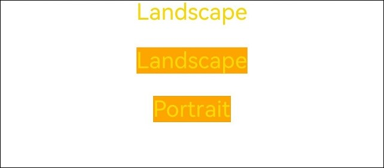

# Media Query (@ohos.mediaquery)


## Overview

[Media queries](../reference/apis-arkui/js-apis-mediaquery.md), the cornerstone of responsive design, are widely used on mobile devices. You can use media queries to apply application styles based on the device type or device state. Specifically, media queries allow you to:

1. Design a layout style based on the device and application attributes (such as display area, dark light color, and resolution).

2. Update the page layout to adapt to dynamic screen changes (for example, screen splitting or switching between landscape and portrait modes).


## Usage

Invoke the API in the **mediaquery** module to set the media query condition and the callback, and change the page layout or implement service logic in the callback corresponding to the condition. The procedure is as follows:

Import the **mediaquery** module, as shown below:


```ts
import { mediaquery } from '@kit.ArkUI';
```

Use the **matchMediaSync** API to set the media query condition and save the returned listener. The following is the example for listening for landscape events:


```ts
let listener: mediaquery.MediaQueryListener = mediaquery.matchMediaSync('(orientation: landscape)');
```

Register the **onPortrait** callback using the saved listener, and change the page layout or implement service logic in the callback. When the media query condition is matched, the callback is triggered. The sample code is as follows:


```ts
onPortrait(mediaQueryResult: mediaquery.MediaQueryResult) {
  if (mediaQueryResult.matches as boolean) {
    // do something here
  } else {
    // do something here
  }
}

listener.on('change', onPortrait);
```


## Media Query Conditions

The media query condition consists of the media type (optional), logical operator, and media feature. The logical operator is used to connect different media types and media features. A media feature must be enclosed in parentheses (). There may be multiple media features.


### Syntax

Syntax rules include [media-type](#media-type), [media-logic-operations](#media-logic-operations), and [media-feature](#media-feature).


```ts
[media-type] [media-logic-operations] [(media-feature)]
```

Examples are as follows:

- **screen and (round-screen: true)**: The query is valid when the device screen is round.

- **(max-height: 800px)**: The query is valid when the height is less than or equal to 800 px.

- **(height &lt;= 800px)**: The query is valid when the height is less than or equal to 800 px.

- **screen and (device-type: tv) or (resolution < 2)**: The query is valid when the device type is TV or the device resolution is less than 2. This is a multi-condition query that contains multiple media features.

- **(dark-mode: true)**: The query is valid when the system is in dark mode.


### media-type
When media types are not specified in a media query, the default type **screen** is used. Media types must be placed at the beginning of the query condition.

| **Type**| **Description**        |
| ------ | -------------- |
| screen | Media query based on screen-related parameters.|


### media-logic-operations

You can use logical operators (**and**, **or**, **not**, and **only**) to compose complex media queries. You can also combine them using comma (,). The following table describes the operators.

  **Table 1** Media logical operators

| Type            | Description                                                        |
| ---------------- | ------------------------------------------------------------ |
| and              | The **and** operator is used to combine multiple media features into one media query, in a logical AND operation. The query is valid only when all media features are true. It can also combine media types and media functions. For example, **screen and (device-type: wearable) and (max-height: 600px)** evaluates to **true** when the device type is wearable and the maximum height of the application is 600 pixel units.|
| or               | The **or** operator is used to combine multiple media features into one media query, in a logical OR operation. The query is valid if a media feature is true. For example, **screen and (max-height: 1000px) or (round-screen: true)** indicates that the query is valid when the maximum height of the application is 1000 pixel units or the device screen is round.|
| not              | The **not** operator is used to perform a logical negation for a media query. It must be used in conjunction with **screen**. **true** is returned if the query condition is not met. Otherwise, **false** is returned. For example, **not screen and (min-height: 50px) and (max-height: 600px)** evaluates to **true** when the height of the application is less than 50 pixel units or greater than 600 pixel units.|
| only             | The **only** operator must be used with **screen** to ensure that the styles are only applied when the media query matches. It has the same effect as using **screen** alone. Example: **only screen and (height &lt;= 50) **|
| comma (,) | The **or** operator is used to combine multiple media features into one media query, in a logical OR operation. The query is valid if a media feature is true. The effect of a comma operator is equivalent to that of the **or** operator. For example, **screen and (min-height: 1000px), (round-screen: true)** indicates that the query is valid when the minimum height of the application is 1000 pixel units or the device screen is round.|

Media range operators include <=, >=, <, and >. For details, see the following table.

  **Table 2** Logical operators for range query

| Type   | Description                                      |
| ----- | ---------------------------------------- |
| &lt;= | Less than or equal to, for example, **screen and (50 &lt;= height)**.|
| &gt;= | Greater than or equal to, for example, **screen and (600 &gt;= height)**.|
| &lt;  | Less than, for example, **screen and (50 &lt; height)**.|
| &gt;  | Greater than, for example, **screen and (height > 600)**.|


### media-feature

The media features include the width and height of the application display area, device resolution, and device width and height. For details, see the following table.

  **Table 3** Media features

For width and height related features, the units vp and px are supported. If no unit is specified, px is used by default.

| Type               | Description                                      |
| ----------------- | ---------------------------------------- |
| height            | Height of the drawing area of the application.                           |
| min-height        | Minimum height of the drawing area of the application.                         |
| max-height        | Maximum height of the drawing area of the application.                         |
| width             | Width of the drawing area of the application.                           |
| min-width         | Minimum width of the drawing area of the application.                         |
| max-width         | Maximum width of the drawing area of the application.                         |
| resolution        | Resolution of the device. The unit can be dpi, dppx, or dpcm.  <br>- **dpi** indicates the number of physical pixels per inch. 1 dpi ≈ 0.39 dpcm.<br>- **dpcm** indicates the number of physical pixels per centimeter. 1 dpcm ≈ 2.54 dpi.<br>- **dppx** indicates the number of physical pixels in each pixel. (This unit is calculated based on this formula: 96 px = 1 inch, which is different from the calculation method of the px unit on the page.) 1 dppx = 96 dpi.|
| min-resolution    | Minimum device resolution.                               |
| max-resolution    | Maximum device resolution.                               |
| orientation       | Screen orientation.<br>Options are as follows:<br>- orientation: portrait<br>- orientation: landscape|
| device-height     | Height of the device.                                  |
| min-device-height | Minimum height of the device.                                |
| max-device-height | Maximum height of the device.                                |
| device-width      | Width of the device. The settings are only saved once during application initialization and do not update in real-time with device width changes, such as in scenarios where a foldable screen is folded or unfolded.                                  |
| device-type       | Type of the device.<br>Available options: **default** and **tablet**          |
| min-device-width  | Minimum width of the device.                                |
| max-device-width  | Maximum width of the device.                                |
| round-screen      | Screen type. The value **true** indicates a circular screen, and **false** indicates a non-circular screen.             |
| dark-mode         | Whether the device is in dark mode. The value **true** means that the device is in dark mode, and **false** means the opposite.                 |

>**NOTE**
>
>Of the preceding media features, only height and width are supported on widgets.

## Example Scenario

In the following examples, media queries are used to apply different content and styles to the page text when the screen is switched between landscape and portrait modes.

Stage model:


```ts
import { mediaquery, window } from '@kit.ArkUI';
import { common } from '@kit.AbilityKit';

@Entry
@Component
struct MediaQueryExample {
  @State color: string = '#DB7093';
  @State text: string = 'Portrait';
  // The query is valid when the device is in landscape mode.
  listener:mediaquery.MediaQueryListener = this.getUIContext().getMediaQuery().matchMediaSync('(orientation: landscape)');

  // The callback is triggered when the query is valid.
  onPortrait(mediaQueryResult:mediaquery.MediaQueryResult) {
    if (mediaQueryResult.matches as boolean) {// If the device is in landscape mode, the page layout is changed accordingly.
      this.color = '#FFD700';
      this.text = 'Landscape';
    } else {
      this.color = '#DB7093';
      this.text = 'Portrait';
    }
  }

  aboutToAppear() {
    // Bind to the current application instance.
    // Register the callback.
    this.listener.on('change', (mediaQueryResult: mediaquery.MediaQueryResult) => {
      this.onPortrait(mediaQueryResult)
    });
  }

  aboutToDisappear() {
    // Unbind the callback function registered in the listener.
    this.listener.off('change');
  }

  // Change the landscape/portrait mode of the device in the callback.
  private changeOrientation(isLandscape: boolean) {
    // Obtain the context information of the UIAbility instance.
    let context:common.UIAbilityContext = this.getUIContext().getHostContext() as common.UIAbilityContext;
    // Invoke this API to manually change the landscape/portrait mode of the device.
    window.getLastWindow(context).then((lastWindow) => {
      lastWindow.setPreferredOrientation(isLandscape ? window.Orientation.LANDSCAPE : window.Orientation.PORTRAIT)
    });
  }

  build() {
    Column({ space: 50 }) {
      Text(this.text).fontSize(50).fontColor(this.color)
      Text('Landscape').fontSize(50).fontColor(this.color).backgroundColor(Color.Orange)
        .onClick(() => {
          this.changeOrientation(true);
        })
      Text('Portrait').fontSize(50).fontColor(this.color).backgroundColor(Color.Orange)
        .onClick(() => {
          this.changeOrientation(false);
        })
    }
    .width('100%').height('100%')
  }
}
```

FA model:


```ts
import { mediaquery } from '@kit.ArkUI';
import { featureAbility } from '@kit.AbilityKit';

@Entry
@Component
struct MediaQueryExample {
  @State color: string = '#DB7093';
  @State text: string = 'Portrait';
  listener:mediaquery.MediaQueryListener = mediaquery.matchMediaSync('(orientation: landscape)'); // The query is valid when the device is in landscape mode.

  onPortrait(mediaQueryResult:mediaquery.MediaQueryResult) { // The callback is triggered when the query is valid.
    if (mediaQueryResult.matches as boolean) {// If the device is in landscape mode, the page layout is changed accordingly.
      this.color = '#FFD700';
      this.text = 'Landscape';
    } else {
      this.color = '#DB7093';
      this.text = 'Portrait';
    }
  }

  aboutToAppear() {
    // Bind to the current application instance.
    this.listener.on('change', (mediaQueryResult:mediaquery.MediaQueryResult) => { this.onPortrait(mediaQueryResult) }); // Register the callback.
  }

  aboutToDisappear() {
    // Unbind the callback function registered in the listener.
    this.listener.off('change');
  }

  build() {
    Column({ space: 50 }) {
      Text(this.text).fontSize(50).fontColor(this.color)
      Text('Landscape').fontSize(50).fontColor(this.color).backgroundColor(Color.Orange)
        .onClick(() => {
          let context = featureAbility.getContext();
          context.setDisplayOrientation(0); // Invoke this API to manually change the landscape/portrait mode of the device.
        })
      Text('Portrait').fontSize(50).fontColor(this.color).backgroundColor(Color.Orange)
        .onClick(() => {
          let context = featureAbility.getContext();
          context.setDisplayOrientation(1); // Invoke this API to manually change the landscape/portrait mode of the device.
        })
    }
    .width('100%').height('100%')
  }
}
```

  **Figure 1** Portrait mode 


  **Figure 2** Landscape mode 



