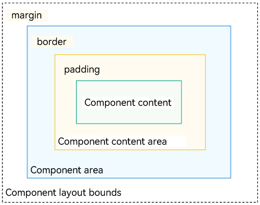

# Layout Overview

In the declarative UI, page layout is the art of organizing custom components sequentially over a page. A well-designed layout can help you present information intuitively and effectively.

You design page layout by leveraging specific components or attributes to control the size and position of components on pages. The design process involves the following steps:

- Determine the layout structure of the page.

- Analyze the elements on the page.

- Select container components and attributes to control the position and size of each element on the page.

## Layout Structure

A layout is generally in a hierarchical structure. Below is a common page structure.

  **Figure 1** Common page structure 

To achieve the preceding effect, you need to declare the corresponding elements on the page. **Page** indicates the root node of the page, and other elements such as **Column** and **Row** are built-in components. ArkUI provides a wide variety of layout components, which you can draw on to implement different layouts. For example, you can use **Row** to implement a linear layout.

## Layout Elements

You can use layout-related container components to create a specific layout. For example, the **List** component can form a linear layout.

  **Figure 2** Layout elements 

- Component area (blue block): size of the component, subject to the [width](../reference/apis-arkui/arkui-ts/ts-universal-attributes-size.md#width) and [height](../reference/apis-arkui/arkui-ts/ts-universal-attributes-size.md#height) attributes.

- Component content area (yellow block): size of the component area minus the [border](../reference/apis-arkui/arkui-ts/ts-universal-attributes-border.md#border) of the component. It serves as the layout constraint for calculating the size of the component content (or child component).

- Component content (green block): size of the component content, for example, size of the text content in the component. The component content may not match the component content area. For example, if fixed width and height values are set, the component content area is the size obtained with the width and height minus the paddings and border. The component content is the size calculated by the layout engine, which may be less than the component content area. When the component content and component content area do not match, the [align](../reference/apis-arkui/arkui-ts/ts-universal-attributes-location.md#align) attribute takes effect, defining the alignment mode of the component content in the component content area, for example, center aligned.

- Component layout bounds (dotted lines): component area plus the [margins](../reference/apis-arkui/arkui-ts/ts-universal-attributes-size.md#margin) (if supplied). 

## Layout Selection

The declarative UI provides the following common layouts. Choose a layout that best suits the use case.

| Layout                                                        | Description                                                    |
| ------------------------------------------------------------ | ------------------------------------------------------------ |
| [Linear layout](arkts-layout-development-linear.md) (Row and Column)| Use this layout when there are multiple child components and they can be arranged linearly.|
| [Stack layout](arkts-layout-development-stack-layout.md) (Stack)| Use this layout when you want to stack components. The stacking does not occupy or affect the layout space of other components in the same container. For example, when the [Panel](../reference/apis-arkui/arkui-ts/ts-container-panel.md) component is displayed as a child, superimposing it over other components makes more sense. In this case, the stack layout is preferred at the outer layer.|
| [Flex layout](arkts-layout-development-flex-layout.md) (Flex) | The flex layout is similar to the linear layout. However, it empowers the container to adjust the size of its child components to best fill the available space. Use this layout when you need elements to stretch or shrink to fit into the container.|
| [Relative layout](arkts-layout-development-relative-layout.md) (RelativeContainer)| The relative layout is a two-dimensional layout system. It does not need to comply with linear layout rules, and therefore exhibits more flexibility. By setting anchor rules (**AlignRules**) on a child component, you enable the component to position itself on the horizontal axis and vertical axis as relative to other child component in the container. Anchor rules support compression, stretching, stacking, and wrapping of child components. Use this layout when the distribution of elements is complex or when a linear layout may result in deeply nested components in the container.|
| [Responsive grid layout](arkts-layout-development-grid-layout.md) (GridRow and GridCol)| The responsive grid is an auxiliary positioning tool for a multi-device application, with capability of dividing space into rows and columns. Unlike the regular grid, the responsive grid is not allocating fixed-size space. Instead, it allows a layout to dynamically change based on the screen size. In this way, the design and development costs for adapting to different screen sizes are significantly reduced, and the overall design and development process is more orderly and rhythmic. In addition, the responsive grid offers a consistent display experience across devices. Use this layout when you are presenting the same content on different screen sizes.|
| [Media query](arkts-layout-development-media-query.md) (\@ohos.mediaquery)| You can use media queries to apply application styles based on the device type or device state. For example, you can apply specific layouts based on the attribute information of the target device and application, and update a page layout to reflect the dynamic screen changes.|
| [List](arkts-layout-development-create-list.md) (List)     | Use lists to display structured, scrollable information efficiently. In ArkUI, the list allows you to lay out elements in the horizontal or vertical layout and is able to adapt to the number of elements in the cross axis direction. It can scroll when the content overflows. Use this layout when you are presenting similar data types or data type sets, such as images and text.|
| [Grid](arkts-layout-development-create-grid.md) (Grid)     | The grid excels at spacing elements evenly and defining the relationship between the elements. The grid layout controls the number of cells occupied by child components, number of rows or columns that child components span, and how the child components and spacing are adjusted proportionally when the grid container size changes. Use this layout in scenarios where space needs to be allocated evenly or based on a fixed proportion, such as calculators, albums, and calendars.|
| [Looping](arkts-layout-development-create-looping.md) (Swiper)| Use this layout when you want to implement ad rotation and image preview.      |
| [Tabs](arkts-navigation-tabs.md)| The **Tabs** component can quickly switch between views on a page, improving information search efficiency and reducing the amount of information that users receive at a time.      |

## Layout Position

Attributes such as **position** and **offset** affect the position of the layout container relative to itself or other components.

| Positioning Capability| Description                                                    | Implementation                                                    |
| -------- | ------------------------------------------------------------ | ------------------------------------------------------------ |
| Absolute positioning| Absolute positioning is poor in adaptability to devices of different sizes, and is prone to screen adaptation errors.| Use [position](../reference/apis-arkui/arkui-ts/ts-universal-attributes-location.md#position) to implement absolute positioning and set the offset position of the upper left corner of an element relative to the upper left corner of the parent container. When laying out components, this attribute does not affect the layout of the parent component. It only adjusts the component position during drawing.|
| Relative positioning| Relative positioning keeps an element in the normal document flow, while allowing you to move it around relative to its original location.| You can use [offset](../reference/apis-arkui/arkui-ts/ts-universal-attributes-location.md#offset) to implement relative positioning and set the offset of an element relative to itself. This attribute does not affect the layout of the parent component. It only adjusts the component position during drawing.|

## Constraints on Child Components

* Stretching: When the size of a container component changes, the increased or decreased amount of space is allocated to the specified area in the container component.

  [flexGrow](../reference/apis-arkui/arkui-ts/ts-universal-attributes-flex-layout.md#flexgrow) and [flexShrink](../reference/apis-arkui/arkui-ts/ts-universal-attributes-flex-layout.md#flexshrink) attributes:
  1. **flexGrow** defines the grow factor of a flex item.
  2. **flexShrink** defines the shrink factor of a flex item.

* Scaling: The width and height of a child component change with the container component, with its aspect ratio fixed at the preset value.

  The [aspectRatio](../reference/apis-arkui/arkui-ts/ts-universal-attributes-layout-constraints.md#aspectratio) attribute specifies the aspect ratio of the current component. The formula is as follows: aspectRatio = width/height.

* Proportion: The width and height of child components to adjust dynamically in response to changes in the size of the container component, according to the preset proportion value.

  Two implementation modes are available with the universal attributes:
  1. Set the width and height of the child components as percentages.

      | Parent and Ancestor Component Setting| Child Component Percentage Reference|
      |---|---|
      | The parent component sets the width or height, and the ancestor component does not specify the parent's width or height.| Based on the parent component's width and height|
      | The parent component sets the width or height, and the ancestor component specifies the parent's width or height.| Based on the parent component's width and height specified by the ancestor component|
      | The parent component does not the set width or height, and the ancestor component specifies the parent's width or height| Based on the parent component's width and height specified by the ancestor component|
      | The parent component does not set the width or height, and the ancestor component does not specify the parent's width or height| Based on the percentage reference inherited from the parent component. Since the parent component does not specify the width or height, this reference is passed down from the ancestor component.|
  2. Use the [layoutWeight](../reference/apis-arkui/arkui-ts/ts-universal-attributes-size.md#layoutweight) attribute to enable the child components to adaptively occupy the remaining space.

* Hiding: The child components in a container component are shown or hidden according to their preset display priority as the container component's size changes. Child components with the same display priority are shown or hidden at the same time.

  This feature is governed by the [displayPriority](../reference/apis-arkui/arkui-ts/ts-universal-attributes-layout-constraints.md#displaypriority) attribute, which dictates the visibility of components.

