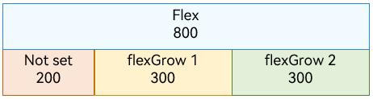
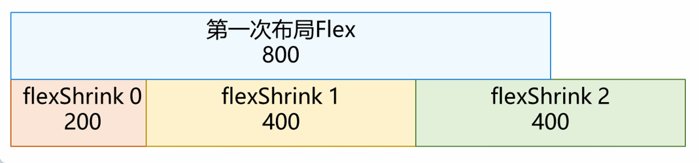
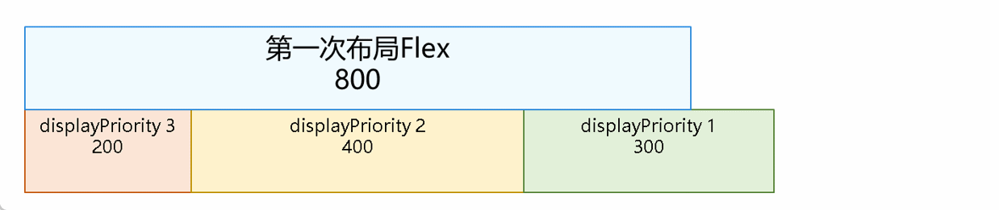

# Improving Layout Performance

When you are using the **\<Flex>** component, note that its layout performance may drop in certain scenarios. The **\<Flex>** component is a container whose child components are automatically laid out to create a flexible layout. By default, the child components are arranged along the main axis. The size of a child component along the main axis is called its main axis size.

In the single-row layout scenario, if the total main axis length of child components is not equal to the main axis length of the container, some child components are laid out twice to fill the container, that is, secondary layout is required. As a result, the layout efficiency decreases.

## Scenario 1

The **DisplayPriority** or **LayoutWeight** attribute of all child components is set to their default value or is not set. In this scenario, the child components are all laid out in sequence.

- If the total main axis length of the child components is equal to the main axis length of the container in the first layout, no secondary layout is required.

  

- If the total main axis length of the child components is less than the main axis length of the container in the first layout, the child components with valid **flexGrow** values will trigger secondary layout and be stretched to fill the container.

  

- If the total main axis length of the child components is greater than the main axis length of the container in the first layout, the child components with valid **flexShrink** (whose default value **1** is valid) values will trigger secondary layout and shrink to fill the container.

  

## Scenario 2

The **DisplayPriority** attribute is set for the child component, but not the **LayoutWeight** attribute.

In this scenario, the child components with the same **DisplayPriority** value are laid out in groups, in descending order of the **DisplayPriority** values. When the total main axis length of the child components reaches the maximum and does not exceed the main axis length of the container, child components that have not been laid out and have the smallest **DisplayPriority** value will be discarded (a set of child components with critical **DisplayPriority** values may be laid out but still be discarded).

- If the total main axis length of the child components is equal to the main axis length of the container in the first layout, no secondary layout is required.
  
  
  
- If the total main axis length of the child components is less than the main axis length of the container in the first layout, the child components with valid **flexGrow** values will trigger secondary layout and be stretched to fill the container.
  
  

## Scenario 3

The **LayoutWeight** attribute is set for the child component.

In this scenario, the child components with the same **DisplayPriority** value and without the **LayoutWeight** attribute set are laid out in groups, in descending order of the **DisplayPriority** values. When the total main axis length of the child components reaches the maximum and does not exceed the main axis length of the container, child components that have not been laid out and have the smallest **DisplayPriority** value will be discarded (a set of child components with critical **DisplayPriority** values may be laid out but still be discarded).

The remaining space in the container is filled by child components for which the **LayoutWeight** attribute is set.

- The child components are laid out only once in this process, and secondary layout is not triggered.
  
  

## How to Optimize Flex Layout Performance

- Use **\<Column>** and **\<Row>** instead of **\<Flex>**.

- Set the **flexShrink** attribute of child components whose size does not need to be changed to **0**.

- Prioritize the **LayoutWeight** attribute over the **flexGrow** and **flexShrink** attributes.

- Use the most common layout result so that the total main axis length of child components is equal to the main axis length of the **\<Flex>** container.
