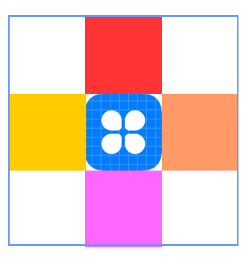

# Relative Layout (RelativeContainer)


## Overview

The relative layout, implemented using the [\<RelativeContainer>](../reference/arkui-ts/ts-container-relativecontainer.md) container component, is used to lay out child elements in relative positions. A child element can set the container or another child element as the anchor, based on which its relative position is determined. Below shows a relative layout. The dotted lines in the figure indicate the position dependency.


  **Figure 1** Relative layout 


A child element does not necessarily adopt the dependency shown above to determine its relative position. For example, Item4 may use Item2 or the **\<RelativeContainer>** parent container as a dependency anchor.


## Basic Concepts

- Anchor: element relative to which an element's position is specified.

- Alignment mode: how the current element is aligned with the anchor, which can be top-, center-, or bottom-aligned in the vertical direction or left-, center-, and right-aligned in the horizontal direction.


## Setting the Dependency


### Setting the Anchor

By setting the anchor, you set a position dependency relationship between a child element and its parent element or sibling elements. In the horizontal direction, you can set the left, middle, and right anchors. In the vertical direction, you can set the top, center, and bottom anchors. To specify anchors, you must set IDs for the **\<RelativeContainer>** component and its child elements. The default ID is **container**. The ID is set through the **id** attribute. Child elements whose IDs are not set are not displayed in the **\<RelativeContainer>** component.

>**NOTE**
>
>When using anchors, pay attention to the relative positions of child elements to avoid misplacement or blocking.

- The ID of the **\<RelativeContainer>** parent component is **container**.

  ```ts
  RelativeContainer() {
    Row()
      // Add other attributes.
      .alignRules({
        top: { anchor: '__container__', align: VerticalAlign.Top },
        left: { anchor: '__container__', align: HorizontalAlign.Start }
      })
      .id("row1")

    Row()
      ...
      .alignRules({
        top: { anchor: '__container__', align: VerticalAlign.Top },
        right: { anchor: '__container__', align: HorizontalAlign.End }
      })
      .id("row2")
  }
  ...
  ```

  

- A child element is used as the anchor.

  ```ts
  RelativeContainer() {
    ...
    top: { anchor: 'row1', align: VerticalAlign.Bottom },
    ...
  }
  .width(300).height(300)
  .margin({ left: 20 })
  .border({ width: 2, color: '#6699FF' })
  ```

  


### Setting Alignment Relative to the Anchor

After an anchor is set, you can use **align** to set the alignment mode relative to the anchor.

Alignment modes in the horizontal direction can be left, center, or right, achieved by the **HorizontalAlign.Start**, **HorizontalAlign.Center**, and **HorizontalAlign.End** attributes, respectively.


Alignment modes in the vertical direction can be top, center, or bottom, achieved by the **HorizontalAlign.Top**, **HorizontalAlign.Center**, and **HorizontalAlign.Bottom** attributes, respectively.


## Example

Child elements in the relative layout are flexible. You can use **alignRules** to move child elements in the **\<RelativeContainer>** container.


```ts
@Entry
@Component
struct Index {
  build() {
    Row() {
      RelativeContainer() {
        Row()
          .width(100)
          .height(100)
          .backgroundColor('#FF3333')
          .alignRules({
            top: { anchor: '__container__', align: VerticalAlign.Top },  // Use the parent container as the anchor and align with its top vertically.
            middle: { anchor: '__container__', align: HorizontalAlign.Center }  // Use the parent container as the anchor and align with its center horizontally.
          })
          .id('row1') // Set the anchor to row1.

        Row() {
          Image($r('app.media.icon'))
        }
        .height(100).width(100)
        .alignRules({
          top: { anchor: 'row1', align: VerticalAlign.Bottom },  // Use row1 as the anchor and align with its bottom vertically.
          left: { anchor: 'row1', align: HorizontalAlign.Start }  // Use row1 as the anchor and align with its left horizontally.
        })
        .id('row2') // Set the anchor to row2.

        Row()
          .width(100)
          .height(100)
          .backgroundColor('#FFCC00')
          .alignRules({
            top: { anchor: 'row2', align: VerticalAlign.Top }
          })
          .id('row3') // Set the anchor to row3.

        Row()
          .width(100)
          .height(100)
          .backgroundColor('#FF9966')
          .alignRules({
            top: { anchor: 'row2', align: VerticalAlign.Top },
            left: { anchor: 'row2', align: HorizontalAlign.End },
          })
          .id('row4') // Set the anchor to row4.

        Row()
          .width(100)
          .height(100)
          .backgroundColor('#FF66FF')
          .alignRules({
            top: { anchor: 'row2', align: VerticalAlign.Bottom },
            middle: { anchor: 'row2', align: HorizontalAlign.Center }
          })
          .id('row5') // Set the anchor to row5.
      }
      .width(300).height(300)
      .border({ width: 2, color: '#6699FF' })
    }
    .height('100%').margin({ left: 30 })
  }
}
```


