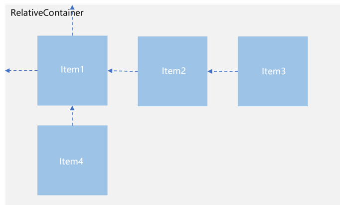
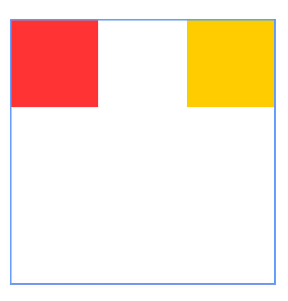
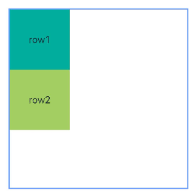
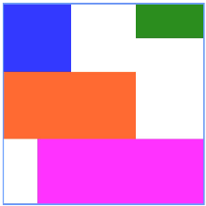
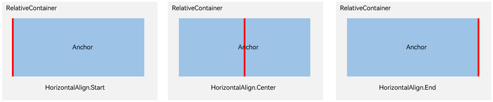
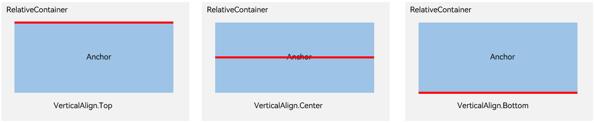
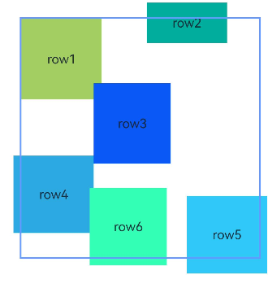
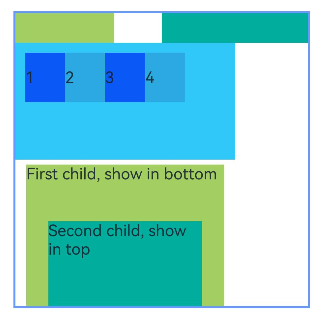
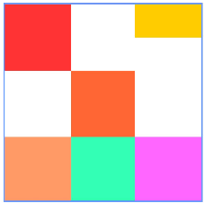

# Relative Layout (RelativeContainer)


## Overview

During application development, nesting components – same or different – is common in page layout, especially when the target page is complicated. Yet, nesting components too deeply, or nesting too many components, can be especially expensive. Naturally, optimizing the layout hierarchies can effectively lead to better performance and less time overhead. <!--Del-->For details about how the relative container is more performance-efficient than the list, see [Improving Layout Performance](../performance/reduce-view-nesting-levels.md).<!--DelEnd-->

The relative layout, implemented using the **RelativeContainer** container component, is used to lay out child elements in relative positions. It is applicable to element alignment in complex scenarios. A child element can use the container or another child element as the anchor, based on which its relative position is determined. Below shows a relative layout. The dotted lines in the figure indicate the position dependency.


  **Figure 1** Relative layout 




A child element does not necessarily adopt the dependency shown above to determine its relative position. For example, Item4 may use Item2 or the **RelativeContainer** parent container as a dependency anchor.


## Basic Concepts

- Anchor: element relative to which an element's position is specified.

- Alignment mode: how the current element is aligned with the anchor, which can be top-, center-, or bottom-aligned in the vertical direction or left-, center-, and right-aligned in the horizontal direction.


## Setting the Dependency


### Setting the Anchor

By setting the anchor, you set a position dependency relationship between a child element and its parent element or sibling elements. In the horizontal direction, you can set the left, middle, and right anchors. In the vertical direction, you can set the top, center, and bottom anchors.
To specify anchors, you must set IDs for the **RelativeContainer** component and its child elements. The default ID is **\_\_container\_\_**, and the IDs for the remaining child elements are set through the **id** attribute.  Components without **id** set can be displayed but cannot be used as anchors by other child components; the relative layout container will generate an ID for them, and the pattern of this ID is not predictable by the application logic. When a mutual or circular dependency occurs, none of the child components in the container are drawn. If anchors are set for more than two positions in a single direction but the anchor positions are reversed, the size of the child component is 0, which means that the child component is not drawn. 

>**NOTE**
>
>When using anchors, pay attention to the relative positions of child elements to avoid misplacement or blocking.

- The ID of the **RelativeContainer** parent component is **__container__**.

  ```ts
  let AlignRus:Record<string,Record<string,string|VerticalAlign|HorizontalAlign>> = {
    'top': { 'anchor': '__container__', 'align': VerticalAlign.Top },
    'left': { 'anchor': '__container__', 'align': HorizontalAlign.Start }
  }
  let AlignRue:Record<string,Record<string,string|VerticalAlign|HorizontalAlign>> = {
    'top': { 'anchor': '__container__', 'align': VerticalAlign.Top },
    'right': { 'anchor': '__container__', 'align': HorizontalAlign.End }
  }
  let Mleft:Record<string,number> = { 'left': 20 }
  let BWC:Record<string,number|string> = { 'width': 2, 'color': '#6699FF' }
 
  @Entry
  @Component
  struct Index {
    build() {
      RelativeContainer() {
        Row(){Text('row1')}.justifyContent(FlexAlign.Center).width(100).height(100)
        .backgroundColor("#FF3333")
        .alignRules(AlignRus)
        .id("row1")

        Row(){Text('row2')}.justifyContent(FlexAlign.Center).width(100).height(100)
        .backgroundColor("#FFCC00")
        .alignRules(AlignRue)
        .id("row2")
      }.width(300).height(300)
      .margin(Mleft)
      .border(BWC)
    }
  }
  ```

  

- Example of using a sibling element as the anchor:

  ```ts
  let AlignRus:Record<string,Record<string,string|VerticalAlign|HorizontalAlign>> = {
    'top': { 'anchor': '__container__', 'align': VerticalAlign.Top },
    'left': { 'anchor': '__container__', 'align': HorizontalAlign.Start }
  }
  let RelConB:Record<string,Record<string,string|VerticalAlign|HorizontalAlign>> = {
    'top': { 'anchor': 'row1', 'align': VerticalAlign.Bottom },
    'left' : { 'anchor': 'row1', 'align': HorizontalAlign.Start }
  }
  let Mleft:Record<string,number> = { 'left': 20 }
  let BWC:Record<string,number|string> = { 'width': 2, 'color': '#6699FF' }

  @Entry
  @Component
  struct Index {
    build() {
      RelativeContainer() {
        Row(){Text('row1')}.justifyContent(FlexAlign.Center).width(100).height(100)
        .backgroundColor("#FF3333")
        .alignRules(AlignRus)
        .id("row1")

        Row(){Text('row2')}.justifyContent(FlexAlign.Center).width(100).height(100)
        .backgroundColor("#FFCC00")
        .alignRules(RelConB)
        .id("row2")
      }.width(300).height(300)
      .margin(Mleft)
      .border(BWC)
    }
  }
  ```

  

- Make sure the anchors of a child component do not depend on each other.

  ```ts
  @Entry
  @Component
  struct Index {
    build() {
      Row() {
        RelativeContainer() {
          Row(){Text('row1')}.justifyContent(FlexAlign.Center).width(100).height(100)
            .backgroundColor('#ff3339ff')
            .alignRules({
              top: {anchor: "__container__", align: VerticalAlign.Top},
              left: {anchor: "__container__", align: HorizontalAlign.Start}
            })
            .id("row1")

          Row(){Text('row2')}.justifyContent(FlexAlign.Center).width(100)
            .backgroundColor('#ff298e1e')
            .alignRules({
              top: {anchor: "__container__", align: VerticalAlign.Top},
              right: {anchor: "__container__", align: HorizontalAlign.End},
              bottom: {anchor: "row1", align: VerticalAlign.Center},
            })
            .id("row2")

          Row(){Text('row3')}.justifyContent(FlexAlign.Center).height(100)
            .backgroundColor('#ffff6a33')
            .alignRules({
              top: {anchor: "row1", align: VerticalAlign.Bottom},
              left: {anchor: "row1", align: HorizontalAlign.Start},
              right: {anchor: "row2", align: HorizontalAlign.Start}
            })
            .id("row3")

          Row(){Text('row4')}.justifyContent(FlexAlign.Center)
            .backgroundColor('#ffff33fd')
            .alignRules({
              top: {anchor: "row3", align: VerticalAlign.Bottom},
              left: {anchor: "row1", align: HorizontalAlign.Center},
              right: {anchor: "row2", align: HorizontalAlign.End},
              bottom: {anchor: "__container__", align: VerticalAlign.Bottom}
            })
            .id("row4")
        }
        .width(300).height(300)
        .margin({left: 50})
        .border({width:2, color: "#6699FF"})
      }
      .height('100%')
    }
  }
  ```
  

### Setting Alignment Relative to the Anchor

After an anchor is set, you can use **align** to set the alignment mode relative to the anchor.

Alignment modes in the horizontal direction can be left, center, or right, achieved by the **HorizontalAlign.Start**, **HorizontalAlign.Center**, and **HorizontalAlign.End** attributes, respectively.



Alignment modes in the vertical direction can be top, center, or bottom, achieved by the **VerticalAlign.Top**, **VerticalAlign.Center**, and **VerticalAlign.Bottom** attributes, respectively.



### Setting Offset

After being aligned relative to the anchor, a child component may be still not at its target position. In this case, you can set the offset.

  ```ts
  @Entry
  @Component
  struct Index {
    build() {
      Row() {
        RelativeContainer() {
          Row(){Text('row1')}.justifyContent(FlexAlign.Center).width(100).height(100)
            .backgroundColor("#FF3333")
            .alignRules({
              top: {anchor: "__container__", align: VerticalAlign.Top},
              left: {anchor: "__container__", align: HorizontalAlign.Start}
            })
            .id("row1")

          Row(){Text('row2')}.justifyContent(FlexAlign.Center).width(100)
            .backgroundColor("#FFCC00")
            .alignRules({
              top: {anchor: "__container__", align: VerticalAlign.Top},
              right: {anchor: "__container__", align: HorizontalAlign.End},
              bottom: {anchor: "row1", align: VerticalAlign.Center},
            })
            .offset({
              x:-40,
              y:-20
            })
            .id("row2")

          Row(){Text('row3')}.justifyContent(FlexAlign.Center).height(100)
            .backgroundColor("#FF6633")
            .alignRules({
              top: {anchor: "row1", align: VerticalAlign.Bottom},
              left: {anchor: "row1", align: HorizontalAlign.End},
              right: {anchor: "row2", align: HorizontalAlign.Start}
            })
            .offset({
              x:-10,
              y:-20
            })
            .id("row3")

          Row(){Text('row4')}.justifyContent(FlexAlign.Center)
            .backgroundColor("#FF9966")
            .alignRules({
              top: {anchor: "row3", align: VerticalAlign.Bottom},
              bottom: {anchor: "__container__", align: VerticalAlign.Bottom},
              left: {anchor: "__container__", align: HorizontalAlign.Start},
              right: {anchor: "row1", align: HorizontalAlign.End}
            })
            .offset({
              x:-10,
              y:-30
            })
            .id("row4")

          Row(){Text('row5')}.justifyContent(FlexAlign.Center)
            .backgroundColor("#FF66FF")
            .alignRules({
              top: {anchor: "row3", align: VerticalAlign.Bottom},
              bottom: {anchor: "__container__", align: VerticalAlign.Bottom},
              left: {anchor: "row2", align: HorizontalAlign.Start},
              right: {anchor: "row2", align: HorizontalAlign.End}
            })
            .offset({
              x:10,
              y:20
            })
            .id("row5")

          Row(){Text('row6')}.justifyContent(FlexAlign.Center)
            .backgroundColor('#ff33ffb5')
            .alignRules({
              top: {anchor: "row3", align: VerticalAlign.Bottom},
              bottom: {anchor: "row4", align: VerticalAlign.Bottom},
              left: {anchor: "row3", align: HorizontalAlign.Start},
              right: {anchor: "row3", align: HorizontalAlign.End}
            })
            .offset({
              x:-15,
              y:10
            })
            .backgroundImagePosition(Alignment.Bottom)
            .backgroundImageSize(ImageSize.Cover)
            .id("row6")
        }
        .width(300).height(300)
        .margin({left: 50})
        .border({width:2, color: "#6699FF"})
      }
      .height('100%')
    }
  }
  ```
  

## Aligning Components in Multiple Layouts

You can set components in multiple layout components, such as **Row**, **Column**, **Flex**, and **Stack**, to be aligned based on the relative layout rules.

  ```ts
  @Entry
  @Component
  struct Index {
    @State value: number = 0
    build() {
      Row() {

        RelativeContainer() {
          Row().width(100).height(100)
            .backgroundColor('#ff33ffcc')
            .alignRules({
              top: {anchor: "__container__", align: VerticalAlign.Top},
              left: {anchor: "__container__", align: HorizontalAlign.Start}
            })
            .id("row1")

          Column().width('50%').height(30).backgroundColor(0xAFEEEE)
            .alignRules({
              top: {anchor: "__container__", align: VerticalAlign.Top},
              left: {anchor: "__container__", align: HorizontalAlign.Center}
            }).id("row2")

          Flex({ direction: FlexDirection.Row }) {
            Text('1').width('20%').height(50).backgroundColor(0xF5DEB3)
            Text('2').width('20%').height(50).backgroundColor(0xD2B48C)
            Text('3').width('20%').height(50).backgroundColor(0xF5DEB3)
            Text('4').width('20%').height(50).backgroundColor(0xD2B48C)
          }
          .padding(10)
          .backgroundColor('#ffedafaf')
          .alignRules({
            top: {anchor: "row2", align: VerticalAlign.Bottom},
            left: {anchor: "__container__", align: HorizontalAlign.Start},
            bottom: {anchor: "__container__", align: VerticalAlign.Center},
            right: {anchor: "row2", align: HorizontalAlign.Center}
          })
          .id("row3")

          Stack({ alignContent: Alignment.Bottom }) {
            Text('First child, show in bottom').width('90%').height('100%').backgroundColor(0xd2cab3).align(Alignment.Top)
            Text('Second child, show in top').width('70%').height('60%').backgroundColor(0xc1cbac).align(Alignment.Top)
          }
          .margin({ top: 5 })
          .alignRules({
            top: {anchor: "row3", align: VerticalAlign.Bottom},
            left: {anchor: "__container__", align: HorizontalAlign.Start},
            bottom: {anchor: "__container__", align: VerticalAlign.Bottom},
            right: {anchor: "row3", align: HorizontalAlign.End}
          })
          .id("row4")

        }
        .width(300).height(300)
        .margin({left: 50})
        .border({width:2, color: "#6699FF"})
      }
      .height('100%')
    }
  }
  ```
  

## Component Size

The size of a child component is not affected by the relative layout rules. If two or more **alignRule** values are set for a child component in one direction, avoid setting the size in this direction. Otherwise, the component size determined by **alignRule** may conflict with the size you set.

  ```ts
  @Entry
  @Component
  struct Index {
    build() {
      Row() {
        RelativeContainer() {
          Row(){Text('row1')}.justifyContent(FlexAlign.Center)
            .width(100).height(100)
            .backgroundColor("#FF3333")
            .alignRules({
              top: {anchor: "__container__", align: VerticalAlign.Top},
              left: {anchor: "__container__", align: HorizontalAlign.Start}
            })
            .id("row1")

          Row(){Text('row2')}.justifyContent(FlexAlign.Center).width(100)
            .backgroundColor("#FFCC00")
            .alignRules({
              top: {anchor: "__container__", align: VerticalAlign.Top},
              right: {anchor: "__container__", align: HorizontalAlign.End},
              bottom: {anchor: "row1", align: VerticalAlign.Center},
            })
            .id("row2")

          Row(){Text('row3')}.justifyContent(FlexAlign.Center).height(100)
            .backgroundColor("#FF6633")
            .alignRules({
              top: {anchor: "row1", align: VerticalAlign.Bottom},
              left: {anchor: "row1", align: HorizontalAlign.End},
              right: {anchor: "row2", align: HorizontalAlign.Start}
            })
            .id("row3")

          Row(){Text('row4')}.justifyContent(FlexAlign.Center)
            .backgroundColor("#FF9966")
            .alignRules({
              top: {anchor: "row3", align: VerticalAlign.Bottom},
              bottom: {anchor: "__container__", align: VerticalAlign.Bottom},
              left: {anchor: "__container__", align: HorizontalAlign.Start},
              right: {anchor: "row1", align: HorizontalAlign.End}
            })
            .id("row4")

          Row(){Text('row5')}.justifyContent(FlexAlign.Center)
            .backgroundColor("#FF66FF")
            .alignRules({
              top: {anchor: "row3", align: VerticalAlign.Bottom},
              bottom: {anchor: "__container__", align: VerticalAlign.Bottom},
              left: {anchor: "row2", align: HorizontalAlign.Start},
              right: {anchor: "row2", align: HorizontalAlign.End}
            })
            .id("row5")

          Row(){Text('row6')}.justifyContent(FlexAlign.Center)
            .backgroundColor('#ff33ffb5')
            .alignRules({
              top: {anchor: "row3", align: VerticalAlign.Bottom},
              bottom: {anchor: "row4", align: VerticalAlign.Bottom},
              left: {anchor: "row3", align: HorizontalAlign.Start},
              right: {anchor: "row3", align: HorizontalAlign.End}
            })
            .id("row6")
            .backgroundImagePosition(Alignment.Bottom)
            .backgroundImageSize(ImageSize.Cover)
        }
        .width(300).height(300)
        .margin({left: 50})
        .border({width:2, color: "#6699FF"})
      }
      .height('100%')
    }
  }
  ```
  
