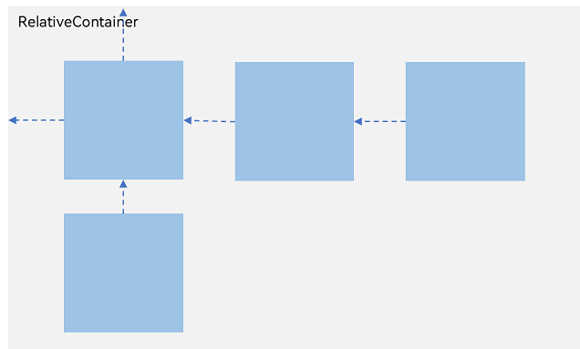
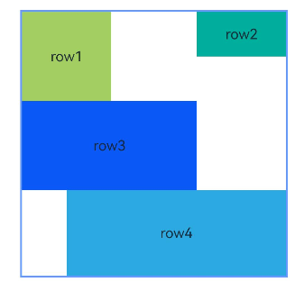
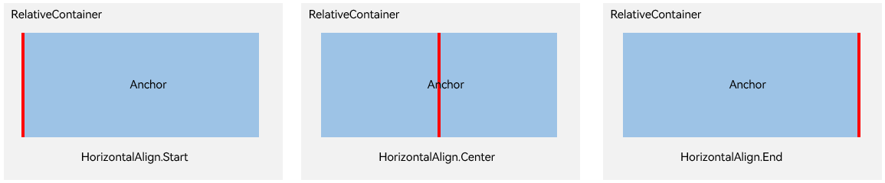
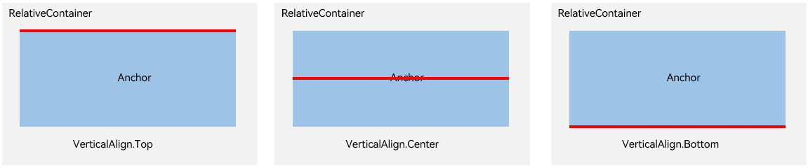
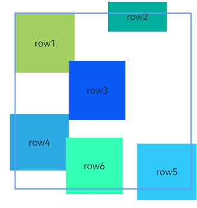
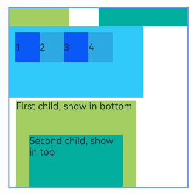
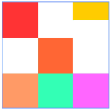

# Relative Layout (RelativeContainer)

<!--Kit: ArkUI-->
<!--Subsystem: ArkUI-->
<!--Owner: @fenglinbailu-->
<!--Designer: @lanshouren-->
<!--Tester: @liuli0427-->
<!--Adviser: @Brilliantry_Rui-->
<!-- md-trans-meta sourceCommit=c8954d33bacbdec6df88d8586db7cc9b9d8a799e translatedAt=2026-08-04T06:34:51.336Z pushedAt=2026-08-04T07:32:59.686Z -->

## Overview

During app development, complex UIs often require nesting multiple components of the same or different types. Deeply nested layout components or an excessive number of nested components can introduce additional overhead. Optimizing the layout approach can effectively improve performance and reduce time costs.

The relative layout, implemented using the **RelativeContainer** container component, is used to lay out child elements in relative positions. It is applicable to element alignment in complex scenarios. A child element can use either the container itself or another child element as an anchor to determine its relative position. When using anchors, pay attention to the relative positions of child elements to prevent misplacement or overlapping. The following figure illustrates the concept of **RelativeContainer**, where the dotted lines indicate positional dependencies.

  **Figure 1** Relative layout 



A child element does not necessarily adopt the dependency shown above to determine its relative position. For example, Item4 may use Item2 or the **RelativeContainer** parent container as a dependency anchor.

## Basic Concepts

- Reference boundary: boundary of the current component used for alignment with the anchor.

- Anchor: element used as a reference point for specifying another element's position.

- Alignment mode: how the current element is aligned with the anchor, which can be top-, center-, or bottom-aligned in the vertical direction or left-, center-, and right-aligned in the horizontal direction.

- Chain: a series of components aligned sequentially. The chain mode specifies the arrangement pattern for elements within the chain.

- Guideline: virtual horizontal or vertical anchors created within a container to facilitate even alignment of elements along a specified offset.

- Barrier: the outermost boundary of a group of specified components in a particular direction within a container. For example, the barrier below a group of components corresponds to the bottom boundary of those components.

## Setting Dependencies

### Setting Reference Boundaries

Specify which boundary of the current component aligns with the anchor. Child components within the container can have both horizontal and vertical reference boundaries.

* In the horizontal direction, component boundaries can align with the anchor using start (**left**), center (**middle**), or end (**right**) boundaries. When all three boundaries are specified, only the start (**left**) and center (**middle**) boundaries take effect.

  

* In the vertical direction, component boundaries can align with the anchor using top, center, or bottom boundaries. When all three boundaries are specified, only the top and center boundaries take effect.

  

### Setting Anchors

Anchor configuration defines the positional relationship of a child element relative to its parent container or sibling elements. Specifically, a child element can anchor its position to the relative layout container (**RelativeContainer**), a guideline, a barrier, or another child element.

To properly define an anchor, each child element in **RelativeContainer** must have a unique component ID, which is used to specify anchor relationships. The parent **RelativeContainer** element has a default ID of \_\_container\_\_. Other child element IDs are set using the [id](../reference/apis-arkui/arkui-ts/ts-universal-attributes-component-id.md#id) attribute.

> **NOTE**
>
> * Components without an ID can be displayed but cannot be referenced as anchors by other components. The relative layout container automatically assigns component IDs, but these generated IDs are not accessible to the application. Guideline and barrier IDs must be unique to avoid conflicts with component IDs. In case of duplicates, the following priority rules apply: component > guideline > barrier.
> * When setting anchors between components, avoid creating dependency loops (except when establishing chains between components). Dependency loops prevent child components from obtaining positioning references and will cause rendering failures.

- The parent **RelativeContainer** component serves as an anchor, with __container__ representing the parent container's component ID.

  <!-- @[RelativeContainerParentComponentId_start](https://gitcode.com/openharmony/applications_app_samples/blob/master/code/DocsSample/ArkUISample/MultipleLayoutProject/entry/src/main/ets/pages/relativecontainerlayout/RelativeContainerParentComponentId.ets) -->

  ``` TypeScript
  let alignRus: Record<string, Record<string, string | VerticalAlign | HorizontalAlign>> = {
    'top': { 'anchor': '__container__', 'align': VerticalAlign.Top },
    'left': { 'anchor': '__container__', 'align': HorizontalAlign.Start }
  }
  let alignRue: Record<string, Record<string, string | VerticalAlign | HorizontalAlign>> = {
    'top': { 'anchor': '__container__', 'align': VerticalAlign.Top },
    'right': { 'anchor': '__container__', 'align': HorizontalAlign.End }
  }
  let marginLeft: Record<string, number> = { 'left': 20 }
  let borderWidth: Record<string, number | string> = { 'width': 2, 'color': '#6699FF' }
  
  @Entry
  @Component
  struct ParentRefRelativeContainer {
    build() {
      RelativeContainer() {
        Row() {
          Text('row1')
        }
        .justifyContent(FlexAlign.Center)
        .width(100)
        .height(100)
        .backgroundColor('#a3cf62')
        .alignRules(alignRus)
        .id('row1')
  
        Row() {
          Text('row2')
        }
        .justifyContent(FlexAlign.Center)
        .width(100)
        .height(100)
        .backgroundColor('#00ae9d')
        .alignRules(alignRue)
        .id('row2')
      }.width(300).height(300)
      .margin(marginLeft)
      .border(borderWidth)
    }
  }
  ```

  

- Example of using a sibling element as the anchor:

  <!-- @[RelativeContainerSiblingComponentId_start](https://gitcode.com/openharmony/applications_app_samples/blob/master/code/DocsSample/ArkUISample/MultipleLayoutProject/entry/src/main/ets/pages/relativecontainerlayout/RelativeContainerSiblingComponentId.ets) -->

  ``` TypeScript
  let alignRus001: Record<string, Record<string, string | VerticalAlign | HorizontalAlign>> = {
    'top': { 'anchor': '__container__', 'align': VerticalAlign.Top },
    'left': { 'anchor': '__container__', 'align': HorizontalAlign.Start }
  }
  let relConB: Record<string, Record<string, string | VerticalAlign | HorizontalAlign>> = {
    'top': { 'anchor': 'row1', 'align': VerticalAlign.Bottom },
    'left': { 'anchor': 'row1', 'align': HorizontalAlign.Start }
  }
  let marginLeft001: Record<string, number> = { 'left': 20 }
  let borderWidth001: Record<string, number | string> = { 'width': 2, 'color': '#6699FF' }
  
  @Entry
  @Component
  struct SiblingRefRelativeContainer {
    build() {
      RelativeContainer() {
        Row() {
          Text('row1')
        }
        .justifyContent(FlexAlign.Center)
        .width(100)
        .height(100)
        .backgroundColor('#00ae9d')
        .alignRules(alignRus001)
        .id('row1')
  
        Row() {
          Text('row2')
        }
        .justifyContent(FlexAlign.Center)
        .width(100)
        .height(100)
        .backgroundColor('#a3cf62')
        .alignRules(relConB)
        .id('row2')
      }.width(300).height(300)
      .margin(marginLeft001)
      .border(borderWidth001)
    }
  }
  ```

  

- Make sure the anchors of a child component do not depend on each other.

  <!-- @[RelativeContainerChildComponentId_start](https://gitcode.com/openharmony/applications_app_samples/blob/master/code/DocsSample/ArkUISample/MultipleLayoutProject/entry/src/main/ets/pages/relativecontainerlayout/RelativeContainerChildComponentId.ets) -->

  ``` TypeScript
  @Entry
  @Component
  struct ChildRefRelativeContainer {
    build() {
      Row() {
        RelativeContainer() {
          Row() {
            Text('row1')
          }
          .justifyContent(FlexAlign.Center)
          .width(100)
          .height(100)
          .backgroundColor('#a3cf62')
          .alignRules({
            top: { anchor: '__container__', align: VerticalAlign.Top },
            left: { anchor: '__container__', align: HorizontalAlign.Start }
          })
          .id('row1')

          Row() {
            Text('row2')
          }
          .justifyContent(FlexAlign.Center)
          .width(100)
          .backgroundColor('#00ae9d')
          .alignRules({
            top: { anchor: '__container__', align: VerticalAlign.Top },
            right: { anchor: '__container__', align: HorizontalAlign.End },
            bottom: { anchor: 'row1', align: VerticalAlign.Center },
          })
          .id('row2')

          Row() {
            Text('row3')
          }
          .justifyContent(FlexAlign.Center)
          .height(100)
          .backgroundColor('#0a59f7')
          .alignRules({
            top: { anchor: 'row1', align: VerticalAlign.Bottom },
            left: { anchor: 'row1', align: HorizontalAlign.Start },
            right: { anchor: 'row2', align: HorizontalAlign.Start }
          })
          .id('row3')

          Row() {
            Text('row4')
          }.justifyContent(FlexAlign.Center)
          .backgroundColor('#2ca9e0')
          .alignRules({
            top: { anchor: 'row3', align: VerticalAlign.Bottom },
            left: { anchor: 'row1', align: HorizontalAlign.Center },
            right: { anchor: 'row2', align: HorizontalAlign.End },
            bottom: { anchor: '__container__', align: VerticalAlign.Bottom }
          })
          .id('row4')
        }
        .width(300).height(300)
        .margin({ left: 50 })
        .border({ width: 2, color: '#6699FF' })
      }
      .height('100%')
    }
  }
  ```

  

### Setting Alignment Relative to the Anchor

After setting the anchor, you can use the **align** property of [alignRules](../reference/apis-arkui/arkui-ts/ts-universal-attributes-location.md#alignrules9) to configure the alignment position relative to the anchor.

Horizontal alignment modes include left, center, and right, implemented using **HorizontalAlign.Start**, **HorizontalAlign.Center**, and **HorizontalAlign.End**, respectively.



Vertical alignment modes include top, center, and bottom, implemented using **VerticalAlign.Top**, **VerticalAlign.Center**, and **VerticalAlign.Bottom**, respectively.



### Setting the Offset

After relative alignment, a child component may not yet reach the target position. You can set an additional offset as needed. When a component whose position is adjusted using offset serves as an anchor, the alignment position is the position before the offset is applied. Starting from API version 11, the [Bias](../reference/apis-arkui/arkui-ts/ts-types.md#bias11) object is introduced. It is recommended to use bias to set additional offsets in API version 11 and later. For an example of using bias, see [Example 4: Applying Vertical Offsets](../reference/apis-arkui/arkui-ts/ts-container-relativecontainer.md#example-4-applying-vertical-offsets).

  <!-- @[RelativeContainerChildComponentOffset_start](https://gitcode.com/openharmony/applications_app_samples/blob/master/code/DocsSample/ArkUISample/MultipleLayoutProject/entry/src/main/ets/pages/relativecontainerlayout/RelativeContainerChildComponentOffset.ets) -->

  ``` TypeScript
  @Entry
  @Component
  struct ChildComponentOffsetExample {
    build() {
      Row() {
        RelativeContainer() {
          Row() {
            Text('row1')
          }
          .justifyContent(FlexAlign.Center)
          .width(100)
          .height(100)
          .backgroundColor('#a3cf62')
          .alignRules({
            top: { anchor: '__container__', align: VerticalAlign.Top },
            left: { anchor: '__container__', align: HorizontalAlign.Start }
          })
          .id('row1')
  
          Row() {
            Text('row2')
          }
          .justifyContent(FlexAlign.Center)
          .width(100)
          .backgroundColor('#00ae9d')
          .alignRules({
            top: { anchor: '__container__', align: VerticalAlign.Top },
            right: { anchor: '__container__', align: HorizontalAlign.End },
            bottom: { anchor: 'row1', align: VerticalAlign.Center },
          })
          .offset({
            x: -40,
            y: -20
          })
          .id('row2')
  
          Row() {
            Text('row3')
          }
          .justifyContent(FlexAlign.Center)
          .height(100)
          .backgroundColor('#0a59f7')
          .alignRules({
            top: { anchor: 'row1', align: VerticalAlign.Bottom },
            left: { anchor: 'row1', align: HorizontalAlign.End },
            right: { anchor: 'row2', align: HorizontalAlign.Start }
          })
          .offset({
            x: -10,
            y: -20
          })
          .id('row3')
  
          Row() {
            Text('row4')
          }
          .justifyContent(FlexAlign.Center)
          .backgroundColor('#2ca9e0')
          .alignRules({
            top: { anchor: 'row3', align: VerticalAlign.Bottom },
            bottom: { anchor: '__container__', align: VerticalAlign.Bottom },
            left: { anchor: '__container__', align: HorizontalAlign.Start },
            right: { anchor: 'row1', align: HorizontalAlign.End }
          })
          .offset({
            x: -10,
            y: -30
          })
          .id('row4')
  
          Row() {
            Text('row5')
          }
          .justifyContent(FlexAlign.Center)
          .backgroundColor('#30c9f7')
          .alignRules({
            top: { anchor: 'row3', align: VerticalAlign.Bottom },
            bottom: { anchor: '__container__', align: VerticalAlign.Bottom },
            left: { anchor: 'row2', align: HorizontalAlign.Start },
            right: { anchor: 'row2', align: HorizontalAlign.End }
          })
          .offset({
            x: 10,
            y: 20
          })
          .id('row5')
  
          Row() {
            Text('row6')
          }
          .justifyContent(FlexAlign.Center)
          .backgroundColor('#ff33ffb5')
          .alignRules({
            top: { anchor: 'row3', align: VerticalAlign.Bottom },
            bottom: { anchor: 'row4', align: VerticalAlign.Bottom },
            left: { anchor: 'row3', align: HorizontalAlign.Start },
            right: { anchor: 'row3', align: HorizontalAlign.End }
          })
          .offset({
            x: -15,
            y: 10
          })
          .backgroundImagePosition(Alignment.Bottom)
          .backgroundImageSize(ImageSize.Cover)
          .id('row6')
        }
        .width(300).height(300)
        .margin({ left: 50 })
        .border({ width: 2, color: '#6699FF' })
      }
      .height('100%')
    }
  }
  ```

  

## Aligning Components in Multiple Layouts

You can set components in multiple layout components, such as [Row](../reference/apis-arkui/arkui-ts/ts-container-row.md), [Column](../reference/apis-arkui/arkui-ts/ts-container-column.md), [Flex](../reference/apis-arkui/arkui-ts/ts-container-flex.md), and [Stack](../reference/apis-arkui/arkui-ts/ts-container-stack.md), to be aligned based on the **RelativeContainer** rules.

  <!-- @[RelativeContainerDifferentComponentId_start](https://gitcode.com/openharmony/applications_app_samples/blob/master/code/DocsSample/ArkUISample/MultipleLayoutProject/entry/src/main/ets/pages/relativecontainerlayout/RelativeContainerDifferentComponentId.ets) -->

  ``` TypeScript
  @Entry
  @Component
  struct RelativeContainerExample {
    build() {
      Row() {

        RelativeContainer() {
          Row()
            .width(100)
            .height(100)
            .backgroundColor('#a3cf62')
            .alignRules({
              top: { anchor: '__container__', align: VerticalAlign.Top },
              left: { anchor: '__container__', align: HorizontalAlign.Start }
            })
            .id('row1')

          Column()
            .width('50%')
            .height(30)
            .backgroundColor('#00ae9d')
            .alignRules({
              top: { anchor: '__container__', align: VerticalAlign.Top },
              left: { anchor: '__container__', align: HorizontalAlign.Center }
            })
            .id('row2')

          Flex({ direction: FlexDirection.Row }) {
            Text('1').width('20%').height(50).backgroundColor('#0a59f7')
            Text('2').width('20%').height(50).backgroundColor('#2ca9e0')
            Text('3').width('20%').height(50).backgroundColor('#0a59f7')
            Text('4').width('20%').height(50).backgroundColor('#2ca9e0')
          }
          .padding(10)
          .backgroundColor('#30c9f7')
          .alignRules({
            top: { anchor: 'row2', align: VerticalAlign.Bottom },
            left: { anchor: '__container__', align: HorizontalAlign.Start },
            bottom: { anchor: '__container__', align: VerticalAlign.Center },
            right: { anchor: 'row2', align: HorizontalAlign.Center }
          })
          .id('row3')

          Stack({ alignContent: Alignment.Bottom }) {
            Text('First child, show in bottom')
              .width('90%')
              .height('100%')
              .backgroundColor('#a3cf62')
              .align(Alignment.Top)
            Text('Second child, show in top').width('70%').height('60%').backgroundColor('#00ae9d').align(Alignment.Top)
          }
          .margin({ top: 5 })
          .alignRules({
            top: { anchor: 'row3', align: VerticalAlign.Bottom },
            left: { anchor: '__container__', align: HorizontalAlign.Start },
            bottom: { anchor: '__container__', align: VerticalAlign.Bottom },
            right: { anchor: 'row3', align: HorizontalAlign.End }
          })
          .id('row4')

        }
        .width(300).height(300)
        .margin({ left: 50 })
        .border({ width: 2, color: '#6699FF' })
      }
      .height('100%')
    }
  }
  ```

  

## Setting the Component Size

When both the child component size and relative layout rules are specified in the frontend page, the final rendering size of the child component is determined by constraint rules. Since API version 11, the size explicitly set for the child component takes precedence over the alignment anchor size in relative layout rules. Therefore, to ensure precise alignment of child components with anchors, use only **alignRules** instead of explicit [size settings](../reference/apis-arkui/arkui-ts/ts-universal-attributes-size.md).

> **NOTE**
>
> * If the child component size cannot be determined based on constraints and the component's **size** attribute, the component will not be rendered.
> * When two or more anchors are set in the same direction, if the positional sequence of these anchors is incorrect, the child component will be treated as having a zero size and will not be rendered.

<!-- @[RelativeContainerComponentSize_start](https://gitcode.com/openharmony/applications_app_samples/blob/master/code/DocsSample/ArkUISample/MultipleLayoutProject/entry/src/main/ets/pages/relativecontainerlayout/RelativeContainerComponentSize.ets) -->

``` TypeScript
@Entry
@Component
struct RelativeAlignRulesExample {
  build() {
    Row() {
      RelativeContainer() {
        Row() {
          Text('row1')
        }
        .justifyContent(FlexAlign.Center)
        .width(100)
        .height(100)
        .backgroundColor('#a3cf62')
        .alignRules({
          top: { anchor: '__container__', align: VerticalAlign.Top },
          left: { anchor: '__container__', align: HorizontalAlign.Start }
        })
        .id('row1')

        Row() {
          Text('row2')
        }
        .justifyContent(FlexAlign.Center)
        .width(100)
        .backgroundColor('#00ae9d')
        .alignRules({
          top: { anchor: '__container__', align: VerticalAlign.Top },
          right: { anchor: '__container__', align: HorizontalAlign.End },
          bottom: { anchor: 'row1', align: VerticalAlign.Center },
        })
        .id('row2')

        Row() {
          Text('row3')
        }
        .justifyContent(FlexAlign.Center)
        .height(100)
        .backgroundColor('#0a59f7')
        .alignRules({
          top: { anchor: 'row1', align: VerticalAlign.Bottom },
          left: { anchor: 'row1', align: HorizontalAlign.End },
          right: { anchor: 'row2', align: HorizontalAlign.Start }
        })
        .id('row3')

        Row() {
          Text('row4')
        }.justifyContent(FlexAlign.Center)
        .backgroundColor('#2ca9e0')
        .alignRules({
          top: { anchor: 'row3', align: VerticalAlign.Bottom },
          bottom: { anchor: '__container__', align: VerticalAlign.Bottom },
          left: { anchor: '__container__', align: HorizontalAlign.Start },
          right: { anchor: 'row1', align: HorizontalAlign.End }
        })
        .id('row4')

        Row() {
          Text('row5')
        }.justifyContent(FlexAlign.Center)
        .backgroundColor('#30c9f7')
        .alignRules({
          top: { anchor: 'row3', align: VerticalAlign.Bottom },
          bottom: { anchor: '__container__', align: VerticalAlign.Bottom },
          left: { anchor: 'row2', align: HorizontalAlign.Start },
          right: { anchor: 'row2', align: HorizontalAlign.End }
        })
        .id('row5')

        Row() {
          Text('row6')
        }
        .justifyContent(FlexAlign.Center)
        .backgroundColor('#ff33ffb5')
        .alignRules({
          top: { anchor: 'row3', align: VerticalAlign.Bottom },
          bottom: { anchor: 'row4', align: VerticalAlign.Bottom },
          left: { anchor: 'row3', align: HorizontalAlign.Start },
          right: { anchor: 'row3', align: HorizontalAlign.End }
        })
        .id('row6')
        .backgroundImagePosition(Alignment.Bottom)
        .backgroundImageSize(ImageSize.Cover)
      }
      .width(300).height(300)
      .margin({ left: 50 })
      .border({ width: 2, color: '#6699FF' })
    }
    .height('100%')
  }
}
```

  

## Creating a Component Chain

Chain formation relies on associations between components. Consider a basic horizontal chain comprising components A and B. The dependency relationship is as follows: Anchor 1 <-- Component A <---> Component B --> Anchor 2, where A has a left anchor, B has a right anchor, A's right anchor aligns with B's [HorizontalAlign](../reference/apis-arkui/arkui-ts/ts-appendix-enums.md#horizontalalign).Start, and B's left anchor aligns with A's [HorizontalAlign](../reference/apis-arkui/arkui-ts/ts-appendix-enums.md#horizontalalign).End.

* The chain direction and format are declared in the [chainMode](../reference/apis-arkui/arkui-ts/ts-universal-attributes-location.md#chainmode12) API of the chain header component. The **bias** attribute for all elements within the chain is ignored, with only the chain header element's **bias** attribute taking effect as the bias for the entire chain. The chain header is the first component that satisfies chain formation rules. It starts from the left in horizontal layouts (or from the right in mirrored language layouts), and from the top in vertical layouts.

* If the total size of all elements in a chain exceeds the anchor constraints of the chain, the excess is evenly distributed to both sides of the chain. In a [PACKED](../reference/apis-arkui/arkui-ts/ts-universal-attributes-location.md#chainstyle12) chain, you can use [Bias](../reference/apis-arkui/arkui-ts/ts-types.md#bias11) to set the distribution of the excess.

In the following example, nine **Row** components within the container are grouped into three horizontal chains using **alignRules** and **chainMode**. Components **row1**, **row2**, and **row3** are top-aligned and form a SPREAD chain horizontally; components within the chain are evenly distributed between anchors. Components **row4**, **row5**, and **row6** are centered vertically based on the container and form a SPREAD_INSIDE chain horizontally; the first and last components are aligned with anchors, and others are evenly distributed within the chain. Components **row7**, **row8**, and **row9** are bottom-aligned and form a PACKED chain horizontally; components within the chain have no gaps between them.

<!-- @[RelativeContainerMultipleComponentsChainMode_start](https://gitcode.com/openharmony/applications_app_samples/blob/master/code/DocsSample/ArkUISample/MultipleLayoutProject/entry/src/main/ets/pages/relativecontainerlayout/RelativeContainerMultipleComponentsChainMode.ets) -->

``` TypeScript
@Entry
@Component
struct RelativeChainModeExample {
  build() {
    Row() {
      RelativeContainer() {
        Row() {
          Text('row1')
        }
        .justifyContent(FlexAlign.Center)
        .width(80)
        .height(80)
        .backgroundColor('#a3cf62')
        .alignRules({
          left: { anchor: '__container__', align: HorizontalAlign.Start },
          right: { anchor: 'row2', align: HorizontalAlign.Start },
          top: { anchor: '__container__', align: VerticalAlign.Top }
        })
        .id('row1')
        .chainMode(Axis.Horizontal, ChainStyle.SPREAD)

        Row() {
          Text('row2')
        }
        .justifyContent(FlexAlign.Center)
        .width(80)
        .height(80)
        .backgroundColor('#00ae9d')
        .alignRules({
          left: { anchor: 'row1', align: HorizontalAlign.End },
          right: { anchor: 'row3', align: HorizontalAlign.Start },
          top: { anchor: 'row1', align: VerticalAlign.Top }
        })
        .id('row2')

        Row() {
          Text('row3')
        }
        .justifyContent(FlexAlign.Center)
        .width(80)
        .height(80)
        .backgroundColor('#0a59f7')
        .alignRules({
          left: { anchor: 'row2', align: HorizontalAlign.End },
          right: { anchor: '__container__', align: HorizontalAlign.End },
          top: { anchor: 'row1', align: VerticalAlign.Top }
        })
        .id('row3')

        Row() {
          Text('row4')
        }
        .justifyContent(FlexAlign.Center)
        .width(80)
        .height(80)
        .backgroundColor('#a3cf62')
        .alignRules({
          left: { anchor: '__container__', align: HorizontalAlign.Start },
          right: { anchor: 'row5', align: HorizontalAlign.Start },
          center: { anchor: '__container__', align: VerticalAlign.Center }
        })
        .id('row4')
        .chainMode(Axis.Horizontal, ChainStyle.SPREAD_INSIDE)

        Row() {
          Text('row5')
        }
        .justifyContent(FlexAlign.Center)
        .width(80)
        .height(80)
        .backgroundColor('#00ae9d')
        .alignRules({
          left: { anchor: 'row4', align: HorizontalAlign.End },
          right: { anchor: 'row6', align: HorizontalAlign.Start },
          top: { anchor: 'row4', align: VerticalAlign.Top }
        })
        .id('row5')

        Row() {
          Text('row6')
        }
        .justifyContent(FlexAlign.Center)
        .width(80)
        .height(80)
        .backgroundColor('#0a59f7')
        .alignRules({
          left: { anchor: 'row5', align: HorizontalAlign.End },
          right: { anchor: '__container__', align: HorizontalAlign.End },
          top: { anchor: 'row4', align: VerticalAlign.Top }
        })
        .id('row6')

        Row() {
          Text('row7')
        }
        .justifyContent(FlexAlign.Center)
        .width(80)
        .height(80)
        .backgroundColor('#a3cf62')
        .alignRules({
          left: { anchor: '__container__', align: HorizontalAlign.Start },
          right: { anchor: 'row8', align: HorizontalAlign.Start },
          bottom: { anchor: '__container__', align: VerticalAlign.Bottom }
        })
        .id('row7')
        .chainMode(Axis.Horizontal, ChainStyle.PACKED)

        Row() {
          Text('row8')
        }
        .justifyContent(FlexAlign.Center)
        .width(80)
        .height(80)
        .backgroundColor('#00ae9d')
        .alignRules({
          left: { anchor: 'row7', align: HorizontalAlign.End },
          right: { anchor: 'row9', align: HorizontalAlign.Start },
          top: { anchor: 'row7', align: VerticalAlign.Top }
        })
        .id('row8')

        Row() {
          Text('row9')
        }
        .justifyContent(FlexAlign.Center)
        .width(80)
        .height(80)
        .backgroundColor('#0a59f7')
        .alignRules({
          left: { anchor: 'row8', align: HorizontalAlign.End },
          right: { anchor: '__container__', align: HorizontalAlign.End },
          top: { anchor: 'row7', align: VerticalAlign.Top }
        })
        .id('row9')
      }
      .width(300).height(300)
      .margin({ left: 50 })
      .border({ width: 2, color: '#6699FF' })
    }
    .height('100%')
  }
}
```


## Positioning Child Components Using Guidelines

Guidelines are virtual horizontal or vertical anchors within a container, designed to align components at specific offset positions.

Guidelines are categorized into vertical and horizontal types. For vertical guidelines, the **start** and **end** attributes define the distances from the container's left and right sides, respectively. For horizontal guidelines, these attributes specify distances from the container's top and bottom sides, respectively.

* If both **start** and **end** attributes are set, the **start** attribute takes precedence when the two rules conflict.

* If the container size in a particular direction is set to **"auto"**, the guideline position in that direction must be specified using the **start** attribute, and the value cannot be a percentage.

In the following example code, a vertical guideline named **guideline1** is positioned 50 vp from the container's left side, and a horizontal guideline named **guideline2** is positioned 50 vp from the container's top. Row1 is aligned using these two guidelines, requiring no additional bias configuration.

<!-- @[RelativeContainerComponentGuideLine_start](https://gitcode.com/openharmony/applications_app_samples/blob/master/code/DocsSample/ArkUISample/MultipleLayoutProject/entry/src/main/ets/pages/relativecontainerlayout/RelativeContainerComponentGuideLine.ets) -->

``` TypeScript
@Entry
@Component
struct RelativeGuideLineExample {
  build() {
    Row() {
      RelativeContainer() {
        Row()
          .width(100)
          .height(100)
          .backgroundColor('#a3cf62')
          .alignRules({
            left: { anchor: 'guideline1', align: HorizontalAlign.End },
            top: { anchor: 'guideline2', align: VerticalAlign.Top }
          })
          .id('row1')
      }
      .width(300)
      .height(300)
      .margin({ left: 50 })
      .border({ width: 2, color: '#6699FF' })
      .guideLine([{ id: 'guideline1', direction: Axis.Vertical, position: { start: 50 } },
        { id: 'guideline2', direction: Axis.Horizontal, position: { start: 50 } }])
    }
    .height('100%')
  }
}
```


## Setting Barriers for Multiple Components

A barrier is a dynamic reference boundary for a container. It calculates the outermost shared boundary of a specified group of components in a particular direction based on their actual positions. It is used when a component needs to be positioned relative to the collective boundary of multiple components, for example, to achieve the effect of "to the right of these components" or "not overlapping any other component."

Barriers can be positioned in four directions: top, bottom, left, or right. Vertical barriers (including **TOP** and **BOTTOM**) can only serve as horizontal anchors for components. If they are used as vertical anchors, their value default to **0**. Horizontal barriers (including **LEFT** and **RIGHT**) can only serve as vertical anchors for components. If they are used as horizontal anchors, their value default to **0**.

Unlike static guidelines, barriers automatically update based on the positional changes of the referenced component. You only need to define the desired direction.

In the following sample code, the **item1**, **item2**, and **item3** components can be considered to be enclosed by an invisible rectangular area. **outer1** is positioned below this invisible area based on its bottom boundary, and **outer2** is positioned to the right of this invisible area based on its right boundary.

<!-- @[testRelativeContainerComponentBarrier_start](https://gitcode.com/openharmony/applications_app_samples/blob/master/code/DocsSample/ArkUISample/MultipleLayoutProject/entry/src/main/ets/pages/relativecontainerlayout/RelativeContainerComponentBarrier.ets) -->

``` TypeScript
@Entry
@Component
struct Index {
  build() {
    RelativeContainer() {
      Text('item 1')
        .width(80)
        .height(80)
        .textAlign(TextAlign.Center)
        .backgroundColor('#a3cf62')
        .id('item1')
        .alignRules({
          top: {
            anchor: '__container__',
            align: VerticalAlign.Top
          },
          left: {
            anchor: '__container__',
            align: HorizontalAlign.Start
          }
        })
      Text('item 2')
        .width(80)
        .height(80)
        .textAlign(TextAlign.Center)
        .backgroundColor('#a3cf62')
        .id('item2')
        .alignRules({
          top: {
            anchor: 'item1',
            align: VerticalAlign.Bottom
          },
          left: {
            anchor: 'item1',
            align: HorizontalAlign.End
          }
        })
      Text('item 3')
        .width(80)
        .height(80)
        .textAlign(TextAlign.Center)
        .backgroundColor('#a3cf62')
        .id('item3')
        .alignRules({
          bottom: {
            anchor: 'item2',
            align: VerticalAlign.Top
          },
          left: {
            anchor: 'item2',
            align: HorizontalAlign.End
          }
        })
      Text('outer 1')
        .width(80)
        .height(80)
        .textAlign(TextAlign.Center)
        .backgroundColor('#00ae9d')
        // Define the position.
        .alignRules({
          top: {
            anchor: 'barrier_bottom',
            align: VerticalAlign.Top
          },
          left: {
            anchor: 'barrier_left',
            align: HorizontalAlign.Start
          }
        })

      Text('outer 2')
        .width(80)
        .height(80)
        .textAlign(TextAlign.Center)
        .backgroundColor('#00ae9d')
        // Define the position.
        .alignRules({
          top: {
            anchor: 'barrier_top',
            align: VerticalAlign.Top
          },
          left: {
            anchor: 'barrier_right',
            align: HorizontalAlign.Start
          }
        })
    }
    .width('100%')
    .padding(10)
    .barrier([
      {
        id: 'barrier_left',
        direction: BarrierDirection.LEFT,
        referencedId: ['item1', 'item2', 'item3']
      },
      {
        id: 'barrier_right',
        direction: BarrierDirection.RIGHT,
        referencedId: ['item1', 'item2', 'item3']
      },
      {
        id: 'barrier_top',
        direction: BarrierDirection.TOP,
        referencedId: ['item1', 'item2', 'item3']
      },
      {
        id: 'barrier_bottom',
        direction: BarrierDirection.BOTTOM,
        referencedId: ['item1', 'item2', 'item3']
      },
    ])
  }
}
```


<!--no_check-->