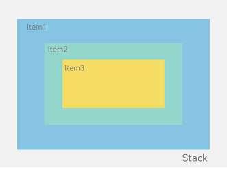
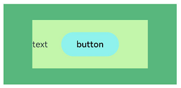
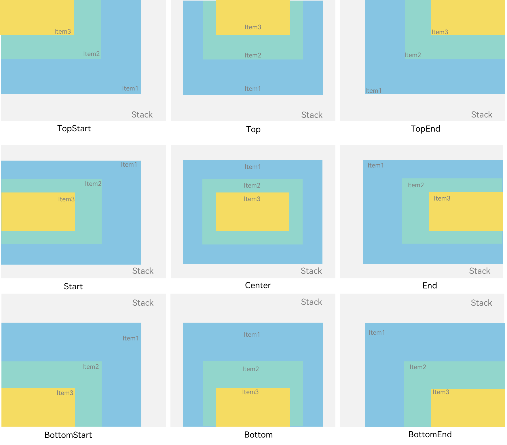
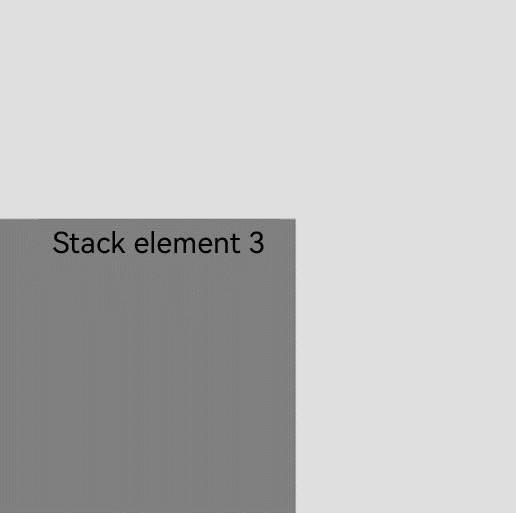
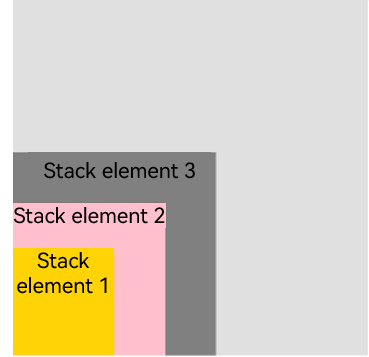
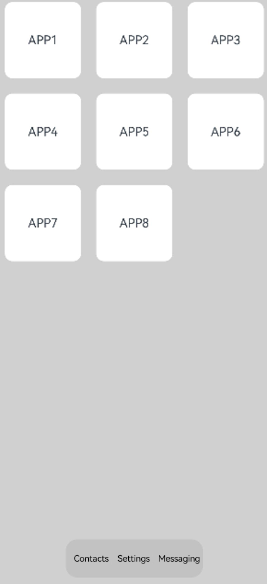

# Stack Layout (Stack)


## Overview

The stack layout reserves an area on the screen to display elements in a component and allows the elements to be stacked. You can implement a stack layout through the [Stack](../reference/apis-arkui/arkui-ts/ts-container-stack.md) component, which provides a stack container where positioned or non-positioned child elements are pushed successively and the latter one sits on top of the previous one.

The stack layout excels at page stacking and positioning, and is widely used in ad and widget arrangement.

In the **Stack** component shown in Figure 1, the sequence of child elements is Item1 -> Item2 -> Item3.


  **Figure 1** Stack layout 




## How to Develop

The **Stack** component can contain various child elements, which are stacked in the center by default. While respecting the constraints of **Stack**, child elements are laid out in their respective style.

```ts
// xxx.ets
let MTop:Record<string,number> = { 'top': 50 }

@Entry
@Component
struct StackExample {
  build() {
    Column(){
      Stack({ }) {
        Column(){}.width('90%').height('100%').backgroundColor('#ff58b87c')
        Text('text').width('60%').height('60%').backgroundColor('#ffc3f6aa')
        Button('button').width('30%').height('30%').backgroundColor('#ff8ff3eb').fontColor('#000')
      }.width('100%').height(150).margin(MTop)
    }
  }
}
```





## Alignment

Alignment of elements in the **Stack** component is set through the [alignContent](../reference/apis-arkui/arkui-ts/ts-container-stack.md#aligncontent) parameter. As shown in Figure 2, nine alignment modes are supported.

  **Figure 2** Alignment modes in the Stack component 



```ts
// xxx.ets
@Entry
@Component
struct StackExample {
  build() {
    Stack({ alignContent: Alignment.TopStart }) {
      Text('Stack').width('90%').height('100%').backgroundColor('#e1dede').align(Alignment.BottomEnd)
      Text('Item 1').width('70%').height('80%').backgroundColor(0xd2cab3).align(Alignment.BottomEnd)
      Text('Item 2').width('50%').height('60%').backgroundColor(0xc1cbac).align(Alignment.BottomEnd)
    }.width('100%').height(150).margin({ top: 5 })
  }
}
```

## Z-order Control

The stacking order of child elements in the **Stack** component is set through the [zIndex](../reference/apis-arkui/arkui-ts/ts-universal-attributes-z-order.md) attribute. A larger **zIndex** value indicates a higher display level.

  In the stack layout, if the size of an element is greater than that of the one before it, the one before it is hidden.

```ts
Stack({ alignContent: Alignment.BottomStart }) {
  Column() {
    Text('Stacked element 1').textAlign(TextAlign.End).fontSize(20)
  }.width(100).height(100).backgroundColor(0xffd306)

  Column() {
    Text('Stacked element 2').fontSize(20)
  }.width(150).height(150).backgroundColor(Color.Pink)

  Column() {
    Text('Stacked element 3').fontSize(20)
  }.width(200).height(200).backgroundColor(Color.Grey)
}.width(350).height(350).backgroundColor(0xe0e0e0)
```



In the preceding figure, the size of the stacked element 3 is greater than that of all the elements before it. Therefore, the first two elements are completely hidden. To show these elements, modify their **zIndex** attribute settings.


```ts
Stack({ alignContent: Alignment.BottomStart }) {
  Column() {
    Text('Stacked element 1').fontSize(20)
  }.width(100).height(100).backgroundColor(0xffd306).zIndex(2)

  Column() {
    Text('Stacked element 2').fontSize(20)
  }.width(150).height(150).backgroundColor(Color.Pink).zIndex(1)

  Column() {
    Text('Stacked element 3').fontSize(20)
  }.width(200).height(200).backgroundColor(Color.Grey)
}.width(350).height(350).backgroundColor(0xe0e0e0)
```




## Example Scenario

In this example, the stack layout is used to quickly set up a page.


```ts
@Entry
@Component
struct StackSample {
  private arr: string[] = ['APP1', 'APP2', 'APP3', 'APP4', 'APP5', 'APP6', 'APP7', 'APP8'];

  build() {
    Stack({ alignContent: Alignment.Bottom }) {
      Flex({ wrap: FlexWrap.Wrap }) {
        ForEach(this.arr, (item:string) => {
          Text(item)
            .width(100)
            .height(100)
            .fontSize(16)
            .margin(10)
            .textAlign(TextAlign.Center)
            .borderRadius(10)
            .backgroundColor(0xFFFFFF)
        }, (item:string):string => item)
      }.width('100%').height('100%')

      Flex({ justifyContent: FlexAlign.SpaceAround, alignItems: ItemAlign.Center }) {
        Text('Contacts').fontSize(16)
        Text('Settings').fontSize(16)
        Text('Messaging').fontSize(16)
      }
      .width('50%')
      .height(50)
      .backgroundColor('#16302e2e')
      .margin({ bottom: 15 })
      .borderRadius(15)
    }.width('100%').height('100%').backgroundColor('#CFD0CF')
  }
}
```



<!--RP1--><!--RP1End-->
