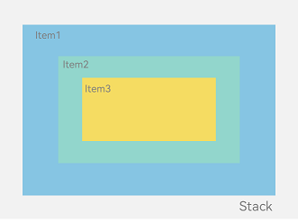
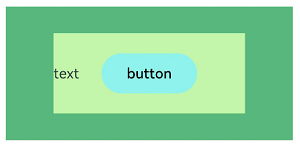
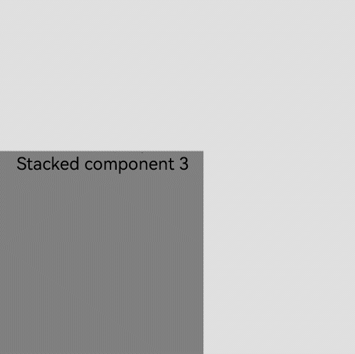

# Stack Layout (Stack)

<!--Kit: ArkUI-->
<!--Subsystem: ArkUI-->
<!--Owner: @fenglinbailu-->
<!--Designer: @lanshouren-->
<!--Tester: @liuli0427-->
<!--Adviser: @Brilliantry_Rui-->
<!-- md-trans-meta sourceCommit=276d60289816e1dd5baf9329b4a307375826cd4b translatedAt=2026-08-04T06:34:45.605Z pushedAt=2026-08-04T07:39:54.133Z -->

## Overview

Stack layout (Stack) reserves an area on the screen for displaying elements within a component, providing a layout where elements can overlap. The stack layout implements fixed positioning and stacking through the [Stack](../reference/apis-arkui/arkui-ts/ts-container-stack.md) container component. Child elements in the container are placed in sequence, with each subsequent child element covering the previous one. Child elements can be stacked on top of each other and can also have their positions set.

The stack layout excels at page stacking and positioning, and is widely used in ad and widget arrangement.

In the **Stack** component shown in Figure 1, the sequence of child elements is Item1 -> Item2 -> Item3.

  **Figure 1** Stack layout 



> **NOTE**
>
> Excessive nesting of components can lead to performance degradation. In some scenarios, using component attributes directly or leveraging system APIs can achieve the same effect as the stack layout, reducing the number of nested components and optimizing performance. For best practices, see [Preferentially Using Component Properties Instead of Nested Components](https://developer.huawei.com/consumer/en/doc/best-practices/bpta-component-nesting-optimization#section78181114123811).

## How to Develop

The **Stack** component can contain various child elements, which are stacked in the center by default. While respecting the constraints of **Stack**, child elements are laid out in their respective style.

<!-- @[StackLayoutExample_start](https://gitcode.com/openharmony/applications_app_samples/blob/master/code/DocsSample/ArkUISample/MultipleLayoutProject/entry/src/main/ets/pages/stacklayout/StackLayoutExample.ets) -->

``` TypeScript
// xxx.ets
let mTop:Record<string,number> = { 'top': 50 }

@Entry
@Component
struct StackLayoutExample {
  build() {
    Column(){
      Stack({ }) {
        Column(){}.width('90%').height('100%').backgroundColor('#ff58b87c')
        Text('text').width('60%').height('60%').backgroundColor('#ffc3f6aa')
        Button('button').width('30%').height('30%').backgroundColor('#ff8ff3eb').fontColor('#000')
      }.width('100%').height(150).margin(mTop)
    }
  }
}
```



## Alignment

Alignment of elements in the **Stack** component is set through the [alignContent](../reference/apis-arkui/arkui-ts/ts-container-stack.md#aligncontent) parameter. As shown in Figure 2, nine alignment modes are supported.

  **Figure 2** Alignment modes in the Stack component 



<!-- @[StackLayoutAlignContent_start](https://gitcode.com/openharmony/applications_app_samples/blob/master/code/DocsSample/ArkUISample/MultipleLayoutProject/entry/src/main/ets/pages/stacklayout/StackLayoutAlignContent.ets) -->

``` TypeScript
// xxx.ets
@Entry
@Component
struct StackAlignContentExample {
  build() {
    Stack({ alignContent: Alignment.TopStart }) {
      Text('Stack').width('90%').height('100%').backgroundColor('#e1dede').align(Alignment.BottomEnd)
      Text('Item 1').width('70%').height('80%').backgroundColor(0xd2cab3).align(Alignment.BottomEnd)
      Text('Item 2').width('50%').height('60%').backgroundColor(0xc1cbac).align(Alignment.BottomEnd)
    }.width('100%').height(150).margin({ top: 5 })
  }
}
```

## Z-order Control

The stacking order of child elements in the **Stack** component is set through the [zIndex](../reference/apis-arkui/arkui-ts/ts-universal-attributes-z-order.md) attribute. A larger **zIndex** value indicates a higher display level.

  In the stack layout, if the size of an element is greater than that of the one before it, the one before it is hidden.

<!-- @[StackLayoutNozIndex_start](https://gitcode.com/openharmony/applications_app_samples/blob/master/code/DocsSample/ArkUISample/MultipleLayoutProject/entry/src/main/ets/pages/stacklayout/StackLayoutNozIndex.ets) -->

``` TypeScript
Stack({ alignContent: Alignment.BottomStart }) {
  Column() {
    // Replace $r('app.string.stack_num1') with the actual resource file. In this example, the value in the resource file is "Stack child element 1."
    Text($r('app.string.stack_num1')).textAlign(TextAlign.End).fontSize(20)
  }.width(100).height(100).backgroundColor(0xffd306)

  Column() {
    // Replace $r('app.string.stack_num2') with the actual resource file. In this example, the value in the resource file is "Stack child element 2."
    Text($r('app.string.stack_num2')).fontSize(20)
  }.width(150).height(150).backgroundColor(Color.Pink)

  Column() {
    // Replace $r('app.string.stack_num3') with the actual resource file. In this example, the value in the resource file is "Stack child element 3."
    Text($r('app.string.stack_num3')).fontSize(20)
  }.width(200).height(200).backgroundColor(Color.Grey)
}.width(350).height(350).backgroundColor(0xe0e0e0)
```


In the preceding figure, the size of the stacked element 3 is greater than that of all the elements before it. Therefore, the first two elements are completely hidden. To show these elements, modify their **zIndex** attribute settings.

<!-- @[StackLayoutzIndex_start](https://gitcode.com/openharmony/applications_app_samples/blob/master/code/DocsSample/ArkUISample/MultipleLayoutProject/entry/src/main/ets/pages/stacklayout/StackLayoutzIndex.ets) -->

``` TypeScript
Stack({ alignContent: Alignment.BottomStart }) {
  Column() {
    // Replace $r('app.string.stack_num1') with the actual resource file. In this example, the value in the resource file is "Stack child element 1."
    Text($r('app.string.stack_num1')).fontSize(20)
  }.width(100).height(100).backgroundColor(0xffd306).zIndex(2)

  Column() {
    // Replace $r('app.string.stack_num2') with the actual resource file. In this example, the value in the resource file is "Stack child element 2."
    Text($r('app.string.stack_num2')).fontSize(20)
  }.width(150).height(150).backgroundColor(Color.Pink).zIndex(1)

  Column() {
    // Replace $r('app.string.stack_num3') with the actual resource file. In this example, the value in the resource file is "Stack child element 3."
    Text($r('app.string.stack_num3')).fontSize(20)
  }.width(200).height(200).backgroundColor(Color.Grey)
}.width(350).height(350).backgroundColor(0xe0e0e0)
```


## Example Scenario

In this example, the stack layout is used to quickly set up a page.

<!-- @[StackLayoutSceneExample_start](https://gitcode.com/openharmony/applications_app_samples/blob/master/code/DocsSample/ArkUISample/MultipleLayoutProject/entry/src/main/ets/pages/stacklayout/StackLayoutSceneExample.ets) -->

``` TypeScript
@Entry
@Component
struct StackSample {
  private arr: string[] = ['APP1', 'APP2', 'APP3', 'APP4', 'APP5', 'APP6', 'APP7', 'APP8'];

  build() {
    Stack({ alignContent: Alignment.Bottom }) {
      Flex({ wrap: FlexWrap.Wrap }) {
        ForEach(this.arr, (item:string) => {
          Text(item)
            .width(100)
            .height(100)
            .fontSize(16)
            .margin(10)
            .textAlign(TextAlign.Center)
            .borderRadius(10)
            .backgroundColor(0xFFFFFF)
        }, (item:string):string => item)
      }.width('100%').height('100%')

      Flex({ justifyContent: FlexAlign.SpaceAround, alignItems: ItemAlign.Center }) {
        // Replace $r('app.string.contacts') with the actual resource file. In this example, the value in the resource file is "Contacts."
        Text($r('app.string.contacts')).fontSize(16)
        // Replace $r('app.string.setting') with the actual resource file. In this example, the value in the resource file is "Settings."
        Text($r('app.string.setting')).fontSize(16)
        // Replace $r('app.string.text_message') with the actual resource file. In this example, the value in the resource file is "Messaging."
        Text($r('app.string.text_message')).fontSize(16)
      }
      .width('50%')
      .height(50)
      .backgroundColor('#16302e2e')
      .margin({ bottom: 15 })
      .borderRadius(15)
    }.width('100%').height('100%').backgroundColor('#CFD0CF')
  }
}
```


<!--RP1--><!--RP1End-->