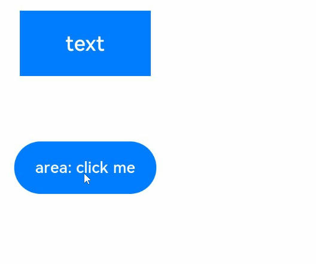
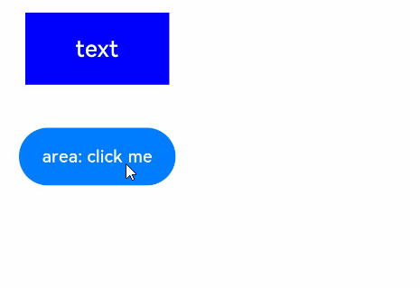

# Layout Update Animation


[Explicit animation](../reference/arkui-ts/ts-explicit-animation.md) (**animateTo**) and [attribute animation](../reference/arkui-ts/ts-animatorproperty.md) (**animation**) are the most basic and common animation features provided by ArkUI. When the layout attributes (such as the [size](../reference/arkui-ts/ts-universal-attributes-size.md) and [position](../reference/arkui-ts/ts-universal-attributes-location.md)) attributes change, you can use the attribute animation or explicit animation to transit to the new layout parameter status based on the animation parameters.


| Animation Type| Description                                      |
| ---- | ---------------------------------------- |
| Explicit animation| Triggered by changes in a closure, including component addition and deletion caused by data changes and component attribute changes.| Complex animation scenarios|
| Attribute animation| Triggered when the attribute changes. The animation setting is simple.                     |


## Using Explicit Animation to Create Layout Update Animation

The API for explicit animation is as follows:


```ts
animateTo(value: AnimateParam, event: () => void): void
```

The first parameter specifies the animation parameter, and the second parameter is the closure function of the animation.

The following is an example of using explicit animation to create a layout update animation. In the example, when the **\<Column>** component's **alignItems** attribute is updated, the layout of its child components changes. As long as the attribute is updated in the closure function of **animateTo**, animation is performed as configured through **animateTo** for all changes caused by the attribute toward the end value.


```ts
@Entry
@Component
struct LayoutChange {
  // Used to control the alignItems attribute of a column.
  @State itemAlign: HorizontalAlign = HorizontalAlign.Start;
  allAlign: HorizontalAlign[] = [HorizontalAlign.Start, HorizontalAlign.Center, HorizontalAlign.End];
  alignIndex: number = 0;

  build() {
    Column() {
      Column({ space: 10 }) {
        Button("1").width(100).height(50)
        Button("2").width(100).height(50)
        Button("3").width(100).height(50)
      }
      .margin(20)
      .alignItems(this.itemAlign)
      .borderWidth(2)
      .width("90%")
      .height(200)

      Button("click").onClick(() => {
        // The animation duration is 1000 ms, and the curve is EaseInOut.
        animateTo({ duration: 1000, curve: Curve.EaseInOut }, () => {
          this.alignIndex = (this.alignIndex + 1) % this.allAlign.length;
          // Modify the this.itemAlign parameter in the closure function to change the layout of child elements in the <Column> container. The animation for transition to the new position is applied.
          this.itemAlign = this.allAlign[this.alignIndex];
        });
      })
    }
    .width("100%")
    .height("100%")
  }
}
```


In addition to directly changing the layout, you can also change the width, height, and position of a component.


```ts
@Entry
@Component
struct LayoutChange2 {
  @State myWidth: number = 100;
  @State myHeight: number = 50;
  // Flag. true and false correspond to a group of myWidth and myHeight values, respectively.
  @State flag: boolean = false;

  build() {
    Column({ space: 10 }) {
      Button("text")
        .type(ButtonType.Normal)
        .width(this.myWidth)
        .height(this.myHeight)
        .margin(20)
      Button("area: click me")
        .fontSize(12)
        .margin(20)
        .onClick(() => {
          animateTo({ duration: 1000, curve: Curve.Ease }, () => {
            // In the animation closure, the state variables that control the width and height of the first button are changed based on the flag settings so that the width and height of the first button are animated.
            if (this.flag) {
              this.myWidth = 100;
              this.myHeight = 50;
            } else {
              this.myWidth = 200;
              this.myHeight = 100;
            }
            this.flag = !this.flag;
          });
        })
    }
    .width("100%")
    .height("100%")
  }
}
```


In the click event of the second button, the **animateTo** API is used to modify the **this.myWidth** and **this.myHeight** state variables in the closure. As these two state variables set the width and height of the first button, the width and height animation is performed for the first button. The display effect is shown below.





At the same time, the second button also produces a position animation. After the width and height of the first button are changed, the layout of other components in the column is also changed, and the second button is among those other components.


If you do not want the second button to have an animation effect, you can use either of the following methods: 1. Add a container outside the first button so that the sizes before and after the animation are within the range of the container. In this way, the position of the second button is not affected by the position of the first button. The key code is as follows:


```ts
Column({ space: 10 }) {
  Column() {
    // The button is placed in a container that is large enough so that it does not affect the position of the outer component.
    Button("text")
      .type(ButtonType.Normal)
      .width(this.myWidth)
      .height(this.myHeight)
  }
  .margin(20)
  .width(200)
  .height(100)

  Button("area: click me")
    .fontSize(12)
    .onClick(() => {
      animateTo({ duration: 1000, curve: Curve.Ease }, () => {
        // In the animation closure, the state variables that control the width and height of the first button are changed based on the flag settings so that the width and height of the first button are animated.
        if (this.flag) {
          this.myWidth = 100;
          this.myHeight = 50;
        } else {
          this.myWidth = 200;
          this.myHeight = 100;
        }
        this.flag = !this.flag;
      });
    })
}
.width("100%")
.height("100%")
```


2. Add layout constraints to the second button. For example, add position constraints so that the position of the second button is not affected by the width and height of the first button.  The sample code is as follows: 


```ts
Column({ space: 10 }) {
  Button("text")
    .type(ButtonType.Normal)
    .width(this.myWidth)
    .height(this.myHeight)
    .margin(20)

  Button("area: click me")
    .fontSize(12)
    // Set the position attribute to a fixed value so that the position of the second button is not affected by the width and height of the first button.
    .position({ x: "30%", y: 200 })
    .onClick(() => {
      animateTo({ duration: 1000, curve: Curve.Ease }, () => {
        // In the animation closure, the state variables that control the width and height of the first button are changed based on the flag settings so that the width and height of the first button are animated.
        if (this.flag) {
          this.myWidth = 100;
          this.myHeight = 50;
        } else {
          this.myWidth = 200;
          this.myHeight = 100;
        }
        this.flag = !this.flag;
      });
    })
}
.width("100%")
.height("100%")
```


## Using Attribute Animation to Generate Layout Update Animation

Unlike explicit animation, which requires the attribute changes for triggering animation to be placed in the closure function, attribute animation does not need to use the closure. You only need to append the **animation** attribute to the target component attribute.

The API of the attribute animation is as follows:


```ts
animation(value: AnimateParam)
```

This API accepts an animation parameter as its argument. If you want the component to generate an animation with the value change of an attribute, add this attribute before the **animation** attribute. Otherwise, you can place the attribute after the **animation** attribute. The previous example of explicit animation can be easily implemented with attribute animation. The sample code is as follows:


```ts
@Entry
@Component
struct LayoutChange2 {
  @State myWidth: number = 100;
  @State myHeight: number = 50;
  @State flag: boolean = false;
  @State myColor: Color = Color.Blue;

  build() {
    Column({ space: 10 }) {
      Button("text")
        .type(ButtonType.Normal)
        .width(this.myWidth)
        .height(this.myHeight)
        // The animation takes effect only for the type, width, and height attributes. The duration is 1000 ms, and the curve is Ease.
        .animation({ duration: 1000, curve: Curve.Ease })
        // The animation does not take effect for the backgroundColor and margin attributes.
        .backgroundColor(this.myColor)
        .margin(20)

      Button("area: click me")
        .fontSize(12)
        .onClick(() => {
          // Change the attribute value. Animation transition is performed for attributes configured with attribute animation.
          if (this.flag) {
            this.myWidth = 100;
            this.myHeight = 50;
            this.myColor = Color.Blue;
          } else {
            this.myWidth = 200;
            this.myHeight = 100;
            this.myColor = Color.Pink;
          }
          this.flag = !this.flag;
        })
    }
  }
}
```


In the preceding example, the **animation** attribute of the first button takes effect only for the **type**, **width**, and **height** attributes written before the **animation** attribute, but does not take effect for the **backgroundColor** and **margin** attributes written after. In the running result, the **width** and **height** attributes execute the animation based on the **animation** settings, while the **backgroundColor** attribute changes without any animation applied. The display effect is shown below.





>**NOTE**
>
>    1. Attribute animations are executed according to the configured attribute animation settings. Each component can have its own attribute animation settings.
>
>    2. Explicit animations are executed on all GUI differences caused before and after animation closures, and they share the same animation settings. Therefore, explicit animations are applicable to scenarios where animations are executed in a unified manner. Explicit animations can also be used for animations caused by non-attribute variables, such as **if/else** statements and deletion of array elements used by **ForEach**.
>
>    3. If an attribute animation is configured for an attribute and the attribute value is changed in the explicit animation closure, the attribute animation takes precedence, under the configured animation settings.
