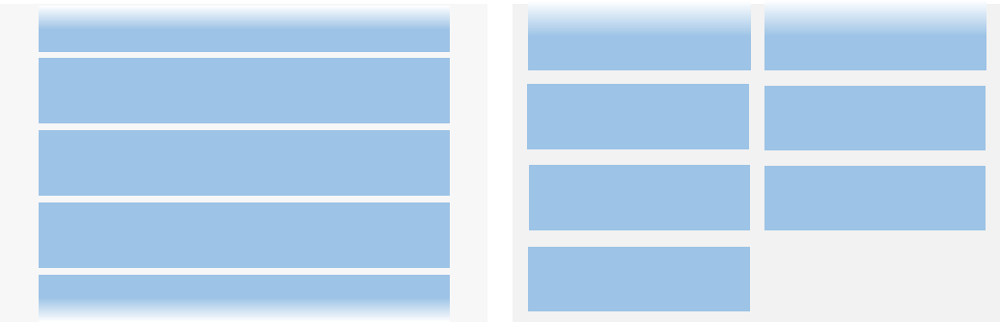
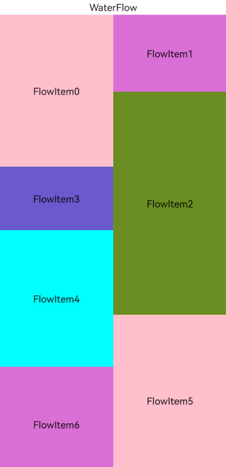

# List and Grid Overview

<!--Kit: ArkUI-->
<!--Subsystem: ArkUI-->
<!--Owner: @yylong; @zcdqs-->
<!--Designer: @yylong; @zcdqs-->
<!--Tester: @liuzhenshuo-->
<!--Adviser: @HelloCrease-->

Many applications require scrollable views to display collections of similar items, such as images, videos, music, news, or products. Depending on the layout requirements, these scenarios can be implemented using [List](arkts-layout-development-create-list.md), [Grid](arkts-layout-development-create-grid.md), or [WaterFlow](arkts-layout-development-create-waterflow.md). For circular screens, [ArcList](arkts-layout-development-create-arclist.md) is recommended.

## List

The **List** component is ideal for single-column or multi-column layouts where columns have uniform widths. Common use cases include contact lists, music playlists, and shopping lists.

In scenarios like live comment feeds or instant messaging, where new data is appended to the bottom, the list should automatically scroll upward to reveal newly added items. This behavior can be enabled by [configuring the **List** component to stack from the end](../reference/apis-arkui/arkui-ts/ts-container-list.md#stackfromend19).

## Grid

A grid layout organizes items into rows and columns, allowing flexible positioning by specifying the target cell for each item. Typical use cases include image galleries, calendars, and calculators.

To support items that span multiple rows or columns, configure the grid using [GridLayoutOptions](../reference/apis-arkui/arkui-ts/ts-container-grid.md#gridlayoutoptions10).

## Waterfall Flow

Waterfall flow is a multi-column layout where columns have equal width but items can vary in height. It is well-suited for staggered layouts such as image feeds, video previews, and product recommendations.

To support mixed layouts with varying column counts on the same page, use WaterFlowSections](../reference/apis-arkui/arkui-ts/ts-container-waterflow.md#waterflowoptions).

## Arc List

An arc list is a specialized list designed for circular screens. It supports automatic scaling of items as they approach the top or bottom edges of the display.

## Feature Comparison

|Feature| List | Grid | WaterFlow | ArcList |
|---------|---------|---------|---------|---------|
|General scrolling capability|Supported|Supported|Supported|Supported|
|Item grouping|[ListItemGroup](../reference/apis-arkui/arkui-ts/ts-container-listitemgroup.md)|[GridLayoutOptions](../reference/apis-arkui/arkui-ts/ts-container-grid.md#gridlayoutoptions10)|[WaterFlowSections](../reference/apis-arkui/arkui-ts/ts-container-waterflow.md#waterflowoptions)|Not supported|
|Sticky headers|Supported via the [sticky](../reference/apis-arkui/arkui-ts/ts-container-list.md#sticky9) attribute|Not supported|Not supported|Not supported|
|Drag-and-drop sorting|Supported with [drag-and-drop sorting](../reference/apis-arkui/arkui-ts/ts-universal-attributes-drag-sorting.md), including animations and automatic scrolling when dragged to the edge|Supported with [built-in animations](../reference/apis-arkui/arkui-ts/ts-container-grid.md#supportanimation8) (only when all items occupy 1 row and 1 column), and no automatic scrolling when dragged to the edge|Not supported|Not supported|
|Swipe actions|Supported via the [swipeAction](../reference/apis-arkui/arkui-ts/ts-container-listitem.md#swipeaction9) attribute|Not supported|Not supported|Not supported|
|Item spacing|Supported|Supported|Supported|Supported|
|Item dividers|Supported|Not supported|Not supported|Not supported|
