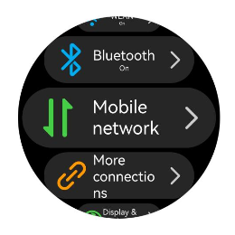

# List and Grid Overview

<!--Kit: ArkUI-->
<!--Subsystem: ArkUI-->
<!--Owner: @rongShao-Z; @yangcan18-->
<!--Designer: @yangcan18-->
<!--Tester: @leiyuqian-->
<!--Adviser: @Brilliantry_Rui-->

Many applications require scrollable views to display collections of similar items, such as images, videos, music, news, or products. Depending on the layout requirements, these scenarios can be implemented using [List](arkts-layout-development-create-list.md), [Grid](arkts-layout-development-create-grid.md), or [WaterFlow](arkts-layout-development-create-waterflow.md). For circular screens, [ArcList](arkts-layout-development-create-arclist.md) is recommended.

When an application needs to scroll through collections of items from different categories. For example, an e‑commerce homepage that includes multi‑column grid category entries, waterfall‑flow product widgets, and linear list recommendations, or a social app feed that contains text lists, nine‑square grid images, and video cards. Such scenarios can be implemented by combining multiple [lazy‑loading layouts](arkts-layout-development-create-lazy-layout.md) within a scrollable parent component (such as **Scroll**, **List**, or **WaterFlow**).

## List

The **List** component is ideal for single-column or multi-column layouts where columns have uniform widths. Common use cases include contact lists, music playlists, and shopping lists.

In scenarios like live comment feeds or instant messaging, where new data is appended to the bottom, the list should automatically scroll upward to reveal newly added items. This behavior can be enabled by [stackFromEnd](../reference/apis-arkui/arkui-ts/ts-container-list.md#stackfromend19).

## Grid

A grid layout organizes items into rows and columns, allowing flexible positioning by specifying the target cell for each item. Typical use cases include image galleries, calendars, and calculators.

To support items that span multiple rows or columns, configure the grid using [GridLayoutOptions](../reference/apis-arkui/arkui-ts/ts-container-grid.md#gridlayoutoptions10).

## Waterfall Flow

Waterfall flow is a multi-column layout where columns have equal width but items can vary in height. It is well-suited for staggered layouts such as image feeds, video previews, and product recommendations.

To support mixed layouts with varying column counts on the same page, use [WaterFlowOptions](../reference/apis-arkui/arkui-ts/ts-container-waterflow.md#waterflowoptions).

## Arc List

An arc list is a specialized list designed for circular screens. It supports automatic scaling of items as they approach the top or bottom edges of the display.

## Lazy Loading Layout

A lazy loading layout container is a type of layout container that is nested within a scrollable parent component (**Scroll**, **List**, or **WaterFlow**) and is responsible for loading child components on demand. Such containers do not provide scrolling capability themselves; scrolling is handled uniformly by the parent component. They create and lay out only the child components that fall within the visible area of the scrollable parent component, and pre‑load content half a screen above and below the visible area during idle time between frames, thereby reducing first‑frame rendering time and memory overhead. ArkUI provides three types of layout containers that support lazy loading: [LazyColumnLayout](../reference/apis-arkui/arkui-ts/ts-container-lazycolumnlayout.md), [LazyVGridLayout](../reference/apis-arkui/arkui-ts/ts-container-lazyvgridlayout.md), and [LazyVWaterFlowLayout](../reference/apis-arkui/arkui-ts/ts-container-lazyvwaterflowlayout.md). Different lazy loading layout containers offer different layout modes, allowing you to combine multiple types of lazy loading layout containers within the same parent component to flexibly implement mixed layouts.

## Capability Comparison

|Capability| List | Grid | WaterFlow | ArcList |
|---------|---------|---------|---------|---------|
|General scrolling capability|Supported|Supported|Supported|Supported|
|Item grouping|[ListItemGroup](../reference/apis-arkui/arkui-ts/ts-container-listitemgroup.md)|[GridLayoutOptions](../reference/apis-arkui/arkui-ts/ts-container-grid.md#gridlayoutoptions10)|[WaterFlowSections](../reference/apis-arkui/arkui-ts/ts-container-waterflow.md#waterflowsections12)|Not supported|
|Sticky items|Supported via the [sticky](../reference/apis-arkui/arkui-ts/ts-container-list.md#sticky9) attribute|Not supported|Not supported|Not supported|
|Drag-and-drop sorting|Supported with [drag-and-drop sorting](../reference/apis-arkui/arkui-ts/ts-universal-attributes-drag-sorting.md), including animations and automatic scrolling when dragged to the edge|Supported with built-in animation [supportAnimation](../reference/apis-arkui/arkui-ts/ts-container-grid.md#supportanimation8) (only when all items occupy 1 row and 1 column), and no automatic scrolling when dragged to the edge|Not supported|Not supported|
|Swipe actions|Supported via the [swipeAction](../reference/apis-arkui/arkui-ts/ts-container-listitem.md#swipeaction9) attribute|Not supported|Not supported|Not supported|
|Item spacing|Supported|Supported|Supported|Supported|
|Item dividers|Supported|Not supported|Not supported|Not supported|

<!--no_check-->
