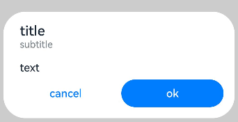
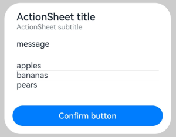
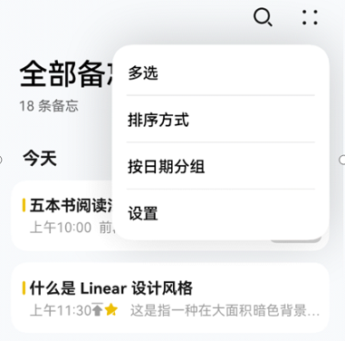
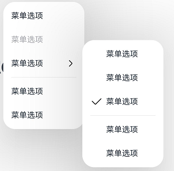
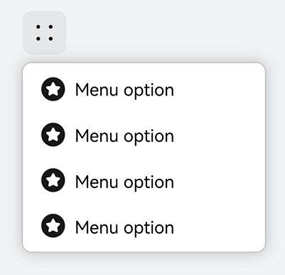
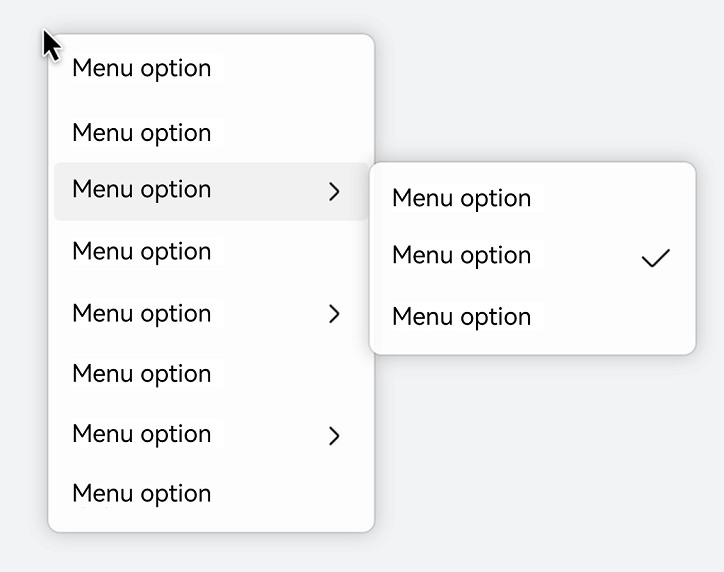

# Modal Dialog Box (ModelDialog)

## Overview

A modal is a state of UI components or views. Before a modal components or view disappears, users can only respond to the component or view and cannot operate other non-modal components or views, which is quite intrusive.

In ArkUI, you can implement modal dialog boxes by using components such as [AlertDialog](../reference/apis-arkui/arkui-ts/ts-methods-alert-dialog-box.md), [CustomDialog](../reference/apis-arkui/arkui-ts/ts-methods-custom-dialog-box.md), [ActionSheet](../reference/apis-arkui/arkui-ts/ts-methods-action-sheet.md), [Popup](../reference/apis-arkui/arkui-ts/ts-universal-attributes-popup.md), Menu](../reference/apis-arkui/arkui-ts/ts-basic-components-menu.md), and [ContextMenu](../reference/apis-arkui/arkui-ts/ts-methods-menu.md).

| Name                                | Use Scenario                                                    |
| ------------------------------------ | ------------------------------------------------------------ |
| AlertDialog | Usually used to display information or operations that users need to pay attention to or must focus on. For example, when a user performs a sensitive action, such a dialog box can be displayed for confirmation.|
| ActionSheet | Used when there is a list of information that requires user attention or confirmation.|
| CustomDialog | Used when users need to customize the components and content within the dialog box.|
| Popup                                | Used to provide information tips for specified components. For example, when a question mark icon is touched, a bubble tip pops up.         |
| Menu/ContextMenu                     | Used to bind executable operations to specified components, such as displaying operation options when an icon is long-pressed.      |

> **NOTE**
>
> - For modal dialog boxes described in this guide, you can adjust them to non-modal by configuring specific parameters (such as **isModal** of **CustomDialog**) to meet different use scenarios.
>
> - On mobile devices, a dialog box in subwindow mode cannot exceed the main window.
>
> - When multiple dialog box components are displayed in sequence, the layer of the later displayed component is higher than that of the earlier one, and the exit is in the order from high to low.

## Using a Global Dialog Box

A global dialog box is not bound to any component and is generally used for necessary alerts when user-triggered operations occur. ArkUI currently provides two types of dialog box components: customized and custom.

Customized: **AlertDialog**, **ActionSheet**, **promptAction.showDialog**, and **promptAction.showActionMenu**. You can use these components to specify the text content and button operations as needed.

Custom: **CustomDialog** and **promptAction.openCustomDialog**. You need to pass in custom components based on the use scenario to fill in the dialog box with custom content.

Below are examples of **AlertDialog**, **ActionSheet**, and **CustomDialog** to illustrate their respective dialog box effects and usage methods.

- **AlertDialog**: alert dialog box, used to ask questions or get user permission.
  - The alert dialog box interrupts the current task. Therefore, only use it to provide necessary information and useful operations.
  - Avoid using alert dialog boxes to provide information only; users do not like to be interrupted by information-rich but non-operable alerts.
  - Mandatory content: title, optional information text, and up to 3 buttons.
  - Optional content: text box, icon, check box, and help button.
  
  
  
  ```ts
  @Entry
  @Component
  struct AlertDialogExample {
    build() {
      Column({ space: 5 }) {
        Button('two button dialog')
          .onClick(() => {
            AlertDialog.show(
              {
                title: 'title',
                subtitle: 'subtitle',
                message: 'text',
                autoCancel: true,
                alignment: DialogAlignment.Bottom,
                gridCount: 4,
                offset: { dx: 0, dy: -20 },
                primaryButton: {
                  value: 'cancel',
                  action: () => {
                    console.info('Callback when the first button is clicked')
                  }
                },
                secondaryButton: {
                  enabled: true,
                  defaultFocus: true,
                  style: DialogButtonStyle.HIGHLIGHT,
                  value: 'ok',
                  action: () => {
                    console.info('Callback when the second button is clicked')
                  }
                }
              }
            )
          }).backgroundColor(0x317aff)
      }.width('100%').margin({ top: 5 })
    }
  }
  ```
  
- **ActionSheet**: action sheet.

  Suitable for displaying multiple operation items, especially when there is no other display content besides the operation list.

  


  ```ts
  @Entry
  @Component
  struct ActionSheetExample {
    build() {
      Flex({ direction: FlexDirection.Column, alignItems: ItemAlign.Center, justifyContent: FlexAlign.Center }) {
        Button('Click to Show ActionSheet')
          .onClick(() => {
            ActionSheet.show({
              title: 'ActionSheet title',
              subtitle: 'ActionSheet subtitle',
              message: 'message',
              autoCancel: true,
              confirm: {
                defaultFocus: true,
                value: 'Confirm button',
                action: () => {
                  console.log('Get Alert Dialog handled')
                }
              },
              alignment: DialogAlignment.Bottom,
              offset: { dx: 0, dy: -10 },
              sheets: [
                {
                  title: 'apples',
                  action: () => {
                    console.log('apples')
                  }
                },
                {
                  title: 'bananas',
                  action: () => {
                    console.log('bananas')
                  }
                },
                {
                  title: 'pears',
                  action: () => {
                    console.log('pears')
                  }
                }
              ]
            })
          })
      }.width('100%')
      .height('100%')
    }
  }
  ```

- **CustomDialog**: custom dialog box.

  When you need to customize the content and style of the dialog box, you can opt for **CustomDialog**. Yet, when possible, use [promptAction.openCustomDialog](../reference/apis-arkui/js-apis-promptAction.md#promptactionopencustomdialog11) instead.

  

  ```ts
  // xxx.ets
  @CustomDialog
  @Component
  struct CustomDialogExample {
    @Link textValue: string
    @Link inputValue: string
    controller?: CustomDialogController
    cancel: () => void = () => {
    }
    confirm: () => void = () => {
    }
  
    build() {
      Column() {
        Text('Change text').fontSize(20).margin({ top: 10, bottom: 10 })
        TextInput({ placeholder: '', text: this.textValue }).height(60).width('90%')
          .onChange((value: string) => {
            this.textValue = value
          })
        Text('Whether to change a text?').fontSize(16).margin({ bottom: 10 })
        Flex({ justifyContent: FlexAlign.SpaceAround }) {
          Button('cancel')
            .onClick(() => {
              if (this.controller != undefined) {
                this.controller.close()
                this.cancel()
              }
            }).backgroundColor(0xffffff).fontColor(Color.Black)
          Button('confirm')
            .onClick(() => {
              if (this.controller != undefined) {
                this.inputValue = this.textValue
                this.controller.close()
                this.confirm()
              }
            }).backgroundColor(0xffffff).fontColor(Color.Red)
        }.margin({ bottom: 10 })
      }.borderRadius(10)
    }
  }
  
  @Entry
  @Component
  struct CustomDialogUser {
    @State textValue: string = ''
    @State inputValue: string = 'click me'
    dialogController: CustomDialogController | null = new CustomDialogController({
      builder: CustomDialogExample({
        cancel: () => {
          this.onCancel()
        },
        confirm: () => {
          this.onAccept()
        },
        textValue: $textValue,
        inputValue: $inputValue
      }),
      cancel: this.exitApp,
      autoCancel: true,
      onWillDismiss: (dismissDialogAction: DismissDialogAction) => {
        console.info("reason=" + JSON.stringify(dismissDialogAction.reason))
        console.log("dialog onWillDismiss")
        if (dismissDialogAction.reason == DismissReason.PRESS_BACK) {
          dismissDialogAction.dismiss()
        }
        if (dismissDialogAction.reason == DismissReason.TOUCH_OUTSIDE) {
          dismissDialogAction.dismiss()
        }
      },
      alignment: DialogAlignment.Bottom,
      offset: { dx: 0, dy: -20 },
      gridCount: 4,
      customStyle: false,
      cornerRadius: 10,
    })
  
    // Set dialogController to null when the custom component is about to be destroyed.
    aboutToDisappear() {
      this.dialogController = null // Set dialogController to null.
    }
  
    onCancel() {
      console.info('Callback when the first button is clicked')
    }
  
    onAccept() {
      console.info('Callback when the second button is clicked')
    }
  
    exitApp() {
      console.info('Click the callback in the blank area')
    }
  
    build() {
      Column() {
        Button(this.inputValue)
          .onClick(() => {
            if (this.dialogController != null) {
              this.dialogController.open()
            }
          }).backgroundColor(0x317aff)
      }.width('100%').margin({ top: 5 })
    }
  }
  ```

## Using Popups

With the **Popup** component, you can display additional content on top of existing elements to, for example, indicate how to operate the current feature.


```ts
@Entry
@Component
struct PopupExample {
  @State handlePopup: boolean = false

  build() {
    Flex({ direction: FlexDirection.Column }) {
      // PopupOptions for setting the popup
      Button('PopupOptions')
        .onClick(() => {
          this.handlePopup = !this.handlePopup
        })
        .bindPopup(this.handlePopup, {
          message: 'This is a popup with PopupOptions',
          placementOnTop: true,
          showInSubWindow: false,
          primaryButton: {
            value: 'confirm',
            action: () => {
              this.handlePopup = !this.handlePopup
              console.info('confirm Button click')
            }
          },
          // Second button
          secondaryButton: {
            value: 'cancel',
            action: () => {
              this.handlePopup = !this.handlePopup
              console.info('cancel Button click')
            }
          },
          onStateChange: (e) => {
            console.info(JSON.stringify(e.isVisible))
            if (!e.isVisible) {
              this.handlePopup = false
            }
          }
        })
        .position({ x: 100, y: 150 })
    }.width('100%').padding({ top: 5 })
  }
}
```

## Using a Menu Dialog Box

There are cases where you need to pop up some menu options through interaction for user operations. In this case, you can combine **Menu** and **MenuItem** components to construct the menu options, and then use the **bindMenu** and **bindContextMenu** methods to bind the menu with the target components.

| API                  | Use Scenario                  |
| -------------------------- | -------------------------- |
| bindMenu | Scenarios where a preview image is not needed, and display is required in non-subwindows.|
| bindContextMenu | Scenarios where a preview image is needed, and display is required in subwindows.|

- **bindMenu**: binds a temporary popup component used to display operations that users can perform.

  | Single-Level Menu                  | Multi-Level Menu                  |
  | -------------------------- | -------------------------- |
  |  |  |
  
	```ts
  @Entry
	@Component
	struct Index {
	  @State select: boolean = true
	
	  @Builder
	  MyMenu() {
	    Menu() {
	      MenuItem({ content: "Menu option" })
	      MenuItem({ content: "Menu option" })
	      MenuItem({ content: "Menu option" })
	      MenuItem({ content: "Menu option" })
	    }
	  }
	
	  build() {
	    Row() {
	      Column() {
	        Text('click to show menu')
	          .fontSize(50)
	          .fontWeight(FontWeight.Bold)
	      }
	      .bindMenu(this.MyMenu)
	      .width('100%')
	    }
	    .height('100%')
	  }
	}
	```


- **bindContextMenu**: binds a context menu that includes a menu, preview image, and overlay, typically displayed when the user long-presses a home screen button.

  | Display Relative to the Parent Component Area               | Display Relative to the Touched Position                 |
  | --------------------------------- | --------------------------------- |
  |  |  |

  ```ts
  @Entry
  @Component
  struct Index {
    @State select: boolean = true
  
    @Builder
    MyMenu(){
      Menu() {
        MenuItem({ content: "Menu option" })
        MenuItem({ content: "Menu option" })
        MenuItem({ content: "Menu option" })
        MenuItem({ content: "Menu option" })
      }
    }
  
    build() {
      Row() {
        Column() {
          Text('click to show menu')
            .fontSize(50)
            .fontWeight(FontWeight.Bold)
        }
        .bindContextMenu(this.MyMenu, ResponseType.LongPress,{
          placement: Placement.Left,
          preview: MenuPreviewMode.IMAGE
        })
        .width('100%')
      }
      .height('100%')
    }
  }
  ```


## Beyond the Application Screen

On 2-in-1 devices, when using modal dialog boxes, there are scenarios where the dialog box display exceeds the main window (application screen), as shown in the figure below.


You can allow a dialog box to exceed the main window by [adding support for subwindows](#adding-support-for-subwindows) and [defining the default subwindow](#defining-the-default-subwindow).

### Adding Support for Subwindows

To extend the UI beyond the main window, you can configure custom dialog boxes (**CustomDialog**), alert dialog boxes (**AlertDialog**), action sheets (**ActionSheet**), and bubble tips (**Popup**) to appear in a subwindow through **showInSubWindow**.

```ts
// xxx.ets	
@CustomDialog
struct CustomDialogExample {
  controller?: CustomDialogController
  cancel: () => void = () => {
  }
  confirm: () => void = () => {
  }
  build() {
    Column() {
      Text('Dialog box outside the main window')
        .fontSize(30)
        .height(100)
      Button('Close Dialog Box')
        .onClick(() => {
          if (this.controller != undefined) {
            this.controller.close()
          }
        })
        .margin(20)
    }
  }
}
@Entry
@Component
struct CustomDialogUser {
  dialogController: CustomDialogController | null = new CustomDialogController({
    builder: CustomDialogExample({
      cancel: ()=> { this.onCancel() },
      confirm: ()=> { this.onAccept() }
    }),
    cancel: this.existApp,
    autoCancel: true,
    alignment: DialogAlignment.Center,
    offset: { dx: 0, dy: -20 },
    gridCount: 4,
    showInSubWindow: true,
    isModal: true,
    customStyle: false,
    cornerRadius: 10,
  })
  // Set dialogController to null when the custom component is about to be destroyed.
  aboutToDisappear() {
    this.dialogController = null // Set dialogController to null.
  }

  onCancel() {
    console.info('Callback when the first button is clicked')
  }

  onAccept() {
    console.info('Callback when the second button is clicked')
  }

  existApp() {
    console.info('Click the callback in the blank area')
  }

  build() {
    Column() {
      Button('click me')
        .onClick(() => {
          if (this.dialogController != null) {
            this.dialogController.open()
          }
        }).backgroundColor(0x317aff)
    }.width('100%').margin({ top: 5 })
  }
}
```

### Defining the Default Subwindow

You can call **bindContextMenu** to bind a context menu to a component, which is displayed when the user long-presses or right-clicks the component. Only custom menu items are supported.

```ts
@Entry
@Component
struct ContextMenuExample {
  @Builder MenuBuilder() {
    Flex({ direction: FlexDirection.Column, justifyContent: FlexAlign.Center, alignItems: ItemAlign.Center }) {
      Text('Test menu item 1')
        .fontSize(20)
        .width(100)
        .height(50)
        .textAlign(TextAlign.Center)
      Divider().height(10)
      Text('Test menu item 2')
        .fontSize(20)
        .width(100)
        .height(50)
        .textAlign(TextAlign.Center)
    }.width(100)
  }

  build() {
    Column() {
      Text('LongPress for menu')
    }
    .width('100%')
    .margin({ top: 5 })
    .bindContextMenu(this.MenuBuilder, ResponseType.LongPress)
  }
}
```
