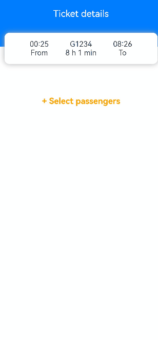
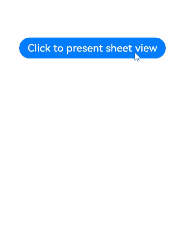
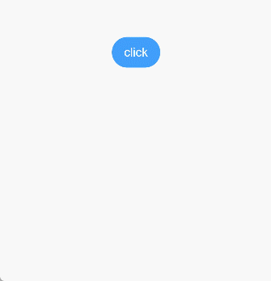
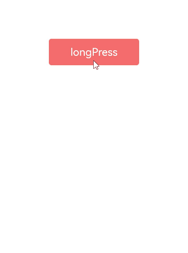
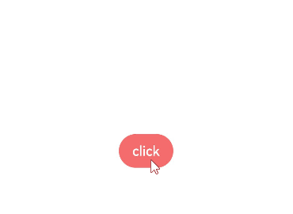
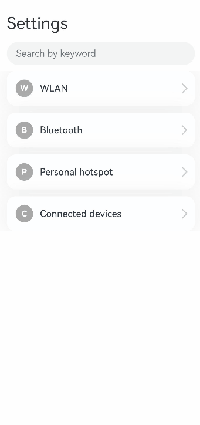

# Modal Transition


Modal transition is a type of transition achieved by a modal – a view that appears on top of the current view while the current view remains.


**Table 1** Modal transition APIs
| API                                      | Description               | Usage                                    |
| ---------------------------------------- | ----------------- | ---------------------------------------- |
| [bindContentCover](../reference/arkui-ts/ts-universal-attributes-modal-transition.md) | Binds a modal to the component.       | Use this API to display a custom modal. It can work with the transition animation and shared element animation to implement complex transition animation effects, for example, displaying an image in full in the modal upon the click of a thumbnail.|
| [bindSheet](../reference/arkui-ts/ts-universal-attributes-sheet-transition.md) | Binds a sheet to the component.         | Use this API to display a custom sheet, for example, a sharing confirmation dialog box.                         |
| [bindMenu](../reference/arkui-ts/ts-universal-attributes-menu.md) | Binds a menu to the component, which is displayed when the component is clicked.    | Use this API where a menu is required, for example, for the plus sign (+), a common menu indicator in applications.                |
| [bindContextMenu](../reference/arkui-ts/ts-universal-attributes-menu.md) | Binds a context menu to the component, which is displayed when the user long-presses or right-clicks the component.| Use this API for components that bounce up when long-pressed, for example, home screen icons.            |
| [bindPopup](../reference/arkui-ts/ts-universal-attributes-popup.md) | Binds a popup to the component.       | Use this API to display a popup containing additional information about a component when the component is clicked.              |
| if                                       | Adds or deletes the component.     | Use this API to display a temporary page in a certain state. In this mode, the return navigation needs to be implemented with a listener. |


## Creating Modal Transition with bindContentCover

You can bind a full-screen modal to a component through the [bindContentCover](../reference/arkui-ts/ts-universal-attributes-modal-transition.md) attribute. Better yet, with the **ModalTransition** parameter, you can apply a transition effect for when the component is inserted or deleted.

1. Define [bindContentCover](../reference/arkui-ts/ts-universal-attributes-modal-transition.md).

2. Define the modal view.

   ```ts
   // Use @Builder to build a modal view.
   @Builder MyBuilder() {
     Column() {
       Text('my model view')
     }
     // Use the transition API to implement the transition animation for component appearance and disappearance. The transition API must be added to the first component of the builder.
     .transition(TransitionEffect.translate(y:300).animation({ curve: curves.springMotion(0.6, 0.8) }))
   }
   ```

3. Call the modal API to display the modal. Implement an animation by using the animation or shared element transition APIs.

   ```ts
    class PresentTmp{
      isPresent: boolean = false;
      set(){
        this.isPresent = !this.isPresent;
      }
    }
   // Define the state variable to control the visibility of the modal.
   @State isPresent: boolean = false;

   Button('Click to present model view')
     // Bind the modal to the component. ModalTransition indicates the transition mode of the modal. The value None means no transition animation for the modal.
     .bindContentCover(this.isPresent, this.MyBuilder, ModalTransition.NONE)
     .onClick(() => {
       // Change the state variable to display the modal.
       let setPre:PresentTmp = new PresentTmp()
       setPre.set()
     })
   ```


Below is the complete sample code and effect.


```ts
import curves from '@ohos.curves';

@Entry
@Component
struct BindContentCoverDemo {
  // Step 1: Define bindContentCover.
  // Define the state variable to control the visibility of the modal.
  @State isPresent: boolean = false;

  // Step 2: Define the modal view.
  // Use @Builder to build a modal view.
  @Builder MyBuilder() {
    Column() {
      Column() {
        Column() {
          Text('back')
            .fontSize(24)
            .fontColor(Color.White)
        }
        .justifyContent(FlexAlign.Center)
        .width(100)
        .height(100)
        .borderRadius(5)
        .backgroundColor(0xf56c6c)
        .onClick(() => {
          this.isPresent = false;
        })
      }
      .height('100%')
      .width('100%')
      .backgroundColor(0x909399)
      .justifyContent(FlexAlign.Center)
      .border({
        radius: {
          topLeft: 15,
          topRight: 15,
        }
      })
    }
    .height('100%')
    .justifyContent(FlexAlign.End)
    // Use the transition API to implement the transition animation for component appearance and disappearance.
    .transition(TransitionEffect.translate({ y: 1000 }).animation({ curve: curves.springMotion(0.6, 0.8) }))
  }

  build() {
    Column() {
      Column() {
        Text('Click Me')
          .fontSize(24)
          .fontColor(Color.White)
      }
      // Step 3: Call the modal API to display the modal. Implement an animation by using the animation or shared element transition APIs.
      .onClick(() => {
        // Change the state variable to display the modal.
        this.isPresent = !this.isPresent;
      })
      // Bind a modal to the component. ModalTransition.DEFAULT means to use the slide-up and slide-down animation type.
      .bindContentCover(this.isPresent, this.MyBuilder(), ModalTransition.DEFAULT)
      .justifyContent(FlexAlign.Center)
      .backgroundColor(0XF56C6C)
      .width(100)
      .height(100)
      .borderRadius(5)
    }
    .justifyContent(FlexAlign.Center)
    .width('100%')
    .height('100%')
  }
}
```





## Creating Sheet Transition with bindSheet

You can bind a sheet to a component through the [bindSheet](../reference/arkui-ts/ts-universal-attributes-sheet-transition.md) attribute. You can also set the sheet to the preset or custom height for when the component is inserted. The process of creating a sheet transition is basically the same as that of creating a modal transition.

Below is the complete sample code and effect.


```ts
@Entry
@Component
struct BindSheetDemo {

  // Define the state variable to control the sheet height.
  @State sheetHeight: number|SheetSize|null|undefined = 300;
  // Define the state variable to control the visibility of the drag bar.
  @State showDragBar: boolean = true;

  // Use @Builder to build a sheet view.
  @Builder myBuilder() {
    Column() {
      Button("change height")
        .margin(10)
        .fontSize(20)
        .onClick(() => {
          this.sheetHeight = 500;
        })

      Button("Set Illegal height")
        .margin(10)
        .fontSize(20)
        .onClick(() => {
          this.sheetHeight = -1;
        })

      Button("close dragbar")
        .margin(10)
        .fontSize(20)
        .onClick(() => {
          this.showDragBar = !this.showDragBar;
        })
      Button("close modal 1")
        .margin(10)
        .fontSize(20)
        .onClick(() => {
          this.isPresent = false;
        })
    }
    .width('100%')
    .height('100%')
  }

  // Define the state variable to control the visibility of the sheet.
  @State isPresent: boolean = false;

  build() {
    Column() {
      if(this.sheetHeight){
        Button("Click to present sheet view")
        .onClick(() => {
          // Change the state variable to display the modal.
          this.isPresent = !this.isPresent;
        })
        .fontSize(20)
        .margin(10)
          // Bind the sheet to the component. You can specify the sheet height and whether to display the drag bar.
        .bindSheet(this.isPresent, this.myBuilder(), { height: this.sheetHeight, dragBar: this.showDragBar })
      }
    }
    .justifyContent(FlexAlign.Center)
    .width('100%')
    .height('100%')
  }
}
```




## Creating a Menu with bindMenu

You can bind a menu to component through the [bindMenu](../reference/arkui-ts/ts-universal-attributes-menu.md) attribute. The menu can then be triggered by clicking. Below is the complete sample code and effect.


```ts
class BMD{
  value:ResourceStr = ''
  action:() => void = () => {}
}
@Entry
@Component
struct BindMenuDemo {

  // Step 1: Define a data array to represent menu items.
  @State items:BMD[] = [
    {
      value:'Menu item 1',
      action: () => {
        console.info('handle Menu1 select')
      }
    },
    {
      value:'Menu item 2',
      action: () => {
        console.info('handle Menu2 select')
      }
    },
  ]

  build() {
    Column() {
      Button('click')
        .backgroundColor(0x409eff)
        .borderRadius(5)
          // Step 2: Bind the menu data to the component through bindMenu.
        .bindMenu(this.items)
    }
    .justifyContent(FlexAlign.Center)
    .width('100%')
    .height(437)
  }
}
```




## Creating a Context Menu with bindContextMenu

You can bind a context menu to component through the [bindContextMenu](../reference/arkui-ts/ts-universal-attributes-menu.md) attribute. The menu can then be triggered by long-pressing or right-clicking.  

Below is the complete sample code and effect.


```ts
@Entry
@Component
struct BindContextMenuDemo {
  private num: number[] = [1, 2, 3, 4];
  private colors: Color[] = [0x67C23A, 0xE6A23C, 0xf56c6c, 0x909399];
  // Use @Builder to build custom menu items.
  @Builder MyMenu() {
    Row() {
      Column() {
        ForEach(this.num, (item: number, index: number = 0) => {
          Row() {
              Text(item.toString())
                .fontSize(20)
                .fontColor(Color.White)
            }
            .backgroundColor(this.colors[index])
            .width('100%')
            .aspectRatio(2)
            .justifyContent(FlexAlign.Center)
        })
      }
      .width('100%')
    }
    .width(150)
    .justifyContent(FlexAlign.Center)
    .padding(5)
  }

  build() {
    Column() {
      Column() {
        Text('longPress')
          .fontSize(20)
          .fontColor(Color.White)
      }
      .justifyContent(FlexAlign.Center)
      .width(170)
      .height(50)
      .bindContextMenu(this.MyMenu, ResponseType.LongPress)
      .backgroundColor(0xf56c6c)
      .borderRadius(5)
    }
    .justifyContent(FlexAlign.Center)
    .width('100%')
    .height(437)
  }
}
```




## Creating a Popup with bindPopUp

You can bind a popup to a component through the [bindpopup](../reference/arkui-ts/ts-universal-attributes-popup.md) attribute, specifying its content, interaction logic, and display status.

Below is the complete sample code and effect.


```ts
@Entry
@Component
struct BindPopupDemo {

  // Step 1: Define the state variable to control the visibility of the popup.
  @State customPopup: boolean = false;

  // Step 2: Use @Builder to build a custom popup.
  @Builder popupBuilder() {
    Column({ space: 2 }) {
      Row().width(64)
        .height(64)
        .backgroundColor(0x409eff)
      Text('Popup')
        .fontSize(10)
        .fontColor(Color.White)
    }
    .justifyContent(FlexAlign.SpaceAround)
    .width(100)
    .height(100)
    .padding(5)
  }

  build() {
    Column() {

      Button('click')
        // Step 4: Add a click event to control the visibility of the popup.
        .onClick(() => {
          this.customPopup = !this.customPopup;
        })
        .backgroundColor(0xf56c6c)
          // Step 5: Bind the popup to the component through bindPopup.
        .bindPopup(this.customPopup, {
          builder: this.popupBuilder,
          placement: Placement.Top,
          maskColor: 0x33000000,
          popupColor: 0xf56c6c,
          enableArrow: true,
          onStateChange: (e) => {
            if (!e.isVisible) {
              this.customPopup = false;
            }
          }
        })
    }
    .justifyContent(FlexAlign.Center)
    .width('100%')
    .height(437)
  }
}
```





## Creating Modal Transition with if

In addition to the preceding modal transition APIs, you can also use the **if** syntax to create a modal transition, eliminating the need for binding to the component and listening for state variable changes.

Below is the complete sample code and effect.


```ts
@Entry
@Component
struct ModalTransition1 {

  // Step 1: Define a state variable to control page display.
  @State isShow: boolean = false;

  build() {
    // Step 2: Define a stack layout to display the current view and modal view.
    Stack() {
      Column() {
        Text('Page1')
          .fontSize(40)
          .fontColor(Color.White)
          .fontWeight(FontWeight.Bolder)

        Text('Click to transition')
          .fontSize(15)
          .fontColor(Color.White)
      }
      .justifyContent(FlexAlign.Center)
      .width('100%')
      .height('100%')
      .linearGradient({
        colors: [
          [0xf56c6c, 0.0],
          [0xffffff, 1.0]
        ]
      })
      // Step 3: Change the state variable to display the modal view.
      .onClick(() => {
        animateTo({ duration: 500 }, () => {
          this.isShow = !this.isShow;
        })
      })

      // Step 4: Define the modal view in if and display it at the top layer. Use if to control the appearance and disappearance of the modal view.
      if (this.isShow) {
        Column() {
          Text('Page2')
            .fontSize(40)
            .fontColor(Color.Gray)
            .fontWeight(FontWeight.Bolder)

          Text('Click to transition')
            .fontSize(15)
            .fontColor(Color.Gray)
        }
        .justifyContent(FlexAlign.Start)
        .width('100%')
        .height('100%')
        .linearGradient({
          colors: [
            [0xffffff, 0.0],
            [0x409eff, 1.0]
          ]
        })
        // Step 5: Define the mode in which the modal view disappears.
        .transition(TransitionEffect.OPACITY.combine(TransitionEffect.rotate({ angle: 90, y: 1 })))
        .onClick(() => {
          animateTo({ duration: 500 }, () => {
            this.isShow = !this.isShow;
          })
        })
      }

    }
    .width('100%')
    .height('100%')
  }
}
```


