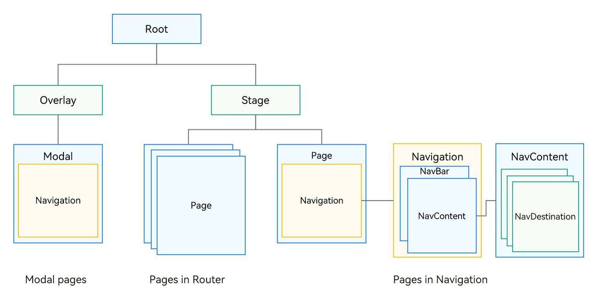

# Component Navigation and Page Routing Overview

The **Navigation** component and the APIs in the **Router** (@ohos.router) module both facilitate page redirection within an application. Yet, the **Navigation** component excels by offering intra-component redirection, which is particularly beneficial in one-time development for multi-device deployment. It provides more flexible page stack operations and a wider range of animations and lifecycles. Therefore, to deliver a better user experience, use the **Navigation** component to implement page redirection and intra-component redirection whenever possible.

## Architecture Differences

In the ArkUI component tree hierarchy, pages that were originally managed by the **Router** module are located beneath the stage management node of the page stack. **Navigation**, as a navigation container component, can be mounted under a single page node and can also be stacked and nested. **Navigation** manages the title bar, toolbar, and content area, an area designed to display the content of custom pages and allowing for page routing. The design of **Navigation** has the following advantages:

1. Explicitly distinguishes the title bar, content area, and toolbar in the API for enhanced management and UX animation flexibility.

2. Explicitly provides a routing container, allowing you to decide its location, which can be in a modal, sheet, or dialog box.

3. Integrates UX design and one-time development for multi-device deployment capabilities, with default capabilities for unified title display, page switching, and single or double column adaptation.

4. Enables flexible page configuration by allowing you to determine the relationship between page aliases and UI through [UIBuilder](../quick-start/arkts-builder.md).

5. Transforms page transition animations into component property animations, offering a wider and more flexible range of transition effects.

6. Provides an inheritable page stack object for improved page display management.

## Capability Comparison 

| Scenario                                     | Navigation                            | Router                                 |
| --------------------------------------------- | ------------------------------------- | -------------------------------------- |
| One-time development for multi-device deployment                                     | Supported. The Auto mode is provided to automatically adapt to single- or double-column layout.   | Not supported                                |
| Navigation to a specific page                                 | pushPath & pushDestination            | pushUrl & pushNameRoute                |
| Navigation to a page within an HSP                                | Supported                                 | Supported                                  |
| Navigation to a page within a HAR                                | Supported                                 | Supported                                  |
| Passing parameters during navigation                                     | Supported                                 | Supported                                  |
| Obtaining parameters of a specific page                             | Supported                                 | Not supported                                |
| Type of parameters passed                                     | Passed as an object                       | Passed as an object, methods not supported within the object|
| Navigation result callback                                 | Supported                                 | Supported                                  |
| Navigation to a singleton page                                 | Supported                                 | Supported                                  |
| Return to a previous page                                     | Supported                                 | Supported                                  |
| Passing parameters on returning to a previous page                                 | Supported                                 | Supported                                  |
| Returning to a specific route                                 | Supported                                 | Supported                                  |
| Dialog box for returning to a previous page                                 | Supported, implemented through route interception               | showAlertBeforeBackPage                |
| Route replacement                                     | replacePath & replacePathByName       | replaceUrl & replaceNameRoute          |
| Clearing the navigation stack                                   | clear                                 | clear                                  |
| Removing specific routes from the navigation stack                                 | removeByIndexes & removeByName        | Not supported                                |
| Transition animation                                     | Supported                                 | Supported                                  |
| Custom transition animation                               | Supported                                 | Supported, with limited animation types                    |
| Disabling transition animation                                 | Supported, with global or one-time setting                       | Supported, by setting **duration** in the **pageTransition** API to **0**|
| Shared element animation with **geometryTransition**               | Supported (shared between **NavDestination** components)       | Not supported                                |
| Listening for page lifecycle                             | UIObserver.on('navDestinationUpdate') | UIObserver.on('routerPageUpdate')      |
| Obtaining a page stack object                               | Supported                                 | Not supported                                |
| Route interception                                     | Supported through **setInterception**      | Not supported                                |
| Route stack information query                               | Supported                                 | getState() & getLength()               |
| Move operations within the navigation stack                               | moveToTop & moveIndexToTop            | Not supported                                |
| Immersive pages                                   | Supported                                 | Not supported; requires window configuration              |
| Setting the title bar and toolbar| Supported                                 | Not supported                                |
| Modal nested routing                                 | Supported                                 | Not supported                                |
