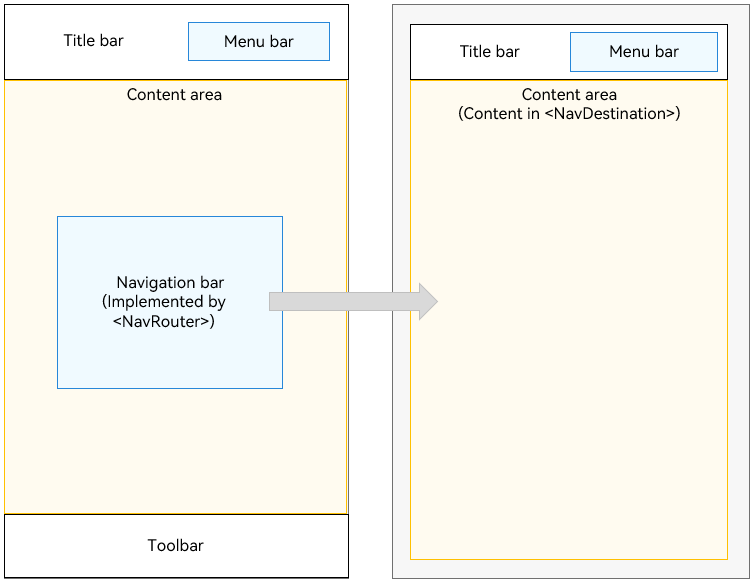
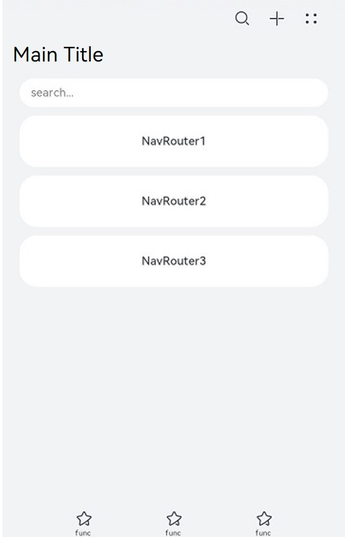
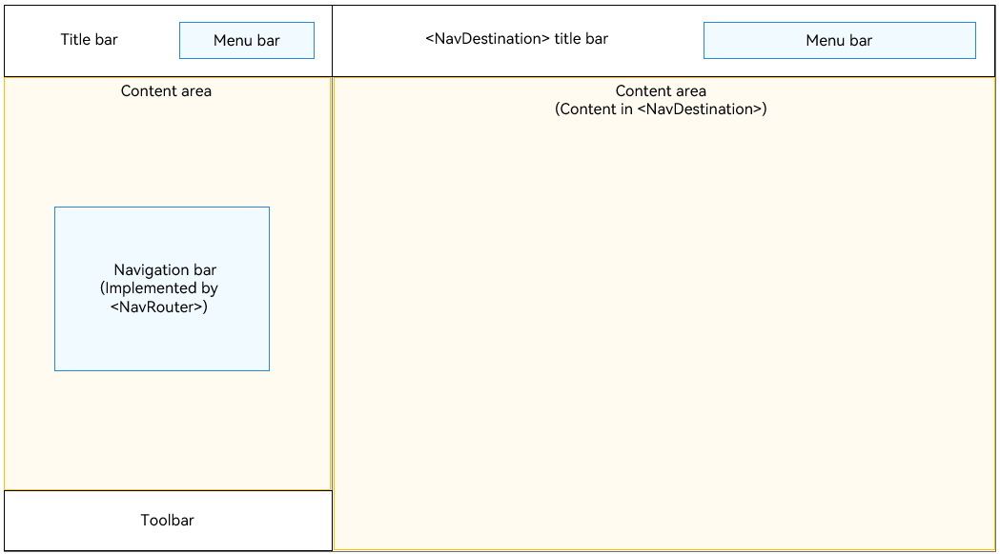
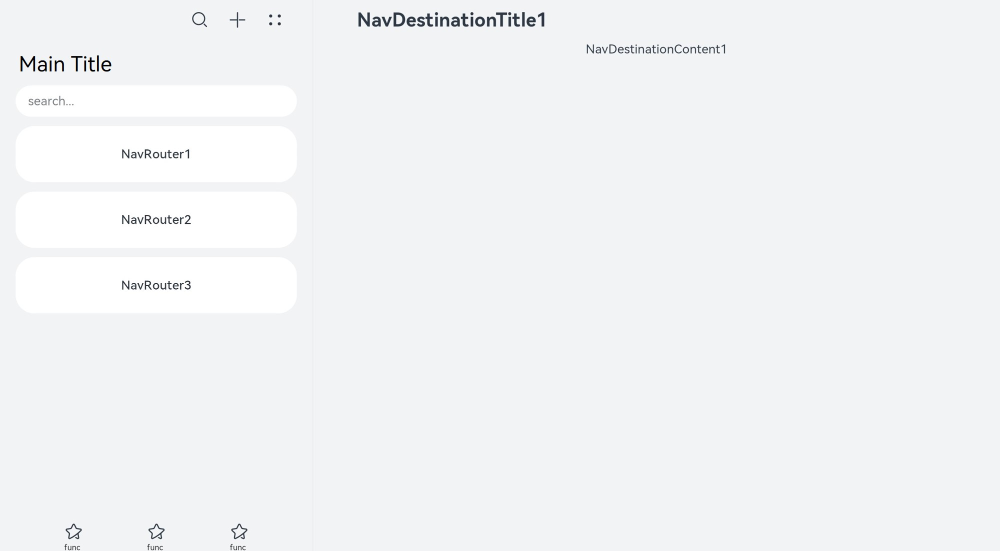
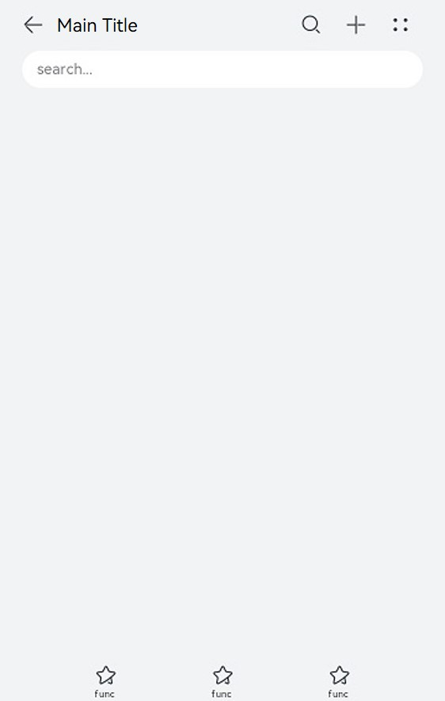
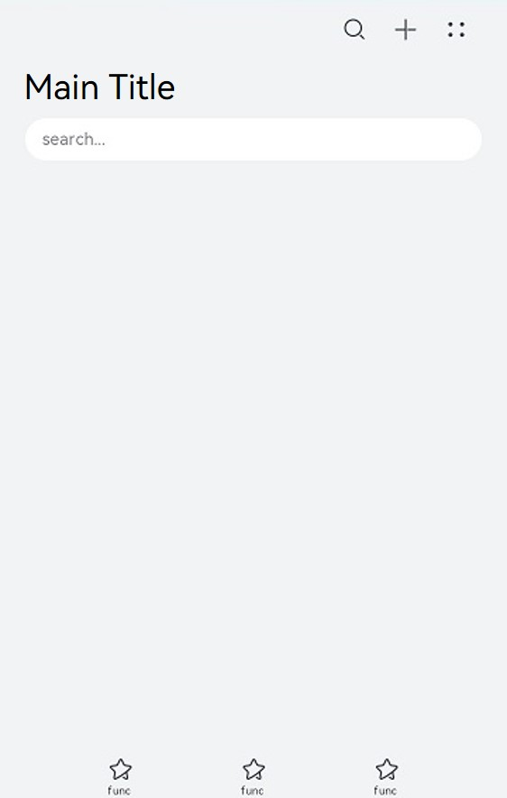
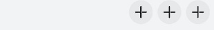
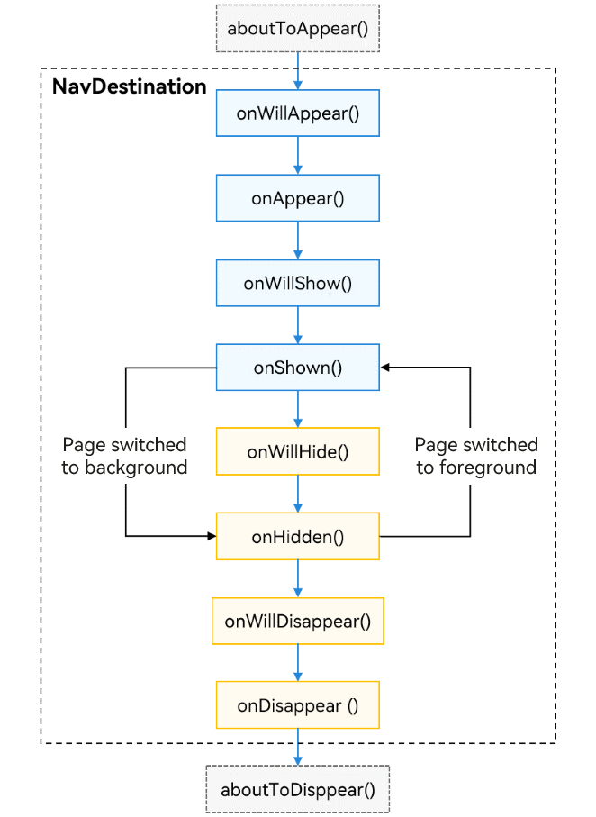

# Component Navigation (Navigation) (Recommended)

The [Navigation](../reference/apis-arkui/arkui-ts/ts-basic-components-navigation.md) component functions as the root container of a page and supports three display modes: single-page, column, and adaptive. It is applicable to routing within a module or across modules and useful in one-time development for multi-device deployment. Draw on this component's routing capability to create a smooth page transition experience, and explore its various title bar styles to present titles seamlessly linked with the content. On devices of different sizes, the **Navigation** component can automatically adapt to the display size and switch between display modes.

The **Navigation** component consists of the navigation page (**NavBar**) and subpage (**NavDestination**). The navigation page consists of the title bar (including the menu bar), content area, and toolbar. It can be hidden through the [hideNavBar](../reference/apis-arkui/arkui-ts/ts-basic-components-navigation.md#hidenavbar9) attribute. The navigation page does not exist in the page stack, and switching between this page and its subpages, as well as switching between subpages, can be implemented through routing.

In API version 9, you need to combine the **Navigation** component and the [\<NavRouter>](../reference/apis-arkui/arkui-ts/ts-basic-components-navrouter.md) component to implement page navigation. Since API version 10, you are advised to use the [NavPathStack](../reference/apis-arkui/arkui-ts/ts-basic-components-navigation.md#navpathstack10) component for the same purpose.


## Setting the Page Display Mode

The **Navigation** component uses the **mode** attribute to set the page display mode.

- Adaptive Mode

  By default, the **Navigation** component is in adaptive mode. In this case, the **mode** attribute is **NavigationMode.Auto**. In adaptive mode, when the device width is greater than or equal to the threshold (520 vp for API version 9 and earlier and 600 vp for API version 10 and later), the **Navigation** component uses the column mode. Otherwise, the **Navigation** component uses the single-page mode.


  ```
  Navigation() {
    ...
  }
  .mode(NavigationMode.Auto)
  ```

- Single-page mode

    **Figure 1** Single-page mode 

  

  Set **mode** to **NavigationMode.Stack** so that the **Navigation** component is displayed on a single page.


  ```ts
  Navigation() {
    ...
  }
  .mode(NavigationMode.Stack)
  ```

  

- Column mode

  **Figure 2** Column mode

  

  Set **mode** to **NavigationMode.Split** so that the **Navigation** component is displayed in columns.


  ```ts
  @Entry
  @Component
  struct NavigationExample {
    @State TooTmp: ToolbarItem = {'value': "func", 'icon': "./image/ic_public_highlights.svg", 'action': ()=> {}}
    @Provide('pageInfos') pageInfos: NavPathStack = new NavPathStack()
    private arr: number[] = [1, 2, 3];

    @Builder
    PageMap(name: string) {
      if (name === "NavDestinationTitle1") {
        pageOneTmp()
      } else if (name === "NavDestinationTitle2") {
        pageTwoTmp()
      } else if (name === "NavDestinationTitle3") {
        pageThreeTmp()
      }
    }
  
    build() {
      Column() {
        Navigation(this.pageInfos) {
          TextInput({ placeholder: 'search...' })
            .width("90%")
            .height(40)
            .backgroundColor('#FFFFFF')
  
          List({ space: 12 }) {
            ForEach(this.arr, (item:string) => {
              ListItem() {
                Text("NavRouter" + item)
                  .width("100%")
                  .height(72)
                  .backgroundColor('#FFFFFF')
                  .borderRadius(24)
                  .fontSize(16)
                  .fontWeight(500)
                  .textAlign(TextAlign.Center)
                  .onClick(()=>{
                    this.pageInfos.pushPath({ name: "NavDestinationTitle" + item})
                  })
              }
            }, (item:string):string => item)
          }
          .width("90%")
          .margin({ top: 12 })
        }
        .title ("Main Title")
        .mode(NavigationMode.Split)
        .navDestination(this.PageMap)
        .menus([
          {value: "", icon: "./image/ic_public_search.svg", action: ()=> {}},
          {value: "", icon: "./image/ic_public_add.svg", action: ()=> {}},
          {value: "", icon: "./image/ic_public_add.svg", action: ()=> {}},
          {value: "", icon: "./image/ic_public_add.svg", action: ()=> {}},
          {value: "", icon: "./image/ic_public_add.svg", action: ()=> {}}
        ])
        .toolbarConfiguration([this.TooTmp, this.TooTmp, this.TooTmp])
      }
      .height('100%')
      .width('100%')
      .backgroundColor('#F1F3F5')
    }
  }

  // PageOne.ets
  @Component
  export struct pageOneTmp {
    @Consume('pageInfos') pageInfos: NavPathStack;
    build() {
      NavDestination() {
        Column() {
          Text("NavDestinationContent1")
        }.width('100%').height('100%')
      }.title("NavDestinationTitle1")
      .onBackPressed(() => {
        const popDestinationInfo = this.pageInfos.pop() // Pop the top element out of the navigation stack.
        console.log('pop' + 'Return value' + JSON.stringify(popDestinationInfo))
        return true
      })
    }
  }

  // PageTwo.ets
  @Component
  export struct pageTwoTmp {
    @Consume('pageInfos') pageInfos: NavPathStack;
    build() {
      NavDestination() {
        Column() {
          Text("NavDestinationContent2")
        }.width('100%').height('100%')
      }.title("NavDestinationTitle2")
      .onBackPressed(() => {
        const popDestinationInfo = this.pageInfos.pop() // Pop the top element out of the navigation stack.
        console.log('pop' + 'Return value' + JSON.stringify(popDestinationInfo))
        return true
      })
    }
  }

  // PageThree.ets
  @Component
  export struct pageThreeTmp {
    @Consume('pageInfos') pageInfos: NavPathStack;
    build() {
      NavDestination() {
        Column() {
          Text("NavDestinationContent3")
        }.width('100%').height('100%')
      }.title("NavDestinationTitle3")
      .onBackPressed(() => {
        const popDestinationInfo = this.pageInfos.pop() // Pop the top element out of the navigation stack.
        console.log('pop' + 'Return value' + JSON.stringify(popDestinationInfo))
        return true
      })
    }
  }
  ```

  


## Setting the Title Bar Mode

The title bar is on the top of the page and is used to display the page name and operation entry. The **Navigation** component uses the **titleMode** attribute to set the title bar mode.

- Mini mode

  Applicable when the title of a level-1 page does not need to be highlighted.

  **Figure 3** Title bar in Mini mode 

  


  ```ts
  Navigation() {
    ...
  }
  .titleMode(NavigationTitleMode.Mini)
  ```


- Full mode

  Applicable when the title of a level-1 page needs to be highlighted.

    **Figure 4** Title bar in Full mode 

  


  ```ts
  Navigation() {
    ...
  }
  .titleMode(NavigationTitleMode.Full)
  ```


## Setting the Menu Bar

The menu bar is in the upper right corner of the **Navigation** component. You can set the menu bar through the **menus** attribute, which supports two parameter types: Array&lt;[NavigationMenuItem](../reference/apis-arkui/arkui-ts/ts-basic-components-navigation.md#navigationmenuitem)&gt; and CustomBuilder. When the Array\<NavigationMenuItem> type is used, a maximum of three icons can be displayed in portrait mode and a maximum of five icons can be displayed in landscape mode. Extra icons will be placed in the automatically generated More icons.

**Figure 5** Menu bar with three icons 



```ts
let TooTmp: NavigationMenuItem = {'value': "", 'icon': "./image/ic_public_highlights.svg", 'action': ()=> {}}
Navigation() {
  ...
}
.menus([TooTmp,
  TooTmp,
  TooTmp])
```

You can also reference images in the **resources** folder.

```ts
let TooTmp: NavigationMenuItem = {'value': "", 'icon': "resources/base/media/ic_public_highlights.svg", 'action': ()=> {}}
Navigation() {
  ...
}
.menus([TooTmp,
  TooTmp,
  TooTmp])
```

**Figure 6** Menu bar with four icons 


```ts
let TooTmp: NavigationMenuItem = {'value': "", 'icon': "./image/ic_public_highlights.svg", 'action': ()=> {}}
Navigation() {
  ...
}
.menus([TooTmp,
  TooTmp,
  TooTmp,
  TooTmp])
```


## Setting the Toolbar

The toolbar is located at the bottom of the **Navigation** component. You can set the toolbar through the **toolbarConfiguration** attribute.


  **Figure 7** Toolbar 


```ts
let TooTmp: ToolbarItem = {'value': "func", 'icon': "./image/ic_public_highlights.svg", 'action': ()=> {}}
let TooBar: ToolbarItem[] = [TooTmp,TooTmp,TooTmp]
Navigation() {
  ...
}
.toolbarConfiguration(TooBar)
```

## Route Operations

Navigation-related routing operations are all based on the APIs provided by [NavPathStack](../reference/apis-arkui/arkui-ts/ts-basic-components-navigation.md#navpathstack10). For each **Navigation** component, a **NavPathStack** object must be created and passed in to manage pages. The router operations mainly involve page navigation, page return, page replacement, page deletion, parameter acquisition, and routing interception.

**NavPathStack** can be inherited since API version 12. You can customize attributes and methods in derived classes or override methods of the parent class. Derived class objects can be used in place of the base class **NavPathStack** objects. For details about the sample code, see [Example 10](../reference/apis-arkui/arkui-ts/ts-basic-components-navigation.md#example-10).

```ts
@Entry
@Component
struct Index {
  // Create a NavPathStack object and pass it to Navigation.
  pageStack: NavPathStack = new NavPathStack()

  build() {
    Navigation(this.pageStack) {
    }
    .title('Main')
  }
}
```

### Page Navigation

**NavPathStack** implements the following types of page navigation through **Push** related APIs:

1. Normal navigation: Navigation is conducted by page name and allows for passing of **param**.

    ```ts
    this.pageStack.pushPath({ name: "PageOne", param: "PageOne Param" })
    this.pageStack.pushPathByName("PageOne", "PageOne Param")
    ```

2. Navigation with a return callback: An **onPop** callback is added during navigation to obtain return information and process it upon page popping.

    ```ts
    this.pageStack.pushPathByName('PageOne', "PageOne Param", (popInfo) => {
    console.log('Pop page name is: ' + popInfo.info.name + ', result: ' + JSON.stringify(popInfo.result))
    });
    ```

3. Navigation with an error code: An asynchronous callback is triggered at the end of navigation, returning error code information.

    ```ts
    this.pageStack.pushDestinationByName('PageOne', "PageOne Param")
    .catch((error: BusinessError) => {
        console.error(`Push destination failed, error code = ${error.code}, error.message = ${error.message}.`);
    }).then(() => {
    console.error('Push destination succeed.');
    });
    ```

### Page Return

**NavPathStack** implements the page return feature through **Pop** related APIs.

```ts
// Return to the previous page.
this.pageStack.pop()
// Return to the previous PageOne page.
this.pageStack.popToName("PageOne")
// Return to the page whose index is 1.
this.pageStack.popToIndex(1)
// Return to the root home page (clear all pages in the stack).
this.pageStack.clear()
```

### Page Replacement

NavPathStack implements the page replacement feature through **Replace** related APIs.

```ts
// Replace the top page of the stack with PageOne.
this.pageStack.replacePath({ name: "PageOne", param: "PageOne Param" })
this.pageStack.replacePathByName("PageOne", "PageOne Param")
```

### Page Deletion

**NavPathStack** implements the page deletion feature through **Remove** related APIs.

```ts
// Remove all pages whose name is PageOne from the stack.
this.pageStack.removeByName("PageOne")
// Remove the page with the specified index.
this.pageStack.removeByIndexes([1,3,5])
```

### Parameter Acquisition

**NavPathStack** obtains parameters of the page through **Get** related APIs.

```ts
// Obtain all page names in the stack.
this.pageStack.getAllPathName()
// Obtain the parameters of the page whose index is 1.
this.pageStack.getParamByIndex(1)
// Obtain the parameters of the PageOne page.
this.pageStack.getParamByName("PageOne")
// Obtain the index set of the PageOne page.
this.pageStack.getIndexByName("PageOne")
```

### Route Interception

**NavPathStack** provides the [setInterception](../reference/apis-arkui/arkui-ts/ts-basic-components-navigation.md#setinterception12) API to set callbacks for page navigation interception of **Navigation**. This API requires passing in a **NavigationInterception** object, which contains three callback functions described below.

| Name      | Description                                                |
| ------------ | ------------------------------------------------------ |
| willShow   | Callback invoked when the page is about to be navigated, allowing for stack operations, which are effective in the current navigation.      |
| didShow    | Callback invoked after the page is navigated. Stack operations in this callback are effective in the next navigation. |
| modeChange | Callback invoked when the display mode of the **Navigation** component switches between single-column and dual-column. |

> **NOTE**
>
> The navigation stack has already changed when any of the preceding callbacks is invoked.

You can implement the capability to intercept and redirect in the **willShow** callback by modifying the route stack.

```ts
this.pageStack.setInterception({
  willShow: (from: NavDestinationContext | "navBar", to: NavDestinationContext | "navBar",
    operation: NavigationOperation, animated: boolean) => {
    if (typeof to === "string") {
      console.log("target page is navigation home page.");
      return;
    }
    // Redirect navigation to PageTwo to PageOne.
    let target: NavDestinationContext = to as NavDestinationContext;
    if (target.pathInfo.name === 'PageTwo') {
      target.pathStack.pop();
      target.pathStack.pushPathByName('PageOne', null);
    }
  }
})
```

## Subpage

[NavDestination](../reference/apis-arkui/arkui-ts/ts-basic-components-navdestination.md) is the root container for **Navigation** subpages, used to hold some special attributes as well as lifecycles of subpages. You can set separate attributes such as the title bar and menu bar for **NavDestination**, in the same way you set attributes for **Navigation**. You can also set different display modes for **NavDestination** through the **mode** attribute to meet different page requirements.

### Page Display Mode

- Standard mode

  By default, subpages in the **\<NavDestination>** component are in standard mode, which corresponds to the **NavDestinationMode.STANDARD** value of the **mode** attribute. The lifecycle of a standard type **NavDestination** follows the changes in its position in the **NavPathStack**.

- Dialog mode
  
  With **mode** set to **NavDestinationMode.DIALOG**, a **NavDestination** The appearance and disappearance of the dialog-type **NavDestination** will not affect the display and lifecycle of the underlying standard-type **NavDestination**, and the two can be displayed at the same time.
  
  ```ts
  // Dialog NavDestination
  @Entry
  @Component
   struct Index {
     @Provide('NavPathStack') pageStack: NavPathStack = new NavPathStack()
  
     @Builder
     PagesMap(name: string) {
       if (name == 'DialogPage') {
         DialogPage()
       }
     }
  
     build() {
       Navigation(this.pageStack) {
         Button('Push DialogPage')
           .margin(20)
           .width('80%')
           .onClick(() => {
             this.pageStack.pushPathByName('DialogPage', '');
           })
       }
       .mode(NavigationMode.Stack)
       .title('Main')
       .navDestination(this.PagesMap)
     }
   }
  
   @Component
   export struct DialogPage {
     @Consume('NavPathStack') pageStack: NavPathStack;
  
     build() {
       NavDestination() {
         Stack({ alignContent: Alignment.Center }) {
           Column() {
             Text("Dialog NavDestination")
               .fontSize(20)
               .margin({ bottom: 100 })
             Button("Close").onClick(() => {
               this.pageStack.pop()
             }).width('30%')
           }
           .justifyContent(FlexAlign.Center)
           .backgroundColor(Color.White)
           .borderRadius(10)
           .height('30%')
           .width('80%')
         }.height("100%").width('100%')
       }
       .backgroundColor('rgba(0,0,0,0.5)')
       .hideTitleBar(true)
       .mode(NavDestinationMode.DIALOG)
     }
   }
  ```
  

### Page Lifecycle

As a routing container, **Navigation**'s lifecycle is carried on the **NavDestination** component, which is opened in the form of component events.

Its lifecycle can be roughly divided into three categories: custom component lifecycle, universal component lifecycle, and its own lifecycle (where **aboutToAppear** and **aboutToDisappear** are [custom component lifecycle callbacks](../reference/apis-arkui/arkui-ts/ts-custom-component-lifecycle.md) and exist when **NavDestination** contains custom components; **OnAppear** and **OnDisappear** are [universal component lifecycle](../reference/apis-arkui/arkui-ts/ts-universal-events-show-hide.md); the remaining are unique to **NavDestination**)

The following figure shows the lifecycle.



- **aboutToAppear**: Invoked when the custom component is about to appear. Specifically, it is invoked after a new instance of the custom component is created and before its **build()** function is executed (before the creation of **NavDestination**). You can change state variables in this callback, and the changes take effect in the subsequent execution of **build()**.
- **onWillAppear**: invoked after the **NavDestination** component is created and before it is mounted to the component tree. Changing the state variable in this callback takes effect in the current frame.
- **onAppear**: invoked when the **NavDestination** component is mounted to the component tree. It is a universal lifecycle event.
- **onWillShow**: invoked before the **NavDestination** component layout is displayed. In this case, the page is invisible. (This callback is not invoked when the application is switched to the foreground.)
- **onShown**: invoked after the **NavDestination** component layout is displayed. At this time, the page layout is complete.
- **onWillHide**: invoked when the **NavDestination** component is about to be hidden (it is not invoked when the application is switched to the background).
- **onHidden**: invoked after the **NavDestination** component is hidden (when a non-top page is pushed into the stack, the top page pops out of the stack, or the application is switched to the background).
- **onWillDisappear**: invoked before the **NavDestination** component is about to be destroyed. If there is a transition animation, this callback is invoked before the animation (when the top page of the stack pops out of the stack).
- **onDisappear**: invoked when the **NavDestination** component is unloaded and destroyed from the component tree. It is a universal lifecycle event.
- **aboutToDisappear**: invoked before the custom component is destroyed. The state variable cannot be changed in this callback.

### Page Listening and Query

To facilitate the decoupling of components from pages, custom components within **NavDestination** subpages can listen for or query some page status information through global APIs.

- Page information query

  Custom components provide the [queryNavDestinationInfo](../reference/apis-arkui/arkui-ts/ts-custom-component-api.md#querynavdestinationinfo) API, which can be used to query the information of the current page within **NavDestination**. The return value is [NavDestinationInfo](../reference/apis-arkui/js-apis-arkui-observer.md#navdestinationinfo). If the query fails, the return value is **undefined**.
  
  ```ts
   import { uiObserver } from '@kit.ArkUI';
  
   // Custom components within NavDestination
   @Component
   struct MyComponent {
     navDesInfo: uiObserver.NavDestinationInfo | undefined
  
     aboutToAppear(): void {
       this.navDesInfo = this.queryNavDestinationInfo();
     }
  
     build() {
         Column() {
           Text("Page name: " + this.navDesInfo?.name)
         }.width('100%').height('100%')
     }
   }
  ```
- Page status listening
  
  The registration API provided by [@ohos.arkui.observer](../reference/apis-arkui/js-apis-arkui-observer.md#observeronnavdestinationupdate) can be used to listen for the lifecycle changes of **NavDestination**. The usage is as follows:
  
  ```ts
  uiObserver.on('navDestinationUpdate', (info) => {
       console.info('NavDestination state update', JSON.stringify(info));
   });
  ```
  
  You can also register a callback for page switching status to obtain the corresponding page information [NavDestinationSwitchInfo](../reference/apis-arkui/js-apis-arkui-observer.md#navdestinationswitchinfo12) when a page route switching occurs, and it provides different listening scopes for UIAbilityContext and UIContext:
  
  ```ts
   // Used in UIAbility
   import { UIContext, uiObserver } from '@kit.ArkUI';
  
   // callBackFunc is a callback defined by you.
   function callBackFunc(info: uiObserver.NavDestinationSwitchInfo) {}
   uiObserver.on('navDestinationSwitch', this.context, callBackFunc);
  
   // The getUIContext() API of the window can be used to obtain the corresponding UIContent.
   uiContext: UIContext | null = null;
   uiObserver.on('navDestinationSwitch', this.uiContext, callBackFunc);
  ```

## Page Transition

**Navigation** provides default transition animations for page switching: Different transition effects are initiated for different operations on the page stack (dialog-type pages have no transition animation by default). **Navigation** also provides the capability to disable system transitions, customize transitions, and define shared element transitions.

### Disabling Transitions

- On a Global Basis
  
  To enable or disable all transition animations in the current **Navigation** component, you can use the [disableAnimation](../reference/apis-arkui/arkui-ts/ts-basic-components-navigation.md#disableanimation11) API provided in **NavPathStack**.
  ```ts
  pageStack: NavPathStack = new NavPathStack()
  
  aboutToAppear(): void {
    this.pageStack.disableAnimation(true)
  }
  ```
- On a One-time Basis
  
  To disable the transition animation for a single operation (implemented by APIs provided by **NavPathStack**, such as **Push**, **Pop**, and **Replace**), set the **animated** parameter in the API to **false**. This setting does not affect the next transition.
  ```ts
  pageStack: NavPathStack = new NavPathStack()
  
  this.pageStack.pushPath({ name: "PageOne" }, false)
  this.pageStack.pop(false)
  ```

### Customizing a Transition

You can customize transition animations through the [customNavContentTransition](../reference/apis-arkui/arkui-ts/ts-basic-components-navigation.md#customnavcontenttransition11) event. Specifically, you can define a custom transition animation in the following steps:

1. Build a custom transition animation utility class **CustomNavigationUtils**, which manages custom transition animation **CustomTransition** objects for each page through a Map. A page registers its **CustomTransition** object when created and unregisters it when destroyed.
2. Implement a transition protocol object [NavigationAnimatedTransition](..//reference/apis-arkui/arkui-ts/ts-basic-components-navigation.md#navigationanimatedtransition11). In this object, the **timeout** property indicates the timeout for the transition to end, with a default value of 1000 ms; the **transition** property is the custom transition animation API, where you should implement your own transition animation logic, which the system will call when the transition starts; **onTransitionEnd** is the callback when the transition ends.
3. Call the **customNavContentTransition** API to return the **NavigationAnimatedTransition** object. If **undefined** is returned, the system default transition is used.

For details about the sample code, see [Example 3](../reference/apis-arkui/arkui-ts/ts-basic-components-navigation.md#example-3).

### Defining a Shared Element Transition

During the switching between **NavDestination** components, the [geometryTransition](../reference/apis-arkui/arkui-ts/ts-transition-animation-geometrytransition.md) API can be used to implement the shared element transitions. Pages configured with shared element transitions must have the system's default transition animations disabled.
1. Add the **geometryTransition** attribute to the components that need to implement shared element transitions, ensuring that the **id** parameter is consistent between the two **NavDestination** components.

    ```ts
    // Set id of the source page.
    NavDestination() {
    Column() {
        ...
        Image($r('app.media.startIcon'))
        .geometryTransition('sharedId')
        .width(100)
        .height(100)
    }
    }
    .title('FromPage')

    // Set id of the destination page.
    NavDestination() {
    Column() {
        ...
        Image($r('app.media.startIcon'))
        .geometryTransition('sharedId')
        .width(200)
        .height(200)
    }
    }
    .title('ToPage')
    ```

2. Place the page routing operation in the **animateTo** animation closure, set the corresponding animation parameters, and disable the default transition.

    ```ts
    NavDestination() {
    Column() {
        Button('Go to Destination Page')
        .width('80%')
        .height(40)
        .margin(20)
        .onClick(() => {
            animateTo({ duration: 1000 }, () => {
            this.pageStack.pushPath({ name: 'ToPage' }, false)
            })
        })
    }
    }
    .title('FromPage')
    ```

## Cross-Package Dynamic Routing

Using static imports for page routing can lead to coupling between different modules and prolonged home page loading times.

The purpose of dynamic routing is to allow multiple modules (HARs/HSPs) to reuse the same business logic, with decoupling between different modules and integration of routing functionality.

**Advantages of dynamic routing**

- In addition to the URL for navigation, you can configure various information, such as the default orientation (landscape or portrait) and whether authentication is required. The configuration is processed in a unified manner during routing
- You can assign a name to each routing page and navigate by name instead of file path.
- Dynamic imports (on-demand loading) can be used to load pages to prevent the first page from loading a large amount of code, which can cause stuttering.

Dynamic routing provides two modes: [System Routing Table](#system-routing-table) and [Custom Routing Table](#custom-routing-table).

- The system routing table is easier to use than the custom routing table. It only requires adding the corresponding page navigation configuration items to implement page navigation.

- The custom route table is more complex to use, but can be customized to meet specific service requirements.

The custom route table and system route table can be used together.

### System Routing Table

**Navigation** supports the system routing table for dynamic routing since API version 12. Each service module (HSP/HAR) requires an individual **router_map.json** file. When routing is triggered, the application only needs to pass the name of the page that needs to be routed through the routing API provided by **NavPathStack**. In this case, the system will automatically complete the dynamic loading of the target module, page component construction, and route redirection. This way, module decoupling is achieved at the development level. The main steps are as follows:

1. Add the route table configuration to the **module.json5** file of the redirection target module.
   
   ```json
     {
       "module" : {
         "routerMap": "$profile:route_map"
       }
     }
   ```
2. Create the **route_map.json** file in **resources/base/profile** of the project directory. Add the following configuration information:
   
   ```json
     {
       "routerMap": [
         {
           "name": "PageOne",
           "pageSourceFile": "src/main/ets/pages/PageOne.ets",
           "buildFunction": "PageOneBuilder",
           "data": {
             "description" : "this is PageOne"
           }
         }
       ]
     }
   ```

    The configuration is described as follows.

    | Item | Description |
    |---|---|
    | name | Name of the target page to be redirected to.|
    | pageSourceFile | Path of the target page in the package, relative to the **src** directory.|
    | buildFunction | Name of the entry point function for redirection to the target page, which must be decorated by @Builder. |
    | data | Custom data. You can obtain the value through the **getConfigInRouteMap** API.|

3. On the target page, configure the @Builder decorated entry point function. The function name must be the same as the value of **buildFunction** in the **router_map.json** file. Otherwise, an error is reported at compile time.
   
   ```ts
     // Entry point function for redirection to the target page
     @Builder
     export function PageOneBuilder() {
       PageOne()
     }
   
     @Component
     struct PageOne {
       pathStack: NavPathStack = new NavPathStack()
   
       build() {
         NavDestination() {
         }
         .title('PageOne')
         .onReady((context: NavDestinationContext) => {
            this.pathStack = context.pathStack
         })
       }
     }
   ```
4. Use routing APIs such as **pushPathByName** to navigate to the target page. (Note: In this case, you do not need to configure the **navDestination** attribute in **Navigation**.)
   
   ```ts
     @Entry
     @Component
     struct Index {
       pageStack : NavPathStack = new NavPathStack();
   
       build() {
         Navigation(this.pageStack){
         }.onAppear(() => {
           this.pageStack.pushPathByName("PageOne", null, false);
         })
         .hideNavBar(true)
       }
     }
   ```

### Custom Routing Table

You can implement cross-package dynamic routing through a custom routing table.

**Implementation:**

1. Define page navigation configuration items.
   - Use resource files for definition. The [resource manager](../reference/apis-localization-kit/js-apis-resource-manager.md) parses resource files during running.
   - Configure the route loading configuration items in the .ets file, including the route page name (alias of the page in the **pushPath** API), name of the module where the file is located (name of the HSP/HAR module), and path of the page to be loaded in the module (relative to the **src** directory).
2. Load the target navigation page. Use [import](../quick-start/arkts-dynamic-import.md) to load the module where the target page is located during running. After the module is loaded, call the method in the module, load the target page to be displayed in the module by importing the method of the module, and return the **Builder** function defined after the page is loaded.
3. Trigger page navigation. Execute the **Builder** function loaded in step 2 in the [.navDestination](../reference/apis-arkui/arkui-ts/ts-basic-components-navigation.md#navdestination10) attribute of **Navigation** to navigate to the target page.
<!--no_check-->