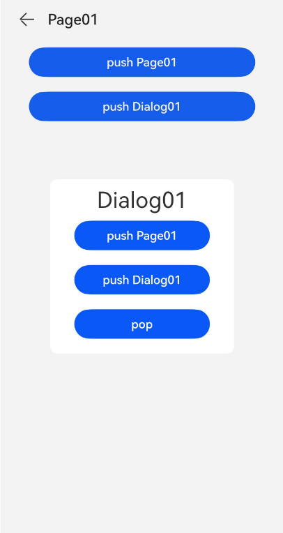

# Navigation

Generally, the [\<Navigation>](../reference/apis-arkui/arkui-ts/ts-basic-components-navigation.md) component functions as the root container of a page and supports three display modes: single-page, column, and adaptive. It is applicable to page redirection within a module and useful in one-time development for multi-device deployment. Draw on this component's routing capability to create a smooth page transition experience, and explore its various title bar styles to present titles seamlessly linked with the content. In one-time development for multi-device deployment scenarios, the **\<Navigation>** component can automatically adapt to the window size; when the window is large enough, it automatically displays content in columns.

When implementing page navigation, prioritize the [NavPathStack](../reference/apis-arkui/arkui-ts/ts-basic-components-navigation.md#navpathstack10) API of the **\<Navigation>** component. Avoid a combination of **\<Navigation>** and the **\<NavRouter>** child for page navigation. The [\<NavDestination>](../reference/apis-arkui/arkui-ts/ts-basic-components-navdestination.md) component can be used for page navigation when contained in a **\<Navigation>** component, but cannot be 


## Setting the Page Display Mode

The **\<Navigation>** component uses the **mode** attribute to set the page display mode.

- Adaptive Mode

  By default, the **\<Navigation>** component is in adaptive mode. In this case, the **mode** attribute is **NavigationMode.Auto**. In adaptive mode, when the device width is greater than 520 vp, the **\<Navigation>** component uses the column mode. Otherwise, the **\<Navigation>** component uses the single-page mode.


  ```
  Navigation() {
    ...
  }
  .mode(NavigationMode.Auto)
  ```

- Single-page mode

    **Figure 1** Single-page mode 

  

  Set **mode** to **NavigationMode.Stack** so that the **\<Navigation>** component is displayed on a single page.


  ```ts
  Navigation() {
    ...
  }
  .mode(NavigationMode.Stack)
  ```

  

- Column mode

  **Figure 2** Column mode

  

  Set **mode** to **NavigationMode.Split** so that the **\<Navigation>** component is displayed in columns.


  ```ts
  @Entry
  @Component
  struct NavigationExample {
    @State TooTmp: ToolbarItem = {'value': "func", 'icon': "./image/ic_public_highlights.svg", 'action': ()=> {}}
    private arr: number[] = [1, 2, 3];
  
    build() {
      Column() {
        Navigation() {
          TextInput({ placeholder: 'search...' })
            .width("90%")
            .height(40)
            .backgroundColor('#FFFFFF')
  
          List({ space: 12 }) {
            ForEach(this.arr, (item:string) => {
              ListItem() {
                NavRouter() {
                  Text("NavRouter" + item)
                    .width("100%")
                    .height(72)
                    .backgroundColor('#FFFFFF')
                    .borderRadius(24)
                    .fontSize(16)
                    .fontWeight(500)
                    .textAlign(TextAlign.Center)
                  NavDestination() {
                    Text("NavDestinationContent" + item)
                  }
                  .title("NavDestinationTitle" + item)
                }
              }
            }, (item:string):string => item)
          }
          .width("90%")
          .margin({ top: 12 })
        }
        .title ("Main Title")
        .mode(NavigationMode.Split)
        .menus([
          {value: "", icon: "./image/ic_public_search.svg", action: ()=> {}},
          {value: "", icon: "./image/ic_public_add.svg", action: ()=> {}},
          {value: "", icon: "./image/ic_public_add.svg", action: ()=> {}},
          {value: "", icon: "./image/ic_public_add.svg", action: ()=> {}},
          {value: "", icon: "./image/ic_public_add.svg", action: ()=> {}}
        ])
        .toolbarConfiguration([this.TooTmp, this.TooTmp, this.TooTmp])
      }
      .height('100%')
      .width('100%')
      .backgroundColor('#F1F3F5')
    }
  }
  ```

  


## Setting the Title Bar Mode

The title bar is on the top of the page and is used to display the page name and operation entry. The **\<Navigation>** component uses the **titleMode** attribute to set the title bar mode.

- Mini mode
  Applicable when the title of a level-1 page does not need to be highlighted.

  **Figure 3** Title bar in Mini mode 

  


  ```ts
  Navigation() {
    ...
  }
  .titleMode(NavigationTitleMode.Mini)
  ```


- Full mode
  Applicable when the title of a level-1 page needs to be highlighted.

    **Figure 4** Title bar in Full mode 

  


  ```ts
  Navigation() {
    ...
  }
  .titleMode(NavigationTitleMode.Full)
  ```


## Setting the Menu Bar

The menu bar is in the upper right corner of the **\<Navigation>** component. You can set the menu bar through the **menus** attribute, which supports two parameter types: Array&lt;[NavigationMenuItem](../reference/apis-arkui/arkui-ts/ts-basic-components-navigation.md#navigationmenuitem)&gt; and CustomBuilder. When the Array\<NavigationMenuItem> type is used, a maximum of three icons can be displayed in portrait mode and a maximum of five icons can be displayed in landscape mode. Extra icons will be placed in the automatically generated More icons.

**Figure 5** Menu bar with three icons 


```ts
let TooTmp: NavigationMenuItem = {'value': "", 'icon': "./image/ic_public_highlights.svg", 'action': ()=> {}}
Navigation() {
  ...
}
.menus([TooTmp,
  TooTmp,
  TooTmp])
```

You can also reference images in the **resources** folder.

```ts
let TooTmp: NavigationMenuItem = {'value': "", 'icon': "resources/base/media/ic_public_highlights.svg", 'action': ()=> {}}
Navigation() {
  ...
}
.menus([TooTmp,
  TooTmp,
  TooTmp])
```

**Figure 6** Menu bar with four icons 


```ts
let TooTmp: NavigationMenuItem = {'value': "", 'icon': "./image/ic_public_highlights.svg", 'action': ()=> {}}
Navigation() {
  ...
}
.menus([TooTmp,
  TooTmp,
  TooTmp,
  TooTmp])
```


## Setting the Toolbar

The toolbar is located at the bottom of the **\<Navigation>** component. You can set the toolbar through the **toolbarConfiguration** attribute.


  **Figure 7** Toolbar 


```ts
let TooTmp: ToolbarItem = {'value': "func", 'icon': "./image/ic_public_highlights.svg", 'action': ()=> {}}
let TooBar: ToolbarItem[] = [TooTmp,TooTmp,TooTmp]
Navigation() {
  ...
}
.toolbarConfiguration(TooBar)
```

## Setting the Subpage Mode

You can set the subpage mode through the **mode** attribute of **\<NavDestination>**, the root container of subpages.

- Standard mode

  By default, subpages in the **\<NavDestination>** component are in standard mode, which corresponds to the **NavDestinationMode.STANDARD** value of the **mode** attribute. In standard mode, where the lifecycle of **\<NavDestination>** changes with the standard destination in the **NavPathStack**.

- Dialog mode

  **Figure 8** Dialog mode

  

  Set the **mode** attribute to **NavDestinationMode.DIALOG** to set subpages in the **\<NavDestination>** component to dialog mode, where the component is transparent. You can add different effects to the component, for example, add a background.

  ```ts
  // Index.ets
  @Component
  struct Page01 {

    @Consume('pageInfos') pageInfos: NavPathStack;

    build() {
      NavDestination() {
        Button('push Page01')
          .width('80%')
          .onClick(() => {
            this.pageInfos.pushPathByName('Page01', '');
          })
          .margin({top: 10, bottom: 10})
        Button('push Dialog01')
          .width('80%')
          .onClick(() => {
            this.pageInfos.pushPathByName('Dialog01', '');
          })
          .margin({top: 10, bottom: 10})
      }
      .title('Page01')
    }
  }

  @Component
  struct Dialog01 {

    @Consume('pageInfos') pageInfos: NavPathStack;

    build() {
      NavDestination() {
        Stack() {
          Column()
            .width('100%')
            .height('100%')
            .backgroundColor(Color.Gray)
            .opacity(0.1)
            .onClick(() => {
              this.pageInfos.pop();
            })
          // Add controls for business processing
          Column() {
            Text('Dialog01')
              .fontSize(30)
              .fontWeight(2)
            Button('push Page01')
              .width('80%')
              .onClick(() => {
                this.pageInfos.pushPathByName('Page01', '');
              })
              .margin({top: 10, bottom: 10})
            Button('push Dialog01')
              .width('80%')
              .onClick(() => {
                this.pageInfos.pushPathByName('Dialog01', '');
              })
              .margin({top: 10, bottom: 10})
            Button('pop')
              .width('80%')
              .onClick(() => {
                this.pageInfos.pop();
              })
              .margin({top: 10, bottom: 10})
          }
          .padding(10)
          .width(250)
          .backgroundColor(Color.White)
          .borderRadius(10)
        }
      }
      .hideTitleBar(true)
      // Set the mode property of this NavDestination to DIALOG
      .mode(NavDestinationMode.DIALOG)
    }
  }

  @Entry
  @Component
  struct Index {
    @Provide('pageInfos') pageInfos: NavPathStack = new NavPathStack()
    isLogin: boolean = false;

    @Builder
    PagesMap(name: string) {
      if (name == 'Page01') {
        Page01()
      } else if (name == 'Dialog01') {
        Dialog01()
      }
    }

    build() {
      Navigation(this.pageInfos) {
        Button('push Page01')
          .width('80%')
          .onClick(() => {
            this.pageInfos.pushPathByName('Page01', '');
          })
      }
      .mode(NavigationMode.Stack)
      .titleMode(NavigationTitleMode.Mini)
      .title ('Home')
      .navDestination(this.PagesMap)
    }
  }
  ```

  

## Using the System Route Table

There are drawbacks with the redirection mode using the **navDestination** attribute of the **\<Navigation>** component. To redirect to a page of another module (HSP/HAR) in this mode, you need to configure the target module as a dependency in the **module.json5** file of the project, and then import the target page with **import** statements. As a result, the dependency and coupling of different modules may result, and the home page may take a long time to load. To avoid such issues, use the system route table. It eliminates the need for configuring the dependency between modules for redirection. In addition, during redirection, the page that is not a redirection target will not be loaded, and the page that has been loaded will not be loaded again.

1. Add the route table configuration to the **module.json5** file of the redirection target module.

    ```json
      {
        "module" : {
          "routerMap": "$profile:route_map"
        }
      }
    ```

2. Create the **route_map.json** file in **resources/base/profile** of the project directory. The file content is as follows:

    ```json
      {
        "routerMap": [
          {
            "name": "PageOne",
            "pageSourceFile": "src/main/ets/pages/PageOne.ets",
            "buildFunction": "PageOneBuilder",
            "data": {
              "description" : "this is PageOne"
            }
          }
        ]
      }
    ```

    | Item| Description|
    |---|---|
    | name | Name of the target page to be redirected to.|
    | pageSourceFile | Path of the target page in the package, relative to the **src** directory.|
    | buildFunction | Name of the entry point function for redirection to the target page, which must be decorated by @Builder.|
    | data | Custom data. You can obtain the value through the **getConfigInRouteMap** API.|

3. On the target page, configure the @Builder decorated entry point function. The function name must be the same as the value of **buildFunction** in the **router_map.json** file. Otherwise, an error is reported at compile time. Use the **pushPathByName(name, param)** API for page redirection. The @Builder decorated entry function uses the **name** and **param** parameters as the input parameters of the execution function.

    ```ts
      // Entry point function for redirection to the target page
      @Builder
      export function PageOneBuilder(name: string,param: Object) {
        PageOne({name: string, pram: param})
      }

      @Component
      struct PageOne {
        name: string = "";
        param: Object;
        build() {
          NavDestination() {}
        }
      }
    ```

The application can call **pushDestinationByName** to obtain the error information about the target page.

## Using a Custom Route Table

1. Define the route configuration item, including the page name, module name, and module path.

    ```ts
      class RouteItem {
        name: string;
        pageModule: string;
        pagePath: string;
      }
    ```

2. You can also add the configuration item to the resource file, and then use APIs provided in the [@ohos.resourceManager](../reference/apis-localization-kit/js-apis-resource-manager.md) module to read the file and obtain the corresponding fields.

3. Add the page in the route table as a dependency to the **oh_packages.json5** file of the project where the page defined for **\<Navigation>** is located.

    ```json
      {
        "dependency": {
          "dynamicRouter": "file:../dynamicRouter", // External dependency
          ...
        }
      }
    ```

4. Configure the dynamically loaded files in the route table to the **oh-packages.json** file. The following is a configuration example:

    ```json
      {
        "buildOption": {
          "sourceOption": {
            "dynamicImport": [
              './PageOne', // File path in the package
              "dynamicRouter" // Name of the remote package
            ]
          }
        }
      }
    ```

5. Implement the route management class and register the **WrapBuilder** method.

    ```ts
      registerRouteMap(name: string, builder: WrapperBuilder<[object]>)
      {
        DynamicRouter.builderMap.set(name, builder);
      }

      async push(info: RouterInfo, param?: string)
      {
        try {
          let result = await import(info.moduleName);
          result.harInit(info.pageName);
          DynamicRouter.getNavPathStack().pushPathByName(info.name);
        } catch(err) {
          logger.error(LOGGER_TAG, err);
        }
      }
    ```

6. Call the registration function to register the target page with the page redirection list.

    ```ts
      @Builder
      export function getVibrateEffectView() {
        VibrateEffectView()
      }

      DynamicRouter.registerRouterMap(RouterInfo.VIBRATE_EFFECT, wrapBuilder(getVibrateEffectView));
    ```

