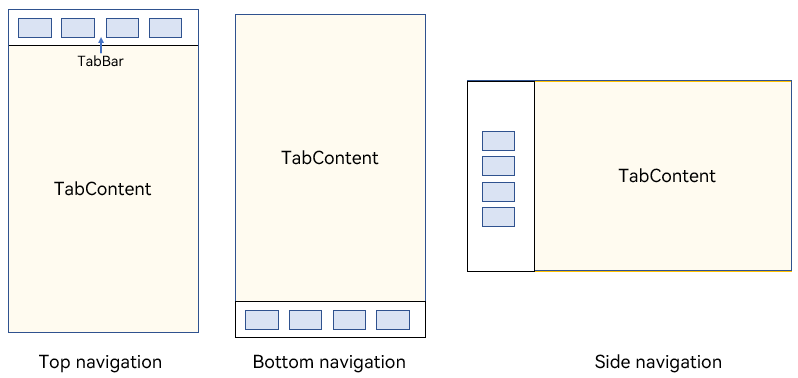
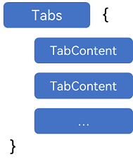
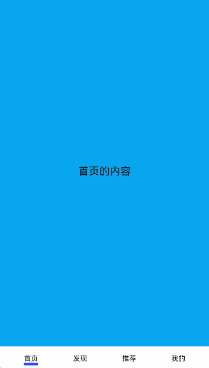
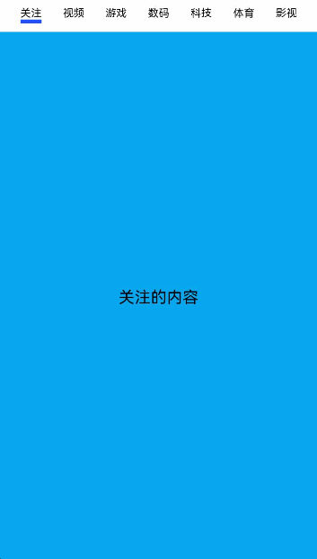
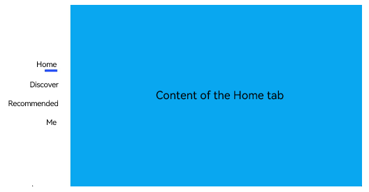
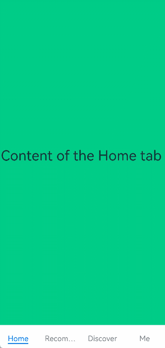
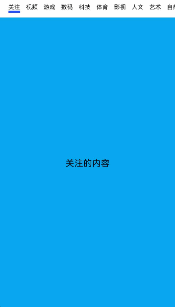
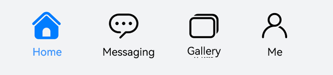
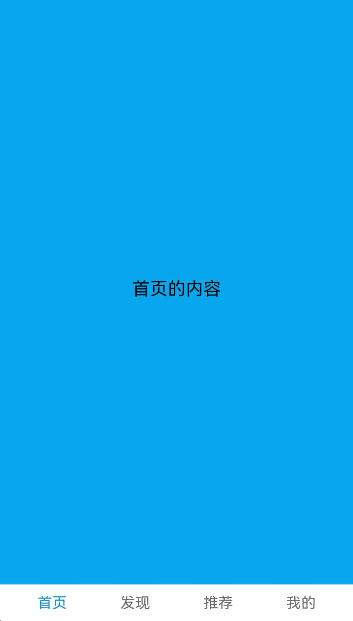
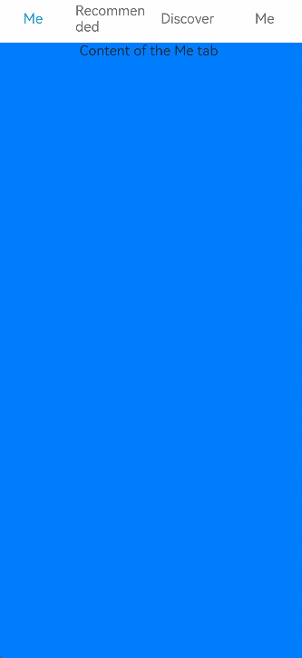

# Tabs


When there is a large amount of page information, to enable the user to focus on the currently displayed content, the page content needs to be classified to improve the page space utilization. The [\<Tabs>](../reference/arkui-ts/ts-container-tabs.md) component can quickly switch between views on a page, improving information search efficiency and reducing the amount of information that users can obtain at a time.


## Basic Layout

  The **\<Tabs>** component consists of two parts: **\<TabContent>** and **\<TabBar>**. **\<TabContent>** is the content page, and **\<TabBar>** is the navigation tab bar. The following figure shows the page structure. The layout varies according to the navigation type. In bottom navigation, top navigation, and side navigation, the navigation tab bar is located at the bottom, top, and edge, respectively.
  **Figure 1** \<Tabs> component layout 




>**NOTE**
>
> - The **\<TabContent>** component does not support setting of the common width attribute. By default, its width is the same as that of the parent **\<Tabs>** component.
>
> - The **\<TabContent>** component does not support setting of the common height attribute. Its height is determined by the height of the parent **\<Tabs>** component and the **\<TabBar>** component.


**\<Tabs>** use braces to enclose the tab content, as shown in Figure 2.


  **Figure 2** Using \<Tabs> and \<TabContent> 




Each **\<TabContent>** component should be mapped to a tab page, which can be configured through the **tabBar** attribute. The following is an example.


```ts
 TabContent() {
   Text('Content of the Home tab').fontSize(30)
 }
.tabBar ('Home')
```


When setting multiple **\<TabContent>** components, place them in sequence in the **\<Tabs>** component.

```ts
Tabs() {
  TabContent() {
    Text('Content of the Home tab').fontSize(30)
  }
  .tabBar ('Home')

  TabContent() {
    Text('Content of the Recommended tab').fontSize(30)
  }
  .tabBar ('Recommended')

  TabContent() {
    Text ('Content of the Discover tab').fontSize (30)
  }
  .tabBar ('Discover')
  
  TabContent() {
    Text ('Content of the Me tab').fontSize (30)
  }
  .tabBar ("Me")
}
```


## Bottom Navigation

Bottom navigation is the most common navigation mode in applications. The bottom navigation bar is located at the bottom of the level-1 page of the application. It enables the user to quickly have a picture of the feature categories the moment they open the application. In addition, it facilitates one-hand operations of the user. Bottom navigation generally exists as a main navigation form of an application, in that it provides convenient access to primary destinations anywhere in the application.


  **Figure 3** Bottom navigation bar 




You set the position of the navigation bar through the **barPosition** parameter of the **\<Tabs>** component. The default value of this parameter is **Start**, which means that the navigation bar is located on the top. To set the navigation bar to the bottom, set **barPosition** to **End**.


```ts
Tabs({ barPosition: BarPosition.End }) {
  // TabContent: Home, Discover, Recommended, and Me
  ...
}
```


## Top Navigation

Top navigation comes in handy when there are many content categories and users need to frequently switch between them. It is usually a further subdivision of the categories in the bottom navigation bar. For example, a theme application may provide a top navigation bar that classifies themes into image, video, and font.

  **Figure 4** Top navigation bar 



The default barPosition parameter of the Tabs component is Start, indicating the top navigation mode.


```ts
Tabs({ barPosition: BarPosition.Start }) {
  // TabContent: Following, Video, Game, Digital, Technology, Sports, Movie
  ...
}
```


## Side Navigation

Side navigation is seldom used in applications. It is more applicable to landscape screens and is used to perform navigation operations on applications. Because the natural eye movement pattern is from left to right, the side navigation bar is located on the left side by default.


  **Figure 5** Side navigation bar 




To implement the side navigation bar, set the **vertical** attribute of the **\<Tabs>** component to **true**. In the bottom navigation and top navigation implementations, the default value **false** of the **vertical** attribute is used, indicating that the content page and navigation bar are aligned vertically.


```ts
Tabs({ barPosition: BarPosition.Start }) {
  // TabContent: Home, Discover, Recommended, and Me
  ...
}
.vertical(true)
.barWidth(100)
.barHeight(200)
```


>**NOTE**
>
> - When the **vertical** attribute is set to **true**, the tab bar takes up the whole screen width by default. You need to set **barWidth** to a proper value.
>
> - When the **vertical** attribute is set to **true**, the tab bar takes up the actual content height by default. You need to set **barWidth** to a proper value.


## Restricting the Scrolling of the Navigation Bar

By default, the navigation bar is scrollable. On some pages that require multi-level classification of content, for example, when both bottom navigation and top navigation are used, the scroll effect of the bottom navigation bar may conflict with that of the top navigation bar. In this case, the scrolling of the bottom navigation bar needs to be restricted to improve user experience.

  **Figure 6** Restricting the scrolling of the bottom navigation bar 




The attribute that enables or disables the scrolling is **scrollable**. Its default value is **true**, indicating that scrolling is enabled. To disable the scrolling, set the attribute to **false**.


```ts
Tabs({ barPosition: BarPosition.End }) {
  TabContent(){
    Column(){
      Tabs(){
        // Content on the top navigation bar
        ...
      }
    }
    .backgroundColor('#ff08a8f1')
    .width('100%')
  }
  .tabBar ('Home')

  // Other TabContent content: Discover, Recommended, and Me
  ...
}
.scrollable(false)
```


## Fixed Navigation Bar

When the content categories are relatively fixed and not scalable, a fixed navigation bar can be used. For example, it can be used for the bottom navigation bar, which generally contains 3 to 5 categories. The fixed navigation bar cannot be scrolled or dragged. The tab bar width is evenly distributed among the categories.


  **Figure 7** Fixed navigation bar


To use a fixed navigation bar, set the **barMode** attribute of the **\<Tabs>** component to **Fixed** (default).


```ts
Tabs({ barPosition: BarPosition.End }) {
  // TabContent: Home, Discover, Recommended, and Me
  ...
}
.barMode(BarMode.Fixed)
```


## Scrollable Navigation Bar

The top navigation bar or side navigation bar can be set to be scrollable if the screen width cannot fully accommodate all the tabs. With a scrollable navigation bar, users can reveal tabs beyond the visible area by touching or swiping on the navigation bar.


  **Figure 8** Scrollable navigation bar 




To use a scrollable navigation bar, set the **barMode** attribute of the **\<Tabs>** component to **Scrollable**.


```ts
Tabs({ barPosition: BarPosition.Start }) {
  // TabContent: follow, video, game, digital, technology, sports, movie, humanities, art, nature, and military
  ...
}
.barMode(BarMode.Scrollable)
```


## Customizing the Navigation Bar

The bottom navigation bar is generally used on the home page of an application. To deliver a more vibrant experience, you can customize the style of the navigation bar, combining use of text and icons to signify the tab content.


  **Figure 9** Custom navigation bar 




By default, the system uses an underscore (_) to indicate the active tab. For a custom navigation bar, you need to implement the corresponding style to distinguish active tabs from inactive tabs.


To customize the navigation bar, use the **tabBar** parameter and pass in to it custom function component styles in **CustomBuilder** mode. In this example, a custom function component **TabBuilder** is declared, and the input parameters include **title** (tab title), **targetIndex** (target index of the tab), **selectedImg** (image for the selected state), and **normalImg** (image for the unselected state). The UI display style is determined based on whether the value of **currentIndex** (index of the active tab) matches that of **targetIndex** (target index of the tab).


```ts
@Builder TabBuilder(title: string, targetIndex: number, selectedImg: Resource, normalImg: Resource) {
  Column() {
    Image(this.currentIndex === targetIndex ? selectedImg : normalImg)
      .size({ width: 25, height: 25 })
    Text(title)
      .fontColor(this.currentIndex === targetIndex ? '#1698CE' : '#6B6B6B')
  }
  .width('100%')
  .height(50)
  .justifyContent(FlexAlign.Center)
}
```


Pass the custom function component to the **tabBar** attribute corresponding to the tab content and transfer the corresponding parameters.


```ts
TabContent() {
  Column(){
    Text('Content of the Me tab') 
  }
  .width('100%')
  .height('100%')
  .backgroundColor('#007DFF')
}
.tabBar(this.TabBuilder('Me', 0, $r('app.media.mine_selected'), $r('app.media.mine_normal')))
```


## Switching to a Specified Tab

Non-custom navigation bars follow the default system switching logic. If you are using a custom navigation bar, you must manually implement the logic for switching tabs so that when the user switches to a tab, the application displays the corresponding tab page.


  **Figure 10** Switching to a specified tab in a custom navigation bar 




To switch to a specified tab page, use **TabsController**, which is the controller of the **\<Tabs>** component. By using the **changeIndex** API of **TabsController**, you can set your application to display the tab content corresponding to the specified index.


```ts
private tabsController : TabsController = new TabsController()
@State currentIndex:number = 0;

@Builder TabBuilder(title: string, targetIndex: number) {
  Column() {
    Text(title)
      .fontColor(this.currentIndex === targetIndex ? '#1698CE' : '#6B6B6B')
  }
  ...
  .onClick(() => {
    this.currentIndex = targetIndex;
    this.tabsController.changeIndex(this.currentIndex);
  })
}
```


When using a custom navigation bar, pass the corresponding \@Builder in the **tabBar** attribute and transfer the corresponding parameters.


```ts
Tabs({ barPosition: BarPosition.End, controller: this.tabsController }) {
  TabContent(){
    ...
  }.tabBar (this.TabBuilder ('Home', 0))

  TabContent(){
    ...
  }.tabBar (this.TabBuilder ('Discover', 1))

  TabContent(){
    ...
  }.tabBar (this.TabBuilder ('Recommended', 2))

  TabContent(){
    ...
  }
  .tabBar (this.TabBuilder ('Me',3))
}
```


## Swiping to Switch Between Tabs

For non-custom navigation bars, tabs and tab content are linked by default. For custom navigation bars, however, tabs and tab content are linked when tab switching is initiated by **TabsController**, but not when tab switching is initiated by a swipe gesture. This means that, when the user swipes on the screen to switch between tab content, the tabs do not switch automatically. In this case, manual switching is required.


  **Figure 11** Lack of linkage between tabs and tab content 




To manually switch between the tabs, use the **onChange** API provided by the **\<Tabs>** component to listen for the index change and pass the index of the active tab to **currentIndex**.


```ts
Tabs({ barPosition: BarPosition.End, controller: this.tabsController }) {
  TabContent() {
    ...
  }.tabBar (this.TabBuilder ('Home', 0))

  TabContent() {
    ...
  }.tabBar (this.TabBuilder ('Found', 1))

  TabContent() {
    ...
  }.tabBar (this.TabBuilder ('Recommended', 2))

  TabContent() {
    ...
  }
  .tabBar (this.TabBuilder ('Me', 3))
}.onChange((index) => {
  this.currentIndex = index
})
```


  **Figure 12** Linkage between tabs and tab content


