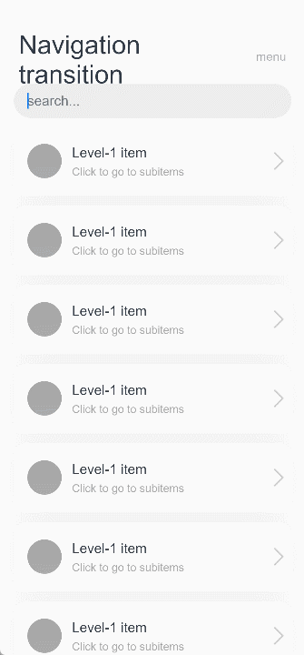

# Navigation Transition


Navigation transition is a transition animation that runs during the navigation from one view to another. The animation settings of the navigation transition are pre-defined and cannot be modified.


To implement the navigation transition, you are advised to use the [\<Navigation>](../reference/arkui-ts/ts-basic-components-navigation.md) component, complete with the [\<NavRouter>](../reference/arkui-ts/ts-basic-components-navrouter.md) and [\<NavDestination>](../reference/arkui-ts/ts-basic-components-navdestination.md) components.


Below is the complete sample code and effect.


```ts
@Component
export struct MyFirstIndex {
  @Consume('pathInfos') pathInfos: NavPathStack
  name: string = ''
  @State value: string = ''

  build() {
    NavDestination() {
      Column() {
        Blank()
        Text ('Navigate to the target page' + this.value 'by clicking the NavRouter area')
          .fontStyle(FontStyle.Italic)
          .lineHeight(35)
          .fontSize(25)
          .fontColor(Color.Black)
          .textAlign(TextAlign.Center)
          .letterSpacing(5)
          .textShadow({ radius: 2, offsetX: 4, offsetY: 4, color: 0x909399 })
          .padding({ left: 30, right: 30 })

        Blank()

        Button ('Back')
          .backgroundColor(Color.Black)
          .onClick(() => {
            this.pathInfos.pop()
          })
        Blank()
      }
      .size({ width: '100%', height: '100%' })
    }.title(this.name + 'Level-2 Page')
  }
}

@Component
export struct MySecondIndex {
  @Consume('pathInfos') pathInfos: NavPathStack;
  name: String = '';
  @State value: String = ''

  build() {
    NavDestination() {
      Column() {
        Blank()
        Text('Navigate to the target page' + this.value 'by updating the navigation stack data)
          .fontStyle(FontStyle.Italic)
          .lineHeight(35)
          .fontSize(25)
          .fontColor(Color.Black)
          .textAlign(TextAlign.Center)
          .letterSpacing(5)
          .textShadow({ radius: 2, offsetX: 4, offsetY: 4, color: 0x909399 })
          .padding({ left: 30, right: 30 })

        Blank()

        Button ('Back')
          .backgroundColor(Color.Black)
          .onClick(() => {
            this.pathInfos.pop()
          })
        Blank()
      }
      .size({ width: '100%', height: '100%' })
    }.title(this.name + 'Level-2 Page')
  }
}

@Entry
@Component
struct NavigationDemo {
  @Provide('pathInfos') pathInfos: NavPathStack = new NavPathStack()
  private listArray: Array<Number> = [0, 1, 2]

  @Builder NavPathStack() {
    Column() {
      Text('menu')
        .fontColor('#182431')
        .fontSize(14)
        .lineHeight(19)
        .opacity(0.4)
        .margin({ top: 30 })
    }
    .alignItems(HorizontalAlign.Start)
  }

  // Set the builder by the navDestination attribute method of Navigation. When the navigation stack changes, the builder function is triggered to create a new page.
  @Builder myRouter(name: string, param: string) {
    if(name == 'Method 1 for Accessing'){
      MyFirstIndex({ name: name, value: param })
    }
    if (name == 'Method 2 for Accessing') {
      MySecondIndex({ name: name, value: param })
    }
  }

  build() {
    Column() {
      Navigation(this.pathInfos) {
        TextInput({ placeholder: 'Search...' })
          .width('90%')
          .height(40)
          .margin({ bottom: 10 })

        // Define the level-1 navigation view through <List>.
        List({ space: 12, initialIndex: 0 }) {
          ForEach(this.listArray, (item : string) => {
            ListItem() {
              // Define the navigation target page through NavDestination. The parameters are transferred between pages through state variables or regular variables.
              // After NavRouter is clicked, the name and param parameters are passed to the builder function (myRouter) set by the navDestination method of Navigation.
              NavRouter({ name: 'Method 1 for Accessing', param: '' + item }) {
                Row() {
                  Row() {
                    Text('' + item)
                      .fontColor(Color.White)
                      .fontSize(15)
                      .fontWeight(FontWeight.Bold)
                  }
                  .width(40)
                  .height(40)
                  .backgroundColor('#a8a8a8')
                  .margin({ right: 12 })
                  .borderRadius(20)
                  .justifyContent(FlexAlign.Center)

                  Column() {
                    Text('Level-1 item')
                      .fontSize(16)
                      .lineHeight(21)
                      .fontWeight(FontWeight.Medium)
                    Text('Click to go to subpage ' + item)
                      .fontSize(13)
                      .lineHeight(21)
                      .fontColor('#a8a8a8')
                  }
                  .alignItems(HorizontalAlign.Start)

                  Blank()

                  Row()
                    .width(15)
                    .height(15)
                    .margin({ right: 12 })
                    .border({
                      width: { top: 2, right: 2 },
                      color: 0xcccccc
                    })
                    .rotate({ angle: 45 })
                }
                .borderRadius(15)
                .shadow({ radius: 100, color: '#ededed' })
                .width('90%')
                .alignItems(VerticalAlign.Center)
                .padding({ left: 16, top: 12, bottom: 12 })
                .height(80)
                .backgroundColor(Color.White)
              }
            }
            .width('100%')
          }, (item : string) : string => item)
        }
        .listDirection(Axis.Vertical)
        .edgeEffect(EdgeEffect.Spring)
        .sticky(StickyStyle.Header)
        .chainAnimation(false)
        .width('100%')

        Column()
          .height('20%')

        Button ('Next')
          .onClick(() => {
            // Trigger navigation update by operating the bound navigation stack data, and trigger the navDestination attribute method to build a new page based on the pathInfos.
            this.pathInfos.pushPathByName('Method 2 for Accessing', 4)
          })
      }
      .navDestination(this.myRouter)
      .width('100%')
      .mode(NavigationMode.Auto)
      .title('Navigation transition') // Set the title text.
    }
    .size({ width: '100%', height: '100%' })
    .backgroundColor(0xf4f4f5)
  }
}
```



