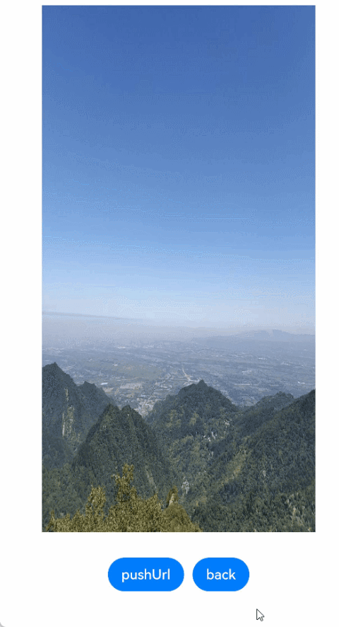

# Page Transition Animation (Not Recommended)

To achieve a better transition effect, you are advised to use the [Navigation](arkts-navigation-transition.md) component and [modal transition](arkts-modal-transition.md).

During page redirection, one page enters and the other page exits. You can customize the [page transition effects](../reference/apis-arkui/arkui-ts/ts-page-transition-animation.md) for these pages through the **pageTransition** function. Specifically, [PageTransitionEnter](../reference/apis-arkui/arkui-ts/ts-page-transition-animation.md#pagetransitionenter) defines the page entrance animation, while [PageTransitionExit](../reference/apis-arkui/arkui-ts/ts-page-transition-animation.md#pagetransitionexit) defines the page exit animation.
The **pageTransition** function is as follows:

```ts
pageTransition() {
  PageTransitionEnter()
  PageTransitionExit()
}
```


API of **PageTransitionEnter**:

```ts
PageTransitionEnter({type?: RouteType,duration?: number,curve?: Curve | string,delay?: number})
```


API of **PageTransitionExit**:

```ts
PageTransitionExit({type?: RouteType,duration?: number,curve?: Curve | string,delay?: number})
```


Both **PageTransitionEnter** and **PageTransitionExit** contain the **slide**, **translate**, **scale**, and **opacity** attributes. For **PageTransitionEnter**, these attributes indicate the start values for page entrance. For **PageTransitionExit**, these attributes indicate the end values for page exit. In this sense, configuration of page transition is similar to that of component transition. **PageTransitionEnter** provides the **onEnter** callback, and **PageTransitionExit** provides the **onExit** callback.


In the preceding APIs, the **type** parameter indicates the route type used in page navigation. Each page transition involves exit of one page and entrance of the other. If you switch from page A to page B through the **router.pushUrl** operation, page A exits, with the exit animation applied; and page B enters, with the entrance animation applied. If you switch from page B back to page A through the **router.back** operation, page B exits, , with the exit animation applied; and page A enters, with the entrance animation applied. That is, **PageTransitionEnter** of a page may be an entrance animation of a new page (pushed to the stack) or of an existing page (popped from the stack). To distinguish these two types of entrance animations, the **type** parameter is provided.


## Setting type to RouteType.None

When **type** is set to **RouteType.None** (default value), the page transition animations work for both the push and pop operations in the page stack.


```ts
// page A
pageTransition() {
  // Configure the page entrance animation to sliding in from the left, with the duration of 1200 ms. The settings take effect no matter whether the push or pop operation is performed on the page stack.
  PageTransitionEnter({ type: RouteType.None, duration: 1200 })
    .slide(SlideEffect.Left)
  // Configure the page exit animation to sliding out from the left, with the duration of 1000 ms. The settings take effect no matter whether the push or pop operation is performed on the page stack.
  PageTransitionExit({ type: RouteType.None, duration: 1000 })
    .slide(SlideEffect.Left)
}
```

```ts
// page B
pageTransition() {
  // Configure the page entrance animation to sliding in from the right, with the duration of 1000 ms. The settings take effect no matter whether the push or pop operation is performed on the page stack.
  PageTransitionEnter({ type: RouteType.None, duration: 1000 })
    .slide(SlideEffect.Right)
  // Configure the page exit animation to sliding out from the right, with the duration of 1200 ms. The settings take effect no matter whether the push or pop operation is performed on the page stack.
  PageTransitionExit({ type: RouteType.None, duration: 1200 })
    .slide(SlideEffect.Right)
}
```


Assume that the page stack is in the multi-instance mode, that is, duplicate pages are allowed in the page stack. There may be four scenarios. The following table lists the page transition effects.


| Route Operation                        | Page A Transition Effect                           | Page B Transition Effect                           |
| ---------------------------- | ---------------------------------- | ---------------------------------- |
| **router.pushUrl** – redirection from page A to new page B| The page exits. The animation defined by **PageTransitionExit** is applied. In the example, the page slides out from the left of the screen. | The page enters. The animation defined by **PageTransitionEnter** is applied. In the example, the page slides in from the right of the screen.|
| **router.back** – redirection from page B back to page A      | The page enters. The animation defined by **PageTransitionEnter** is applied. In the example, the page slides in from the left of the screen.| The page exits. The animation defined by **PageTransitionExit** is applied. In the example, the page slides out from the right of the screen. |
| **router.pushUrl** – redirection from page B to new page A| The page enters. The animation defined by **PageTransitionEnter** is applied. In the example, the page slides in from the left of the screen.| The page exits. The animation defined by **PageTransitionExit** is applied. In the example, the page slides out from the right of the screen. |
| **router.back** – redirection from page A back to page B      | The page exits. The animation defined by **PageTransitionExit** is applied. In the example, the page slides out from the left of the screen. | The page enters. The animation defined by **PageTransitionEnter** is applied. In the example, the page slides in from the right of the screen.|


If you want the page accessed by **router.pushUrl** to always slide in from the right and the page exited by **router.back** to always slide out from the right, the third and fourth cases in the preceding table do not meet the requirements. In this case, you need to define four page transition effects.


## Setting type to RouteType.Push or RouteType.Pop

When **type** is set to **RouteType.Push**, the page transition animations work for only both the push operations in the page stack. When **type** is set to **RouteType.Pop**, the page transition animations work for only both the pop operations in the page stack.


```ts
// page A
pageTransition() {
  // Configure the page entrance animation to sliding in from the right, with the duration of 1200 ms. The settings take effect only when the push operation is performed on the page stack.
  PageTransitionEnter({ type: RouteType.Push, duration: 1200 })
    .slide(SlideEffect.Right)
  // Configure the page entrance animation to sliding in from the left, with the duration of 1200 ms. The settings take effect only when the pop operation is performed on the page stack.
  PageTransitionEnter({ type: RouteType.Pop, duration: 1200 })
    .slide(SlideEffect.Left)
  // Configure the page exit animation to sliding out from the left, with the duration of 1000 ms. The settings take effect only when the push operation is performed on the page stack.
  PageTransitionExit({ type: RouteType.Push, duration: 1000 })
    .slide(SlideEffect.Left)
  // Configure the page exit animation to sliding out from the right, with the duration of 1000 ms. The settings take effect only when the pop operation is performed on the page stack.
  PageTransitionExit({ type: RouteType.Pop, duration: 1000 })
    .slide(SlideEffect.Right)
}
```

```ts
// page B
pageTransition() {
  // Configure the page entrance animation to sliding in from the right, with the duration of 1000 ms. The settings take effect only when the push operation is performed on the page stack.
  PageTransitionEnter({ type: RouteType.Push, duration: 1000 })
    .slide(SlideEffect.Right)
  // Configure the page entrance animation to sliding in from the left, with the duration of 1000 ms. The settings take effect only when the pop operation is performed on the page stack.
  PageTransitionEnter({ type: RouteType.Pop, duration: 1000 })
    .slide(SlideEffect.Left)
  // Configure the page exit animation to sliding out from the left, with the duration of 1200 ms. The settings take effect only when the push operation is performed on the page stack.
  PageTransitionExit({ type: RouteType.Push, duration: 1200 })
    .slide(SlideEffect.Left)
  // Configure the page exit animation to sliding out from the right, with the duration of 1200 ms. The settings take effect only when the pop operation is performed on the page stack.
  PageTransitionExit({ type: RouteType.Pop, duration: 1200 })
    .slide(SlideEffect.Right)
}
```


The preceding code defines page transition effects for all possibles scenarios. Assume that the page stack is in the multi-instance mode, that is, duplicate pages are allowed in the page stack. There may be four scenarios. The following table lists the page transition effects.


| Route Operation                        | Page A Transition Effect                                 | Page B Transition Effect                                 |
| ---------------------------- | ---------------------------------------- | ---------------------------------------- |
| **router.pushUrl** – redirection from page A to new page B.| The page exits. The transition style of **PageTransitionExit** whose **type** is **RouteType.Push** takes effect. The page slides out from the left of the screen.| The page enters. The transition style of **PageTransitionEnter** whose **type** is **RouteType.Push** takes effect. The page slides in from the right of the screen.|
| **router.back** – redirection from page B back to page A.      | The page enters. The transition style of **PageTransitionEnter** whose **type** is **RouteType.Pop** takes effect. The page slides in from the left of the screen.| The page exits. The transition style of **PageTransitionExit** whose **type** is **RouteType.Pop** takes effect. The page slides out from the right of the screen.|
| **router.pushUrl** – redirection from page B to new page A.| The page enters. The transition style of **PageTransitionEnter** whose **type** is **RouteType.Push** takes effect. The page slides in from the right of the screen.| The page exits. The transition style of **PageTransitionExit** whose **type** is **RouteType.Push** takes effect. The page slides out from the left of the screen.|
| **router.back** – redirection from page A back to page B.      | The page exits. The transition style of **PageTransitionExit** whose **type** is **RouteType.Pop** takes effect. The page slides out from the right of the screen.| The page enters. The transition style of **PageTransitionEnter** whose **type** is **RouteType.Pop** takes effect. The page slides in from the left of the screen.|


>**NOTE**
>
>    1. The transition style of each page can be independently configured. However, as each transition involves two pages, take into account the smoothness between page transitions, for example, the transition duration.
>
>    2. If no page transition style is defined, a page uses the default page transition style.


## Disabling Page Transition


```ts
pageTransition() {
  PageTransitionEnter({ type: RouteType.None, duration: 0 })
  PageTransitionExit({ type: RouteType.None, duration: 0 })
}
```


You can disable the transition animation of a page by setting the page transition duration to 0.


## Example

In the following example, page transition animations are defined using [router.pushUrl](../reference/apis-arkui/js-apis-router.md#routerpushurl9) for all the page transition scenarios.

```ts
// PageTransitionSrc1
import { router } from "@kit.ArkUI";
@Entry
@Component
struct PageTransitionSrc1 {
  build() {
    Column() {
      Image($r('app.media.mountain'))
        .width('90%')
        .height('80%')
        .objectFit(ImageFit.Fill)
        .syncLoad(true) // Load the image synchronously so that the image has been loaded when the page is displayed.
        .margin(30)

      Row({ space: 10 }) {
        Button("pushUrl")
          .onClick(() => {
            // Navigate to the next page, which is a push operation.
            router.pushUrl({ url: 'pages/myTest/pageTransitionDst1' });
          })
        Button("back")
          .onClick(() => {
            // Return to the previous page, which is equivalent to the pop operation.
            router.back();
          })
      }.justifyContent(FlexAlign.Center)
    }
    .width("100%").height("100%")
    .alignItems(HorizontalAlign.Center)
  }

  pageTransition() {
    // Configure the page entrance animation to sliding in from the right, with the duration of 1000 ms. The settings take effect only when the push operation is performed on the page stack.
    PageTransitionEnter({ type: RouteType.Push, duration: 1000 })
      .slide(SlideEffect.Right)
    // Configure the page entrance animation to sliding in from the left, with the duration of 1000 ms. The settings take effect only when the pop operation is performed on the page stack.
    PageTransitionEnter({ type: RouteType.Pop, duration: 1000 })
      .slide(SlideEffect.Left)
    // Configure the page exit animation to sliding out from the left, with the duration of 1000 ms. The settings take effect only when the push operation is performed on the page stack.
    PageTransitionExit({ type: RouteType.Push, duration: 1000 })
      .slide(SlideEffect.Left)
    // Configure the page exit animation to sliding out from the right, with the duration of 1000 ms. The settings take effect only when the pop operation is performed on the page stack.
    PageTransitionExit({ type: RouteType.Pop, duration: 1000 })
      .slide(SlideEffect.Right)
  }
}
```


```ts
// PageTransitionDst1
import { router } from "@kit.ArkUI";
@Entry
@Component
struct PageTransitionDst1 {
  build() {
    Column() {
      Image($r('app.media.forest'))
        .width('90%')
        .height('80%')
        .objectFit(ImageFit.Fill)
        .syncLoad(true) // Load the image synchronously so that the image has been loaded when the page is displayed.
        .margin(30)

      Row({ space: 10 }) {
        Button("pushUrl")
          .onClick(() => {
            // Navigate to the next page, which is a push operation.
            router.pushUrl({ url: 'pages/myTest/pageTransitionSrc1' });
          })
        Button("back")
          .onClick(() => {
            // Return to the previous page, which is equivalent to the pop operation.
            router.back();
          })
      }.justifyContent(FlexAlign.Center)
    }
    .width("100%").height("100%")
    .alignItems(HorizontalAlign.Center)
  }

  pageTransition() {
    // Configure the page entrance animation to sliding in from the right, with the duration of 1000 ms. The settings take effect only when the push operation is performed on the page stack.
    PageTransitionEnter({ type: RouteType.Push, duration: 1000 })
      .slide(SlideEffect.Right)
    // Configure the page entrance animation to sliding in from the left, with the duration of 1000 ms. The settings take effect only when the pop operation is performed on the page stack.
    PageTransitionEnter({ type: RouteType.Pop, duration: 1000 })
      .slide(SlideEffect.Left)
    // Configure the page exit animation to sliding out from the left, with the duration of 1000 ms. The settings take effect only when the push operation is performed on the page stack.
    PageTransitionExit({ type: RouteType.Push, duration: 1000 })
      .slide(SlideEffect.Left)
    // Configure the page exit animation to sliding out from the right, with the duration of 1000 ms. The settings take effect only when the pop operation is performed on the page stack.
    PageTransitionExit({ type: RouteType.Pop, duration: 1000 })
      .slide(SlideEffect.Right)
  }
}
```


In the following example, **type** is set to **RouteType.None**.


```ts
// PageTransitionSrc2
import { router } from "@kit.ArkUI";
@Entry
@Component
struct PageTransitionSrc2 {
  build() {
    Column() {
      Image($r('app.media.mountain'))
        .width('90%')
        .height('80%')
        .objectFit(ImageFit.Fill)
        .syncLoad(true) // Load the image synchronously so that the image has been loaded when the page is displayed.
        .margin(30)

      Row({ space: 10 }) {
        Button("pushUrl")
          .onClick(() => {
            // Navigate to the next page, which is a push operation.
            router.pushUrl({ url: 'pages/myTest/pageTransitionDst2' });
          })
        Button("back")
          .onClick(() => {
            // Return to the previous page, which is equivalent to the pop operation.
            router.back();
          })
      }.justifyContent(FlexAlign.Center)
    }
    .width("100%").height("100%")
    .alignItems(HorizontalAlign.Center)
  }

  pageTransition() {
    // Configure the page entrance animation to sliding in from the left, with the duration of 1000 ms. The settings take effect no matter whether the push or pop operation is performed on the page stack.
    PageTransitionEnter({ duration: 1000 })
      .slide(SlideEffect.Left)
    // Configure the page exit animation to translating by 100 vp along the x- and y-axes and changing the opacity to 0, with the duration of 1200 ms. The settings take effect no matter whether the push or pop operation is performed on the page stack.
    PageTransitionExit({ duration: 1200 })
      .translate({ x: 100.0, y: 100.0 })
      .opacity(0)
  }
}
```


```ts
// PageTransitionDst2
import { router } from "@kit.ArkUI";
@Entry
@Component
struct PageTransitionDst2 {
  build() {
    Column() {
      Image($r('app.media.forest'))
        .width('90%')
        .height('80%')
        .objectFit(ImageFit.Fill)
        .syncLoad(true) // Load the image synchronously so that the image has been loaded when the page is displayed.
        .margin(30)

      Row({ space: 10 }) {
        Button("pushUrl")
          .onClick(() => {
            // Navigate to the next page, which is a push operation.
            router.pushUrl({ url: 'pages/myTest/pageTransitionSrc2' });
          })
        Button("back")
          .onClick(() => {
            // Return to the previous page, which is equivalent to the pop operation.
            router.back();
          })
      }.justifyContent(FlexAlign.Center)
    }
    .width("100%").height("100%")
    .alignItems(HorizontalAlign.Center)
  }

  pageTransition() {
    // Configure the page entrance animation to sliding in from the left, with the duration of 1200 ms. The settings take effect no matter whether the push or pop operation is performed on the page stack.
    PageTransitionEnter({ duration: 1200 })
      .slide(SlideEffect.Left)
    // Configure the page exit animation to translating by 100 vp along the x- and y-axes and changing the opacity to 0, with the duration of 1000 ms. The settings take effect no matter whether the push or pop operation is performed on the page stack.
    PageTransitionExit({ duration: 1000 })
      .translate({ x: 100.0, y: 100.0 })
      .opacity(0)
  }
}
```



