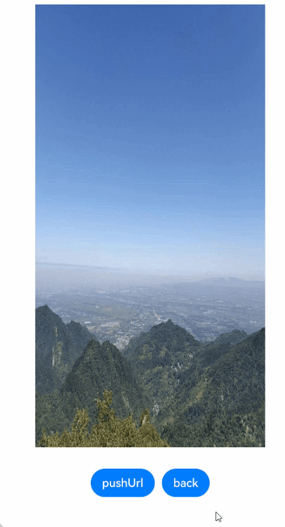

# Page Transition Animation (Not Recommended)

<!--Kit: ArkUI-->
<!--Subsystem: ArkUI-->
<!--Owner: @CCFFWW-->
<!--Designer: @CCFFWW-->
<!--Tester: @lxl007-->
<!--Adviser: @Brilliantry_Rui-->
<!-- md-trans-meta sourceCommit=871010847291a8d5221a0bd1c554d4d2cba1ab41 translatedAt=2026-08-04T06:36:43.025Z pushedAt=2026-08-04T07:55:49.563Z -->

To achieve a better transition effect, you are advised to use the [navigation transition](./arkts-navigation-animation.md) and [modal transition](arkts-modal-transition.md).

When a jump occurs between two pages, one page disappears and the other appears. In this case, you can configure the page transition parameters for each page to achieve a custom page transition effect. The [page transition](../reference/apis-arkui/arkui-ts/ts-page-transition-animation.md) effect is defined in the **pageTransition** function, where [PageTransitionEnter](../reference/apis-arkui/arkui-ts/ts-page-transition-animation.md#pagetransitionenter) and [PageTransitionExit](../reference/apis-arkui/arkui-ts/ts-page-transition-animation.md#pagetransitionexit) specify the animation effects for page entrance and exit.

The **pageTransition** function is as follows:

```ts
pageTransition() {
  PageTransitionEnter()
  PageTransitionExit()
}
```

API of **PageTransitionEnter**:

```ts
PageTransitionEnter({ type?: RouteType, duration?: number, curve?: Curve | string, delay?: number })
```

API of **PageTransitionExit**:

```ts
PageTransitionExit({ type?: RouteType, duration?: number, curve?: Curve | string, delay?: number })
```

The preceding APIs define the **PageTransitionEnter** and **PageTransitionExit** components. You can implement different page transition effects through the [slide](../reference/apis-arkui/arkui-ts/ts-page-transition-animation.md#slide), [translate](../reference/apis-arkui/arkui-ts/ts-page-transition-animation.md#translate), [scale](../reference/apis-arkui/arkui-ts/ts-page-transition-animation.md#scale) and [opacity](../reference/apis-arkui/arkui-ts/ts-page-transition-animation.md#opacity) attributes. For **PageTransitionEnter**, these attributes indicate the start values for page entrance. For **PageTransitionExit**, these attributes indicate the end values for page exit. In this sense, configuration of page transition is similar to that of component [transition](../reference/apis-arkui/arkui-ts/ts-transition-animation-component.md). In addition, **PageTransitionEnter** provides the **onEnter** callback for customizing the page enter animation, while **PageTransitionExit** provides the **onExit** callback for customizing the page exit animation.

In the preceding APIs, the **type** parameter indicates the route type used in page navigation. Each page transition involves exit of one page and entrance of the other. If you switch from page A to page B using [pushUrl](../reference/apis-arkui/arkts-apis-uicontext-router.md#pushurl), page A exits and plays the exit animation; and page B enters and plays the entrance animation. If you switch from page B back to page A using [back](../reference/apis-arkui/arkts-apis-uicontext-router.md#back), page B exits and plays the exit animation; and page A enters and plays the entrance animation. That is, **PageTransitionEnter** of a page may be an entrance animation of a new page (pushed to the stack) or of an existing page (popped from the stack). To distinguish these two types of entrance animations, the **type** parameter is provided.

## Setting type to RouteType.None

When **type** is set to **RouteType.None** (default value), the page transition animations work for both the push and pop operations in the page stack.

<!-- @[pageTransition_template5_pageA_start](https://gitcode.com/openharmony/applications_app_samples/blob/master/code/DocsSample/ArkUISample/Animation/entry/src/main/ets/pages/pageTransition/template5/PageTransitionSrc3.ets) -->

``` TypeScript
// page A
pageTransition() {
  // Configure the page entrance animation to sliding in from the left, with the duration of 1200 ms. The settings take effect no matter whether the push or pop operation is performed on the page stack.
  PageTransitionEnter({ type: RouteType.None, duration: 1200 })
    .slide(SlideEffect.Left)
  // Configure the page exit animation to sliding out from the left, with the duration of 1000 ms. The settings take effect no matter whether the push or pop operation is performed on the page stack.
  PageTransitionExit({ type: RouteType.None, duration: 1000 })
    .slide(SlideEffect.Left)
}
```

<!-- -->

<!-- @[pageTransition_template5_pageB_start](https://gitcode.com/openharmony/applications_app_samples/blob/master/code/DocsSample/ArkUISample/Animation/entry/src/main/ets/pages/pageTransition/template5/PageTransitionDst3.ets) -->

``` TypeScript
// page B
pageTransition() {
  // Configure the page entrance animation to sliding in from the right, with the duration of 1000 ms. The settings take effect no matter whether the push or pop operation is performed on the page stack.
  PageTransitionEnter({ type: RouteType.None, duration: 1000 })
    .slide(SlideEffect.Right)
  // Configure the page exit animation to sliding out from the right, with the duration of 1200 ms. The settings take effect no matter whether the push or pop operation is performed on the page stack.
  PageTransitionExit({ type: RouteType.None, duration: 1200 })
    .slide(SlideEffect.Right)
}
```

Assume that the page navigation is in the multi-instance mode, which means that duplicate pages are allowed in the page stack. There may be four scenarios. The following table lists the page transition effects.

| Route Operation                        | Page A Transition Effect                           | Page B Transition Effect                           |
| ---------------------------- | ---------------------------------- | ---------------------------------- |
| **pushUrl**, navigating from page A to a new instance of page B| The page exits. The animation defined by **PageTransitionExit** is applied. In the example, the page slides out from the left of the screen. | The page enters. The animation defined by **PageTransitionEnter** is applied. In the example, the page slides in from the right of the screen.|
| **back**, returning from page B back to page A      | The page enters. The animation defined by **PageTransitionEnter** is applied. In the example, the page slides in from the left of the screen.| The page exits. The animation defined by **PageTransitionExit** is applied. In the example, the page slides out from the right of the screen. |
| **pushUrl**, navigating from page B to a new instance of page A| The page enters. The animation defined by **PageTransitionEnter** is applied. In the example, the page slides in from the left of the screen.| The page exits. The animation defined by **PageTransitionExit** is applied. In the example, the page slides out from the right of the screen. |
| **back**, returning from page A back to page B      | The page exits. The animation defined by **PageTransitionExit** is applied. In the example, the page slides out from the left of the screen. | The page enters. The animation defined by **PageTransitionEnter** is applied. In the example, the page slides in from the right of the screen.|

If you want the page entered via **pushUrl** to always slide in from the right, and the page exited via **back** to always slide out from the right, cases 3 and 4 in the table above do not meet the requirement. In this case, all four page transition effects must be fully defined.

## Setting type to RouteType.Push or RouteType.Pop

When [type](../reference/apis-arkui/arkui-ts/ts-page-transition-animation.md#pagetransitionoptions) is set to [RouteType.Push](../reference/apis-arkui/arkui-ts/ts-page-transition-animation.md#routetype), the page transition animations work only for the push operations in the page stack. When **type** is set to **RouteType.Pop**, the page transition animations work only for the pop operations in the page stack.

<!-- @[pageTransition_template6_pageA_start](https://gitcode.com/openharmony/applications_app_samples/blob/master/code/DocsSample/ArkUISample/Animation/entry/src/main/ets/pages/pageTransition/template6/PageTransitionSrc4.ets) -->

``` TypeScript
// page A
pageTransition() {
  // Configure the page entrance animation to sliding in from the right, with the duration of 1200 ms. The settings take effect only when the push operation is performed on the page stack.
  PageTransitionEnter({ type: RouteType.Push, duration: 1200 })
    .slide(SlideEffect.Right)
  // Configure the page entrance animation to sliding in from the left, with the duration of 1200 ms. The settings take effect only when the pop operation is performed on the page stack.
  PageTransitionEnter({ type: RouteType.Pop, duration: 1200 })
    .slide(SlideEffect.Left)
  // Configure the page exit animation to sliding out from the left, with the duration of 1000 ms. The settings take effect only when the push operation is performed on the page stack.
  PageTransitionExit({ type: RouteType.Push, duration: 1000 })
    .slide(SlideEffect.Left)
  // Configure the page exit animation to sliding out from the right, with the duration of 1000 ms. The settings take effect only when the pop operation is performed on the page stack.
  PageTransitionExit({ type: RouteType.Pop, duration: 1000 })
    .slide(SlideEffect.Right)
}
```

<!-- -->

<!-- @[pageTransition_template6_pageB_start](https://gitcode.com/openharmony/applications_app_samples/blob/master/code/DocsSample/ArkUISample/Animation/entry/src/main/ets/pages/pageTransition/template6/PageTransitionDst4.ets) -->

``` TypeScript
// page B
pageTransition() {
  // Configure the page entrance animation to sliding in from the right, with the duration of 1000 ms. The settings take effect only when the push operation is performed on the page stack.
  PageTransitionEnter({ type: RouteType.Push, duration: 1000 })
    .slide(SlideEffect.Right)
  // Configure the page entrance animation to sliding in from the left, with the duration of 1000 ms. The settings take effect only when the pop operation is performed on the page stack.
  PageTransitionEnter({ type: RouteType.Pop, duration: 1000 })
    .slide(SlideEffect.Left)
  // Configure the page exit animation to sliding out from the left, with the duration of 1200 ms. The settings take effect only when the push operation is performed on the page stack.
  PageTransitionExit({ type: RouteType.Push, duration: 1200 })
    .slide(SlideEffect.Left)
  // Configure the page exit animation to sliding out from the right, with the duration of 1200 ms. The settings take effect only when the pop operation is performed on the page stack.
  PageTransitionExit({ type: RouteType.Pop, duration: 1200 })
    .slide(SlideEffect.Right)
}
```

The code above completely defines all possible page transition styles. Assume that the page navigation is configured in multi-instance mode, where duplicate pages are allowed in the page stack. There may be four scenarios, and the corresponding page transition effects are shown in the table below.

| Route Operation                        | Page A Transition Effect                                 | Page B Transition Effect                                 |
| ---------------------------- | ---------------------------------------- | ---------------------------------------- |
| **pushUrl**, navigating from page A to a new instance of page B| The page exits. The transition style of **PageTransitionExit** whose **type** is **RouteType.Push** takes effect. The page slides out from the left of the screen.| The page enters. The transition style of **PageTransitionEnter** whose **type** is **RouteType.Push** takes effect. The page slides in from the right of the screen.|
| **back**, returning from page B back to page A      | The page enters. The transition style of **PageTransitionEnter** whose **type** is **RouteType.Pop** takes effect. The page slides in from the left of the screen.| The page exits. The transition style of **PageTransitionExit** whose **type** is **RouteType.Pop** takes effect. The page slides out from the right of the screen.|
| **pushUrl**, navigating from page B to a new instance of page A| The page enters. The transition style of **PageTransitionEnter** whose **type** is **RouteType.Push** takes effect. The page slides in from the right of the screen.| The page exits. The transition style of **PageTransitionExit** whose **type** is **RouteType.Push** takes effect. The page slides out from the left of the screen.|
| **back**, returning from page A back to page B      | The page exits. The transition style of **PageTransitionExit** whose **type** is **RouteType.Pop** takes effect. The page slides out from the right of the screen.| The page enters. The transition style of **PageTransitionEnter** whose **type** is **RouteType.Pop** takes effect. The page slides in from the left of the screen.|

> **NOTE**
>
> - The transition style of each page can be independently configured. However, as each transition involves two pages, take into account the smoothness between page transitions, for example, the transition duration.
>
> - If no page transition style is defined, a page uses the default page transition style.

## Disabling Page Transition

You can disable the transition animation of a page by setting the page transition duration to 0.

```ts
pageTransition() {
  PageTransitionEnter({ type: RouteType.None, duration: 0 })
  PageTransitionExit({ type: RouteType.None, duration: 0 })
}
```

## Example

In the following example, page transition animations are defined using [pushUrl](../reference/apis-arkui/arkts-apis-uicontext-router.md#pushurl) for all the page transition scenarios.

<!-- @[pageTransition_template3_pageTransitionSrc1_start](https://gitcode.com/openharmony/applications_app_samples/blob/master/code/DocsSample/ArkUISample/Animation/entry/src/main/ets/pages/pageTransition/template3/pageTransitionSrc1.ets) -->

``` TypeScript
// PageTransitionSrc1
@Entry
@Component
struct PageTransitionSrc1 {
  build() {
    Column() {
      // Replace $r('app.media.mountain') with the actual resource file.
      Image($r('app.media.mountain'))
        .width('90%')
        .height('80%')
        .objectFit(ImageFit.Fill)
        .syncLoad(true) // Load the image synchronously so that the image has been loaded when the page is displayed.
        .margin(30)

      Row({ space: 10 }) {
        Button('pushUrl')
          .onClick(() => {
            // Navigate to the next page, which is a push operation.
            this.getUIContext().getRouter().pushUrl({ url: 'pages/pageTransition/template3/pageTransitionDst1' });
          })
        Button('back')
          .onClick(() => {
            // Return to the previous page, which is equivalent to the pop operation.
            this.getUIContext().getRouter().back();
          })
      }.justifyContent(FlexAlign.Center)
    }
    .width('100%').height('100%')
    .alignItems(HorizontalAlign.Center)
  }

  pageTransition() {
    // Configure the page entrance animation to sliding in from the right, with the duration of 1000 ms. The settings take effect only when the push operation is performed on the page stack.
    PageTransitionEnter({ type: RouteType.Push, duration: 1000 })
      .slide(SlideEffect.Right)
    // Configure the page entrance animation to sliding in from the left, with the duration of 1000 ms. The settings take effect only when the pop operation is performed on the page stack.
    PageTransitionEnter({ type: RouteType.Pop, duration: 1000 })
      .slide(SlideEffect.Left)
    // Configure the page exit animation to sliding out from the left, with the duration of 1000 ms. The settings take effect only when the push operation is performed on the page stack.
    PageTransitionExit({ type: RouteType.Push, duration: 1000 })
      .slide(SlideEffect.Left)
    // Configure the page exit animation to sliding out from the right, with the duration of 1000 ms. The settings take effect only when the pop operation is performed on the page stack.
    PageTransitionExit({ type: RouteType.Pop, duration: 1000 })
      .slide(SlideEffect.Right)
  }
}
```

<!-- -->

<!-- @[pageTransition_template3_pageTransitionDst1_start](https://gitcode.com/openharmony/applications_app_samples/blob/master/code/DocsSample/ArkUISample/Animation/entry/src/main/ets/pages/pageTransition/template3/pageTransitionDst1.ets) -->

``` TypeScript
// PageTransitionDst1
@Entry
@Component
struct PageTransitionDst1 {
  build() {
    Column() {
      // Replace $r('app.media.forest') with the actual resource file.
      Image($r('app.media.forest'))
        .width('90%')
        .height('80%')
        .objectFit(ImageFit.Fill)
        .syncLoad(true) // Load the image synchronously so that the image has been loaded when the page is displayed.
        .margin(30)

      Row({ space: 10 }) {
        Button('pushUrl')
          .onClick(() => {
            // Navigate to the next page, which is a push operation.
            this.getUIContext().getRouter().pushUrl({ url: 'pages/pageTransition/template3/pageTransitionSrc1' });
          })
        Button('back')
          .onClick(() => {
            // Return to the previous page, which is equivalent to the pop operation.
            this.getUIContext().getRouter().back();
          })
      }.justifyContent(FlexAlign.Center)
    }
    .width('100%').height('100%')
    .alignItems(HorizontalAlign.Center)
  }

  pageTransition() {
    // Configure the page entrance animation to sliding in from the right, with the duration of 1000 ms. The settings take effect only when the push operation is performed on the page stack.
    PageTransitionEnter({ type: RouteType.Push, duration: 1000 })
      .slide(SlideEffect.Right)
    // Configure the page entrance animation to sliding in from the left, with the duration of 1000 ms. The settings take effect only when the pop operation is performed on the page stack.
    PageTransitionEnter({ type: RouteType.Pop, duration: 1000 })
      .slide(SlideEffect.Left)
    // Configure the page exit animation to sliding out from the left, with the duration of 1000 ms. The settings take effect only when the push operation is performed on the page stack.
    PageTransitionExit({ type: RouteType.Push, duration: 1000 })
      .slide(SlideEffect.Left)
    // Configure the page exit animation to sliding out from the right, with the duration of 1000 ms. The settings take effect only when the pop operation is performed on the page stack.
    PageTransitionExit({ type: RouteType.Pop, duration: 1000 })
      .slide(SlideEffect.Right)
  }
}
```


In the following example, **type** is set to **RouteType.None**.

<!-- @[pageTransition_template4_pageTransitionSrc2_start](https://gitcode.com/openharmony/applications_app_samples/blob/master/code/DocsSample/ArkUISample/Animation/entry/src/main/ets/pages/pageTransition/template4/pageTransitionSrc2.ets) -->

``` TypeScript
// PageTransitionSrc2
@Entry
@Component
struct PageTransitionSrc2 {
  build() {
    Column() {
      // Replace $r('app.media.mountain') with the actual resource file.
      Image($r('app.media.mountain'))
        .width('90%')
        .height('80%')
        .objectFit(ImageFit.Fill)
        .syncLoad(true) // Load the image synchronously so that the image has been loaded when the page is displayed.
        .margin(30)

      Row({ space: 10 }) {
        Button('pushUrl')
          .onClick(() => {
            // Navigate to the next page, which is a push operation.
            this.getUIContext().getRouter().pushUrl({ url: 'pages/pageTransition/template4/pageTransitionDst2' });
          })
        Button('back')
          .onClick(() => {
            // Return to the previous page, which is equivalent to the pop operation.
            this.getUIContext().getRouter().back();
          })
      }.justifyContent(FlexAlign.Center)
    }
    .width('100%').height('100%')
    .alignItems(HorizontalAlign.Center)
  }

  pageTransition() {
    // Configure the page entrance animation to sliding in from the left, with the duration of 1000 ms. The settings take effect no matter whether the push or pop operation is performed on the page stack.
    PageTransitionEnter({ duration: 1000 })
      .slide(SlideEffect.Left)
    // Configure the page exit animation to translating by 100 vp along the x- and y-axes and changing the opacity to 0, with the duration of 1200 ms. The settings take effect no matter whether the push or pop operation is performed on the page stack.
    PageTransitionExit({ duration: 1200 })
      .translate({ x: 100.0, y: 100.0 })
      .opacity(0)
  }
}
```

<!-- -->

<!-- @[pageTransition_template4_pageTransitionDst2_start](https://gitcode.com/openharmony/applications_app_samples/blob/master/code/DocsSample/ArkUISample/Animation/entry/src/main/ets/pages/pageTransition/template4/pageTransitionDst2.ets) -->

``` TypeScript
// PageTransitionDst2
@Entry
@Component
struct PageTransitionDst2 {
  build() {
    Column() {
      // Replace $r('app.media.forest') with the actual resource file.
      Image($r('app.media.forest'))
        .width('90%')
        .height('80%')
        .objectFit(ImageFit.Fill)
        .syncLoad(true) // Load the image synchronously so that the image has been loaded when the page is displayed.
        .margin(30)

      Row({ space: 10 }) {
        Button('pushUrl')
          .onClick(() => {
            // Navigate to the next page, which is a push operation.
            this.getUIContext().getRouter().pushUrl({ url: 'pages/pageTransition/template4/pageTransitionSrc2' });
          })
        Button('back')
          .onClick(() => {
            // Return to the previous page, which is equivalent to the pop operation.
            this.getUIContext().getRouter().back();
          })
      }.justifyContent(FlexAlign.Center)
    }
    .width('100%').height('100%')
    .alignItems(HorizontalAlign.Center)
  }

  pageTransition() {
    // Configure the page entrance animation to sliding in from the left, with the duration of 1200 ms. The settings take effect no matter whether the push or pop operation is performed on the page stack.
    PageTransitionEnter({ duration: 1200 })
      .slide(SlideEffect.Left)
    // Configure the page exit animation to translating by 100 vp along the x- and y-axes and changing the opacity to 0, with the duration of 1000 ms. The settings take effect no matter whether the push or pop operation is performed on the page stack.
    PageTransitionExit({ duration: 1000 })
      .translate({ x: 100.0, y: 100.0 })
      .opacity(0)
  }
}
```

