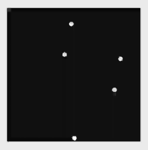
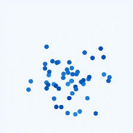
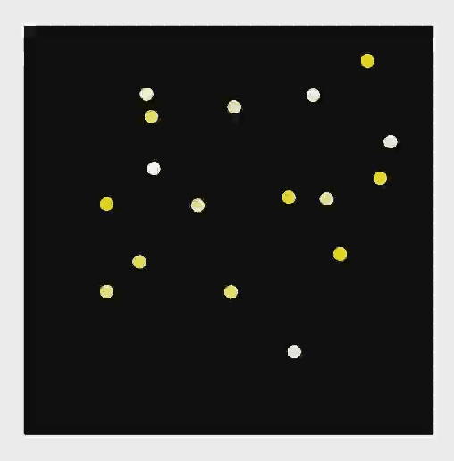
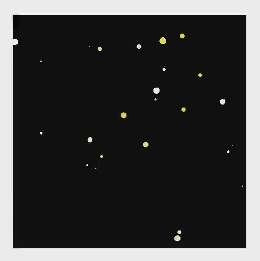

# Particle Animation

[Particle animation](../reference/apis-arkui/arkui-ts/ts-particle-animation.md) is an animation composed of a multitude of particles randomly generated within a certain range. The particles can be points or images. By animating different aspects of the particles, such as color, opacity, scale, velocity, acceleration, and spin angle, you can create engaging and dynamic aesthetics. For example, you can create an impressive snowfall animation by animating the particles – snowflakes.

The component used for producing particle animations is **Particle**.

Below is the sample code and effect:
```ts
@Entry
@Component
struct ParticleExample {
  build() {
    Stack() {
      Text()
        .width(300).height(300).backgroundColor(Color.Black)
      Particle({ particles: [
        {
          emitter: {
            particle: {
              type: ParticleType.POINT, // Particle type.
              config: {
                radius: 5 // Point radius.
              },
              count: 100, // Total number of particles.
            },
          },
        },
      ]
      }).width(250).height(250)
    }.width("100%").height("100%").align(Alignment.Center)
  }
}
```




## Particle Emitter

A particle emitter in particle animation is a component used to generate and control particles. It is primarily used to define the initial properties of particles (such as type, position, and color), control the rate of particle emission, and manage the lifecycle of the particles.

The position of the emitter can be dynamically updated. You can adjust the position, emission rate, and size of the emission window for the emitter using the [emitter](../reference/apis-arkui/arkui-ts/ts-particle-animation.md#emitter12) API.

```ts
// ...
@State emitterProperties: Array<EmitterProperty> = [
  {
    index: 0,
    emitRate: 100,
    position: { x: 60, y: 80 },
    size: { width: 200, height: 200 }
  }
]

Particle(...).width(300).height(300).emitter(this.emitterProperties) // Dynamically adjust the position of the particle emitter.
// ...
```




## Color

Set the type of random value distribution for the initial color of particles. using [DistributionType](../reference/apis-arkui/arkui-ts/ts-particle-animation.md#distributiontype12). You can choose between uniform distribution or Gaussian (normal) distribution.

```ts
// ...
color: {
  range: [Color.White, Color.Yellow], // Initial color range.
  distributionType: DistributionType.GAUSSIAN // Random value distribution type of the initial color.
},
// ...
```




## Lifecycle

The lifecycle of a particle, from creation to expiration, is used to specify how long a particle exists.

Set the particle lifecycle using **lifetime** and **lifetimeRange**.

```ts
// ...
emitter: {
  particle: {
    // ...
    lifetime: 300, // Particle lifetime, in ms.
    lifetimeRange: 100 // Range of particle lifetime values, in ms.
  },
  emitRate: 10, // Number of particles emitted per second.
  position: [0, 0],
  shape: ParticleEmitterShape.RECTANGLE // Emitter shape.
},
color: {
  range: [Color.White, Color.Yellow], // Initial color range.
},
// ...
```


## Disturbance Field

A disturbance field is a mechanism used to influence the motion of particles. By applying specific forces within the spatial area where particles exist, it alters their trajectories and behaviors, creating more complex and natural animation effects.

Configure disturbance fields using the [disturbanceFields](../reference/apis-arkui/arkui-ts/ts-particle-animation.md#disturbancefields12) API.

```ts
// ...
Particle({ particles: [
  {
    emitter: // ...
    color: // ...
    scale: {
      range: [0.0, 0.0],
      updater: {
        type: ParticleUpdater.CURVE,
        config: [
          {
            from: 0.0,
            to: 0.5,
            startMillis: 0,
            endMillis: 3000,
            curve: Curve.EaseIn
          }
        ]
      }
    },
    acceleration: { // Acceleration. speed indicates the acceleration speed, and angle indicates the acceleration direction.
      speed: {
        range: [3, 9],
        updater: {
          type: ParticleUpdater.RANDOM,
          config: [1, 20]
        }
      },
      angle: {
        range: [90, 90]
      }
    }

  }
]
}).width(300).height(300).disturbanceFields([{
  strength: 10,
  shape: DisturbanceFieldShape.RECT,
  size: { width: 100, height: 100 },
  position: { x: 100, y: 100 },
  feather: 15,
  noiseScale: 10,
  noiseFrequency: 15,
  noiseAmplitude: 5
}])
// ... 
```


