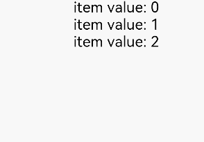
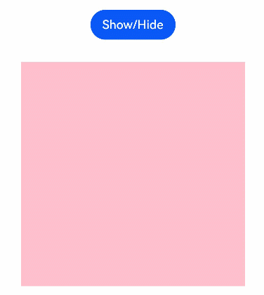
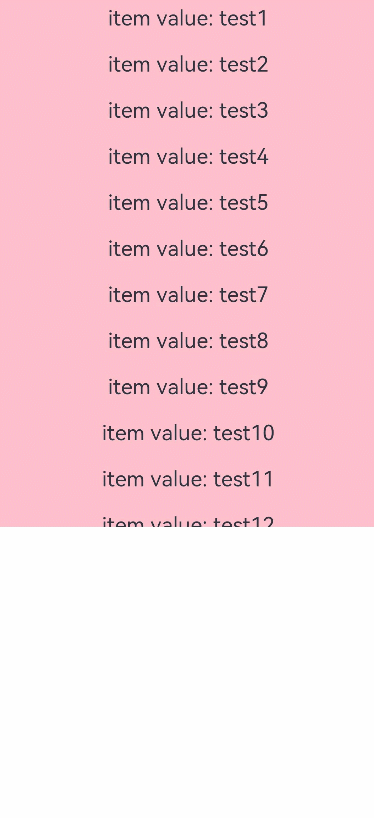

# Recommendations for Improving Performance

If developers use low-performance code to implement functions, the normal running of applications may not be affected, but the performance of applications may be adversely affected. This section lists some performance improvement scenarios for developers to avoid performance deterioration caused by application implementation.

## Lazy data loading is recommended.

If developers directly use the cyclic rendering mode when using a long list, as shown in the following figure, all list elements are loaded at a time. On one hand, the page startup takes a long time, affecting user experience. On the other hand, the pressure and traffic on the server increase, increasing the system load.

```ts
@Entry
@Component
struct MyComponent {
  The @State arr: number[] = Array.from(Array(100), (v,k) =>k); // constructs an array ranging from 0 to 99 and from 0 to 99.
  build() {
    List() {
      ForEach(this.arr, (item: number) => {
        ListItem() {
          Text(`item value: ${item}`)
        }
      }, (item: number) => item.toString())
    }
  }
}
```

The preceding code loads all 100 list elements during page loading, which is not required. We want to iteratively load data from the data source and create corresponding components. Therefore, data lazy loading is required, as shown in the following figure.

```ts
class BasicDataSource implements IDataSource {
  private listeners: DataChangeListener[] = []

  public totalCount(): number {
    return 0
  }

  public getData(index: number): any {
    return undefined
  }

  registerDataChangeListener(listener: DataChangeListener): void {
    if (this.listeners.indexOf(listener) < 0) {
      console.info('add listener')
      this.listeners.push(listener)
    }
  }

  unregisterDataChangeListener(listener: DataChangeListener): void {
    const pos = this.listeners.indexOf(listener);
    if (pos >= 0) {
      console.info('remove listener')
      this.listeners.splice(pos, 1)
    }
  }

  notifyDataReload(): void {
    this.listeners.forEach(listener => {
      listener.onDataReloaded()
    })
  }

  notifyDataAdd(index: number): void {
    this.listeners.forEach(listener => {
      listener.onDataAdd(index)
    })
  }

  notifyDataChange(index: number): void {
    this.listeners.forEach(listener => {
      listener.onDataChange(index)
    })
  }

  notifyDataDelete(index: number): void {
    this.listeners.forEach(listener => {
      listener.onDataDelete(index)
    })
  }

  notifyDataMove(from: number, to: number): void {
    this.listeners.forEach(listener => {
      listener.onDataMove(from, to)
    })
  }
}

class MyDataSource extends BasicDataSource {
  private dataArray: string[] = ['item value: 0', 'item value: 1', 'item value: 2']

  public totalCount(): number {
    return this.dataArray.length
  }

  public getData(index: number): any {
    return this.dataArray[index]
  }

  public addData(index: number, data: string): void {
    this.dataArray.splice(index, 0, data)
    this.notifyDataAdd(index)
  }

  public pushData(data: string): void {
    this.dataArray.push(data)
    this.notifyDataAdd(this.dataArray.length - 1)
  }
}

@Entry
@Component
struct MyComponent {
  private data: MyDataSource = new MyDataSource()

  build() {
    List() {
      LazyForEach(this.data, (item: string) => {
        ListItem() {
          Row() {
            Text(item).fontSize(20).margin({ left: 10 })
          }
        }
        .onClick(() => {
          this.data.pushData('item value: ' + this.data.totalCount())
        })
      }, item => item)
    }
  }
}
```



The preceding code initializes and loads only three list elements during page loading. Each time a list element is clicked, a list element is added.

## Use conditional rendering to replace display and hiding control.

As shown in the following figure, when developers use the visibility common attribute to control the display/hide status of a component, the component still needs to be re-created, causing performance loss.

```ts
@Entry
@Component
struct MyComponent {
  @State isVisible: Visibility = Visibility.Visible;

  build() {
    Column() {
      Button ("Show/Hide")
        .onClick(() => {
          if (this.isVisible == Visibility.Visible) {
            this.isVisible = Visibility.None
          } else {
            this.isVisible = Visibility.Visible
          }
        })
      Row().visibility(this.isVisible)
        .width(300).height(300).backgroundColor(Color.Pink)
    }.width('100%')
  }
}
```

To avoid the preceding issue, use the **if** statement instead. The sample code is as follows:

```ts
@Entry
@Component
struct MyComponent {
  @State isVisible: boolean = true;

  build() {
    Column() {
      Button ("Show/Hide")
        .onClick(() => {
          this.isVisible = !this.isVisible
        })
      if (this.isVisible) {
        Row()
          .width(300).height(300).backgroundColor(Color.Pink)
      }
    }.width('100%')
  }
}
```



## Replacing Flex with Column/Row

By default, the Flex container component has shrink, which causes secondary layout. As a result, the page rendering performance deteriorates to some extent.

```ts
@Entry
@Component
struct MyComponent {
  build() {
    Flex({ direction: FlexDirection.Column }) {
      Flex().width(300).height(200).backgroundColor(Color.Pink)
      Flex().width(300).height(200).backgroundColor(Color.Yellow)
      Flex().width(300).height(200).backgroundColor(Color.Grey)
    }
  }
}
```

In the preceding code, Flex can be replaced with Column and Row to avoid negative impacts caused by Flex secondary layout while ensuring that the page layout effect is the same.

```ts
@Entry
@Component
struct MyComponent {
  build() {
    Column() {
      Row().width(300).height(200).backgroundColor(Color.Pink)
      Row().width(300).height(200).backgroundColor(Color.Yellow)
      Row().width(300).height(200).backgroundColor(Color.Grey)
    }
  }
}
```


## Sets the width and height of the List component.

When developers use the Scroll container component to embed the List child component, if the width and height of the List child component are not specified, all child components are loaded by default, as shown in the following figure.

```ts
@Entry
@Component
struct MyComponent {
  private arr: number[] = [0, 1, 2, 3, 4, 5, 6, 7, 8, 9];

  build() {
    Scroll() {
      List() {
        ForEach(this.arr, (item) => {
          ListItem() {
            Text(`item value: ${item}`).fontSize(30).margin({ left: 10 })
          }.height(100)
        }, (item) => item.toString())
      }
    }.backgroundColor(Color.Pink)
  }
}
```

Therefore, in this scenario, you are advised to set the width and height of the List child component as follows:

```ts
@Entry
@Component
struct MyComponent {
  private arr: number[] = [0, 1, 2, 3, 4, 5, 6, 7, 8, 9];

  build() {
    Scroll() {
      List() {
        ForEach(this.arr, (item) => {
          ListItem() {
            Text(`item value: ${item}`).fontSize(30).margin({ left: 10 })
          }.height(100)
        }, (item) => item.toString())
      }.width('100%').height(500)
    }.backgroundColor(Color.Pink)
  }
}
```



## Reduce application sliding white blocks.

To minimize white blocks during swiping, expand the UI loading range by increasing the value of **cachedCount** for the **\<List>** and **\<Grid>** components. cachedCount indicates the number of items preloaded in the off-screen List/Grid. 
If you need to request a network image, you can download the content in advance before the item slides to the screen to reduce the number of white blocks. 
The following is an example of using the cachedCount parameter:

```ts
@Entry
@Component
struct MyComponent {
  private source: MyDataSource = new MyDataSource();

  build() {
    List() {
      LazyForEach(this.source, item => {
        ListItem() {
          Text("Hello" + item)
            .fontSize(50)
            .onAppear(() => {
              console.log("appear:" + item)
            })
        }
      })
    }.cachedCount(3) //Increase the value. The appear log range will be enlarged.
  }
}

class MyDataSource implements IDataSource {
  data: number[] = [1, 2, 3, 4, 5, 6, 7, 8, 9, 10, 11, 12, 13, 14, 15];

  public totalCount(): number {
    return this.data.length
  }

  public getData(index: number): any {
    return this.data[index]
  }

  registerDataChangeListener(listener: DataChangeListener): void {
  }

  unregisterDataChangeListener(listener: DataChangeListener): void {
  }
}
```


**Instructions:**
A greater **cachedCount** value may result in higher CPU and memory overhead of the UI. Adjust the value by taking into account both the comprehensive performance and user experience.
