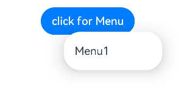
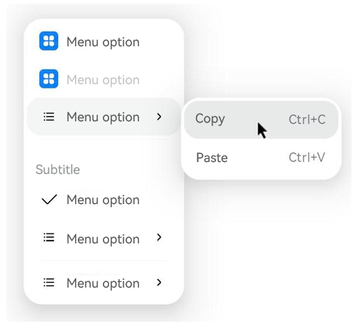

# Menu Control (Menu)
You can use menu APIs to display a context menu, a vertical list of items displayed by long pressing, clicking, or right-clicking a component. For details, see [Menu Control](../reference/apis-arkui/arkui-ts/ts-universal-attributes-menu.md).

A context menu displayed using [bindContextMenu](../reference/apis-arkui/arkui-ts/ts-universal-attributes-menu.md#bindcontextmenu12) and configured with a preview image has a mask applied; in this case, it is modal.

A context menu displayed using [bindMenu](../reference/apis-arkui/arkui-ts/ts-universal-attributes-menu.md#bindmenu11), or **bindContextMenu** without a preview image configured, does not have a mask applied; in this case, it is non-modal.

## Lifecycle

| Name| Type| Description|
| --- | --- | --- |
| aboutToAppear  | () =>  void | Callback triggered when the menu is about to appear.|
| onAppear | () =>  void | Callback triggered when the menu is displayed.|
| aboutToDisappear | () =>  void | Callback triggered when the menu is about to disappear.|
| onDisappear  | () =>  void | Callback triggered when the menu is hidden.|


## Creating a Menu in the Default Style

Use the **bindMenu** API to implement a menu. **bindMenu** responds to the click event of the bound component. When the bound component is clicked, the menu is displayed.

```ts
Button('click for Menu')
  .bindMenu([
    {
      value: 'Menu1',
      action: () => {
        console.info('handle Menu1 select')
      }
    }
  ])
```



## Creating a Menu in a Custom Style

If the default style does not meet requirements, you can use [@Builder](../../application-dev/quick-start/arkts-builder.md) to customize menu content and use the **bindMenu** API to bind the custom menu to a component.

### @Builder: Customizing Menu Content

```ts
class Tmp {
  iconStr2: ResourceStr = $r("app.media.view_list_filled")

  set(val: Resource) {
    this.iconStr2 = val
  }
}

@Entry
@Component
struct menuExample {
  @State select: boolean = true
  private iconStr: ResourceStr = $r("app.media.view_list_filled")
  private iconStr2: ResourceStr = $r("app.media.view_list_filled")

  @Builder
  SubMenu() {
    Menu() {
      MenuItem({ content: "Copy", labelInfo: "Ctrl+C" })
      MenuItem({ content: "Paste", labelInfo: "Ctrl+V" })
    }
  }

  @Builder
  MyMenu() {
    Menu() {
      MenuItem({ startIcon: $r("app.media.icon"), content: "Menu item" })
      MenuItem({ startIcon: $r("app.media.icon"), content: "Menu item" }).enabled(false)
      MenuItem({
        startIcon: this.iconStr,
        content: "Menu item",
        endIcon: $r("app.media.arrow_right_filled"),
        // When the builder parameter is set, it indicates that a submenu is bound to a menu item. When the user hovers the cursor over the menu item, the submenu is displayed.
        builder: this.SubMenu
      })
      MenuItemGroup ({ header: 'Subtitle' }) {
        MenuItem ({ content: "Menu item" })
          .selectIcon(true)
          .selected(this.select)
          .onChange((selected) => {
            console.info("menuItem select" + selected);
            let Str: Tmp = new Tmp()
            Str.set($r("app.media.icon"))
          })
        MenuItem({
          startIcon: $r("app.media.view_list_filled"),
          content: "Menu item",
          endIcon: $r("app.media.arrow_right_filled"),
          builder: this.SubMenu
        })
      }

      MenuItem({
        startIcon: this.iconStr2,
        content: "Menu item",
        endIcon: $r("app.media.arrow_right_filled")
      })
    }
  }

  build() {
    // ...
  }
}

```

### Using the bindMenu Attribute to Bind a Component

```ts
Button('click for Menu')
  .bindMenu(this.MyMenu)
```



## Creating a Context Menu Displayed Upon Right-clicking or Long Pressing

Use the **bindContextMenu** API to customize the menu content and menu popup mode: right-click or long press. The menu items that are displayed using **bindContextMenu** are in an independent child window and can be displayed outside the application window.

- The content in the @Builder is the same as that in the preceding section.
- Check the menu popup mode and bind the component through the **bindContextMenu** attribute. In the example, the menu is displayed upon right-clicking.
  
  ```ts
  Button('click for Menu')
    .bindContextMenu(this.MyMenu, ResponseType.RightClick)
  ```
