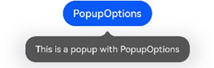
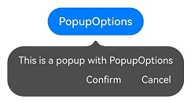
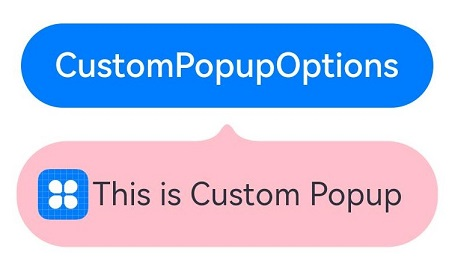

# Popup


You can bind the **Popup** attribute to a component to create a popup, specifying its content and interaction logic, and display state. It is mainly used for screen recording and message notification.


Popups can be defined with [PopupOptions](../reference/arkui-ts/ts-universal-attributes-popup.md#popupoptions) or [CustomPopupOptions](../reference/arkui-ts/ts-universal-attributes-popup.md#custompopupoptions8). In **PopupOptions**, you can set **primaryButton** and **secondaryButton** to include buttons in the popup. In **CustomPopupOptions**, you can create a custom popup through the [builder](../quick-start/arkts-builder.md) parameter.


## Text Popup

Text popups are usually used to display text only and do not allow for user interactions. Bind the **Popup** attribute to a component. When the **show** parameter in the **bindPopup** attribute is set to **true**, a popup is displayed.

If you bind the **Popup** attribute to a **\<Button>** component, each time the **\<Button>** button is clicked, the Boolean value of **handlePopup** changes. When it changes to **true**, the popup is displayed.

```ts
@Entry
@Component
struct PopupExample {
  @State handlePopup: boolean = false
 
  build() {
    Column() {
      Button('PopupOptions')
        .onClick(() => {
          this.handlePopup = !this.handlePopup
        })
        .bindPopup(this.handlePopup, {
          message: 'This is a popup with PopupOptions',
        })
    }.width('100%').padding({ top: 5 })
  }
}
```




## Adding an Event for Popup State Changes

You can use the **onStateChange** parameter to add an event callback for popup state changes, so as to determine the current state of the popup.

```ts
@Entry
@Component
struct PopupExample {
  @State handlePopup: boolean = false

  build() {
    Column() {
      Button('PopupOptions')
        .onClick(() => {
          this.handlePopup = !this.handlePopup
        })
        .bindPopup(this.handlePopup, {
          message: 'This is a popup with PopupOptions',
          onStateChange: (e)=> {// Return the current popup state.
            if (!e.isVisible) {
              this.handlePopup = false
            }
          }
        })
    }.width('100%').padding({ top: 5 })
  }
}
```


## Popup with a Button

You can add a maximum of two buttons to a popup through the **primaryButton** and **secondaryButton** attributes. For each of the buttons, you can set the **action** parameter to specify the operation to be triggered.

```ts
@Entry
@Component
struct PopupExample22 {
  @State handlePopup: boolean = false

  build() {
    Column() {
      Button('PopupOptions').margin({ top: 200 })
        .onClick(() => {
          this.handlePopup = !this.handlePopup
        })
        .bindPopup(this.handlePopup, {
          message: 'This is a popup with PopupOptions',
          primaryButton: {
            value: 'Confirm',
            action: () => {
              this.handlePopup = !this.handlePopup
              console.info('confirm Button click')
            }
          },
          secondaryButton: {
            value: 'Cancel',
            action: () => {
              this.handlePopup = !this.handlePopup
            }
          },
          onStateChange: (e) => {
            if (!e.isVisible) {
              this.handlePopup = false
            }
          }
        })
    }.width('100%').padding({ top: 5 })
  }
}
```





## Custom Popup

You can create a custom popup with **CustomPopupOptions**, defining custom content in \@Builder. In addition, you can use parameters such as **popupColor** to control the popup style.

```ts
@Entry
@Component
struct Index {
  @State customPopup: boolean = false
  // Define the popup content in the popup builder.
  @Builder popupBuilder() {
    Row({ space: 2 }) {
      Image($r("app.media.icon")).width(24).height(24).margin({ left: 5 })
      Text('This is Custom Popup').fontSize(15)
    }.width(200).height(50).padding(5)
  }
  build() {
    Column() {
      Button('CustomPopupOptions')
        .position({x:100,y:200})
        .onClick(() => {
          this.customPopup = !this.customPopup
        })
        .bindPopup(this.customPopup, {
          builder: this.popupBuilder, // Content of the popup.
          placement:Placement.Bottom, // Position of the popup.
          popupColor:Color.Pink // Background color of the popup.
          onStateChange: (e) => {
            console.info(JSON.stringify(e.isVisible))
            if (!e.isVisible) {
              this.customPopup = false
            }
          }
        })
    }
    .height('100%')
  }
}
```


To place the popup in a specific position, set the **placement** parameter. The popup builder triggers a popup message to instruct the user to complete the operation.



