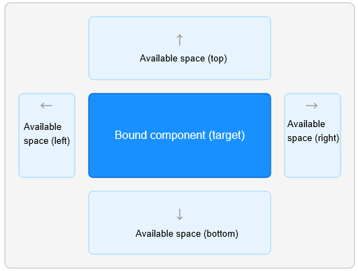

# Popup Component FAQs

<!--Kit: ArkUI-->
<!--Subsystem: ArkUI-->
<!--Owner: @liyi0309-->
<!--Designer: @liyi0309-->
<!--Tester: @lxl007-->
<!--Adviser: @Brilliantry_Rui-->
<!-- md-trans-meta sourceCommit=087470085268b4c7968360a1498b1da15f27d467 translatedAt=2026-07-06T13:06:48.345Z pushedAt=2026-07-07T10:11:25.245Z -->

This document introduces common issues with the popup component and provides references.

## Attribute placement Not Taking Effect for BindPopup

**Symptom**

After setting the [placement](../reference/apis-arkui/arkui-ts/ts-universal-attributes-popup.md#popupoptions) attribute via [popup control](../reference/apis-arkui/arkui-ts/ts-universal-attributes-popup.md), the popup does not appear at the expected position.

**Possible Causes**

The default display area of a popup bubble is the window area outside the bound component. The framework automatically adjusts the bubble position based on the available space, rather than strictly displaying it at the **placement** position.

The popup bubble preferentially displays at the placement position. When space is insufficient, it automatically avoids obstacles according to the following strategy.

1. The default display area of a popup bubble is the window area outside the bound component, as shown in the following diagram:

   

2. If the available space at the set position is insufficient to fully display the popup, the ArkUI framework determines whether the mirrored position of that position can display it. For example, the mirrored position of **Placement.Bottom** is **Placement.Top**, and the mirrored position of **Placement.Left** is **Placement.Right**.

3. If the space at the mirrored position is still insufficient, it switches to a position in the other axis direction, which is cross-axis fallback. For example, when neither the vertical direction (top/bottom) has enough space, it tries the horizontal direction (left/right), and vice versa.

4. If none of the surrounding spaces are sufficient to fully display the popup, the popup will, by default, obscure the bound component to display. If you do not want to obscure the bound component, this can be resolved by setting the [avoidTarget](../reference/apis-arkui/arkui-ts/ts-universal-attributes-popup.md#popupoptions) attribute to **AvoidanceMode.AVOID_AROUND_TARGET**. In this case, the popup will be compressed to avoid obscuring the bound component when the remaining space is insufficient.

**Reference Links**

- [Popup Control](../reference/apis-arkui/arkui-ts/ts-universal-attributes-popup.md)

<!--no_check-->