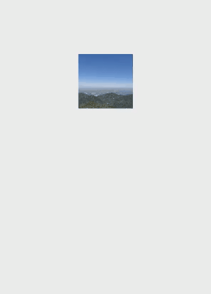

# Rotation Transition Animation

Rotation transition animations are designed to create seamless visual transitions when the screen display orientation changes. There are two approaches to choose from:

- [Rotation transition animation with layout switching](#rotation-transition-animation-with-layout-switching): This animation is your go-to solution for an out-of-the-box implementation experience. It can be achieved by simply configuring automatic rotation (or setting the window display orientation) in the **module.json5** file.
-  [Rotation transition animation with opacity changing](#rotation-transition-animation-with-opacity-changing): This animation adds a touch of sophistication with fade-in and fade-out effects for components during screen rotations. It requires additional setup beyond the **module.json5** configuration, including the preparation of two sets of visuals.

## Rotation Transition Animation with Layout Switching

The rotation transition animation with layout switching is crafted to synchronize the rotation of windows and application views with the screen's orientation change. It's the system's default offering, making it easy for you to implement without the need for complex configurations. When the screen orientation changes, the system automatically initiates a window rotation animation, resizing the window to fit the new orientation. Your application is then prompted to reconfigure its layout to align with the resized window, creating a layout animation that matches the window's rotation parameters.

This animation is activated once the user rotates the screen.

```ts
// xx.ets
import { display } from '@kit.ArkUI';

@Entry
@Component
struct rotation {

  build() {
    Stack() {
      Image($r('app.media.tree'))
        .position({ x: 0, y: 0 })
        .size({ width: 100, height: 100 })
        .id('image1')
    }
    .backgroundColor(Color.White)
    .size({ width: '100%', height: '100%' })
  }
}
```

To enable this animation, add **"orientation": "auto_rotation"** to the **abilities** list in the **module.json5** file of the project.
```json
"orientation": "auto_rotation",
```

The rotation transition animation with layout switching ensures a seamless transition of size and position for windows and application views that rotate in synchronization.


## Rotation Transition Animation with Opacity Changing

The rotation transition animation with opacity changing is activated upon changes in the screen display orientation. It applies a default opacity transition to components that are added or removed during the rotation, allowing for an elegant appearance and disappearance of components. This feature listens for window rotation events and switches the visual effects of components within these events. If the root nodes of the disappearing and appearing views have not been set with a transition effect, it will automatically apply a default opacity transition (that is, [TransitionEffect](../reference/apis-arkui/arkui-ts/ts-transition-animation-component.md#transitioneffect10).OPACITY), creating a smooth fade-in and fade-out effect.

```ts
// xx.ets
import { display } from '@kit.ArkUI';

@Entry
@Component
struct rotation {

  // Obtain the screen display orientation received by listening for the windowsSizeChange event.
  @StorageLink('orientation') myOrientation: display.Orientation = display.Orientation.PORTRAIT;

  build() {
    Stack() {

      // Switch the component's visual effect when the screen display orientation changes.
      if (this.myOrientation == display.Orientation.PORTRAIT || this.myOrientation == display.Orientation.PORTRAIT_INVERTED) {
        Image($r('app.media.sky'))
          .size({ width: 100, height: 100 })
          .id('image1')

          // You can also implement opacity changes for rotation transition animations by setting TransitionEffect.OPACITY.
          // .transition(TransitionEffect.OPACITY)
      } else {
        Image($r('app.media.tree'))
          .position({ x: 0, y: 0 })
          .size({ width: 200, height: 200 })
          .id('image2')
          
          // You can also implement opacity changes for rotation transition animations by setting TransitionEffect.OPACITY.
          // .transition(TransitionEffect.OPACITY)
      }
    }
    .backgroundColor(Color.White)
    .size({ width: '100%', height: '100%' })
  }
}
```

Listen for the **windowSizeChange** event to manage the transitions. For example, you can add logic in the **onWindowStageCreate** API of the **EntryAbility.ets** file to obtain the screen display orientation.
```ts
onWindowStageCreate(windowStage: window.WindowStage): void {

    hilog.info(0x0000, 'testTag', '%{public}s', 'Ability onWindowStageCreate');

    let mainWindow: window.Window;
    try {
      mainWindow = windowStage.getMainWindowSync();
      let displayClass: display.Display = display.getDefaultDisplaySync();
      AppStorage.setOrCreate('orientation', displayClass.orientation);
      // Listen for the windowsSizeChange event, which is triggered when the screen is rotated.
      mainWindow.on('windowSizeChange', (data) => {
        console.info('Succeeded in enabling the listener for window size changes. Data: ' + JSON.stringify(data));
        let displayClass: display.Display | null = null;
        try {
          displayClass = display.getDefaultDisplaySync();
          console.info('display orientation is ' + JSON.stringify(displayClass.orientation));
          // Obtain the screen display orientation.
          AppStorage.set('orientation', displayClass.orientation);
        } catch {
          return;
        }
      })
    } catch {
      hilog.info(0x0000, 'testTag', '%{public}s', 'error');
      return;
    }

    windowStage.loadContent('pages/Index', (err) => {
      if (err.code) {
        hilog.error(0x0000, 'testTag', 'Failed to load the content. Cause: %{public}s', JSON.stringify(err) ?? '');
        return;
      }
      hilog.info(0x0000, 'testTag', 'Succeeded in loading the content.');
    });
}
```

To enable this animation, add **"orientation": "auto_rotation"** to the **abilities** list in the **module.json5** file of the project.
```json
"orientation": "auto_rotation",
```

The rotation transition animation with opacity changing manages the transition of size and position for the window and smoothly switches between application views, providing a fade-out effect for the disappearing view and a fade-in effect for the appearing view.


