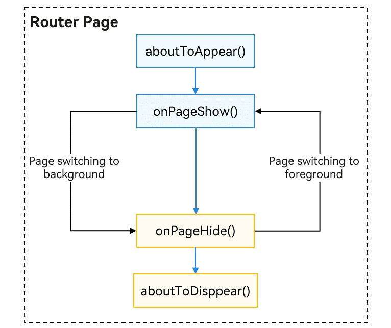

# Transition from Router to Navigation

This topic guides you through the transition from using APIs in the **Router** module to using the **Navigation** component. The **Navigation** component stands out for its wider range of animations, higher flexibility in one-time development for multi-device deployment, and more adaptable stack operations.

## Page Structure

Pages managed by **Router** are @Entry decorated components, each of which must be declared in **main_page.json**.

```json
// main_page.json
{
  "src": [
    "pages/Index",
    "pages/pageOne",
    "pages/pageTwo"
  ]
}
```

The following is an example of a page managed by **Router**.

```ts
// index.ets
import { router } from '@kit.ArkUI';

@Entry
@Component
struct Index {
  @State message: string = 'Hello World';

  build() {
    Row() {
      Column() {
        Text(this.message)
          .fontSize(50)
          .fontWeight(FontWeight.Bold)
        Button('router to pageOne', { stateEffect: true, type: ButtonType.Capsule })
          .width('80%')
          .height(40)
          .margin(20)
          .onClick(() => {
            router.pushUrl({
              url: 'pages/pageOne' // Target URL.
            }, router.RouterMode.Standard, (err) => {
              if (err) {
                console.error(`Invoke pushUrl failed, code is ${err.code}, message is ${err.message}`);
                return;
              }
              console.info('Invoke pushUrl succeeded.');
            })
          })
      }
      .width('100%')
    }
    .height('100%')
  }
}
```

```ts
// pageOne.ets
import { router } from '@kit.ArkUI';

@Entry
@Component
struct pageOne {
  @State message: string = 'This is pageOne';

  build() {
    Row() {
      Column() {
        Text(this.message)
          .fontSize(50)
          .fontWeight(FontWeight.Bold)
        Button('router back to Index', { stateEffect: true, type: ButtonType.Capsule })
          .width('80%')
          .height(40)
          .margin(20)
          .onClick(() => {
            router.back();
          })
      }
      .width('100%')
    }
    .height('100%')
  }
}
```

Pages using **Navigation** are divided into navigation pages and subpages. The navigation page, also known as a NavBar, is a child component of **Navigation**, while subpages are child components of **NavDestination**.

The following is an example of the navigation page using **Navigation**.

```ts
// index.ets
@Entry
@Component
struct Index {
  pathStack: NavPathStack = new NavPathStack()

  build() {
    Navigation(this.pathStack) {
      Column() {
        Button('Push PageOne', { stateEffect: true, type: ButtonType.Capsule })
          .width('80%')
          .height(40)
          .margin(20)
          .onClick(() => {
            this.pathStack.pushPathByName('pageOne', null)
          })
      }.width('100%').height('100%')
    }
    .title("Navigation")
    .mode(NavigationMode.Stack)
  }
}
```
The following is an example of a subpage using **Navigation**.

```ts
// PageOne.ets

@Builder
export function PageOneBuilder() {
  PageOne()
}

@Component
export struct PageOne {
  pathStack: NavPathStack = new NavPathStack()

  build() {
    NavDestination() {
      Column() {
        Button('Back to Home', { stateEffect: true, type: ButtonType.Capsule })
          .width('80%')
          .height(40)
          .margin(20)
          .onClick(() => {
            this.pathStack.clear()
          })
      }.width('100%').height('100%')
    }.title('PageOne')
    .onReady((context: NavDestinationContext) => {
      this.pathStack = context.pathStack
    })
  }
}
```

Each subpage also needs to be configured in the system configuration file **route_map.json** (see [System Routing Table](arkts-navigation-navigation.md#system-routing-table)).

```json
// Configure {"routerMap": "$profile:route_map"} in the project configuration file module.json5.
// route_map.json
{
  "routerMap": [
    {
      "name": "pageOne",
      "pageSourceFile": "src/main/ets/pages/PageOne.ets",
      "buildFunction": "PageOneBuilder",
      "data": {
        "description": "this is pageOne"
      }
    }
  ]
}
```

## Route Operations

To use the **Router** for page operations, you must import the **@ohos.router** module.

```ts
import { router } from '@kit.ArkUI';

// push page
router.pushUrl({ url:"pages/pageOne", params: null })

// pop page
router.back({ url: "pages/pageOne" })

// replace page
router.replaceUrl({ url: "pages/pageOne" })

// clear all page
router.clear()

// Obtain the size of the page stack.
let size = router.getLength()

// Obtain the page state.
let pageState = router.getState()
```

To use the **Navigation** component for page operations, call APIs of the [NavPathStack](../reference/apis-arkui/arkui-ts/ts-basic-components-navigation.md#navpathstack10) object. You need to first create a **NavPathStack** object and pass it into **Navigation**.

```ts
@Entry
@Component
struct Index {
  pathStack: NavPathStack = new NavPathStack()

  build() {
    // Set NavPathStack and pass it to Navigation.
    Navigation(this.pathStack) {
      // ...
    }.width('100%').height('100%')
    .title("Navigation")
    .mode(NavigationMode.Stack)
  }
}


// push page
this.pathStack.pushPath({ name: 'pageOne' })

// pop page
this.pathStack.pop()
this.pathStack.popToIndex(1)
this.pathStack.popToName('pageOne')

// replace page
this.pathStack.replacePath({ name: 'pageOne' })

// clear all page
this.pathStack.clear()

// Obtain the size of the page stack.
let size: number = this.pathStack.size()

// Remove all pages whose name is PageOne from the stack.
this.pathStack.removeByName("pageOne")

// Remove the page with the specified index.
this.pathStack.removeByIndexes([1, 3, 5])

// Obtain all page names in the stack.
this.pathStack.getAllPathName()

// Obtain the parameters of the page whose index is 1.
this.pathStack.getParamByIndex(1)

// Obtain the parameters of the PageOne page.
this.pathStack.getParamByName("pageOne")

// Obtain the index set of the PageOne page.
this.pathStack.getIndexByName("pageOne")
// ...
```

**Router** serves as a global module that can be used across any page, whereas **Navigation** operates as a component. If subpages within a **Navigation** component need to perform routing operations, they must access the **NavPathStack** object held by **Navigation**. The following are several methods to obtain the **NavPathStack** object:

**Method 1**: Use @Provide and @Consume (this method creates coupling and is not recommended).

```ts
// Navigation root container
@Entry
@Component
struct Index {
  // Navigation creates a NavPathStack object decorated by @Provide.
 @Provide('pathStack') pathStack: NavPathStack = new NavPathStack()

  build() {
    Navigation(this.pathStack) {
        // ...
    }
    .title("Navigation")
    .mode(NavigationMode.Stack)
  }
}

// Navigation subpage
@Component
export struct PageOne {
  // NavDestination obtains the NavPathStack object through @Consume.
  @Consume('pathStack') pathStack: NavPathStack;

  build() {
    NavDestination() {
      // ...
    }
    .title("PageOne")
  }
}
```

**Method 2**: Use the **OnReady** callback.

```ts
@Component
export struct PageOne {
  pathStack: NavPathStack = new NavPathStack()

  build() {
    NavDestination() {
      // ...
    }.title('PageOne')
    .onReady((context: NavDestinationContext) => {
      this.pathStack = context.pathStack
    })
  }
}
```

**Method 3**: Call the global AppStorage API.

```ts
@Entry
@Component
struct Index {
  pathStack: NavPathStack = new NavPathStack()

  // Set a NavPathStack object globally.
  aboutToAppear(): void {
     AppStorage.setOrCreate("PathStack", this.pathStack)
   }

  build() {
    Navigation(this.pathStack) {
      // ...
    }.title("Navigation")
    .mode(NavigationMode.Stack)
  }
}

// Navigation subpage
@Component
export struct PageOne {
  // The subpage obtains the global NavPathStack object.
  pathStack: NavPathStack = AppStorage.get("PathStack") as NavPathStack

  build() {
    NavDestination() {
      // ...
    }
    .title("PageOne")
  }
}
```

**Method 4**: Call the custom component query API. For details, see [queryNavigationInfo](../reference/apis-arkui/arkui-ts/ts-custom-component-api.md#querynavigationinfo12).

```ts
// Custom component on the subpage
@Component
struct CustomNode {
  pathStack: NavPathStack = new NavPathStack()

  aboutToAppear() {
    // query navigation info
    let navigationInfo: NavigationInfo = this.queryNavigationInfo() as NavigationInfo
    this.pathStack = navigationInfo.pathStack;
  }

  build() {
    Row() {
      Button('Go to PageTwo')
        .onClick(() => {
          this.pathStack.pushPath({ name: 'pageTwo' })
        })
    }
  }
}
```

## Lifecycle

The lifecycle of a **Router** page is managed by universal methods within the @Entry page, which mainly includes the following lifecycle events:

```ts
// Callback after the page is created and mounted to the tree
aboutToAppear(): void {
}

// Callback before the page is destroyed and unmounted 
aboutToDisappear(): void {
}

// Callback when the page is displayed 
onPageShow(): void {
}

// Callback when the page is hidden 
onPageHide(): void {
}
```

The sequence of these lifecycle events is illustrated in the figure below.



**Navigation**, as a routing container, hosts its lifecycle within the **NavDestination** component and exposes lifecycle events as component events.
For details about the lifecycle, see [Page Lifecycle](arkts-navigation-navigation.md#page-lifecycle).

```ts
@Component
struct PageOne {
  aboutToDisappear() {
  }

  aboutToAppear() {
  }

  build() {
    NavDestination() {
      // ...
    }
    .onWillAppear(() => {
    })
    .onAppear(() => {
    })
    .onWillShow(() => {
    })
    .onShown(() => {
    })
    .onWillHide(() => {
    })
    .onHidden(() => {
    })
    .onWillDisappear(() => {
    })
    .onDisAppear(() => {
    })
  }
}
```

## Transition Animation

Both **Router** and **Navigation** offer built-in system transition animations as well as the capability to customize these animations.

For **Router**, custom page transition animations are implemented through the universal method **pageTransition()**. For details, see [Page Transition Animation](arkts-page-transition-animation.md).

For **Navigation**, a routing container component, page transition animations are essentially property animations between components. You can custom page transition animations through the [customNavContentTransition](../reference/apis-arkui/arkui-ts/ts-basic-components-navigation.md#customnavcontenttransition11) event in **Navigation**. For details, see [Defining a Custom Transition](arkts-navigation-navigation.md#defining-a-custom-transition). (Note: Dialog-type pages currently do not have transition animations.)

## Shared Element Transition

To animate shared elements during page transitions with **Router**, use the **sharedTransition** API. For details, see
[Shared Element Transition (sharedTransition)](../reference/apis-arkui/arkui-ts/ts-transition-animation-shared-elements.md).

To animate shared elements during page transitions with **Navigation**, use the **geometryTransition** API. For details, see [Defining a Shared Element Transition](arkts-navigation-navigation.md#defining-a-shared-element-transition).

## Cross-Package Routing

To implement cross-package routing, with **Router**, use named routes.

1. In the [HAR](../quick-start/har-package.md) or [HSP](../quick-start/in-app-hsp.md) you want to navigate to, name the @Entry decorated custom component in [EntryOptions](../ui/state-management/arkts-create-custom-components.md#entry).

   ```ts
   // library/src/main/ets/pages/Index.ets
   // library is the new custom name of the shared package.
   @Entry({ routeName: 'myPage' })
   @Component
   export struct MyComponent {
     build() {
       Row() {
         Column() {
           Text('Library Page')
             .fontSize(50)
             .fontWeight(FontWeight.Bold)
         }
         .width('100%')
       }
       .height('100%')
     }
   }
   ```

2. When the configuration is successful, import the named route page to the page from which you want to navigate and perform the navigation.

   ```ts
   import { router } from '@kit.ArkUI';
   import { BusinessError } from '@kit.BasicServicesKit';
   import('library/src/main/ets/pages/Index');  // Import the named route page from the library of the shared package.
   
   @Entry
   @Component
   struct Index {
     build() {
       Flex({ direction: FlexDirection.Column, alignItems: ItemAlign.Center, justifyContent: FlexAlign.Center }) {
         Text('Hello World')
           .fontSize(50)
           .fontWeight(FontWeight.Bold)
           .margin({ top: 20 })
           .backgroundColor('#ccc')
           .onClick(() => { // Click to go to a page in another shared package.
             try {
               router.pushNamedRoute({
                 name: 'myPage',
                 params: {
                   data1: 'message',
                   data2: {
                     data3: [123, 456, 789]
                   }
                 }
               })
             } catch (err) {
               let message = (err as BusinessError).message
               let code = (err as BusinessError).code
               console.error(`pushNamedRoute failed, code is ${code}, message is ${message}`);
             }
           })
       }
       .width('100%')
       .height('100%')
     }
   }
   ```

As a routing component, **Navigation** natively supports cross-package navigation.

1. Develop a custom component in the HSP (HAR) that you want to navigate to, and declare it as **export**.

   ```ts
   @Component
   export struct PageInHSP {
     build() {
       NavDestination() {
           // ...
       }
     }
   }
   ```

2. Export the component in the **index.ets** file of the HSP (HAR).

   ```ts
   export { PageInHSP } from "./src/main/ets/pages/PageInHSP"
   ```

3. After configuring the project dependencies for the HSP (HAR), import the custom component into **mainPage** and add it to **pageMap** for normal use.

   ```
   // 1. Import the cross-package route page.
   import { PageInHSP } from 'library/src/main/ets/pages/PageInHSP'
   
   @Entry
   @Component
   struct mainPage {
    pageStack: NavPathStack = new NavPathStack()
   
    @Builder pageMap(name: string) {
      if (name === 'PageInHSP') {
   	    // 2. Define the route mapping table.
   	    PageInHSP()
      }
    }

    build() {
      Navigation(this.pageStack) {
        Button("Push HSP Page")
          .onClick(() => {
            // 3. Navigate to the page in the HSP.
            this.pageStack.pushPath({ name: "PageInHSP" });
          })
      }
      .mode(NavigationMode.Stack)
      .navDestination(this.pageMap)
    }
   }
   ```

In the above approaches, static dependencies are used for cross-package routing. In large-scale projects, inter-module development generally requires decoupling, which relies on the capability of dynamic routing.

## Dynamic Routing

Dynamic routing facilitates the reuse of service modules across different products (HAPs) and ensures module decoupling by using a routing table for transitions without interdependencies. It also streamlines the expansion and integration of routing features.

Business modules expose a set of pages for various scenarios, which are managed through a unified routing table. Products can register the routing tables of the required modules.

**Key Benefits of Dynamic Routing**

1. Route definitions can include not only the URL for navigation but also a variety of extended configurations, such as default orientation (landscape or portrait) and authentication requirements, for unified handling during routing.
2. Each route is assigned a name, allowing navigation by name rather than by file path, which simplifies the routing process.
3. Pages can be loaded using dynamic import (lazy loading), preventing the initial page from loading a large amount of code that could cause lag.

**Implementing Dynamic Routing with Router**

1. Definition: Add new routes to the routing table -> Bind page files to route names (decorators) -> Associate loading functions with page files (dynamic import functions).<br>
2. Registration: Register routes (inject the routing table of dependent modules as needed in the entry ability).<br>
3. Navigation: Check the routing table (for registered route names) -> Pre-routing hooks (dynamic import for page loading) -> Perform routing -> Post-routing hooks (common processing, such as tracking).

**Implementing Dynamic Routing with Navigation**

**Solution 1: Custom Routing Table**

The basic implementation is similar to the aforementioned dynamic routing with **Router**.
1. Create a custom routing management module, which is depended on by all modules providing routing pages.
2. When constructing the **Navigation** component, inject **NavPathStack** into the routing management module, which then encapsulates **NavPathStack** and provides routing capabilities.
3. Instead of providing components directly, each routing page offers a build function wrapped with @build, which is then further encapsulated with **WrappedBuilder** for global encapsulation.
4. Each routing page registers its module name, route name, and the **WrappedBuilder**-encapsulated build function into the routing management module.
5. The routing management module completes dynamic imports and route transitions as needed.

 

**Solution 2: System Routing Table**

Since API version 12, **Navigation** supports a system-wide cross-module routing table solution, which centralizes routing management through individual **router_map.json** files in each service module (HSP/HAR). When a route transition is initiated using **NavPathStack**, the system automatically performs dynamic module loading, component construction, and completes the route transition, achieving module decoupling at the development level.
For details, see [System Routing Table](arkts-navigation-navigation.md#system-routing-table).

## Lifecycle Listening

You can use the observer to register for lifecycle events with the **Router**. For details about the APIs, see [observer.on('routerPageUpdate')](../reference/apis-arkui/js-apis-arkui-observer.md#uiobserveronrouterpageupdate11).


```ts
import { uiObserver } from '@kit.ArkUI';

function callBackFunc(info: uiObserver.RouterPageInfo) {
    console.info("RouterPageInfo is : " + JSON.stringify(info))
}

// used in ability context.
uiObserver.on('routerPageUpdate', this.context, callBackFunc);

// used in UIContext.
uiObserver.on('routerPageUpdate', this.getUIContext(), callBackFunc);
```

A registered callback is invoked when there is a change in the page state. You can obtain relevant page information such as the page name, index, path, and lifecycle status through the parameters passed to the callback.

**Navigation** also allows you to register for lifecycle events through the observer.

```ts
// EntryAbility.ets
import { BusinessError } from '@kit.BasicServicesKit';
import { UIObserver } from '@kit.ArkUI';

export default class EntryAbility extends UIAbility {
  // ...
  onWindowStageCreate(windowStage: window.WindowStage): void {
    // ...
    windowStage.getMainWindow((err: BusinessError, data) => {
      // ...
      let windowClass = data;
      // Obtain a UIContext instance.
      let uiContext: UIContext = windowClass.getUIContext();
      // Obtain a UIObserver instance.
      let uiObserver : UIObserver = uiContext.getUIObserver();
      // Register a listener for DevNavigation state updates.
      uiObserver.on("navDestinationUpdate",(info) => {
        // NavDestinationState.ON_SHOWN = 0, NavDestinationState.ON_HIDE = 1
        if (info.state == 0) {
          // Actions to perform when the NavDestination component is shown.
          console.info('page ON_SHOWN:' + info.name.toString());
        }
      })
    })
  }
}
```

## Page Information Query

To achieve decoupling between custom components and their containing pages, a global API for querying page information is provided within custom components.

With **Router**, you can use the [queryRouterPageInfo](../reference/apis-arkui/arkui-ts/ts-custom-component-api.md#queryrouterpageinfo12) API to query information about the current page where the custom component resides. The return value includes the following properties, with **pageId** being the unique ID for the page.

| Name                | Type                       | Mandatory| Description                          |
| -------------------- | --------------------------- | ---- | ------------------------------ |
| context              | UIAbilityContext/ UIContext | Yes  | Context information of the page.|
| index                | number                      | Yes  | Position of the page in the stack.      |
| name                 | string                      | Yes  | Name of the page.        |
| path                 | string                      | Yes  | Path of the page.        |
| state                | RouterPageState             | Yes  | Status of the page.          |
| pageId<sup>12+</sup> | string                      | Yes  | Unique ID of the routerPage page.      |

```ts
import { uiObserver } from '@kit.ArkUI';

// Custom component on the page
@Component
struct MyComponent {
  aboutToAppear() {
    let info: uiObserver.RouterPageInfo | undefined = this.queryRouterPageInfo();
  }

  build() {
    // ...
  }
}
```

With **Navigation**, you can use the [queryNavDestinationInfo](../reference/apis-arkui/arkui-ts/ts-custom-component-api.md#querynavdestinationinfo) API to query information about the current page where the custom component resides. The return value includes the following properties, with **navDestinationId** being the unique ID for the page.

| Name                         | Type               | Mandatory| Description                                        |
| ----------------------------- | ------------------- | ---- | -------------------------------------------- |
| navigationId                  | ResourceStr         | Yes  | ID of the **Navigation** component that contains the target **NavDestination** component.|
| name                          | ResourceStr         | Yes  | Name of the **NavDestination** component.                  |
| state                         | NavDestinationState | Yes  | State of the **NavDestination** component.                  |
| index<sup>12+<sup>            | number              | Yes  | Index of the **NavDestination** component in the navigation stack.            |
| param<sup>12+<sup>            | Object              | No  | Parameters of the **NavDestination** component.                  |
| navDestinationId<sup>12+<sup> | string              | Yes  | Unique ID of the **NavDestination** component.            |

```ts
import { uiObserver } from '@kit.ArkUI';

@Component
export struct NavDestinationExample {
  build() {
    NavDestination() {
      MyComponent()
    }
  }
}

@Component
struct MyComponent {
  navDesInfo: uiObserver.NavDestinationInfo | undefined

  aboutToAppear() {
    this.navDesInfo = this.queryNavDestinationInfo();
    console.log('get navDestinationInfo: ' + JSON.stringify(this.navDesInfo))
  }

  build() {
    // ...
  }
}
```

## Route Interception

**Router** does not natively provide route interception, so you must implement it by creating custom routing APIs for redirection and interception logic.

**Navigation** provides the [setInterception](../reference/apis-arkui/arkui-ts/ts-basic-components-navigation.md#setinterception12) API for setting callbacks to intercept page navigation. For details, see [Route Interception](arkts-navigation-navigation.md#route-interception).
