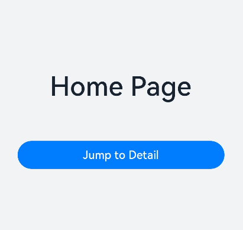

# Page Routing (@ohos.router) (Not Recommended)


Page routing refers to the redirection and data transfer between different pages in an application. It can be implemented through APIs of the **Router** module. Through different URLs, you can easily navigate users through pages. This document describes the functions provided by the **Router** module from the following aspects: [Page Redirection](#page-redirection), [Page Return](#page-return), [Adding a Confirmation Dialog Box Before Page Return](#adding-a-confirmation-dialog-box-before-page-return), and [Named Route](#named-route).

>**NOTE**
>
>You are advised to use [Component Navigation (Navigation)](./arkts-navigation-navigation.md), which offers enhanced functionality and customization capabilities, as the routing framework in your application. For details about the differences between **Navigation** and **Router**, see [Transition from Router to Navigation](./arkts-router-to-navigation.md).

## Page Redirection

Page redirection is an important part of the development process. When using an application, you usually need to jump between different pages, and sometimes you need to pass data from one page to another.

  **Figure 1** Page redirection 


The **Router** module provides two redirection modes: [router.pushUrl](../reference/apis-arkui/js-apis-router.md#routerpushurl9) and [router.replaceUrl](../reference/apis-arkui/js-apis-router.md#routerreplaceurl9). Whether the target page will replace the current page depends on the mode used.

- **router.pushUrl**: The target page is pushed into the page stack and does not replace the current page. In this mode, the state of the current page is retained, and users can return to the current page by pressing the back button or calling the [router.back](../reference/apis-arkui/js-apis-router.md#routerback) API.

- **router.replaceUrl**: The target page replaces and destroys the current page. In this mode, the resources of the current page can be released, and users cannot return to the current page.

>**NOTE**
>
>- When creating a page, configure the route to this page by following instructions in <!--RP1-->[Building the Second Page](../quick-start/start-with-ets-stage.md#building-the-second-page)<!--RP1End-->.
>
>
>- The maximum capacity of a page stack is 32 pages. If this limit is exceeded, the [router.clear](../reference/apis-arkui/js-apis-router.md#routerclear) API can be called to clear the historical page stack and free the memory.

The **Router** module also provides two instance modes: **Standard** and **Single**. Depending on the mode, the target URL is mapped to one or more instances.

- **Standard**: multi-instance mode. It is the default instance mode. In this mode, the target page is added to the top of the page stack, regardless of whether a page with the same URL exists in the stack.

- **Single**: singleton mode. In this mode, if the URL of the target page already exists in the page stack, the page closest to the top of the stack with the same URL is moved to the top of the stack and becomes the new page. If the URL of the target page does not exist in the page stack, the page is redirected in standard mode.

Before using the **Router** module, import it first.


```ts
import { promptAction, router } from '@kit.ArkUI';
import { BusinessError } from '@kit.BasicServicesKit';
```

- Scenario 1: There is a home page (**Home**) and a details page (**Detail**). You want to click an offering on the home page to go to the details page. In addition, the home page needs to be retained in the page stack so that the status can be restored when the page is returned. In this scenario, you can use the **pushUrl** API and use the **Standard** instance mode (which can also be omitted).


  ```ts
  import { router } from '@kit.ArkUI';
  // On the Home page
  function onJumpClick(): void {
    router.pushUrl({
      url: 'pages/Detail' // Target URL.
    }, router.RouterMode.Standard, (err) => {
      if (err) {
        console.error(`Invoke pushUrl failed, code is ${err.code}, message is ${err.message}`);
        return;
      }
      console.info('Invoke pushUrl succeeded.');
    });
  }
  ```

  >**NOTE**
  >
  >In standard (multi-instance) mode, the **router.RouterMode.Standard** parameter can be omitted.

- Scenario 2: There is a login page (**Login**) and a personal center page (**Profile**). After a user successfully logs in from the **Login** page, the **Profile** page is displayed. At the same time, the **Login** page is destroyed, and the application exits when the back button is pressed. In this scenario, you can use the **replaceUrl** API and use the Standard instance mode (which can also be omitted).


  ```ts
  import { router } from '@kit.ArkUI';
  // On the Login page
  function onJumpClick(): void {
    router.replaceUrl({
      url: 'pages/Profile' // Target URL.
    }, router.RouterMode.Standard, (err) => {
      if (err) {
        console.error(`Invoke replaceUrl failed, code is ${err.code}, message is ${err.message}`);
        return;
      }
      console.info('Invoke replaceUrl succeeded.');
    })
  }
  ```

  >**NOTE**
  >
  >In standard (multi-instance) mode, the **router.RouterMode.Standard** parameter can be omitted.

- Scenario 3: There is a **Setting** page and a **Theme** page. After a theme option on the **Setting** page is clicked, the **Theme** page is displayed. Only one **Theme** page exists in the page stack at the same time. When the back button is clicked on the **Theme** page, the **Setting** page is displayed. In this scenario, you can use the **pushUrl** API and use the **Single** instance mode.


  ```ts
  import { router } from '@kit.ArkUI';
  // On the Setting page
  function onJumpClick(): void {
    router.pushUrl({
      url: 'pages/Theme' // Target URL.
    }, router.RouterMode.Single, (err) => {
      if (err) {
        console.error(`Invoke pushUrl failed, code is ${err.code}, message is ${err.message}`);
        return;
      }
      console.info('Invoke pushUrl succeeded.');
    });
  }
  ```

- Scenario 4: There is a search result list page (**SearchResult**) and a search result details page (**SearchDetail**). You want to click a result on the **SearchResult** page to go to the **SearchDetail** page. In addition, if the result has been viewed before, clicking the result displays the existing details page, instead of creating a new one. In this scenario, you can use the **replaceUrl** API and use the **Single** instance mode.


  ```ts
  import { router } from '@kit.ArkUI';

  // On the SearchResult page
  function onJumpClick(): void {
    router.replaceUrl({
      url: 'pages/SearchDetail' // Target URL.
    }, router.RouterMode.Single, (err) => {
      if (err) {
        console.error(`Invoke replaceUrl failed, code is ${err.code}, message is ${err.message}`);
        return;
      }
      console.info('Invoke replaceUrl succeeded.');
    })
  }
  ```

The preceding scenarios do not involve parameter transfer.

If you need to transfer data to the target page during redirection, you can add a **params** attribute and specify an object as a parameter when invoking an API of the **Router** module. Example:


```ts
import { router } from '@kit.ArkUI';
class DataModelInfo {
  age: number = 0;
}

class DataModel {
  id: number = 0;
  info: DataModelInfo|null = null;
}

function onJumpClick(): void {
  // On the Home page
  let paramsInfo: DataModel = {
    id: 123,
    info: {
      age: 20
    }
  };

  router.pushUrl({
    url: 'pages/Detail', // Target URL.
    params: paramsInfo // Add the params attribute to transfer custom parameters.
  }, (err) => {
    if (err) {
      console.error(`Invoke pushUrl failed, code is ${err.code}, message is ${err.message}`);
      return;
    }
    console.info('Invoke pushUrl succeeded.');
  })
}
```

On the target page, you can call the [getParams](../reference/apis-arkui/js-apis-router.md#routergetparams) API of the **Router** module to obtain the passed parameters. Example:


```ts
import { router } from '@kit.ArkUI';

class InfoTmp {
  age: number = 0
}

class RouTmp {
  id: object = () => {
  }
  info: InfoTmp = new InfoTmp()
}

const params: RouTmp = router.getParams() as RouTmp; // Obtain the passed parameter object.
const id: object = params.id // Obtain the value of the id attribute.
const age: number = params.info.age // Obtain the value of the age attribute.
```


## Page Return

Implement the page return feature so that users can return to the previous page or a specified page. You can pass parameters to the target page during the return process.

  **Figure 2** Page return 


Before using the **Router** module, import it first.


```ts
import { router } from '@kit.ArkUI';
```

You can use any of the following methods to return to a page:

- Method 1: Return to the previous page.


  ```ts
  import { router } from '@kit.ArkUI';
  router.back();
  ```

  This method allows you to return to the position of the previous page in the page stack. For this method to work, the previous page must exist in the page stack.

- Method 2: Return to a specific page.


  Return to the page through a common route.

  ```ts
  import { router } from '@kit.ArkUI';
  router.back({
    url: 'pages/Home'
  });
  ```

  Return to the page through a named route.

  ```ts
  import { router } from '@kit.ArkUI';
  router.back({
    url: 'myPage' // myPage is the alias of the page to return to.
  });
  ```

  This method allows users to return to a page with the specified path. For this method to work, the target page must exist in the page stack.

- Method 3: Return to a specific page and pass custom parameters.


  Return to the page through a common route.

  ```ts
  import { router } from '@kit.ArkUI';
  router.back({
    url: 'pages/Home',
    params: {
      info: 'From Home Page'
    }
  });
  ```

  Return to the page through a named route.

  ```ts
  import { router } from '@kit.ArkUI';
  router.back({
    url: 'myPage', // myPage is the alias of the page to return to.
    params: {
      info: 'From Home Page'
    }
  });
  ```

  This method not only allows you to return to the specified page, but also pass in custom parameter information during the return process. The parameter information can be obtained and parsed by invoking the **router.getParams** API on the target page.

On the target page, call the **router.getParams** API to obtain parameters at the desired location. For example, you can use it in the [onPageShow](../reference/apis-arkui/arkui-ts/ts-custom-component-lifecycle.md#onpageshow) lifecycle callback.


```ts
import { router } from '@kit.ArkUI';

@Entry
@Component
struct Home {
  @State message: string = 'Hello World';

  onPageShow() {
    const params = router.getParams() as Record<string, string>; // Obtain the passed parameter object.
    if (params) {
      const info: string = params.info as string; // Obtain the value of the info attribute.
    }
  }
  ...
}
```

>**NOTE**
>
>When the **router.back** API is used to return to a specified page, all pages between the top page (included) and the specified page (excluded) are pushed from the page stack and destroyed.
>
> If the **router.back** method is used to return to the original page, the original page will not be created repeatedly. Therefore, the variable declared using \@State will not be declared repeatedly, and the **aboutToAppear** lifecycle callback of the page will not be triggered. If you want to use the custom parameters transferred from the returned page on the original page, you can parse the parameters in the required position. For example, parameter parsing can be performed in the **onPageShow** lifecycle callback.


## Adding a Confirmation Dialog Box Before Page Return

During application development, to prevent misoperations or data loss, a dialog box needs to be displayed before a user returns from one page to another, asking the user whether to perform the operation.

Such a dialog box can be in the [default style](#default-confirmation-dialog-box) or [custom style](#custom-confirmation-dialog-box).

  **Figure 3** Adding a confirmation dialog box before page return 




### Default Confirmation Dialog Box

To implement this function, you can use the [router.showAlertBeforeBackPage](../reference/apis-arkui/js-apis-router.md#routershowalertbeforebackpage9) and [router.back](../reference/apis-arkui/js-apis-router.md#routerback) APIs provided by the **Router** module.

Before using the **Router** module, import it first.


```ts
import { router } from '@kit.ArkUI';
```

To enable the confirmation dialog box for page return, call the [router.showAlertBeforeBackPage](../reference/apis-arkui/js-apis-router.md#routershowalertbeforebackpage9) API (for setting the information about the dialog box), then the [router.back](../reference/apis-arkui/js-apis-router.md#routerback) API. For example, define a click event processing function for the back button on the payment page:


```ts
import { router } from '@kit.ArkUI';
import { BusinessError } from '@kit.BasicServicesKit';

// Define a click event processing function for the back button.
function onBackClick(): void {
  // Invoke the router.showAlertBeforeBackPage() API to set the information about the confirmation dialog box.
  try {
    router.showAlertBeforeBackPage({
      message: 'Payment not completed yet. Are you sure you want to return?' // Set the content of the confirmation dialog box.
    });
  } catch (err) {
    let message = (err as BusinessError).message
    let code = (err as BusinessError).code
    console.error(`Invoke showAlertBeforeBackPage failed, code is ${code}, message is ${message}`);
  }

  // Invoke the router.back() API to return to the previous page.
  router.back();
}
```

The **router.showAlertBeforeBackPage** API receives an object as a parameter. The object contains the following attributes:

**message**: content of the dialog box. The value is of the string type.
If the API is called successfully, the confirmation dialog box is displayed on the target page. Otherwise, an exception is thrown and the error code and error information is obtained through **err.code** and **err.message**.

When the user clicks the back button, a confirmation dialog box is displayed, prompting the user to confirm their operation. If the user selects **Cancel**, the application stays on the current page. If the user selects OK, the **router.back** API is called and the redirection is performed based on the parameters.

### Custom Confirmation Dialog Box

To implement a custom confirmation dialog box, use APIs in the [promptAction.showDialog](../reference/apis-arkui/js-apis-promptAction.md#promptactionshowdialog) module or create a custom dialog box . This topic uses the APIs in the **PromptAction** module an example to describe how to implement a custom confirmation dialog box.

Before using the **Router** module, import it first.


```ts
import { router } from '@kit.ArkUI';
```

In the event callback, call the [promptAction.showDialog](../reference/apis-arkui/js-apis-promptAction.md#promptactionshowdialog) API of the **PromptAction** module.


```ts
import { promptAction, router } from '@kit.ArkUI';
import { BusinessError } from '@kit.BasicServicesKit';

function onBackClick() {
  // Display a custom confirmation dialog box.
  promptAction.showDialog({
    message:'Payment not completed yet. Are you sure you want to return?',
    buttons: [
      {
        text: 'Cancel',
        color: '#FF0000'
      },
      {
        text: 'OK',
        color: '#0099FF'
      }
    ]
  }).then((result:promptAction.ShowDialogSuccessResponse) => {
    if (result.index === 0) {
      // The user selects Cancel.
      console.info('User canceled the operation.');
    } else if (result.index === 1) {
      // The user selects OK.
      console.info('User confirmed the operation.');
      // Invoke the router.back() API to return to the previous page.
      router.back();
    }
  }).catch((err:Error) => {
    let message = (err as BusinessError).message
    let code = (err as BusinessError).code
    console.error(`Invoke showDialog failed, code is ${code}, message is ${message}`);
  })
}
```

When the user clicks the back button, the custom confirmation dialog box is displayed, prompting the user to confirm their operation. If the user selects **Cancel**, the application stays on the current page. If the user selects OK, the **router.back** API is called and the redirection is performed based on the parameters.

## Named Route

To redirect to a page in a [HAR](../quick-start/har-package.md) or [HSP](../quick-start/in-app-hsp.md), you can use [router.pushNamedRoute](../reference/apis-arkui/js-apis-router.md#routerpushnamedroute10).

  **Figure 4** Named route redirection 


Before using the **Router** module, import it first.


```ts
import { router } from '@kit.ArkUI';
```

In the [HAR](../quick-start/har-package.md) or [HSP](../quick-start/in-app-hsp.md) you want to navigate to, name the @Entry decorated custom component in [EntryOptions](../quick-start/arkts-create-custom-components.md#entryoptions10).

```ts
// library/src/main/ets/pages/Index.ets
// library is the custom name of the new shared package.
@Entry({ routeName: 'myPage' })
@Component
export struct MyComponent {
  build() {
    Row() {
      Column() {
        Text('Library Page')
          .fontSize(50)
          .fontWeight(FontWeight.Bold)
      }
      .width('100%')
    }
    .height('100%')
  }
}
```

When the configuration is successful, import the named route page to the page from which you want to redirect.

```ts
import { router } from '@kit.ArkUI';
import { BusinessError } from '@kit.BasicServicesKit';
import '@ohos/library/src/main/ets/pages/Index';  // Import the named route page from the library of the shared package.
@Entry
@Component
struct Index {
  build() {
    Flex({ direction: FlexDirection.Column, alignItems: ItemAlign.Center, justifyContent: FlexAlign.Center }) {
      Text('Hello World')
        .fontSize(50)
        .fontWeight(FontWeight.Bold)
        .margin({ top: 20 })
        .backgroundColor('#ccc')
        .onClick(() => { // Click to go to a page in another shared package.
          try {
            router.pushNamedRoute({
              name: 'myPage',
              params: {
                data1: 'message',
                data2: {
                  data3: [123, 456, 789]
                }
              }
            })
          } catch (err) {
            let message = (err as BusinessError).message
            let code = (err as BusinessError).code
            console.error(`pushNamedRoute failed, code is ${code}, message is ${message}`);
          }
        })
    }
    .width('100%')
    .height('100%')
  }
}
```

>**NOTE**
>
>To use the named route for redirection, you must configure dependencies in the **oh-package.json5** file of the application package. Example:
>
>```ts
>"dependencies": {
>    "@ohos/library": "file:../library",
>    ...
> }
>```
