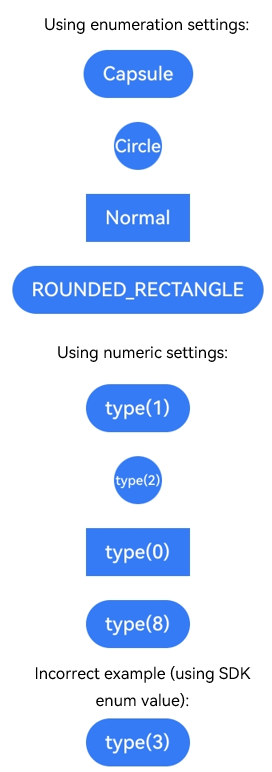

# FAQs About Buttons and Selection Components

<!--Kit: ArkUI-->
<!--Subsystem: ArkUI-->
<!--Owner: @liyi0309-->
<!--Designer: @liyi0309-->
<!--Tester: @lxl007-->
<!--Adviser: @Brilliantry_Rui-->
<!-- md-trans-meta sourceCommit=54a42c9072061579d53f860fa842a9500ca35eee translatedAt=2026-08-04T06:38:28.004Z pushedAt=2026-08-04T08:53:15.989Z -->

This topic addresses frequently asked questions regarding buttons and selection components.

## How Are the Slider Thumb and Track of the Slider Component Aligned?

The **Slider** component supports three display styles defined by [SliderStyle](../reference/apis-arkui/arkui-ts/ts-basic-components-slider.md#sliderstyle). Both **SliderStyle.OutSet** and **SliderStyle.InSet** include visible slider thumbs. When the slider progress is at the minimum value, the alignment behavior differs between these two styles:

**SliderStyle.OutSet**: The thumb center aligns with the track endpoint.


**SliderStyle.InSet**: The slider thumb aligns with the track centerline (midpoint of the track endpoint height).


**Example**

```ts
@Entry
@Component
struct Index {
  build() {
    Column() {
      Slider({
        style: SliderStyle.OutSet
      })
        .blockSize({
          width: 20,
          height: 20
        })
        .trackThickness(50)
      Slider({
        style: SliderStyle.InSet
      })
        .blockSize({
          width: 20,
          height: 20
        })
        .trackThickness(50)
    }
    .height('100%')
    .width('100%')
  }
}
```

## Inconsistent Default Font Weight When AttributeModifier Is Used to Set LabelStyle of a Button

**Symptom**

When **LabelStyle** is set for the **Button** component, the default font weight of the label text is inconsistent in different setting modes.

**Possible Causes**

There are two ways to set **LabelStyle**:

- Set [LabelStyle](../reference/apis-arkui/arkui-ts/ts-basic-components-button.md#labelstyle10) directly. In this case, the default value of the **weight** attribute in **font** is **FontWeight.Medium**, which corresponds to the value **500**.

- Set **LabelStyle** through the [AttributeModifier](../reference/apis-arkui/arkui-ts/ts-universal-attributes-attribute-modifier.md#attributemodifier) API. In this case, the default value of the **weight** attribute in **font** is **400**, which is different from the default value described in the **LabelStyle** description.

**Solution**

To avoid display differences caused by different setting ways, you are advised to explicitly specify the **weight** value when setting **LabelStyle** through the **AttributeModifier** API to ensure that the text style meets the expectation. The following is an example:

<!-- @[button_modifier_faq](https://gitcode.com/openharmony/applications_app_samples/blob/master/code/DocsSample/ArkUISample/ButtonAttribute/entry/src/main/ets/pages/ButtonModifierFAQ.ets) -->

```ts

// pages/ButtonModifierFAQ.ets
class MyButtonModifier1 implements AttributeModifier<ButtonAttribute> {
  applyNormalAttribute(instance: ButtonAttribute): void {
    instance.labelStyle({});
  }
}

class MyButtonModifier2 implements AttributeModifier<ButtonAttribute> {
  applyNormalAttribute(instance: ButtonAttribute): void {
    instance.labelStyle({
      font: {
        weight: FontWeight.Medium
      }
    });
  }
}

@Entry
@Component
struct Index {
  @State modifier1: MyButtonModifier1 = new MyButtonModifier1();
  @State modifier2: MyButtonModifier2 = new MyButtonModifier2();

  build() {
    Column() {
      Text('normal')
      // Set labelStyle for the Button component. The default value of weight in the font attribute is 500.
      Button('DemoButtonTest')
        .width(100)
        .labelStyle({})
      Divider()
      // Set labelStyle via AttributeModifier. The default value of weight in the font attribute is 400.
      Text('modifier1')
      Button('DemoButtonTest')
        .width(100)
        .attributeModifier(this.modifier1)

      Text('modifier2')
      Button('DemoButtonTest')
        .width(100)
        .attributeModifier(this.modifier2)
    }.height('100%')
  }
}
```


## Inconsistency Between ButtonType Enum Values and Numeric Values When Setting the Button Component Type

**Symptom**

The `type` attribute of the Button component supports setting via the [ButtonType](../../application-dev/reference/apis-arkui/arkui-ts/ts-basic-components-button.md#buttontype) enum or a numeric value. However, the enum values defined in the SDK do not match the actual numeric values accepted by `type`. For example, the `ButtonType.ROUNDED_RECTANGLE` enum value is 3, but `type(ButtonType.ROUNDED_RECTANGLE)` and `type(3)` produce different effects.

**Possible Causes**

The numeric values defined in the [ButtonType](../../application-dev/reference/apis-arkui/arkui-ts/ts-basic-components-button.md#buttontype) enum only represent the indices of the enum items and differ from the actual numeric values accepted by the `type` attribute. The mapping is as follows:

| ButtonType Enum | Enum Value | Actual type Value |
| --- | --- | --- |
| Normal | 2 | 0 |
| Capsule | 0 | 1 |
| Circle | 1 | 2 |
| ROUNDED_RECTANGLE | 3 | 8 |

Therefore, `type(8)` produces the same effect as `type(ButtonType.ROUNDED_RECTANGLE)`, while `type(3)` does not correspond to any valid type. Before API version 18, the default value `ButtonType.Capsule` is used; in API version 18 and later, the default value `ButtonType.ROUNDED_RECTANGLE` is used.

**Solution**

You are advised to use the [ButtonType](../../application-dev/reference/apis-arkui/arkui-ts/ts-basic-components-button.md#buttontype) enum for configuration to avoid potential confusion caused by using numeric values directly. If you must use a numeric value, refer to the "Actual type Value" column in the table above.

**Example**

<!-- @[button_type_faq](https://gitcode.com/openharmony/applications_app_samples/blob/master/code/DocsSample/ArkUISample/ButtonAttribute/entry/src/main/ets/pages/ButtonTypeFAQ.ets) -->

``` TypeScript
// pages/ButtonTypeFAQ.ets
@Entry
@Component
struct ButtonTypeDemo {
  build() {
    Column({ space: 20 }) {
      // Use enum settings (recommended).
      Text('Use enum settings:')
      Button('Capsule')
        .type(ButtonType.Capsule)
      Button('Circle')
        .type(ButtonType.Circle)
      Button('Normal')
        .type(ButtonType.Normal)
      Button('ROUNDED_RECTANGLE')
        .type(ButtonType.ROUNDED_RECTANGLE)

      // Use numeric settings (the actual type value is required).
      Text('Use numeric settings:')
      Button('type(1)')
        .type(1) // Equivalent to ButtonType.Capsule.
      Button('type(2)')
        .type(2) // Equivalent to ButtonType.Circle.
      Button('type(0)')
        .type(0) // Equivalent to ButtonType.Normal.
      Button('type(8)')
        .type(8) // Equivalent to ButtonType.ROUNDED_RECTANGLE.

      // Incorrect example: using SDK enum values as the type number.
      Text('Incorrect example (using SDK enum values):')
      Button('type(3)')
        .type(3) // Does not correspond to any type; the default style is used.
    }
    .width('100%')
    .height('100%')
    .backgroundColor(Color.White)
    .justifyContent(FlexAlign.Center)
  }
}
```

