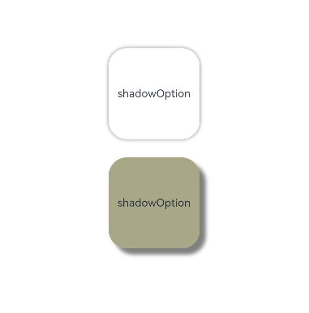

# Shadow Effect


You can use the [shadow](../reference/apis-arkui/arkui-ts/ts-universal-attributes-image-effect.md#shadow)API to apply a shadow effect to a component. Even better, you can set the parameter of this API to [ShadowOptions](../reference/apis-arkui/arkui-ts/ts-universal-attributes-image-effect.md#shadowoptions) to customize the shadow effect. When the radius or color opacity in **ShadowOptions** is set to **0**, there is no shadow effect.


```ts
@Entry
@Component
struct ShadowOptionDemo {
  build() {
    Row() {
      Column() {
        Column() {
          Text('shadowOption').fontSize(12)
        }
        .width(100)
        .aspectRatio(1)
        .margin(10)
        .justifyContent(FlexAlign.Center)
        .backgroundColor(Color.White)
        .borderRadius(20)
        .shadow({ radius: 10, color: Color.Gray })

        Column() {
          Text('shadowOption').fontSize(12)
        }
        .width(100)
        .aspectRatio(1)
        .margin(10)
        .justifyContent(FlexAlign.Center)
        .backgroundColor('#a8a888')
        .borderRadius(20)
        .shadow({
          radius: 10,
          color: Color.Gray,
          offsetX: 20,
          offsetY: 20
        })
      }
      .width('100%')
      .height('100%')
      .justifyContent(FlexAlign.Center)
    }
    .height('100%')
  }
}
```



