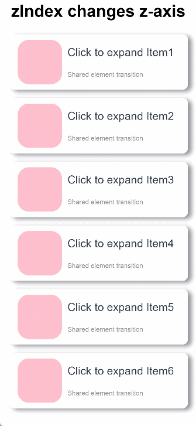
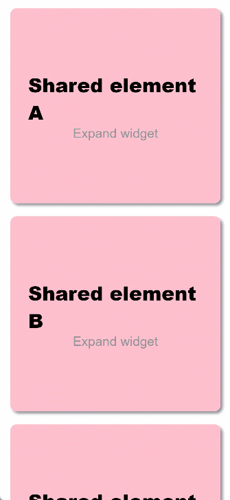

# Shared Element Transition


Shared element transition is a type of transition achieved by animating the size and position between styles of the same or similar elements during page switching. It is typically used with the modal transition for combined effects. When used with transition and attribute animations, it can make its way into a wider range of use cases.


## Implementation with transition and Attribute Animation

This example implements a shared element transition for the scenario where, as a component is expanded, sibling components in the same container disappear or appear. Specifically, attribute animations are applied to width and height changes of a component before and after the expansion; enter/exit animations are applied to the sibling components as they disappear or disappear.

1. Build the component to be expanded, and build two pages for it through state variables: one for the normal state and one for the expanded state.

  ```ts
  class Tmp{
    set(item:CradData):CradData{
      return item
    }
  }
  // Build two pages for the normal and expanded states of the same component, which are then used based on the declared state variables.
  @Component
  export struct MyExtendView {
    // Declare the isExpand variable to be synced with the parent component.
    @Link isExpand: boolean;
    @State cardList: Array<CardData> = xxxx;
  
    build() {
      List() {
        // Customize the expanded component as required.
        if (this.isExpand) {
          Text('expand')
            .transition(TransitionEffect.translate(y:300).animation({ curve: curves.springMotion(0.6, 0.8) }))
        }
  
        ForEach(this.cardList, (item: CradData) => {
          let Item:Tmp = new Tmp()
          let Imp:Tmp = Item.set(item)
          let Mc:Record<string,Tmp> = {'cardData':Imp}
          MyCard(Mc)
        })
      }
      .width(this.isExpand ? 200 : 500) // Define the attributes of the expanded component.
      .animation({ curve: curves.springMotion()}) // Bind an animation to component attributes.
    }
  }
  ```

2. Expand the component to be expanded. Use state variables to control the disappearance or appearance of sibling components, and apply the enter/exit transition to the disappearance and appearance.

  ```ts
  class Tmp{
    isExpand: boolean = false;
    set(){
      this.isExpand = !this.isExpand;
    }
  }
  let Exp:Record<string,boolean> = {'isExpand': false}
    @State isExpand: boolean = false
    
    ...
    List() {
      // Control the appearance or disappearance of sibling components through the isExpand variable, and configure the enter/exit transition.
      if (!this.isExpand) {
        Text ('Collapse')
          .transition(TransitionEffect.translate(y:300).animation({ curve: curves.springMotion(0.6, 0.9) }))
      }
    
      MyExtendView(Exp)
        .onClick(() => {
          let Epd:Tmp = new Tmp()
          Epd.set()
        })
    
      // Control the appearance or disappearance of sibling components through the isExpand variable, and configure the enter/exit transition.
      if (this.isExpand) {
        Text ('Expand')
          .transition(TransitionEffect.translate(y:300).animation({ curve: curves.springMotion() }))
      }
    }
  ...
  ```


Below is the complete sample code and effect.


```ts
// utils.ets
import curves from '@ohos.curves';

// Build two pages for the normal and expanded states of the same component, which are then used based on the declared state variables.
@Component
export struct share_transition_expand {
  // Declare the isExpand variable to be synced with the parent component.
  // Expand the component.
  @State isExpand: boolean = false;
  // Currently expanded component.
  @State curIndex: number = 0;
  @State listArray: Array<number> = [1, 2, 3, 4, 5, 6];
  build() {
    Column() {
      List() {
        ForEach(this.listArray, (item:number, index?:number|undefined) => {
          // Customize the expanded component as required.
          if (!this.isExpand || this.curIndex == index) {
            ListItem() {
              Column() {
                Row() {
                  Row()
                    .backgroundColor(Color.Pink)
                    .borderRadius(20)
                    .width(80)
                    .height(80)

                  Column() {
                    Text ('Click to expand Item' + item)
                      .fontSize(20)
                    Text ('Shared element transition')
                      .fontSize(12)
                      .fontColor(0x909399)
                  }
                  .alignItems(HorizontalAlign.Start)
                  .justifyContent(FlexAlign.SpaceAround)
                  .margin({ left: 10 })
                  .height(80)
                }
                .width('90%')
                .height(100)

                if (this.isExpand) {
                  Row() {
                    Text('Expanded state')
                      .fontSize(28)
                      .fontColor(0x909399)
                      .textAlign(TextAlign.Center)
                      .transition(TransitionEffect.OPACITY.animation({ curve: curves.springMotion(0.6, 0.9) }))
                  }
                  .width('90%')
                  .justifyContent(FlexAlign.Center)
                }
              }
              .onClick(() => {
                // Define the animation parameters for expanding and collapsing.
                animateTo({ curve: curves.springMotion(0.6, 0.9) }, () => {
                  if(index){
                    this.curIndex = index;
                  }
                  this.isExpand = !this.isExpand;
                })
              })
              .width('90%')
              .height(this.isExpand && this.curIndex == index ? '85%' : 100) // Define the attributes of the expanded component as required.
              .alignItems(HorizontalAlign.Center)
              .borderRadius(10)
              .margin({ top: 15 })
              .backgroundColor(Color.White)
              .shadow({ radius: 20, color: 0x909399, offsetX: 20, offsetY: 10 })
              // Control the appearance or disappearance of sibling components through the isExpand variable, and configure the enter/exit transition.
              .transition(TransitionEffect.scale({ x: 0, y: 0 }).animation({ curve: curves.springMotion(0.3, 1.5) }))
            }
            .zIndex(this.curIndex == index ? 1 : 0)
          }
        })
      }
      .height('100%')
      .alignListItem(ListItemAlign.Center)
    }
    .width('100%')
    .height('100%')
    .justifyContent(FlexAlign.Start)
  }
}
```


```ts
// Index.ets
import { share_transition_expand } from './utils';
@Entry
@Component
struct ShareTransitionDemo {
  @State isExpand: boolean = false;
  @State Tmp:Record<string,boolean> = { 'isExpand': false }
  private scroller: Scroller = new Scroller();
  build() {
    Scroll(this.scroller) {
    Column() {
      Text('Sibling nodes appear and disappear.')
        .fontWeight(FontWeight.Bold)
        .fontSize(30)
        .fontColor(Color.Black)
        .margin(10)

      share_transition_expand(this.Tmp)

    }
    .width('100%')
    .height('100%')
    .justifyContent(FlexAlign.Start)
    }
  }
}
```


## Implementation with transition and zIndex

This example implements a shared element transition for the scenario where, as a component is expanded, it is displayed on the top of the container while sibling components in the same container stay. This is achieved with the use of **zIndex**. Specifically:

- Build two pages for the normal and expanded states of the same component, which are then used based on the declared state variables.

- Change the display level of components through the **zIndex** attribute. Set this attribute to **1** for the component in the expanded state and retain the default value **0** for other sibling components. In this way, the component in the expanded state will be displayed over the sibling components.

- With the **translate** attribute, move the component to the top of the parent container when it is expanded.

- Use a placeholder container so that the location of the sibling components remains unchanged. The outer container is placed as a placeholder, and the internal container changes the size.

Below is the complete sample code and effect.


```ts
// utils.ets
import curves from '@ohos.curves';

// Build two pages for the normal and expanded states of the same component, which are then used based on the declared state variables.
@Component
export struct share_zIndex_expand {
  // Declare the isExpand variable to be synced with the parent component.
  @State isExpand: boolean = false;
  @State curIndex: number = 0;
  @State listArray: Array<number> = [1, 2, 3, 4, 5, 6];
  private parentScroller: Scroller = new Scroller(); // Upper-layer scroller

  build() {
    Column() {
      List() {
        ForEach(this.listArray, (item:number, index?:number|undefined) => {
          // Customize the expanded component as required.
          if (!this.isExpand || this.curIndex == index) {
            ListItem() {
              Column() {
                Row() {
                  Row()
                    .backgroundColor(Color.Pink)
                    .borderRadius(20)
                    .width(80)
                    .height(80)

                  Column() {
                    Text ('Click to expand Item' + item)
                      .fontSize(20)
                    Text ('Shared element transition')
                      .fontSize(12)
                      .fontColor(0x909399)
                  }
                  .alignItems(HorizontalAlign.Start)
                  .justifyContent(FlexAlign.SpaceAround)
                  .margin({ left: 10 })
                  .height(80)
                }
                .width('90%')
                .height(100)

                if (this.isExpand && this.curIndex == index) {
                  Row() {
                    Text('Expanded state')
                      .fontSize(28)
                      .fontColor(0x909399)
                      .textAlign(TextAlign.Center)
                      .transition(TransitionEffect.OPACITY.animation({ curve: curves.springMotion(0.6, 0.9) }))
                  }
                  .width('90%')
                  .justifyContent(FlexAlign.Center)
                }
              }
              .width('90%')
              .height(this.isExpand && this.curIndex == index ? 750 : 100)
              .alignItems(HorizontalAlign.Center)
              .borderRadius(10)
              .margin({ top: 15 })
              .backgroundColor(Color.White)
              .shadow({ radius: 20, color: 0x909399, offsetX: 20, offsetY: 10 })
            }
            .onClick(() => {
              // Define the animation parameters for expanding and collapsing.
              animateTo({ curve: curves.springMotion(0.6, 0.9) }, () => {
                if(index){
                  this.curIndex = index;
                }
                this.isExpand = !this.isExpand;
              })
            })
            .zIndex(this.curIndex == index? 1: 0) // When the current list item is selected, its zIndex attribute is set to 1, and it is displayed over other sibling components whose zIndex is 0.
            .translate({ // Move the list item to the top of the parent container through translate.
                y: this.isExpand && this.curIndex == index ? -60 - this.parentScroller.currentOffset()['yOffset'] : 0
            })
          }
        })
      }
      .clip(false)
      .height('100%') // Fixed size of the placeholder container.
      .alignListItem(ListItemAlign.Center)
    }
    .zIndex(1)
    .width('100%')
    .height('100%')
    .justifyContent(FlexAlign.Start)
  }
}
```


```ts
// Index.ets
import { share_zIndex_expand } from './utils'
@Entry
@Component
struct ShareZIndexDemo {
  @State isExpand: boolean = false;
  @State curIndex: number = 0;
  private scroller: Scroller = new Scroller();
  @State Sze:Record<string,boolean|number|Scroller> = { 'isExpand': this.isExpand, 'curIndex': this.curIndex, 'parentScroller': this.scroller }

  build() {
    Scroll(this.scroller) {
      Column() {
        Text ('zIndex changes z-axis')
          .fontWeight(FontWeight.Bold)
          .fontSize(30)
          .fontColor(Color.Black)
          .zIndex(0)
          .margin(10)

        share_zIndex_expand(this.Sze)
      }
      .width('100%')
      .height('100%')
      .justifyContent(FlexAlign.Start)
    }
  }
}
```




## Implementation with geometryTransition

This example implements a shared element transition with [geometryTransition](../reference/arkui-ts/ts-transition-animation-geometrytransition.md), which is used for implicit shared element transitions during component switching.

Below is the complete sample code and effect for using **geometryTransition** and the **if/else** syntax to implement a shared element transition:


```ts
@Entry
@Component
struct IfElseGeometryTransition {
  @State isShow: boolean = false;

  build() {
    Stack({ alignContent: Alignment.Center }) {
      if (this.isShow) {
        Image($r('app.media.test'))
          .autoResize(false)
          .clip(true)
          .width(300)
          .height(400)
          .offset({ y: 100 })
          .geometryTransition("picture")
          .transition(TransitionEffect.OPACITY)
      } else {
        // geometryTransition is bound to a container. Therefore, a relative layout must be configured for the child components of the container.
        // The multiple levels of containers here are used to demonstrate passing of relative layout constraints.
        Column() {
          Column() {
            Image($r('app.media.icon'))
              .width('100%').height('100%')
          }.width('100%').height('100%')
        }
        .width(80)
        .height(80)
        // geometryTransition synchronizes rounded corner settings, but only for the bound component, which is the container in this example.
        // In other words, rounded corner settings of the container are synchronized, and those of the child components are not.
        .borderRadius(20)
        .clip(true)
        .geometryTransition("picture")
        // transition ensures that the component is not destructed immediately when it exits. You can customize the transition effect.
        .transition(TransitionEffect.OPACITY)
      }
    }
    .onClick(() => {
      animateTo({ duration: 1000 }, () => {
        this.isShow = !this.isShow;
      })
    })
  }
}
```


Below is the sample code and effect for using **geometryTransition** and a modal transition API to implement a shared element transition:


```ts
import curves from '@ohos.curves';

@Entry
@Component
struct GeometryTransitionDemo {
  // Define the state variable used to control modal transition.
  @State isPresent: boolean = false;
  @State alpha: boolean = false;
  // Use @Builder to build the modal.
  @Builder
  MyBuilder() {
    Column() {
      Row() {
        Text('Shared component 1')
          .fontWeight(FontWeight.Bold)
          .fontSize(20)
          .fontColor(Color.White)
      }
      .justifyContent(FlexAlign.Center)
      .borderRadius(10)
      .backgroundColor(0xf56c6c)
      .width('100%')
      .aspectRatio(1)
      .margin({ bottom: 20, top: 20})
      // New shared element, <Row, whose ID is share1.
      .geometryTransition('share1')

      Column() {
        Text ('Expanded page')
          .textAlign(TextAlign.Center)
          .fontSize(15)
          .fontColor(this.isPresent ? Color.White : Color.Transparent)
          .margin(20)

        Text('Click anywhere to return')
          .textAlign(TextAlign.Center)
          .fontSize(15)
          .fontColor(this.isPresent ? Color.White : Color.Transparent)
      }
      .width('100%')
      .transition(TransitionEffect.OPACITY.animation({ curve: curves.springMotion(0.6, 1.2) }))

    }
    .onAppear(()=> {
      animateTo({}, ()=>{
        this.alpha = ! this.alpha;
      })
    })
    .width('100%')
    .height('100%')
    .justifyContent(FlexAlign.Start)
    .transition(TransitionEffect.opacity(0.99))
    .backgroundColor(this.alpha ? 0x909399 : Color.Transparent)
    .clip(true)
    .onClick(() => {
      animateTo({ duration: 1000 }, () => {
        this.alpha = ! this.alpha;
        this.isPresent = !this.isPresent;
      })
    })
  }

  build() {
    Column() {
      Row() {
        Text('Shared component 1')
          .fontWeight(FontWeight.Bold)
          .fontSize(20)
          .fontColor(Color.White)
      }
      .justifyContent(FlexAlign.Center)
      .borderRadius(10)
      .backgroundColor(0xf56c6c)
      .width(150)
      .height(150)
      .margin(20)
      // Modal transition component
      .bindContentCover(this.isPresent, this.MyBuilder, ModalTransition.NONE)
      // The <Row> component is assigned the ID share1 and configured to have the shared element effect.
      .geometryTransition('share1')
      .onClick(() => {
        animateTo({ curve: curves.springMotion(0.6, 1.2) }, () => {
          // Change the state variable in the closure to display the modal.
          this.isPresent = !this.isPresent;
        })
      })

      Text('Component 2')
        .fontWeight(FontWeight.Bold)
        .fontSize(20)
        .fontColor(Color.White)
        .textAlign(TextAlign.Center)
        .borderRadius(10)
        .backgroundColor(0x67C23A)
        .width(150)
        .height(150)
        .margin(20)
    }
    .width('100%')
    .height('100%')
    .justifyContent(FlexAlign.Start)
    .backgroundColor(Color.White)
  }
}
```


## Implementation with Attribute Animation


```ts
import curves from '@ohos.curves';
class itTmp{
  $rect:Array<number> = []
}
@Entry
@Component
struct AutoAchieveShareTransitionDemo {
  private items: string[] = ['A', 'B', 'C', 'D', 'E', 'F', 'G', 'H', 'I', 'J'];

  // Specify whether the component is expanded.
  @State expand: boolean = false;

  // Attributes related to the shared element.
  @State rect_top: number = 0; // Position of the shared element.
  @State rect_bottom: number = 0;
  @State rect_left: number = 0;
  @State rect_right: number = 0;

  // Attributes related to the newly created element.
  @State item: string = ''; // Record the expanded element.
  @State cardHeight: number = 300; // Widget height.
  @State cardOpacity: number = 1; // Widget opacity.
  @State layoutHeight: number = 300; // Height of the expanded page.
  @State layoutWidth: string = '90%'; // Width of the expanded page.
  @State layoutOffset: number = 0; // Offset of the expanded page.
  @State layoutOpacity: number = 0; // Opacity of the expanded page.

  // In the callback invoked when the transition is complete.
  @State count: number = 0;

  build() {
    Stack() {
      Scroll() {
        Column({ space: 20 }) {
          ForEach(this.items, (item:string, index?:number|undefined) => {
            Row() {
              Column() {
                Text('Shared element ' + item)
                  .fontSize(30)
                  .fontColor(Color.Black)
                  .fontWeight(FontWeight.Bolder)
                Text ('Expand widget')
                  .fontSize(20)
                  .fontColor(0x909399)
              }
              .width('100%')
              .height('100%')
              .justifyContent(FlexAlign.Center)
            }
            .width('90%')
            .height(this.cardHeight)
            .padding(20)
            .backgroundColor(Color.Pink)
            .borderRadius(10)
            .shadow({ radius: 10, color: 0x909399, offsetX: 10, offsetY: 10 })
            .opacity(this.expand && this.item == item ? 0 : 1)
            // Set a unique ID and obtain the attribute information of the component corresponding to the ID.
            .id(item)
            .onClick(() => {
              // Obtain the position and size of the corresponding component.
              let strJson = getInspectorByKey(item);
              let rect:itTmp = JSON.parse(strJson);
              let rectInfo:Array<object> = JSON.parse('[' + rect.$rect + ']');
              let rect_left:string = JSON.parse('[' + rectInfo[0] + ']')[0];
              let rect_top:string = JSON.parse('[' + rectInfo[0] + ']')[1];
              let rect_right:string = JSON.parse('[' + rectInfo[1] + ']')[0];
              let rect_bottom:string = JSON.parse('[' + rectInfo[1] + ']')[1];
              let rect_value:Record<string,string> = {
                "left": rect_left, "top": rect_top, "right": rect_right, "bottom": rect_bottom
              };

              // Set the location, content, and status of the shared element.
              this.rect_top = Number(rect_top);
              this.item = item;
              this.expand = true;
              this.count += 1;

              animateTo({ curve: curves.springMotion() }, () => {
                this.layoutHeight = 2772 / 3.5;
                this.layoutWidth = '100%';
                this.layoutOffset = -((Number(rect_top) - 136) / 3.5);
              })
            })
          })
        }
        .width('100%')
        .margin({ top: 20 })
      }
      .height('100%')

      // Create an element that is the same as the component based on the obtained component information.
      if (this.expand) {
        Column() {
          // Share element.
          Row() {
            Column() {
              Text('Shared element ' + this.item)
                .fontSize(30)
                .fontColor(Color.Black)
                .fontWeight(FontWeight.Bolder)
              Text ('Expand widget')
                .fontSize(20)
                .fontColor(0x909399)
            }
            .width('100%')
            .height('100%')
            .justifyContent(FlexAlign.Center)
          }
          .width('100%')
          .height(this.cardHeight)
          .padding(20)
          .backgroundColor(Color.Pink)

          // New element.
          Text('Expanded page\n\nExpanded page\n\nExpanded page\n\nExpanded page\n\nExpanded page\n\nExpanded page\n\nExpanded page\n\nExpanded page')
            .fontSize(20)
            .fontColor(0xcccccc)
            .margin({ top: 20 })
            .width(100)

        }
        .borderRadius(this.layoutWidth == '100%' ? 0 : 10)
        .shadow({ radius: 10, color: 0x909399, offsetX: 10, offsetY: 10 })
        .width(this.layoutWidth)
        .height(this.layoutHeight)
        .clip(true)
        .backgroundColor(Color.White)
        // Work out the absolute position of the new element.
        .position({
          x: this.layoutWidth == '90%' ? '5%' : 0,
          y: (this.rect_top - 136) / 3.5
        })
        .translate({
          y: this.layoutOffset
        })
        .onClick(() => {
          this.count -= 1;

          animateTo({
            curve: curves.springMotion(),
            onFinish: (() => {
              if (this.count == 0) {
                this.expand = false;
              }
            })
          }, () => {
            this.layoutHeight = this.cardHeight;
            this.layoutWidth = '90%';
            this.layoutOffset = 0;
          })
        })
      }
    }
  }
}
```



